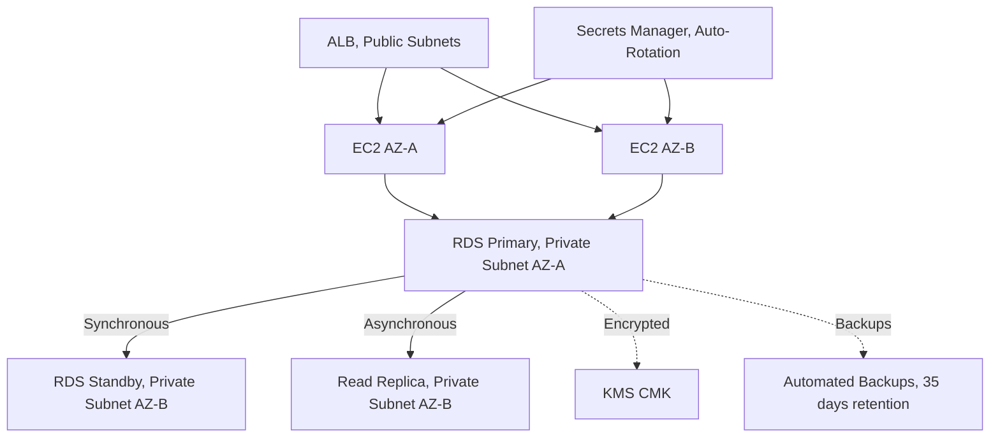
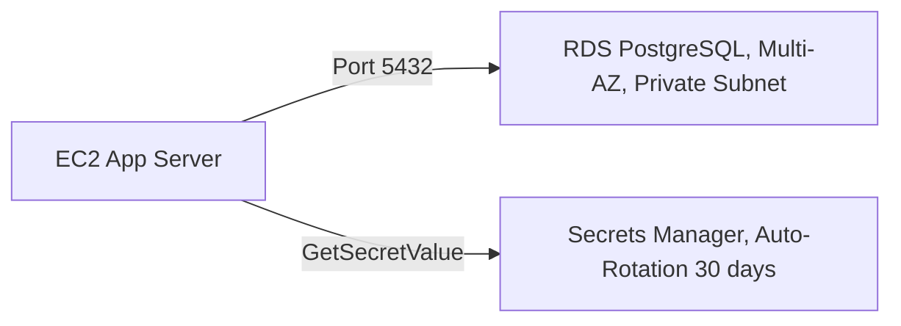
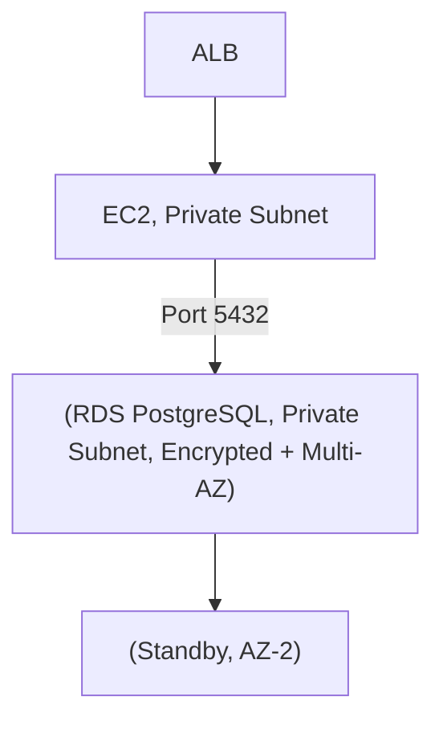

# Chapter 06 — Amazon RDS

---

## Prerequisite Chapters
- Chapter 01 — AWS IAM (RDS access, Secrets Manager integration)
- Chapter 04 — Amazon VPC (subnet groups, security groups, private placement)
- Chapter 22 — AWS KMS (encryption at rest)

## Used In Production Practicals
- Practical 11 — HA Application (ALB → ASG → RDS)
- Practical 13 — Production RDS
- Practical 14 — Secure Application (Secrets Manager → RDS)
- Practical 15 — Flagship Production Architecture

---

## 1. Learning Objectives

By the end of this chapter, you will be able to:

1. **Explain** RDS engine types, deployment options, and Multi-AZ vs Read Replicas.
2. **Create** a production RDS instance with proper VPC, subnet group, and security.
3. **Configure** Multi-AZ for high availability and Read Replicas for read scaling.
4. **Implement** encryption, automated backups, and manual snapshots.
5. **Integrate** with Secrets Manager for credential management.
6. **Monitor** with CloudWatch, Performance Insights, and Enhanced Monitoring.
7. **Troubleshoot** connection failures, performance issues, and failover scenarios.
8. **Answer** interview questions about production database architecture.

---

## 2. What is Amazon RDS?

Amazon RDS is a **managed relational database** service that handles provisioning, patching, backups, and failover. You focus on the application; AWS manages the database infrastructure.

### Supported Engines

| Engine | Use Case |
|--------|----------|
| **PostgreSQL** | Open-source, feature-rich, complex queries |
| **MySQL** | Web applications, WordPress, popular |
| **MariaDB** | MySQL-compatible, community-driven |
| **Oracle** | Enterprise workloads, legacy applications |
| **SQL Server** | .NET applications, Microsoft ecosystem |
| **Aurora** | AWS-native, 5x MySQL / 3x PostgreSQL performance |

### RDS = Managed (NOT Serverless by Default)
```
What AWS manages:           What YOU manage:
  ✅ Hardware provisioning     🔧 Schema design
  ✅ OS patching               🔧 Query optimization
  ✅ Engine patches            🔧 Application connectivity
  ✅ Automated backups         🔧 Parameter Groups
  ✅ Multi-AZ failover         🔧 Security groups
  ✅ Monitoring                🔧 Secrets rotation
  ❌ NO SSH access              🔧 Read Replica promotion
```

---

## 3. Why Do We Need It?

### Without RDS (Self-Managed on EC2)
```
You manage:
  - EC2 instance + EBS volume
  - Database engine installation
  - OS patching + engine patching
  - Backup scripts (cron + pg_dump)
  - Replication setup (complex!)
  - Failover mechanisms (custom scripts)
  - Monitoring (manual CloudWatch setup)

Time: 20-30 hours/month on DB operations
```

### With RDS
```
AWS manages the infrastructure:
  - One-click Multi-AZ (automatic failover)
  - Automated backups (point-in-time recovery)
  - Read Replicas (one command)
  - Monitoring built-in (Performance Insights)
  - Patching scheduled (maintenance window)

Time: 2-5 hours/month on optimization
```

---

## 4. Real-World Production Use Cases

### 1. Web Application Backend
ALB → EC2 (ASG) → RDS PostgreSQL (Multi-AZ). Read-heavy? Add Read Replicas.

### 2. Microservices Database per Service
Each microservice owns its RDS instance. Separate schemas, separate scaling.

### 3. Analytics with Read Replicas
Production RDS → Read Replica → Analytics/BI tools query the replica (no production impact).

---

## 5. Core Concepts

### Multi-AZ vs Read Replica

| Feature | Multi-AZ | Read Replica |
|---------|----------|-------------|
| **Purpose** | High availability (failover) | Read scaling (performance) |
| **Replication** | Synchronous | Asynchronous |
| **Standby readable?** | ❌ No (standby only) | ✅ Yes (read traffic) |
| **Failover** | Automatic (60-120 seconds) | Manual (promote to standalone) |
| **Cross-region** | No (same region, different AZ) | ✅ Yes (DR + global reads) |
| **DNS change** | Automatic (same endpoint) | New endpoint |
| **Cost** | 2x instance (standby) | Per-replica instance |

### Production Database Architecture
```
                    Primary (AZ-A)
                   /            \
    (Synchronous) /              \ (Asynchronous)
                 /                \
         Standby (AZ-B)      Read Replica (AZ-B)
         (Multi-AZ failover)  (Read traffic / Analytics)
                               |
                         Read Replica (Region B)
                         (Cross-region DR)
```

### Subnet Group
```
A DB Subnet Group specifies which subnets RDS can use.
  - Must span at least 2 AZs
  - Use PRIVATE subnets (never public!)
  - Multi-AZ: RDS places primary in one subnet, standby in another
```

### Parameter Groups
```
Parameter groups control database engine configuration:
  - max_connections: 100 → 500
  - shared_buffers: 25% of memory
  - log_min_duration_statement: 1000 (log slow queries > 1 sec)
  - work_mem: 256MB
  
Create custom parameter group (don't modify default!)
Apply to instance (some require reboot)
```

### Storage Types

| Type | IOPS | Use Case |
|------|------|----------|
| **gp3** | 3,000 baseline (up to 16,000) | General purpose (default) |
| **io1/io2** | Up to 64,000 | High-performance OLTP |
| **Magnetic** | — | Legacy (don't use) |

---

## 6. Architecture

### Production RDS Architecture



---

## 7. Important Components

### Security Configuration
```
1. VPC Placement: ALWAYS in private subnets
2. Security Group: Allow inbound only from app SG (port 5432/3306)
3. Encryption: Enable at creation (KMS CMK) — cannot add later!
4. IAM Authentication: Optionally use IAM tokens instead of passwords
5. SSL/TLS: Force encrypted connections (rds.force_ssl=1)
6. Secrets Manager: Store and rotate credentials
7. Public Access: NEVER enable (default: disabled)
```

### Backup Strategy
```
Automated Backups:
  - Daily full backup (during backup window)
  - Transaction logs every 5 minutes
  - Point-in-time recovery to any second in retention period
  - Retention: 1-35 days (production: 35 days)
  - Stored in S3 (managed by AWS)

Manual Snapshots:
  - User-initiated, persist until deleted
  - Use before major changes (engine upgrade, parameter change)
  - Can copy cross-region (for DR)
  - Can share cross-account
```

---

## 8. How It Works

### Connection Flow
```
1. Application reads DB credentials from Secrets Manager
2. Application connects to RDS endpoint (DNS name)
3. DNS resolves to primary instance IP
4. Security group allows traffic from app security group
5. RDS authenticates with username/password
6. SSL/TLS encrypts the connection
7. Queries execute on primary instance
8. Read Replicas: application uses replica endpoint for reads
```

### Failover Process (Multi-AZ)
```
1. Primary fails (hardware, AZ outage, maintenance)
2. RDS detects failure (health check)
3. RDS promotes standby to primary (60-120 seconds)
4. DNS endpoint updated to point to new primary
5. Application reconnects using same endpoint (no code change)
6. Previous primary becomes standby (when recovered)
```

---

## 9. AWS Console Walkthrough

### Create Production RDS Instance
1. **RDS Console** → **Create database**
2. **Engine**: PostgreSQL 16
3. **Template**: Production
4. **Deployment**: Multi-AZ DB instance
5. **Instance class**: db.r6g.large
6. **Storage**: gp3, 100 GB, storage auto-scaling (max 500 GB)
7. **VPC**: Select production VPC
8. **Subnet group**: Private subnets
9. **Public access**: No
10. **Security group**: Allow 5432 from app SG only
11. **Encryption**: Enable (select CMK)
12. **Backup retention**: 35 days
13. **Performance Insights**: Enable (7 days free)
14. **Maintenance window**: Sunday 03:00-04:00

---

## 10. AWS CLI Commands

```bash
# Create subnet group
aws rds create-db-subnet-group \
    --db-subnet-group-name prod-db-subnets \
    --db-subnet-group-description "Production DB subnets" \
    --subnet-ids $PRIV_SUBNET_A $PRIV_SUBNET_B

# Create RDS instance
aws rds create-db-instance \
    --db-instance-identifier prod-db \
    --engine postgres --engine-version 16.4 \
    --db-instance-class db.r6g.large \
    --allocated-storage 100 --max-allocated-storage 500 \
    --storage-type gp3 \
    --multi-az \
    --db-subnet-group-name prod-db-subnets \
    --vpc-security-group-ids $DB_SG \
    --master-username admin \
    --manage-master-user-password \
    --kms-key-id alias/rds-key \
    --storage-encrypted \
    --backup-retention-period 35 \
    --preferred-backup-window "02:00-03:00" \
    --preferred-maintenance-window "sun:03:00-sun:04:00" \
    --enable-performance-insights \
    --no-publicly-accessible

# Create Read Replica
aws rds create-db-instance-read-replica \
    --db-instance-identifier prod-db-replica \
    --source-db-instance-identifier prod-db

# Create manual snapshot
aws rds create-db-snapshot \
    --db-instance-identifier prod-db \
    --db-snapshot-identifier prod-db-before-upgrade

# Restore from snapshot
aws rds restore-db-instance-from-db-snapshot \
    --db-instance-identifier prod-db-restored \
    --db-snapshot-identifier prod-db-before-upgrade

# Failover (for testing)
aws rds reboot-db-instance --db-instance-identifier prod-db --force-failover
```

---

## 11. Hands-On Practical

### Practical: Production RDS with Multi-AZ and Secrets Manager

#### Architecture


#### Step 1 — Create RDS with Managed Password
```bash
aws rds create-db-instance \
    --db-instance-identifier practical-db \
    --engine postgres --engine-version 16.4 \
    --db-instance-class db.t3.medium \
    --allocated-storage 20 \
    --multi-az \
    --manage-master-user-password \
    --no-publicly-accessible \
    --db-subnet-group-name prod-db-subnets \
    --vpc-security-group-ids $DB_SG
```

#### Step 2 — Connect from EC2
```bash
# Get password from Secrets Manager
DB_SECRET=$(aws secretsmanager get-secret-value --secret-id rds!db-... --query SecretString --output text)
DB_PASS=$(echo $DB_SECRET | jq -r .password)
DB_USER=$(echo $DB_SECRET | jq -r .username)

# Connect
psql -h prod-db.abc.rds.amazonaws.com -U $DB_USER -d postgres
```

---

## 12. Production Architecture

```
Instance Sizing:
  - Start with db.r6g.large (2 vCPU, 16 GB)
  - Monitor with Performance Insights
  - Scale vertically (larger instance) or horizontally (read replicas)

Storage:
  - gp3 with auto-scaling (handles growth automatically)
  - Enable storage auto-scaling with max threshold

Networking:
  - Private subnet only (never public)
  - App SG → DB SG (only port 5432/3306)
  - No internet access needed

Credentials:
  - Secrets Manager with 30-day rotation
  - --manage-master-user-password (RDS manages via Secrets Manager)
```

---

## 13. Security Best Practices

1. **Private subnets only** — never publicly accessible
2. **Security group** — allow only app SG on DB port
3. **Encryption at rest** — KMS CMK, enable at creation
4. **Encryption in transit** — force SSL (rds.force_ssl=1)
5. **Secrets Manager** — auto-rotate credentials
6. **IAM authentication** — optional token-based auth
7. **No default port** — change from 5432/3306 if required by policy
8. **Audit logging** — enable PostgreSQL/MySQL audit logs → CloudWatch

---

## 14. High Availability

- **Multi-AZ**: synchronous replication, automatic failover (60-120 sec)
- **Multi-AZ Cluster**: 2 readable standbys (Aurora-like, faster failover ~35 sec)
- **Read Replicas**: async, manual promotion for DR

---

## 15. Scalability

- **Vertical**: change instance class (brief outage in single-AZ, failover in Multi-AZ)
- **Read scaling**: up to 15 Read Replicas
- **Storage auto-scaling**: automatically grows
- **Connection pooling**: RDS Proxy or PgBouncer for connection management

---

## 16. Monitoring & Observability

```
CloudWatch Metrics:
  - CPUUtilization, FreeableMemory, FreeStorageSpace
  - ReadIOPS, WriteIOPS, ReadLatency, WriteLatency
  - DatabaseConnections, DiskQueueDepth

Performance Insights:
  - Top SQL queries by load
  - Wait events (IO, Lock, CPU)
  - Database load vs max vCPU
  - 7 days free retention

Enhanced Monitoring (OS-level):
  - OS processes, memory breakdown
  - 1-second granularity
  - Published to CloudWatch Logs

Alarms:
  CPU > 80% → alert
  FreeableMemory < 500 MB → alert
  FreeStorageSpace < 10 GB → alert
  DatabaseConnections > 80% of max → alert
```

---

## 17. Cost Optimization

```
Instance Costs:
  - Reserved Instances: 30-60% savings (1 or 3 year)
  - Right-size: don't over-provision
  - Graviton (r6g): 20% cheaper, 40% better perf

Storage Costs:
  - gp3 over gp2: same IOPS, 20% cheaper
  - Storage auto-scaling: don't over-provision

Backup Costs:
  - Backup storage up to DB size is free
  - Beyond that: $0.095/GB/month
  - Manual snapshots: charged until deleted

Read Replicas:
  - Same cost as primary
  - Use for read-heavy workloads, not "just in case"
```

---

## 18. Disaster Recovery

```
RPO (Recovery Point Objective):
  - Automated backups: ~5 minutes (transaction log interval)
  - Snapshots: last snapshot time

RTO (Recovery Time Objective):
  - Multi-AZ failover: 60-120 seconds
  - Restore from snapshot: 15-60 minutes
  - Cross-region replica promotion: minutes

DR Strategy:
  - Multi-AZ: automatic, same region
  - Cross-region Read Replica: manual failover, different region
  - Cross-region snapshot copy: restore in DR region
```

---

## 19. Troubleshooting

### Problem 1: "Connection Refused" from EC2 to RDS
```
Check (in order):
  1. RDS instance status: "available"?
  2. Security group: allows inbound from EC2 SG on port 5432/3306?
  3. Subnet group: EC2 and RDS in same VPC?
  4. Route table: EC2 subnet can reach RDS subnet?
  5. RDS publicly accessible: should be "No" (use private connection)
  6. DNS resolution: can EC2 resolve the RDS endpoint?
```

### Problem 2: High CPU on RDS
```
Investigation:
  1. Performance Insights → top SQL by load
  2. Slow query log → queries > 1 second
  3. Check DatabaseConnections (connection leak?)
  4. Check read/write IOPS (storage bottleneck?)

Fix:
  - Optimize slow queries (indexes, query rewrite)
  - Add Read Replicas for read-heavy workloads
  - Scale up instance class
  - Use connection pooling (RDS Proxy)
```

### Problem 3: Storage Full
```
Symptoms: writes fail, "could not extend file" errors

Check:
  - FreeStorageSpace metric → 0
  - Storage auto-scaling enabled?

Fix:
  - Enable storage auto-scaling
  - Manually modify allocated storage
  - Clean up: VACUUM (PostgreSQL), optimize tables (MySQL)
  - Delete old data, archive to S3
```

---

## 20. Common Production Problems

| # | Problem | Root Cause | Prevention |
|---|---------|------------|------------|
| 1 | Connection refused | Security group wrong | App SG → DB SG rule |
| 2 | Encryption can't be added | Must be set at creation | Always encrypt at creation |
| 3 | Failover takes long | Single-AZ | Enable Multi-AZ |
| 4 | Slow queries | Missing indexes | Performance Insights + regular analysis |
| 5 | Connection limit hit | Connection leak | Use RDS Proxy / PgBouncer |
| 6 | Storage full | No auto-scaling | Enable storage auto-scaling |
| 7 | Password in code | Hardcoded credentials | Use Secrets Manager |
| 8 | Public database | PubliclyAccessible=Yes | Never enable public access |

---

## 21. Real-World Scenario

### Scenario: Database Failover During Peak Traffic

**Event**: RDS primary in AZ-A experiences hardware failure during Black Friday sale.

**Response**:
1. RDS detects failure → initiates automatic failover
2. Standby in AZ-B promoted to primary (90 seconds)
3. DNS endpoint updated → applications reconnect
4. Some connections dropped → application retries (built-in retry logic)
5. Monitoring: CloudWatch alarm fires for failover event → team notified
6. Post-incident: verify new primary performance, check replica lag

---

## 22. Interview Questions

### Basic Questions (10)

**Q1: What is Amazon RDS?**
A: A managed relational database service. AWS handles provisioning, patching, backups, and failover. You manage the schema, queries, and application connectivity.

**Q2: What is Multi-AZ?**
A: Synchronous replication to a standby in a different AZ. Automatic failover in 60-120 seconds. Same endpoint — application doesn't need to change.

**Q3: Multi-AZ vs Read Replica?**
A: Multi-AZ: HA (failover), synchronous, standby NOT readable. Read Replica: read scaling, asynchronous, IS readable. Use both in production.

**Q4: Can you encrypt an existing unencrypted RDS instance?**
A: No. You must create a snapshot, copy it with encryption, then restore from the encrypted snapshot. Encryption must be set at creation.

**Q5: How does automated backup work?**
A: Daily full backup + transaction logs every 5 minutes. Point-in-time recovery to any second within retention period (1-35 days). Stored in S3 by AWS.

**Q6: What is a DB Subnet Group?**
A: Defines which VPC subnets RDS can use. Must span at least 2 AZs. Use private subnets. Multi-AZ places primary and standby in different subnets.

**Q7: What is RDS Proxy?**
A: A fully managed connection pooler for RDS. Reduces connection overhead, handles failover transparently, supports IAM authentication. Useful for Lambda (many short connections).

**Q8: What is Performance Insights?**
A: A monitoring tool showing database load, top SQL queries, and wait events. Identifies slow queries and resource bottlenecks. 7 days free retention.

**Q9: What happens during an RDS failover?**
A: Standby promoted to primary, DNS endpoint updated, connections may drop briefly (retry in app). 60-120 seconds for standard Multi-AZ. ~35 seconds for Multi-AZ Cluster.

**Q10: How do you connect securely to RDS?**
A: Private subnet, security group restricts to app SG, encryption at rest (KMS), encryption in transit (SSL), Secrets Manager for credentials.

### Intermediate Questions (10)

**Q11: How do Read Replicas help with performance?**
A: Route read-heavy queries (reports, analytics) to Read Replicas. Primary handles writes only. Up to 15 replicas per instance.

**Q12: Can a Read Replica be in a different region?**
A: Yes. Cross-region Read Replicas provide disaster recovery and local read performance. Can be promoted to standalone for DR.

**Q13: What is the difference between gp3 and io1 storage?**
A: gp3: 3,000 IOPS baseline, up to 16,000, 20% cheaper. io1: up to 64,000 IOPS, consistent performance. Use gp3 for most workloads, io1 for high-IOPS OLTP.

**Q14: How does Secrets Manager integrate with RDS?**
A: `--manage-master-user-password` flag: RDS creates and manages the password in Secrets Manager. Auto-rotation Lambda updates both Secrets Manager and RDS. Application reads from Secrets Manager.

**Q15: What is a Parameter Group?**
A: Database engine configuration (max_connections, shared_buffers). Create custom group, don't modify default. Some params need reboot. Apply at instance level.

**Q16: Why is RDS Proxy important for Lambda functions?**
A: Lambda creates a new database connection per invocation. Under high concurrency (hundreds/thousands of Lambdas), this exhausts RDS `max_connections`. RDS Proxy pools and reuses connections — Lambda connects to Proxy, Proxy maintains a warm pool to RDS. Benefits: reduces connection overhead by up to 97%, handles failover transparently (Proxy waits and retries), and supports IAM authentication. Without Proxy, Lambda at scale = connection storms = database crashes.

**Q17: How does RDS storage auto-scaling work?**
A: When enabled, RDS automatically increases storage when free space drops below 10% and the low-storage condition persists for 5+ minutes, with at least 6 hours since the last scaling event. You set `--max-allocated-storage` (e.g., 500 GB). Scaling increments are the greater of 10% of current storage, 10 GB, or predicted growth. Important: storage can only scale UP, never down. Always set a max threshold to prevent runaway costs.

**Q18: What is Enhanced Monitoring and how does it differ from CloudWatch?**
A: Enhanced Monitoring provides OS-level metrics at up to 1-second granularity — CPU breakdown per process, memory usage (active, inactive, buffers), file system details, and OS processes list. CloudWatch only gives instance-level metrics at 1-minute (or 5-minute) intervals. Enhanced Monitoring uses a lightweight agent on the RDS host, publishing to CloudWatch Logs. Use it to diagnose: is the OS swapping? Which process consumes memory? Is it the DB engine or a monitoring agent?

**Q19: What is the RDS maintenance window and how should you configure it?**
A: The maintenance window is a weekly time slot when AWS applies pending patches, OS updates, and hardware changes. Best practices: schedule during lowest-traffic period (e.g., Sunday 03:00-04:00 UTC), keep it short (30-60 minutes), enable Multi-AZ (maintenance applies to standby first, then failover, then patches old primary — minimizes downtime). If no window is specified, AWS assigns a random 30-minute window. You can defer non-critical patches but security patches may be forced.

**Q20: How do you perform an RDS engine version upgrade?**
A: Two types: Minor upgrades (e.g., 16.3 → 16.4) — can enable auto-minor-version-upgrade, applied during maintenance window. Major upgrades (e.g., 15 → 16) — manual, require compatibility testing. Process: 1) Take a manual snapshot (rollback safety). 2) Test upgrade on a snapshot-restored instance. 3) Modify the production instance with the new engine version. 4) Apply during maintenance window or immediately. Multi-AZ: standby upgraded first → failover → old primary upgraded. Downtime: typically 5-30 minutes depending on engine and DB size.

### Advanced Questions (10)

**Q21: Design a production RDS architecture for a high-traffic e-commerce site.**
A: PostgreSQL on db.r6g.xlarge, Multi-AZ, 2 Read Replicas, gp3 with auto-scaling, KMS encryption, Secrets Manager rotation, Performance Insights, CloudWatch alarms (CPU, memory, connections, storage), private subnet, RDS Proxy for connection management.

**Q22: What are RDS Blue/Green Deployments and when would you use them?**
A: Blue/Green creates a staging environment (green) that mirrors your production (blue) using logical replication. Use for: major engine upgrades, parameter group changes, or schema changes. Process: 1) Create blue/green deployment — green copies blue. 2) Test changes on green. 3) Switchover — green becomes new production (typically under 1 minute of downtime). 4) Old blue kept for rollback. Advantages over in-place upgrade: test before cutover, rollback possible, minimal downtime. Supported for MySQL, MariaDB, and PostgreSQL.

**Q23: Design a cross-region DR strategy for RDS.**
A: Tiered approach depending on RPO/RTO requirements:
- **Backup-based (RPO: hours, RTO: 1-2 hours)**: Automated cross-region snapshot copy → restore in DR region. Cheapest but slowest recovery.
- **Read Replica (RPO: seconds, RTO: minutes)**: Cross-region Read Replica with async replication. Promote to standalone during DR. Near-real-time data, fast recovery.
- **Aurora Global Database (RPO: <1 sec, RTO: <1 min)**: Storage-level replication across regions. Sub-second data lag. Managed failover. Best RPO/RTO but higher cost.
For most production: Cross-region Read Replica + automated snapshot copy for belt-and-suspenders.

**Q24: Compare connection pooling options: RDS Proxy vs PgBouncer vs application-level pooling.**
A: **RDS Proxy**: Fully managed, supports IAM auth, automatic failover handling, pin-aware multiplexing. Best for Lambda/serverless. Cost: per-vCPU pricing.
**PgBouncer**: Open-source, self-managed on EC2, lightweight, transaction-level pooling. Requires operational overhead. No IAM integration.
**Application-level (HikariCP, etc.)**: Built into the app, no extra infrastructure. Cannot pool across multiple app instances. Doesn't help with Lambda.
Production recommendation: RDS Proxy for Lambda workloads, application-level pooling (HikariCP) for traditional EC2/ECS apps, PgBouncer when you need fine-grained control and want to avoid Proxy costs.

**Q25: When should you choose Aurora over standard RDS?**
A: Choose Aurora when you need: 5x MySQL / 3x PostgreSQL throughput, storage auto-scales to 128 TB, 6-way replication across 3 AZs (self-healing storage), up to 15 low-latency Read Replicas with single reader endpoint, Global Database for sub-second cross-region replication, Serverless v2 for variable workloads, faster failover (~30 seconds). Choose standard RDS when: budget is tight (Aurora is ~20% more expensive), you need Oracle or SQL Server, workload is small/predictable, or you need exact engine version compatibility.

**Q26: How do you migrate an on-premises database to RDS using DMS?**
A: AWS Database Migration Service (DMS) steps: 1) Create a replication instance in your VPC. 2) Define source endpoint (on-prem DB) and target endpoint (RDS). 3) Create a migration task — choose full-load, CDC (change data capture), or full-load + CDC. 4) For minimal downtime: full-load + CDC — bulk copy then replicate ongoing changes. 5) When CDC lag = 0, cutover application to RDS. 6) Use Schema Conversion Tool (SCT) if changing engines (e.g., Oracle → PostgreSQL). Key considerations: VPN/Direct Connect for network connectivity, test with a dry-run first, validate row counts and data integrity post-migration.

**Q27: How do Reserved Instances optimize RDS costs?**
A: Reserved Instances (RIs) offer 30-60% discount over on-demand pricing for 1-year or 3-year commitments. Options: **All Upfront** (maximum discount, ~60%), **Partial Upfront** (~45%), **No Upfront** (~30%). RIs apply to instance class, engine, region, and deployment type (Multi-AZ vs Single-AZ). Strategy: use on-demand for initial sizing (1-3 months), analyze usage patterns, then purchase RIs for stable baseline. Combine with right-sizing — a smaller RI is better than over-provisioned on-demand. RIs also apply to Read Replicas.

**Q28: What is the difference between Multi-AZ DB Instance and Multi-AZ DB Cluster?**
A: **Multi-AZ DB Instance**: One primary + one standby (not readable). Synchronous replication. Failover: 60-120 seconds. Standby wastes compute (can't serve reads).
**Multi-AZ DB Cluster**: One writer + two reader instances across 3 AZs. Readers handle read traffic (like Aurora). Failover: ~35 seconds. Transaction log-based replication. Available for MySQL and PostgreSQL. Better utilization — readers serve traffic, faster failover. Choose Cluster for production workloads needing both HA and read scaling.

**Q29: How do you handle RDS credentials rotation with zero-downtime?**
A: Use Secrets Manager with multi-user rotation strategy: 1) Two database users: `app_user` and `app_user_clone`. 2) Rotation Lambda alternates between them — updates password for the inactive user, then swaps the "current" label. 3) Application always reads the current secret — gets valid credentials. 4) Connection pooling libraries refresh credentials on pool cycle. For simpler setups: single-user rotation with `--manage-master-user-password` — RDS handles everything automatically. Application must handle brief connection failures during rotation (retry logic).

**Q30: How do you benchmark and right-size an RDS instance?**
A: Process: 1) Start with instance size based on estimated workload (db.r6g.large for most). 2) Run production-like load tests using pgbench (PostgreSQL) or sysbench (MySQL). 3) Monitor for 2-4 weeks: CPU utilization (target: <70% average), FreeableMemory (target: >25% free), ReadIOPS/WriteIOPS (below provisioned limits), DatabaseConnections (below 80% of max). 4) Right-size: if CPU <30% consistently → downsize. If CPU >80% → upsize or add Read Replicas. 5) Use Graviton instances (db.r6g/r7g) for 20% cost savings with better performance. 6) Document baseline metrics for future comparison.

### Scenario-Based Questions (10)

**Q31: RDS CPU is at 100%. Walk through your investigation.**
A: 1) Performance Insights: identify top SQL by load. 2) Check DatabaseConnections (leak?). 3) Check Read vs Write IOPS. 4) Optimize slow queries (EXPLAIN, add indexes). 5) Short-term: scale up instance. Long-term: add Read Replicas, optimize queries.

**Q32: Application can't connect to RDS after deployment. Troubleshooting steps?**
A: 1) RDS status: "available"? 2) Security group: app SG allowed on port? 3) Correct endpoint in app config? 4) Credentials valid (Secrets Manager rotation changed password?). 5) SSL required but app not using SSL?

**Q33: Your RDS failover during peak traffic caused application errors. How do you prevent this?**
A: Root cause: application connections dropped during DNS update. Prevention: 1) Implement retry logic with exponential backoff in application. 2) Use RDS Proxy — it buffers connections during failover and reconnects transparently. 3) Set DNS TTL low in application connection string (RDS endpoint TTL is 5 seconds). 4) Use Multi-AZ Cluster instead of Multi-AZ Instance (failover ~35 sec vs ~120 sec). 5) Connection pool health checks — validate connections before use (`testOnBorrow=true`). 6) Set up CloudWatch Event for failover → SNS notification → team alerted.

**Q34: RDS storage is full and writes are failing in production. Emergency response?**
A: Immediate actions: 1) Check if storage auto-scaling is enabled — if not, enable it NOW with `modify-db-instance --max-allocated-storage`. 2) If auto-scaling is on but hit the max, increase the max threshold. 3) Manual increase: `modify-db-instance --allocated-storage <larger_size>` (apply immediately). 4) While waiting for scaling: identify and kill long-running transactions holding space. 5) PostgreSQL: run `VACUUM FULL` on bloated tables. MySQL: `OPTIMIZE TABLE`. 6) Delete old/archived data. Post-incident: set CloudWatch alarm on `FreeStorageSpace < 20%`, enable auto-scaling with appropriate max, implement data archival strategy (old data → S3).

**Q35: Walk through activating cross-region DR for your RDS database.**
A: Assuming a cross-region Read Replica exists: 1) Verify replica lag is minimal (ReplicaLag metric → near 0). 2) Stop writes to primary (application maintenance mode). 3) Wait for replica lag = 0 (ensures no data loss). 4) Promote Read Replica: `aws rds promote-read-replica --db-instance-identifier dr-replica`. 5) Replica becomes standalone primary (~5-10 minutes). 6) Update application config to point to new endpoint in DR region. 7) Update DNS (Route 53) if using custom domain. 8) Verify application connectivity and data integrity. 9) Create new Read Replica in DR region for HA. Post-event: replicate back to original region when recovered.

**Q36: DatabaseConnections metric is near max_connections. Troubleshooting?**
A: Investigation: 1) Check current connections: `SELECT count(*) FROM pg_stat_activity;` 2) Identify idle connections: `SELECT * FROM pg_stat_activity WHERE state = 'idle' AND query_start < now() - interval '10 minutes';` 3) Check which application/host has most connections: `SELECT client_addr, count(*) FROM pg_stat_activity GROUP BY client_addr ORDER BY count DESC;` Root causes: connection leak (app opens but doesn't close), no connection pooling, too many app instances. Fix: 1) Kill idle connections: `SELECT pg_terminate_backend(pid) FROM pg_stat_activity WHERE state = 'idle' AND query_start < now() - interval '30 minutes';` 2) Implement connection pooling (RDS Proxy or HikariCP). 3) Set `idle_in_transaction_session_timeout` in parameter group. 4) Increase `max_connections` via parameter group (requires reboot). 5) Scale up instance (larger instance = higher default max_connections).

**Q37: Using Performance Insights, how do you identify and fix a slow query problem?**
A: Step-by-step: 1) Open Performance Insights → Database load chart. 2) If load exceeds Max vCPU line → database is overloaded. 3) Check "Top SQL" tab → identify queries consuming the most Average Active Sessions (AAS). 4) Check "Wait events" → IO:DataFileRead (missing index), Lock:Relation (contention), CPU:Compute (complex query). 5) Copy the slow SQL → run `EXPLAIN ANALYZE` to see execution plan. 6) Common fixes: add missing index (sequential scan → index scan), rewrite subqueries as JOINs, add covering indexes, partition large tables. 7) After fix: verify in Performance Insights that query AAS dropped. 8) Set `log_min_duration_statement = 1000` to log queries > 1 second for ongoing monitoring.

**Q38: Plan a major engine upgrade (PostgreSQL 15 → 16) for a production RDS instance with zero downtime.**
A: Strategy using Blue/Green Deployment: 1) Take manual snapshot (safety net). 2) Create Blue/Green deployment — green environment created with current version. 3) Modify green instance to PostgreSQL 16. 4) Test on green: run integration tests, verify application compatibility, check extensions compatibility. 5) Performance test on green with production-like load. 6) Schedule switchover during low-traffic window. 7) Switchover: green becomes production (< 1 minute downtime). 8) Monitor for 24 hours — if issues, switchover back to blue. 9) Delete blue environment after validation period. Alternative without Blue/Green: use Read Replica promotion — create replica, upgrade replica, promote replica, switch application.

**Q39: How do you test and validate your RDS backup and recovery process?**
A: Regular testing (quarterly recommended): 1) Restore from automated backup: `aws rds restore-db-instance-to-point-in-time --target-db-instance-identifier test-restore --source-db-instance-identifier prod-db --restore-time <timestamp>`. 2) Verify restored instance: check row counts, recent data, application connectivity. 3) Test snapshot restore: restore from latest manual snapshot, compare data. 4) Measure RTO: time from restore command to instance "available" (typically 15-60 min depending on size). 5) Test cross-region: copy snapshot to DR region, restore there, verify data. 6) Document results: actual RTO vs target RTO, data integrity checks, any issues. 7) Automate: schedule monthly restore tests with Lambda + Step Functions. 8) Clean up: delete test instances after validation.

**Q40: Your application experiences intermittent "too many connections" errors only during business hours. Diagnose and fix.**
A: Diagnosis: 1) CloudWatch → DatabaseConnections metric — check if it spikes during business hours and correlates with errors. 2) Correlate with application auto-scaling — more EC2 instances = more connections. 3) Check connection pool settings per app instance (e.g., HikariCP `maximumPoolSize`). 4) Calculate: (number of app instances) × (pool size per instance) > max_connections? Root cause: as ASG scales out during peak traffic, total connections exceed max_connections. Fix: 1) Implement RDS Proxy — decouples app connections from DB connections. 2) Reduce per-instance pool size (e.g., 20 → 10). 3) Increase max_connections via parameter group. 4) Use Read Replicas to offload read traffic (fewer connections needed on primary). 5) Set CloudWatch alarm: DatabaseConnections > 70% of max → scale up or alert.

---

## 23. Scenario-Based Interview Questions

*(Covered in section 22 above — Q31 through Q40)*

---

## 24. Common Mistakes

1. **Public RDS instance** — always private subnet, never publicly accessible
2. **No encryption at creation** — can't add later without snapshot/restore
3. **Single-AZ for production** — always Multi-AZ
4. **Hardcoded credentials** — use Secrets Manager
5. **No backup retention** — set to 35 days for production
6. **Default parameter group** — create and customize a group
7. **Ignoring Performance Insights** — free tool, incredibly useful
8. **No storage auto-scaling** — storage fills up, writes fail

---

## 25. Production Checklist

- [ ] Multi-AZ enabled
- [ ] Private subnet, no public access
- [ ] Security group: only app SG allowed
- [ ] Encryption at rest (KMS CMK)
- [ ] Encryption in transit (SSL/TLS)
- [ ] Secrets Manager with 30-day rotation
- [ ] Backup retention: 35 days
- [ ] Storage auto-scaling enabled
- [ ] Performance Insights enabled
- [ ] CloudWatch alarms (CPU, memory, storage, connections)
- [ ] Custom parameter group applied
- [ ] Read Replicas for read-heavy workloads
- [ ] Cross-region snapshot for DR
- [ ] Maintenance window scheduled off-peak

---

## 26. Chapter Summary

1. **Multi-AZ for HA** — automatic failover, 60-120 seconds, same endpoint
2. **Read Replicas for scaling** — offload reads, cross-region DR
3. **Private subnet ONLY** — never publicly accessible
4. **Encrypt at creation** — cannot add later
5. **Secrets Manager** — auto-rotate credentials every 30 days
6. **Performance Insights** — identify slow queries (free for 7 days)
7. **Storage auto-scaling** — prevent storage-full outages
8. **gp3 storage** — cheaper than gp2, good for most workloads
9. **35-day backup retention** — maximum automated backup
10. **RDS Proxy** — connection pooling for Lambda and microservices

---
---

# 🔬 Practical Lab 16 — RDS Private Database

## Lab Overview
| Item | Detail |
|------|--------|
| **Difficulty** | Intermediate |
| **Duration** | 35 minutes |
| **Cost** | Free tier eligible (db.t3.micro) |
| **Prerequisites** | Practical 06 (VPC), Practical 11 (EC2) |
| **Lab Environment** | Environment 4 — Database |

## Business Scenario
> Your web application needs a PostgreSQL database. It must be in a private subnet, encrypted, with automated backups — accessible only from EC2 application servers.

## Architecture


### Step 0 — Pre-requisite Infrastructure Setup
Before configuring RDS, you must set up the networking and compute environments.

#### A. Create VPC and Subnets
1. Navigate to the **VPC Console** → **Your VPCs** → **Create VPC**.
2. **Resources to create**: Select **VPC only**.
3. **Name tag**: Enter `prod-vpc`.
4. **IPv4 CIDR block**: Enter `10.0.0.0/16` and click **Create VPC**.
5. On the left navigation pane, click **Subnets** → **Create subnet**.
6. **VPC ID**: Select `prod-vpc`.
7. **Private Subnet 1**:
   - Name: `prod-private-subnet-1`, AZ: Choose your first AZ (e.g., `us-east-1a`), CIDR: `10.0.1.0/24`
8. Click **Add new subnet**.
9. **Private Subnet 2**:
   - Name: `prod-private-subnet-2`, AZ: Choose a different AZ (e.g., `us-east-1b`), CIDR: `10.0.2.0/24`
10. Click **Add new subnet**.
11. **Public Subnet** *(Required for NAT Gateway)*:
    - Name: `prod-public-subnet`, AZ: Choose any AZ, CIDR: `10.0.3.0/24`
12. Click **Create subnet**.

#### B. Configure Internet Access (IGW & NAT Gateway)
*SSM requires the EC2 instance to have outbound internet access. We will provide this securely via a NAT Gateway.*
1. **Internet Gateway (IGW)**:
   - Go to **Internet Gateways** → **Create internet gateway**. Name it `prod-igw`.
   - Select it → **Actions** → **Attach to VPC** → select `prod-vpc`.
2. **Public Route Table**:
   - Go to **Route Tables** → **Create route table**. Name it `prod-public-rt`, select `prod-vpc`.
   - Select `prod-public-rt` → **Routes** tab → **Edit routes** → Add `0.0.0.0/0` targeting `Internet Gateway` (`prod-igw`).
   - **Subnet associations** tab → **Edit subnet associations** → Select `prod-public-subnet` → **Save**.
3. **NAT Gateway**:
   - Go to **NAT Gateways** → **Create NAT gateway**.
   - Name it `prod-nat`, select `prod-public-subnet`.
   - Click **Allocate Elastic IP** and click **Create NAT gateway** (wait for it to become available).
4. **Private Route Table**:
   - Go to **Route Tables**. Find the default main route table for `prod-vpc` and rename it to `prod-private-rt`.
   - Select it → **Routes** tab → **Edit routes** → Add `0.0.0.0/0` targeting `NAT Gateway` (`prod-nat`).
   - *(Since this is the main route table, the private subnets are automatically associated with it).*

#### C. Launch EC2 Instance with SSM Access
1. **EC2 Console** → **Launch instance**
2. **Name**: `db-client-ec2`
3. **AMI**: Amazon Linux 2023
4. **Network settings**:
   - **VPC**: `prod-vpc`
   - **Subnet**: Select one of the private subnets
   - **Auto-assign public IP**: Disable
5. **Advanced details** → **IAM instance profile**: Attach a role with the `AmazonSSMManagedInstanceCore` policy.
6. Click **Launch instance**.

#### C. Connect via SSM Session Manager
1. In the **EC2 Console**, select the instance.
2. Click **Connect** → choose the **Session Manager** tab.
3. Click **Connect** to open a browser-based terminal.

### Step 1 — Create DB Subnet Group
1. **RDS Console** → **Subnet groups** → **Create DB subnet group**
   - **Name**: `prod-db-subnet-group`
   - **VPC**: `prod-vpc`
   - **Subnets**: Both private subnets

📸 **Screenshot 01** — DB Subnet Group Created
> **Verify**: Both private subnets across 2 AZs

### Step 2 — Launch RDS Instance
1. **RDS** → **Create database** → **Standard create**
   - **Engine**: PostgreSQL
   - **Template**: Free tier
   - **DB instance identifier**: `prod-db`
   - **Master username**: `dbadmin`
   - **Master password**: Use Secrets Manager to manage
   - **Instance class**: db.t3.micro
   - **Storage**: 20 GB gp3, encrypted ✅
   - **VPC**: `prod-vpc`
   - **Subnet group**: `prod-db-subnet-group`
   - **Public access**: ❌ No
   - **Security group**: `prod-rds-sg`
   - **Backup retention**: 7 days

📸 **Screenshot 02** — RDS Instance Creating
> **What you should see**: RDS instance "prod-db" with status "Creating"

📸 **Screenshot 03** — RDS Instance Available
> **What you should see**: Status "Available", endpoint URL displayed, encrypted, private
> **Verify**: Public accessibility shows "No", encryption shows "Enabled"

### Step 3 — Connect from EC2
```bash
# From EC2 via SSM Session Manager
sudo dnf install -y postgresql15
psql -h prod-db.xxxxx.ap-south-1.rds.amazonaws.com -U dbadmin -d postgres
# Enter password → Connected!
```

📸 **Screenshot 04** — PostgreSQL Connected from EC2
> **What you should see**: psql prompt showing `postgres=>`
> **Verify**: Connection successful from private EC2 to private RDS

🎯 **Interview Insight**: "Why is RDS in a private subnet with no public access?"
> **Strong answer**: "Database should never be internet-facing. Private subnet + no public access + SG allowing only port 5432 from EC2 SG. Defense in depth: network isolation + encryption at rest + encryption in transit + IAM authentication option."

---
---

# 🔬 Practical Lab 17 — RDS Multi-AZ & Failover

## Lab Overview
| Item | Detail |
|------|--------|
| **Difficulty** | Intermediate |
| **Duration** | 20 minutes |
| **Cost** | ~$1/day (Multi-AZ doubles cost) |
| **Prerequisites** | Practical 16 |

### Step 1 — Enable Multi-AZ
1. Select `prod-db` → **Modify** → Enable **Multi-AZ deployment** → Apply immediately

📸 **Screenshot 01** — Multi-AZ Enabled
> **What you should see**: Multi-AZ shows "Yes", secondary AZ displayed

### Step 2 — Simulate Failover
1. **Actions** → **Reboot** → ✅ **Reboot with failover**
2. Monitor: Primary flips to standby AZ (~30-60 seconds)

📸 **Screenshot 02** — Failover Event in Events Tab
> **What you should see**: Event log showing "Multi-AZ instance failover started/completed"
> **Verify**: AZ changed, endpoint DNS unchanged (automatic!)

🎯 **Interview Insight**: "What happens during RDS failover?"
> **Strong answer**: "AWS updates the DNS CNAME to point to the standby. Takes 30-120 seconds. Application reconnects automatically (if using the endpoint DNS). No data loss — synchronous replication. The old primary becomes the new standby."
