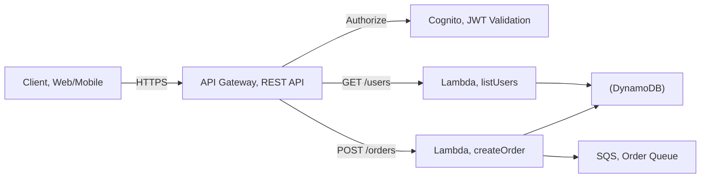
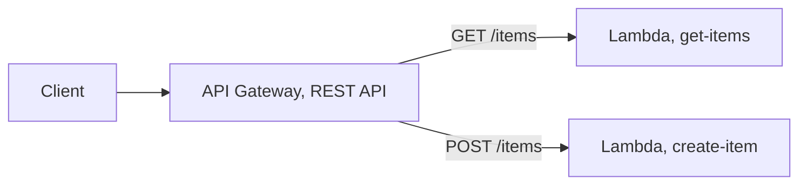

# Chapter 09 — Amazon API Gateway

---

## Prerequisite Chapters
- Chapter 01 — AWS IAM (API execution roles)
- Chapter 08 — AWS Lambda (backend integration)
- Chapter 11 — Amazon Cognito (API authentication)

## Used In Production Practicals
- Practical 19 — API Gateway + Lambda + DynamoDB
- Practical 20 — Cognito + API Gateway + Lambda + DynamoDB
- Practical 15 — Flagship Production Architecture

---

## 1. Learning Objectives

By the end of this chapter, you will be able to:

1. **Explain** REST API vs HTTP API vs WebSocket API — when to use each.
2. **Create** a REST API with resources, methods, and Lambda integration.
3. **Configure** authorization with Cognito, IAM, and Lambda authorizers.
4. **Implement** stages, deployment, throttling, and caching.
5. **Set up** custom domains with ACM certificates.
6. **Monitor** with CloudWatch access logs, execution logs, and X-Ray.
7. **Troubleshoot** 4xx/5xx errors, CORS, and integration issues.
8. **Answer** interview questions about API design and management.

---

## 2. What is Amazon API Gateway?

API Gateway is a fully managed service for creating, publishing, and managing APIs at any scale. It acts as the "front door" for your backend services.

### API Types

| Type | Protocol | Use Case | Cost |
|------|---------|----------|------|
| **REST API** | HTTP | Full-featured (caching, WAF, transforms) | $3.50/million requests |
| **HTTP API** | HTTP | Simple, low-cost proxy to Lambda/HTTP | $1.00/million requests |
| **WebSocket API** | WebSocket | Real-time (chat, notifications, gaming) | $1.00/million messages |

### REST API vs HTTP API

| Feature | REST API | HTTP API |
|---------|----------|----------|
| **Cost** | $3.50/million | $1.00/million (70% cheaper) |
| **Caching** | ✅ Built-in | ❌ No |
| **WAF** | ✅ Yes | ❌ No |
| **Request validation** | ✅ Yes | ❌ No |
| **Request/response transform** | ✅ Yes | ❌ No |
| **Usage plans + API keys** | ✅ Yes | ❌ No |
| **Cognito authorizer** | ✅ Yes | ✅ JWT authorizer |
| **Lambda integration** | ✅ Proxy + non-proxy | ✅ Proxy only |
| **Latency** | Higher | Lower (~60% faster) |

### When to Use
```
HTTP API:  Simple Lambda proxy, cost-sensitive, don't need caching/WAF
REST API:  Need caching, WAF, request validation, API keys, full control
WebSocket: Real-time bidirectional communication
```

---

## 3. Why Do We Need It?

### Without API Gateway
```
Expose Lambda/ECS directly?
  - No authentication
  - No rate limiting
  - No caching
  - No request validation
  - No API versioning
  - No usage monitoring
  - No custom domains
```

### With API Gateway
```
Single entry point for all APIs:
  - Authentication (Cognito, IAM, custom)
  - Rate limiting (throttling)
  - Response caching
  - Request validation
  - API versioning (stages)
  - Monitoring (CloudWatch, X-Ray)
  - Custom domain (api.example.com)
  - WAF protection
```

---

## 4. Real-World Production Use Cases

### 1. Serverless REST API
API Gateway → Lambda → DynamoDB. The most common serverless pattern.

### 2. Microservices Gateway
Single API Gateway routes to different microservices based on path: `/users` → User Service, `/orders` → Order Service.

### 3. Mobile Backend
API Gateway + Cognito + Lambda. Mobile app authenticates with Cognito, calls API with JWT token.

---

## 5. Core Concepts

### API Structure
```
API (my-api)
  └── Resource (/users)
      ├── GET    → Lambda: listUsers
      ├── POST   → Lambda: createUser
      └── Resource (/{userId})
          ├── GET    → Lambda: getUser
          ├── PUT    → Lambda: updateUser
          └── DELETE → Lambda: deleteUser
```

### Integration Types
| Type | How | Use Case |
|------|-----|----------|
| **Lambda Proxy** | Passes entire request to Lambda, returns Lambda response directly | Most common (recommended) |
| **Lambda Non-Proxy** | API Gateway transforms request/response with mapping templates | When you need response shaping |
| **HTTP Proxy** | Forwards to HTTP endpoint | Backend on EC2/ECS |
| **AWS Service** | Direct integration with AWS services | SQS, Step Functions without Lambda |
| **Mock** | Return static response | Testing, CORS preflight |

### Lambda Proxy Integration
```python
# Lambda receives this event:
{
    "httpMethod": "GET",
    "path": "/users/123",
    "pathParameters": {"userId": "123"},
    "queryStringParameters": {"status": "active"},
    "headers": {"Authorization": "Bearer eyJ..."},
    "body": null
}

# Lambda must return this format:
{
    "statusCode": 200,
    "headers": {"Content-Type": "application/json", "Access-Control-Allow-Origin": "*"},
    "body": "{\"id\": \"123\", \"name\": \"Alice\"}"
}
```

### Stages and Deployment
```
Stages = environments for your API:
  dev   → https://abc123.execute-api.ap-south-1.amazonaws.com/dev
  staging → https://abc123.execute-api.ap-south-1.amazonaws.com/staging
  prod  → https://abc123.execute-api.ap-south-1.amazonaws.com/prod

Stage Variables:
  prod.lambdaAlias = "PROD"
  staging.lambdaAlias = "STAGING"
  → Lambda integration: arn:aws:lambda:...:myFunc:${stageVariables.lambdaAlias}
```

### Authorization Options

| Method | How | Use Case |
|--------|-----|----------|
| **Cognito Authorizer** | Validates JWT from Cognito User Pool | User-facing apps |
| **IAM Authorization** | AWS Signature V4 | Service-to-service |
| **Lambda Authorizer** | Custom Lambda validates token/headers | Custom auth, third-party tokens |
| **API Keys** | API key in header (NOT for auth, for tracking) | Usage plans, partner access |

### Throttling
```
Default Limits:
  Account-level: 10,000 requests/second
  Per-stage: configurable
  Per-method: configurable (override)
  Burst: 5,000 requests

Usage Plans:
  Free tier:   100 requests/day, 10/second
  Basic:       10,000 requests/day, 50/second
  Enterprise:  Unlimited, 500/second
  → Associate API key with usage plan
```

### Caching (REST API Only)
```
Cache responses to reduce Lambda invocations:
  - TTL: 0-3600 seconds (default 300)
  - Size: 0.5 GB - 237 GB
  - Cost: $0.02-$3.80/hour depending on size
  - Per-stage, per-method
  - Invalidate: header Cache-Control: max-age=0
```

---

## 6. Architecture

### Serverless API Architecture



---

## 7. Important Components

### API Types
```
REST API:
  - Full-featured, API keys, usage plans, caching
  - Request/response transformations
  - WAF integration, resource policies

HTTP API:
  - Simpler, cheaper, faster (~60% less cost)
  - JWT authorizer built-in, OIDC/OAuth 2.0
  - No usage plans or API keys
  - Best for: Lambda proxy, HTTP proxy

WebSocket API:
  - Persistent connections, real-time
  - Chat applications, live dashboards
  - Routes: $connect, $disconnect, $default
```

---

## 8. How It Works

```
Request Flow:
  1. Client sends HTTPS request to API Gateway endpoint
  2. Route matching: method + path -> integration
  3. Authorization: IAM, Cognito, Lambda authorizer, API key
  4. Request transformation (mapping templates, if REST API)
  5. Integration: Lambda, HTTP endpoint, AWS service, Mock
  6. Response transformation
  7. Response returned to client with CORS headers

Stages:
  - dev, staging, prod (separate deployments)
  - Stage variables for environment-specific config
  - Canary deployments: route % of traffic to new version
```

---

## 9. AWS Console Walkthrough

### Create REST API with Lambda Integration
1. **API Gateway Console** -> **Create API** -> **REST API**
2. **Create Resource**: /orders
3. **Create Method**: GET -> Lambda Function integration
4. **Enable CORS** on the resource
5. **Deploy API** to stage "prod"
6. **Test**: invoke URL from browser or curl

---

## 10. AWS CLI Commands

```bash
# Create REST API
API_ID=$(aws apigateway create-rest-api --name "prod-api" \
    --endpoint-configuration types=REGIONAL \
    --query 'id' --output text)

# Get root resource ID
ROOT_ID=$(aws apigateway get-resources --rest-api-id $API_ID \
    --query 'items[?path==`/`].id' --output text)

# Create resource
RESOURCE_ID=$(aws apigateway create-resource --rest-api-id $API_ID \
    --parent-id $ROOT_ID --path-part "orders" \
    --query 'id' --output text)

# Create method
aws apigateway put-method --rest-api-id $API_ID \
    --resource-id $RESOURCE_ID --http-method GET \
    --authorization-type NONE

# Deploy
aws apigateway create-deployment --rest-api-id $API_ID --stage-name prod
```

### Create REST API
```bash
# Create API
API_ID=$(aws apigateway create-rest-api --name "my-api" \
    --endpoint-configuration '{"types":["REGIONAL"]}' \
    --query 'id' --output text)

# Get root resource
ROOT_ID=$(aws apigateway get-resources --rest-api-id $API_ID \
    --query 'items[0].id' --output text)

# Create /users resource
RESOURCE_ID=$(aws apigateway create-resource --rest-api-id $API_ID \
    --parent-id $ROOT_ID --path-part "users" \
    --query 'id' --output text)

# Create GET method with Lambda proxy
aws apigateway put-method --rest-api-id $API_ID \
    --resource-id $RESOURCE_ID --http-method GET \
    --authorization-type COGNITO_USER_POOLS \
    --authorizer-id $AUTHORIZER_ID

aws apigateway put-integration --rest-api-id $API_ID \
    --resource-id $RESOURCE_ID --http-method GET \
    --type AWS_PROXY \
    --integration-http-method POST \
    --uri "arn:aws:apigateway:ap-south-1:lambda:path/2015-03-31/functions/$LAMBDA_ARN/invocations"

# Deploy to stage
aws apigateway create-deployment --rest-api-id $API_ID --stage-name prod

# Custom domain
aws apigateway create-domain-name \
    --domain-name api.example.com \
    --regional-certificate-arn $ACM_CERT_ARN \
    --endpoint-configuration '{"types":["REGIONAL"]}'
```

### Enable CORS
```bash
# CORS must be enabled for browser-based API calls
# For Lambda Proxy: return CORS headers from Lambda
# Response must include:
#   Access-Control-Allow-Origin: *
#   Access-Control-Allow-Headers: Content-Type,Authorization
#   Access-Control-Allow-Methods: GET,POST,OPTIONS
```

---

## 11. Hands-On Practical

### Practical: REST API with Lambda and Cognito Auth
```bash
# Create HTTP API (simpler)
aws apigatewayv2 create-api --name "orders-api" \
    --protocol-type HTTP --target "arn:aws:lambda:REGION:ACCOUNT:function:orders"

# Add JWT authorizer
aws apigatewayv2 create-authorizer --api-id $API_ID \
    --authorizer-type JWT --name cognito-auth \
    --identity-source '$request.header.Authorization' \
    --jwt-configuration Issuer="https://cognito-idp.REGION.amazonaws.com/POOL_ID",Audience="CLIENT_ID"
```

---

## 12. Production Architecture

```
Production API Gateway Setup:
  - Custom domain with ACM certificate
  - WAF web ACL attached (SQL injection, XSS protection)
  - CloudWatch Logs enabled (full request/response logging)
  - X-Ray tracing enabled (end-to-end latency visibility)
  - Usage plans + API keys for third-party consumers
  - Throttling: 10,000 req/sec account limit, per-method override
  - Stage variables for Lambda alias routing (prod vs canary)
```

---

## 13. Security Best Practices

1. **Authorization on every method** -- never NONE in production
2. **Cognito or Lambda authorizer** for user-facing APIs
3. **IAM authorization** for service-to-service calls
4. **WAF** attached to REST API (rate limiting, IP blocking)
5. **Resource policy** to restrict access by VPC, IP, or account
6. **HTTPS only** -- API Gateway only serves HTTPS
7. **Request validation** -- validate body, headers, query params
8. **API keys + usage plans** for rate limiting third-party consumers
9. **CloudWatch Logs** -- log full requests for audit
10. **Private API** via VPC endpoint for internal services

---

## 14. High Availability

```
API Gateway Built-in HA:
  - Fully managed, multi-AZ by default
  - Automatic scaling (no capacity planning)
  - Edge-optimized: CloudFront distribution included
  - Regional: deploy in specific region
  - 99.95% SLA
```

---

## 15. Scalability

```
Limits:
  - Account-level: 10,000 requests/sec (soft limit, can increase)
  - Per-method throttling: configure burst and rate
  - Payload: 10 MB max (REST), 10 MB (HTTP API)
  - Timeout: 29 seconds max (Lambda integration)
  - Caching: 0.5 GB to 237 GB (REST API only)

Scaling Patterns:
  - Enable caching for read-heavy APIs (TTL-based)
  - Usage plans: per-consumer rate limits
  - Regional API + CloudFront: custom caching + edge acceleration
```

---

## 16. Monitoring & Observability

```
CloudWatch Metrics:
  - Count, 4XXError, 5XXError, Latency, IntegrationLatency
  - CacheMissCount, CacheHitCount (if caching enabled)

X-Ray Tracing:
  - End-to-end: API GW -> Lambda -> DynamoDB
  - Identify bottlenecks (cold starts, DB latency)

Alarms:
  5XXError > 1% -> alert (backend failure)
  4XXError > 10% -> alert (client issues or auth problems)
  Latency p99 > 5000ms -> alert (slow backend)
  Count spike -> alert (potential DDoS)
```

---

## 17. Cost Optimization

```
REST API:   $3.50 per million requests + cache cost
HTTP API:   $1.00 per million requests (70% cheaper!)
WebSocket:  $1.00 per million messages + connection minutes

Cost Tips:
  - Use HTTP API when you don't need REST features
  - Enable caching to reduce Lambda invocations
  - Set appropriate throttling (prevents runaway costs)
  - Use usage plans to limit third-party consumption
```

---

## 18. Disaster Recovery

```
DR Strategy:
  - API Gateway is regional -- deploy in DR region
  - Custom domain + Route 53 failover routing
  - Lambda@Edge or CloudFront for edge availability
  - Export API (Swagger/OpenAPI) for IaC deployment
  - API definition in CloudFormation/SAM template
```

### Production API Configuration
```
API Type:     REST (if need caching/WAF) or HTTP (if cost-sensitive)
Auth:         Cognito JWT authorizer (user-facing) / IAM (service-to-service)
Throttling:   Per-method limits (protect backend)
Caching:      Enable for frequently-read endpoints (GET /products)
WAF:          Block SQL injection, rate limiting
Custom Domain: api.example.com with ACM certificate
Logging:      Access logs + execution logs to CloudWatch
X-Ray:        Enable for distributed tracing
Stages:       dev, staging, prod (separate deployments)
```

---

## 19. Troubleshooting

### Problem 1: 403 Forbidden
```
Causes:
  - Missing or invalid authorization header
  - API key required but not provided
  - WAF blocking the request
  - Resource policy denying the caller
  - Cognito token expired
Fix: Check authorization header, API key, WAF rules, resource policy
```

### Problem 2: 502 Bad Gateway
```
Causes:
  - Lambda returned invalid response format (missing statusCode)
  - Lambda timeout
  - Lambda threw unhandled exception
  - Integration endpoint unreachable
Fix: Check Lambda logs (CloudWatch), verify response format
```

### Problem 3: CORS Error in Browser
```
Causes:
  - Lambda not returning Access-Control-Allow-Origin header
  - OPTIONS method not configured
  - Response headers not matching request origin
Fix: Return CORS headers from Lambda, enable CORS on resource
```

### Problem 4: 429 Too Many Requests
```
Cause: Throttling limit reached
Fix: Increase throttle limits, implement client-side retry with exponential backoff
```

---

## 20. Common Production Problems

| # | Problem | Root Cause | Prevention |
|---|---------|------------|------------|
| 1 | 502 Bad Gateway | Lambda timeout or error | Check Lambda logs, increase timeout |
| 2 | 429 Too Many Requests | Throttling limit hit | Increase throttle, add usage plan |
| 3 | CORS errors | Missing CORS headers | Enable CORS on resource + method |
| 4 | 403 Forbidden | Missing auth, wrong API key | Check authorizer configuration |
| 5 | Slow responses | Lambda cold starts | Provisioned concurrency, HTTP API |
| 6 | Large payload rejected | Over 10 MB limit | Use S3 presigned URLs for uploads |

---

## 21. Real-World Scenario

### Scenario: API Throttling During Product Launch

**Event**: New product launch drives 50x normal API traffic. Users get 429 errors.

**Response**:
1. Increase account-level throttle via AWS Support (expedited)
2. Enable API caching for GET endpoints (reduces Lambda calls)
3. Implement client-side exponential backoff
4. Add CloudFront in front for additional caching layer
5. Post-event: set up usage plans, pre-warm for known events

---

## 22. Interview Questions

### Basic Questions (10)

**Q1: What is Amazon API Gateway?**
A: A managed service for creating, deploying, and managing APIs. Handles authentication, throttling, caching, monitoring. Acts as front door for Lambda, EC2, any HTTP backend.

**Q2: REST API vs HTTP API?**
A: REST: full-featured (caching, WAF, API keys, transforms), $3.50/million. HTTP: simple proxy, 70% cheaper ($1/million), lower latency, but no caching/WAF.

**Q3: What is Lambda Proxy integration?**
A: API Gateway passes the entire request (headers, body, path) to Lambda. Lambda returns statusCode + headers + body. Most common pattern — simple and flexible.

**Q4: How do you handle authentication?**
A: Cognito authorizer (JWT), IAM authorization (SigV4), Lambda authorizer (custom), or API keys (for usage tracking, not auth).

**Q5: What is API Gateway caching?**
A: REST API can cache responses to reduce backend calls. Configure TTL (0-3600s), cache size, per-method. Reduces Lambda invocations and latency.

**Q6: What is a stage?**
A: An environment for your API (dev, staging, prod). Each stage has its own URL, stage variables, caching, and throttling settings.

**Q7: How do you set up a custom domain?**
A: Create ACM certificate → create custom domain in API Gateway → create base path mapping to stage → add CNAME/A record in Route 53.

**Q8: What are usage plans?**
A: Throttle and quota limits associated with API keys. Control access levels for different customers (free tier vs paid tier).

**Q9: What causes a 502 error?**
A: Backend (Lambda) returned an invalid response format or timed out. Check Lambda logs, verify response has statusCode, headers, body.

**Q10: How do you enable CORS?**
A: For Lambda Proxy: return CORS headers (Access-Control-Allow-Origin) from Lambda. Configure OPTIONS method. Both frontend and backend must handle CORS.

### Intermediate Questions (10)

**Q11: How does request validation work in API Gateway?**
A: REST APIs can validate requests before invoking the backend using a request validator: validate body (against a JSON Schema model), validate query string parameters and headers, or both. Invalid requests get a 400 response without invoking Lambda, which saves cost and simplifies backend code. HTTP APIs do not support request validation — validate inside the function instead.

**Q12: What are mapping templates?**
A: Velocity Template Language (VTL) templates used with non-proxy integrations to transform requests and responses. Use them to reshape a client payload into what the backend expects, call AWS services directly (e.g., `PutItem` to DynamoDB or `SendMessage` to SQS with no Lambda), or reshape backend responses. With Lambda Proxy integration, mapping templates are not used.

**Q13: Cognito authorizer vs Lambda authorizer — when do you use each?**
A: Cognito authorizer: zero code, validates Cognito User Pool JWTs, and can check OAuth scopes — use when your users are in Cognito. Lambda authorizer: custom code that returns an IAM policy (REST) or a simple allow/deny (HTTP API) — use for third-party IdPs, API tokens, custom headers, or fine-grained logic like tenant checks. HTTP APIs also have a native JWT authorizer for any OIDC provider (Auth0, Okta).

**Q14: How does Lambda authorizer caching work?**
A: The authorizer result (policy plus context) is cached by identity source (e.g., the `Authorization` header) for a TTL of 0–3600 seconds (default 300). Cached calls skip the authorizer Lambda, reducing latency and cost. Caveat: a REST authorizer policy is cached for the whole API, so return a policy covering all methods the caller may use, or a cached Deny/Allow for one path can wrongly apply to another.

**Q15: What are the main API Gateway limits to remember?**
A: Default account throttle of 10,000 requests/second with a 5,000 burst per Region (soft limit). Maximum payload of 10 MB. Integration timeout of 29 seconds by default (REST Regional and private APIs can request an increase). WebSocket messages up to 128 KB (in 32 KB frames). For long-running work, return 202 and process asynchronously.

**Q16: What endpoint types does a REST API support?**
A: Edge-optimized (requests routed through CloudFront points of presence — good for geographically spread clients), Regional (clients in the same Region, or when you put your own CloudFront distribution in front), and Private (reachable only from a VPC through an `execute-api` interface endpoint). HTTP APIs are Regional only.

**Q17: How do you create a private API?**
A: Create a REST API with endpoint type Private, create an interface VPC endpoint for `com.amazonaws.<region>.execute-api`, and attach a resource policy that allows `execute-api:Invoke` only from that endpoint (`aws:SourceVpce`). Without a resource policy, a private API cannot be invoked. Enable private DNS on the endpoint or call through the endpoint-specific hostname.

**Q18: What is a VPC Link?**
A: A VPC Link lets API Gateway reach private backends inside your VPC without exposing them publicly. REST APIs use a VPC Link to a Network Load Balancer. HTTP APIs use VPC Links that can target ALBs, NLBs, or AWS Cloud Map services. Typical use: exposing ECS/EKS services or internal microservices behind a public API.

**Q19: How do stage variables work?**
A: Key-value pairs defined per stage and referenced as `${stageVariables.name}` in integration URIs, Lambda ARNs, and mapping templates. Common use: point the `dev` stage to `my-function:dev` alias and `prod` to `my-function:prod`. When the integration references a Lambda alias through a stage variable, you must grant API Gateway invoke permission on each alias.

**Q20: How do you customize error responses?**
A: Use Gateway Responses (REST) to customize responses API Gateway itself generates — e.g., `UNAUTHORIZED`, `ACCESS_DENIED`, `THROTTLED`, `DEFAULT_4XX`, `DEFAULT_5XX`. You can change status codes, add CORS headers, and set a consistent JSON body. Adding CORS headers to `DEFAULT_4XX/5XX` is important — otherwise browsers hide the real error behind a CORS failure.

### Advanced Questions (10)

**Q21: How do WebSocket APIs work?**
A: Clients keep a persistent connection. Routes are selected by a route selection expression (e.g., `$request.body.action`), plus built-in `$connect`, `$disconnect`, and `$default` routes. Store connection IDs (usually in DynamoDB) on `$connect`, delete on `$disconnect`. To push messages to a client, the backend calls the `@connections` management API (`POST` to the connection URL). Use for chat, live dashboards, and notifications.

**Q22: What API versioning strategies can you use?**
A: 1) URI path versioning (`/v1/orders`, `/v2/orders`) — most common and explicit. 2) Separate APIs or stages per major version mapped via custom domain base paths (`api.example.com/v1` → API A, `/v2` → API B). 3) Header-based versioning handled in the backend. Keep old versions running with deprecation notices and monitor their traffic before removal.

**Q23: How do canary deployments work in API Gateway?**
A: REST API stages support canary settings: deploy a new version to the canary and route a percentage of traffic (e.g., 10%) to it while the rest uses the current deployment. Canary requests can use different stage variables (e.g., a new Lambda alias) and log separately. Monitor errors and latency, then promote the canary or roll it back. Alternatively, use Lambda alias weighted routing with CodeDeploy behind a stable integration.

**Q24: Design throttling for a multi-tenant SaaS API.**
A: Layer the controls: 1) Account-level and stage-level throttling to protect the backend. 2) Method-level throttling for expensive endpoints. 3) Usage plans with API keys per tenant tier (e.g., Free: 10 rps / 10K per day, Pro: 100 rps / 1M per month). 4) AWS WAF rate-based rules per IP to block abusive clients. 5) Backend protection such as SQS buffering or reserved concurrency on Lambda. Clients should retry 429s with exponential backoff.

**Q25: How do you protect an API with AWS WAF?**
A: Associate a WAF web ACL with the REST API stage (HTTP APIs need CloudFront in front for WAF). Use AWS Managed Rules (Core rule set, Known bad inputs, SQL injection), rate-based rules, geo-match rules, and IP sets. Log to Kinesis Firehose/S3 or CloudWatch Logs. Start new rules in Count mode, then switch to Block once you confirm no false positives.

**Q26: Design a multi-Region active-active API.**
A: Deploy identical Regional APIs in two Regions with the same custom domain name in each (Regional ACM certificate per Region). In Route 53, use latency-based or failover routing with health checks against each Regional endpoint. Back it with DynamoDB global tables or Aurora Global Database. Make writes idempotent and plan for conflict resolution. Edge-optimized endpoints do not support this pattern — use Regional.

**Q27: How do you integrate API Gateway directly with AWS services (no Lambda)?**
A: Use an AWS service integration on a REST API with an IAM execution role and VTL mapping templates — e.g., `POST /orders` → SQS `SendMessage`, `GET /items/{id}` → DynamoDB `GetItem`, or Step Functions `StartExecution`. HTTP APIs offer first-class integrations for SQS, EventBridge, Kinesis, Step Functions, and AppConfig without VTL. Benefits: lower latency, no cold starts, and lower cost.

**Q28: How do you secure an API with mutual TLS?**
A: Configure mTLS on a Regional custom domain name and upload a truststore (PEM bundle of your CA certificates) to S3. Clients must present a certificate signed by a trusted CA. Disable the default `execute-api` endpoint so clients cannot bypass mTLS. Common for B2B and IoT integrations. Certificate revocation must be handled by a Lambda authorizer checking the client cert.

**Q29: How do you implement observability for API Gateway?**
A: Enable CloudWatch metrics (`Count`, `4XXError`, `5XXError`, `Latency`, `IntegrationLatency`, `CacheHitCount`), access logging with a JSON format including `requestId`, `status`, `integrationLatency`, and `authorizer.error`, and X-Ray tracing for end-to-end traces. Alarm on 5XX rate and p99 latency. `Latency` minus `IntegrationLatency` shows the overhead inside API Gateway (authorizers, mapping).

**Q30: How do you manage API Gateway with infrastructure as code?**
A: Define APIs with AWS SAM (`AWS::Serverless::Api`/`HttpApi`), CDK, CloudFormation, or Terraform, ideally from an OpenAPI definition. Remember that REST API changes are not live until a new deployment is created — SAM/CDK handle this automatically; in Terraform you need `aws_api_gateway_deployment` with a `triggers` hash. Keep stages per environment and promote through a CI/CD pipeline.

### Scenario-Based Questions (10)

**Q31: Users intermittently get 504 Gateway Timeout errors. How do you troubleshoot?**
A: A 504 means the integration did not respond within the timeout (29 seconds by default). Check `IntegrationLatency` in CloudWatch and the Lambda `Duration` metric, plus X-Ray traces to find the slow dependency (database, third-party API, cold starts in a VPC). Fixes: optimize the slow call, add caching, raise the integration timeout if supported, or convert to an async pattern (return 202 + job ID, process via SQS/Step Functions, poll or use WebSocket for the result).

**Q32: After a deployment, clients get "Missing Authentication Token" (403). Why?**
A: Despite the name, this usually means the requested path/method does not exist in the deployed stage — e.g., wrong URL, a typo in the resource path, missing stage name in the URL, or the new route was created but the API was not redeployed. Verify the route in the stage, redeploy, and check the base path mapping on the custom domain.

**Q33: A browser app fails with CORS errors, but Postman works. What do you fix?**
A: Postman ignores CORS; browsers enforce it. Ensure: 1) an `OPTIONS` method exists (or CORS is enabled on the HTTP API) returning `Access-Control-Allow-Origin`, `-Methods`, and `-Headers`; 2) Lambda Proxy responses include `Access-Control-Allow-Origin` on every response, including errors; 3) Gateway Responses `DEFAULT_4XX` and `DEFAULT_5XX` include CORS headers; 4) if credentials are used, the origin is specific, not `*`.

**Q34: Clients get 429 Too Many Requests during a sale event. What do you do?**
A: Identify which limit was hit: account Regional limit, stage/method throttling, or usage plan limit (check the `THROTTLED` vs `QUOTA_EXCEEDED` gateway response). Short term: raise stage/method limits and request an account quota increase. Long term: enable caching for read-heavy endpoints, put CloudFront in front for cacheable content, buffer writes with SQS, and make clients retry with exponential backoff and jitter.

**Q35: Lambda returns data, but API Gateway responds 502 "Malformed Lambda proxy response". Why?**
A: With proxy integration, Lambda must return a JSON object with `statusCode` (number), optional `headers`, and `body` as a string. Common bugs: returning a raw object instead of `JSON.stringify(body)`, missing `statusCode`, or an unhandled exception. Check the execution log or Lambda logs; also check `isBase64Encoded` for binary responses.

**Q36: Your API costs are high. How do you reduce them?**
A: 1) Migrate suitable REST APIs to HTTP APIs (about 70% cheaper). 2) Enable caching on hot GET endpoints to cut backend invocations. 3) Put CloudFront in front of cacheable responses. 4) Use direct service integrations instead of Lambda "glue" functions. 5) Increase Lambda authorizer cache TTL. 6) Block bots with WAF so you do not pay for junk traffic. 7) Reduce access-log verbosity where it is excessive.

**Q37: You must expose an internal ECS service to partners securely. How?**
A: Put the ECS service behind an internal NLB (REST) or ALB/Cloud Map (HTTP API), create a VPC Link, and route the API to it. Secure partners with API keys + usage plans for metering, plus IAM auth, Lambda authorizer, or mTLS for authentication. Attach WAF and a custom domain. The ECS service stays in private subnets with no public exposure.

**Q38: Latency is high even though Lambda is fast. Where is the time going?**
A: Compare `Latency` with `IntegrationLatency`. If the gap is large, the time is in API Gateway: authorizer execution (cache it), VTL mapping, or edge-optimized routing for clients in the same Region (switch to Regional). If `IntegrationLatency` is high but Lambda `Duration` is low, look at Lambda cold starts and init duration (use provisioned concurrency or SnapStart). X-Ray shows the breakdown per segment.

**Q39: How do you migrate a REST API to an HTTP API safely?**
A: First check feature gaps: HTTP APIs lack caching, request validation, WAF (directly), usage plans/API keys, VTL transforms, and private endpoints. If you do not rely on these, export the OpenAPI definition, import it as an HTTP API, rebuild authorizers (use JWT authorizers), and test. Shift traffic with Route 53 weighted records or by moving the custom domain mapping, and keep the REST API for rollback.

**Q40: A deleted route broke a mobile app version still in use. How do you prevent this?**
A: Treat the API as a contract: version breaking changes (`/v2`), never remove routes used by supported app versions, and track usage per route and client version through access logs before deprecating. Use canary deployments and contract tests (OpenAPI diff in CI) to catch breaking changes. Communicate deprecation timelines and return a `Deprecation`/`Sunset` header before removal.

---

## 23. Scenario-Based Interview Questions

*(Covered in section 22 above -- Q31 through Q40)*

---

## 24. Common Mistakes

1. **Using REST API when HTTP API suffices** — 3.5x more expensive
2. **Not returning CORS headers from Lambda** — browser errors
3. **Invalid Lambda response format** — 502 errors
4. **API keys for authentication** — use Cognito/IAM, keys are for tracking
5. **No throttling configured** — backend overwhelmed
6. **No custom domain** — using `execute-api` URL in production
7. **Caching without invalidation strategy** — stale data
8. **No access logging** — can't debug API issues

---

## 25. Production Checklist

- [ ] API type selected (REST vs HTTP) based on requirements
- [ ] Authorization configured (Cognito/IAM/Lambda authorizer)
- [ ] Throttling limits set per method
- [ ] Custom domain with ACM certificate
- [ ] CORS configured for browser clients
- [ ] Access logging enabled (CloudWatch)
- [ ] X-Ray tracing enabled
- [ ] WAF attached (REST API) for security
- [ ] Caching enabled for read-heavy endpoints
- [ ] Usage plans for API consumers

---

## 26. Chapter Summary

1. **HTTP API for simple/cheap** — 70% less cost, lower latency
2. **REST API for full features** — caching, WAF, API keys, transforms
3. **Lambda Proxy is the default** — pass everything to Lambda, return formatted response
4. **Cognito for user auth** — JWT validation without Lambda
5. **Throttling protects backends** — per-method, per-stage limits
6. **Custom domain** — api.example.com with ACM certificate
7. **CORS from Lambda** — must return headers in Lambda response
8. **502 = bad Lambda response** — check format and timeout
9. **Stages for environments** — dev, staging, prod
10. **Caching reduces cost** — fewer Lambda invocations

---
---

# 🔬 Practical Lab 34 — API Gateway + Lambda

## Lab Overview
| Item | Detail |
|------|--------|
| **Difficulty** | Intermediate |
| **Duration** | 30 minutes |
| **Cost** | Free tier: 1M API calls/month |
| **Prerequisites** | Practical 33 (Lambda) |
| **Lab Environment** | Environment 8 — Serverless |

## Business Scenario
> Build a REST API that your mobile and web applications can call. API Gateway handles routing, throttling, and CORS — Lambda handles the business logic.

## Architecture


### Step 1 — Create REST API
1. **API Gateway** → **Create API** → **REST API** → **Build**
   - **Name**: `prod-api`
   - **Endpoint type**: Regional

📸 **Screenshot 01** — API Created

### Step 2 — Create Resource and Methods
1. **Create resource**: `/items`
2. **Create method**: GET → Lambda integration → `prod-get-items`
3. **Create method**: POST → Lambda integration → `prod-create-item`

📸 **Screenshot 02** — Resources and Methods Configured
> **Verify**: /items with GET and POST methods pointing to Lambda functions

### Step 3 — Deploy API
1. **Deploy API** → **New stage**: `prod`
2. Copy the invoke URL

📸 **Screenshot 03** — API Deployed to prod Stage
> **What you should see**: Invoke URL displayed

### Step 4 — Test API
```bash
# GET request
curl -s https://xxx.execute-api.ap-south-1.amazonaws.com/prod/items

# POST request
curl -s -X POST https://xxx.execute-api.ap-south-1.amazonaws.com/prod/items \
    -H "Content-Type: application/json" \
    -d '{"name": "Test Item", "price": 29.99}'
```

📸 **Screenshot 04** — API Responding Successfully
> **Verify**: GET returns items, POST creates new item

🎯 **Interview Insight**: "REST API vs HTTP API?"
> **Strong answer**: "HTTP API: cheaper (70%), faster, simpler — best for most use cases. REST API: API keys, usage plans, request validation, WAF integration, caching — best for enterprise APIs. Use HTTP API by default, REST API when you need advanced features."
