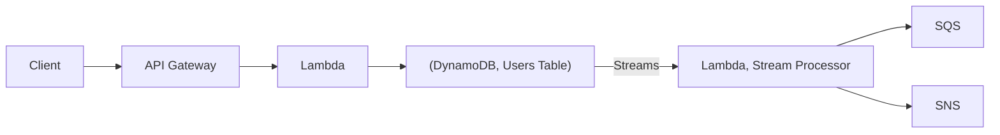
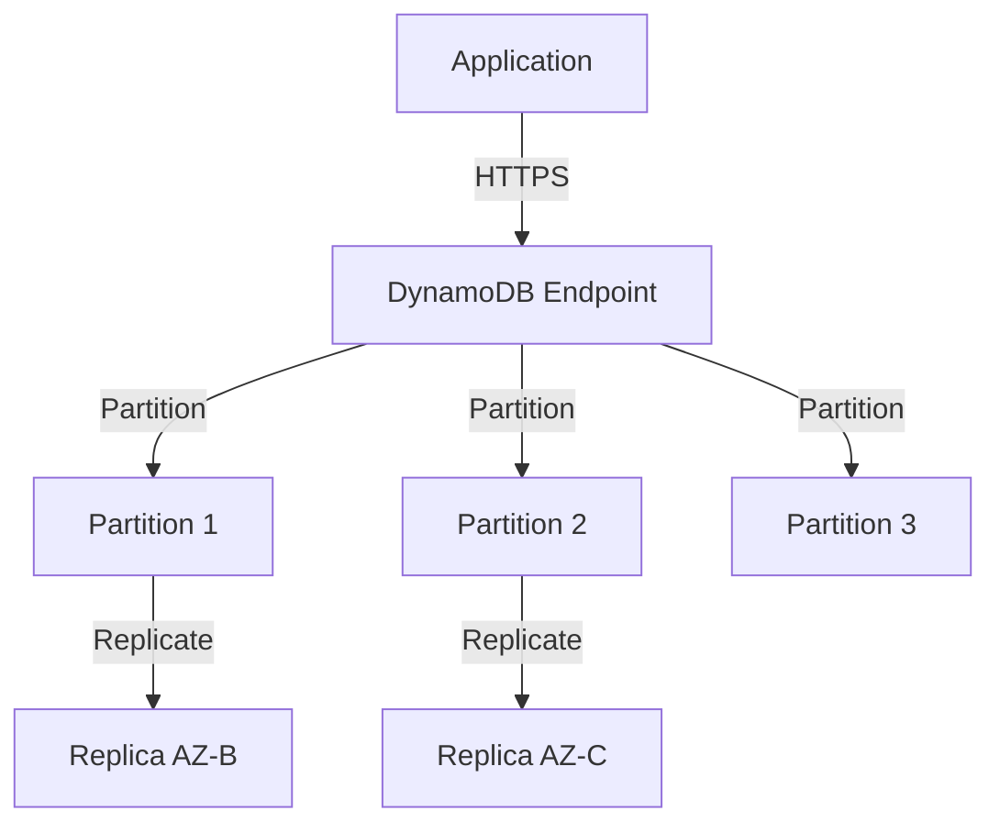
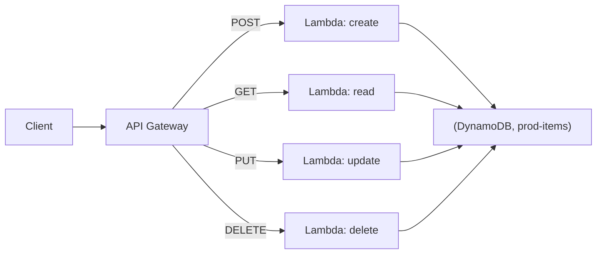

# Chapter 10 — Amazon DynamoDB

---

## Prerequisite Chapters
- Chapter 01 — AWS IAM (table access policies)
- Chapter 08 — AWS Lambda (event-driven processing)
- Chapter 22 — AWS KMS (encryption at rest)

## Used In Production Practicals
- Practical 19 — API Gateway + Lambda + DynamoDB
- Practical 20 — Cognito + API Gateway + Lambda + DynamoDB
- Practical 15 — Flagship Production Architecture

---

## 1. Learning Objectives

By the end of this chapter, you will be able to:

1. **Explain** DynamoDB data model — tables, items, attributes, partition keys, sort keys.
2. **Design** partition keys for even distribution and hot key avoidance.
3. **Create** Global Secondary Indexes (GSI) and Local Secondary Indexes (LSI).
4. **Choose** between On-Demand and Provisioned capacity modes.
5. **Implement** DynamoDB Streams for event-driven architectures.
6. **Configure** TTL for automatic data expiration.
7. **Troubleshoot** throttling, hot partitions, and capacity issues.
8. **Answer** interview questions about NoSQL database design.

---

## 2. What is Amazon DynamoDB?

DynamoDB is a fully managed **NoSQL key-value and document database** designed for single-digit millisecond performance at any scale. Serverless — no servers to manage.

### DynamoDB vs RDS

| Feature | DynamoDB | RDS |
|---------|----------|-----|
| **Type** | NoSQL (key-value) | Relational (SQL) |
| **Schema** | Flexible (schemaless) | Fixed schema (tables, columns) |
| **Scaling** | Automatic (horizontal) | Manual (vertical) |
| **Joins** | Not supported | Full SQL joins |
| **Transactions** | Limited (25 items) | Full ACID |
| **Latency** | Single-digit ms | Variable |
| **Operations** | Zero (serverless) | Managed (patching, backups) |
| **Best for** | High-throughput key lookups | Complex queries, relationships |

### When to Use DynamoDB
```
✅ High throughput, low latency (gaming, IoT, mobile)
✅ Simple access patterns (get/put by key)
✅ Serverless applications (Lambda + API Gateway)
✅ Session storage, shopping cart, user profiles
✅ Event stores, audit logs

❌ Complex joins and relationships
❌ Ad-hoc SQL queries
❌ Financial transactions (complex multi-table)
❌ Small dataset with complex queries (RDS better)
```

---

## 3. Core Concepts

### Data Model
```
Table: Users
  ├── Item: {PK: "user#123", SK: "PROFILE", name: "Alice", email: "alice@ex.com"}
  ├── Item: {PK: "user#123", SK: "ORDER#001", total: 99.99, status: "shipped"}
  ├── Item: {PK: "user#123", SK: "ORDER#002", total: 149.99, status: "pending"}
  ├── Item: {PK: "user#456", SK: "PROFILE", name: "Bob", email: "bob@ex.com"}
  └── Item: {PK: "user#456", SK: "ORDER#001", total: 49.99, status: "delivered"}

Partition Key (PK): Determines which partition stores the item
Sort Key (SK):      Enables range queries within a partition
```

### Key Design Patterns

| Pattern | PK | SK | Query |
|---------|----|----|-------|
| **User profile** | `user#123` | `PROFILE` | Get user by ID |
| **User orders** | `user#123` | `ORDER#001` | Get all orders: SK begins_with "ORDER#" |
| **Product catalog** | `product#ABC` | `METADATA` | Get product details |
| **Time series** | `sensor#001` | `2026-09-18T14:00:00Z` | Query range: SK between dates |

### Capacity Modes

| Mode | Pricing | Scaling | Best For |
|------|---------|---------|----------|
| **On-Demand** | Per request ($1.25/million writes, $0.25/million reads) | Instant, automatic | Variable/unpredictable traffic |
| **Provisioned** | Per RCU/WCU ($0.00065/WCU/hr) | Manual or auto-scaling | Predictable, steady traffic |

### Read/Write Capacity Units
```
WCU (Write Capacity Unit): 1 write/second for item up to 1 KB
RCU (Read Capacity Unit):  1 strongly consistent read/second for item up to 4 KB
                           2 eventually consistent reads/second for item up to 4 KB
```

### Global Secondary Index (GSI) vs Local Secondary Index (LSI)

| Feature | GSI | LSI |
|---------|-----|-----|
| **When to create** | Anytime | Table creation only |
| **Key** | Different PK + optional SK | Same PK, different SK |
| **Consistency** | Eventually consistent only | Strong or eventual |
| **Capacity** | Own provisioned RCU/WCU | Shares table's capacity |
| **Limit** | 20 per table | 5 per table |

### DynamoDB Streams
```
Enable Streams on a table → every change (insert, update, delete) creates a stream record

Stream → Lambda trigger:
  Insert: process new order → send confirmation email
  Update: order status changed → notify customer
  Delete: item expired (TTL) → archive to S3

Stream record contains:
  - Keys only
  - New image (after change)
  - Old image (before change)
  - New and old images (both)
```

### TTL (Time to Live)
```
Set TTL attribute on items → DynamoDB automatically deletes expired items

Example:
  {PK: "session#abc", ttl: 1695050400}  ← Unix timestamp
  When current time > ttl → item deleted (no WCU cost!)

Use cases:
  - Session expiration
  - Temporary tokens
  - Log retention (30 days)
```

---

## 4. Architecture

### Serverless Application with DynamoDB



---

## 5. Architecture



---

## 6. Important Components

```
Table: collection of items (like a SQL table)
Item: a single record (like a SQL row)
Attribute: a field (like a SQL column)
Primary Key: partition key (hash) or composite (hash + sort)
GSI: Global Secondary Index (different partition key, eventual consistency)
LSI: Local Secondary Index (same partition key, different sort key)
Streams: ordered log of item changes (for triggers, replication)
```

---

## 7. How It Works

```
Read/Write Flow:
  1. Application sends request to DynamoDB endpoint (HTTPS)
  2. Request routed to correct partition (hash of partition key)
  3. Write: replicated across 3 AZs (synchronous)
  4. Read: eventually consistent (default) or strongly consistent
  5. Streams: changes published for Lambda triggers, cross-region replication

Consistency Models:
  - Eventually Consistent (default): 0.5 RCU per 4 KB, slightly stale
  - Strongly Consistent: 1 RCU per 4 KB, always latest
  - Transactional: 2x cost, ACID across multiple items
```

---

## 8. Service Components

```
Capacity Modes:
  - On-Demand: pay per request, auto-scales, no planning
  - Provisioned: set RCU/WCU, use auto-scaling, predictable cost

DynamoDB Accelerator (DAX):
  - In-memory cache, microsecond reads
  - Drop-in replacement (same API calls)
  - Ideal for read-heavy workloads

Global Tables:
  - Multi-region, multi-active replication
  - Sub-second replication latency
  - Conflict resolution: last-writer-wins
```

---

## 9. AWS Console Walkthrough

### Create Production DynamoDB Table
1. **DynamoDB Console** -> **Create table**
2. **Table name**: `orders`
3. **Partition key**: `orderId` (String)
4. **Sort key**: `timestamp` (Number)
5. **Capacity mode**: On-Demand (or Provisioned with auto-scaling)
6. **Encryption**: AWS owned key or CMK
7. **Point-in-time recovery**: Enable
8. **Tags**: Environment=prod

---

## 10. AWS CLI Commands

```bash
# Create table
aws dynamodb create-table \
    --table-name orders \
    --attribute-definitions \
        AttributeName=orderId,AttributeType=S \
        AttributeName=timestamp,AttributeType=N \
    --key-schema \
        AttributeName=orderId,KeyType=HASH \
        AttributeName=timestamp,KeyType=RANGE \
    --billing-mode PAY_PER_REQUEST \
    --sse-specification Enabled=true

# Put item
aws dynamodb put-item --table-name orders \
    --item '{"orderId":{"S":"ORD001"},"timestamp":{"N":"1696000000"},"status":{"S":"placed"}}'

# Query
aws dynamodb query --table-name orders \
    --key-condition-expression "orderId = :id" \
    --expression-attribute-values '{":id":{"S":"ORD001"}}'

# Enable PITR
aws dynamodb update-continuous-backups --table-name orders \
    --point-in-time-recovery-specification PointInTimeRecoveryEnabled=true
```

### Table Operations
```bash
# Create table
aws dynamodb create-table \
    --table-name Users \
    --attribute-definitions \
        AttributeName=PK,AttributeType=S \
        AttributeName=SK,AttributeType=S \
    --key-schema \
        AttributeName=PK,KeyType=HASH \
        AttributeName=SK,KeyType=RANGE \
    --billing-mode PAY_PER_REQUEST

# Put item
aws dynamodb put-item --table-name Users --item '{
    "PK": {"S": "user#123"}, "SK": {"S": "PROFILE"},
    "name": {"S": "Alice"}, "email": {"S": "alice@example.com"}
}'

# Get item
aws dynamodb get-item --table-name Users --key '{
    "PK": {"S": "user#123"}, "SK": {"S": "PROFILE"}
}'

# Query (all items for a partition key)
aws dynamodb query --table-name Users \
    --key-condition-expression "PK = :pk AND begins_with(SK, :sk)" \
    --expression-attribute-values '{":pk": {"S": "user#123"}, ":sk": {"S": "ORDER#"}}'

# Enable TTL
aws dynamodb update-time-to-live --table-name Users \
    --time-to-live-specification Enabled=true,AttributeName=ttl

# Enable Streams
aws dynamodb update-table --table-name Users \
    --stream-specification StreamEnabled=true,StreamViewType=NEW_AND_OLD_IMAGES
```

### Python (Boto3)
```python
import boto3
from boto3.dynamodb.conditions import Key

dynamodb = boto3.resource('dynamodb')
table = dynamodb.Table('Users')

# Put item
table.put_item(Item={
    'PK': 'user#123', 'SK': 'PROFILE',
    'name': 'Alice', 'email': 'alice@example.com'
})

# Get item
response = table.get_item(Key={'PK': 'user#123', 'SK': 'PROFILE'})
user = response['Item']

# Query user's orders
response = table.query(
    KeyConditionExpression=Key('PK').eq('user#123') & Key('SK').begins_with('ORDER#')
)
orders = response['Items']
```

---

## 11. Hands-On Practical

### Practical: CRUD Operations with DynamoDB
```bash
# Create, read, update, delete operations
# Put item
aws dynamodb put-item --table-name orders \
    --item '{"orderId":{"S":"ORD002"},"status":{"S":"shipped"}}'

# Get item
aws dynamodb get-item --table-name orders \
    --key '{"orderId":{"S":"ORD002"}}'

# Update item
aws dynamodb update-item --table-name orders \
    --key '{"orderId":{"S":"ORD002"}}' \
    --update-expression "SET #s = :val" \
    --expression-attribute-names '{"#s":"status"}' \
    --expression-attribute-values '{":val":{"S":"delivered"}}'

# Delete item
aws dynamodb delete-item --table-name orders \
    --key '{"orderId":{"S":"ORD002"}}'
```

---

## 12. Production Architecture

```
Production DynamoDB Config:
  - On-Demand for unpredictable workloads (or Provisioned + auto-scaling)
  - Point-in-time recovery (PITR) enabled
  - Encryption with CMK (for compliance) or AWS managed key
  - DynamoDB Streams enabled (for event-driven processing)
  - Global Tables for multi-region active-active
  - DAX for microsecond read latency (read-heavy workloads)
```

---

## 13. Security Best Practices

1. **IAM fine-grained access** -- restrict to specific tables, items, attributes
2. **Condition keys** -- LeadingKeys condition limits access to own items
3. **Encryption at rest** -- enabled by default (AWS owned, managed, or CMK)
4. **VPC endpoints** -- access DynamoDB without internet (Gateway endpoint, free)
5. **CloudTrail** -- log all DynamoDB API calls

---

## 14. High Availability

```
Built-in HA:
  - Data replicated across 3 AZs automatically
  - No single point of failure
  - 99.999% SLA (Global Tables: 99.999%)
  - Automatic failover, no manual intervention
```

---

## 15. Scalability

```
On-Demand Mode:
  - Instantly scales to millions of requests/second
  - No capacity planning required

Provisioned Mode:
  - Auto-scaling: adjusts RCU/WCU based on utilization
  - Target: 70% utilization
  - Burst capacity: 300 seconds of unused capacity

Partition Limits:
  - 3,000 RCU / 1,000 WCU per partition
  - Hot partition = performance issue
  - Fix: design keys for uniform distribution
```

---

## 16. Monitoring & Observability

```
CloudWatch Metrics:
  - ConsumedReadCapacityUnits, ConsumedWriteCapacityUnits
  - ThrottledRequests (most important!)
  - SystemErrors, UserErrors
  - SuccessfulRequestLatency

Alarms:
  ThrottledRequests > 0 -> alert (capacity issue)
  SystemErrors > 0 -> alert (AWS-side issue)
  ConsumedRCU > 80% provisioned -> alert (scale up)
```

---

## 17. Cost Optimization

```
Pricing:
  - On-Demand: $1.25 per million write, $0.25 per million read
  - Provisioned: $0.00065 per WCU/hour, $0.00013 per RCU/hour
  - Storage: $0.25 per GB/month
  - Reserved Capacity: up to 77% savings (provisioned mode)

Cost Tips:
  - Use On-Demand for dev/test, Provisioned for stable prod
  - Reserved Capacity for predictable workloads
  - TTL (Time to Live): auto-delete expired items (free!)
  - Smaller items = fewer RCU/WCU consumed
  - Use projections in queries (don't read unnecessary attributes)
```

---

## 18. Disaster Recovery

```
DR Strategy:
  - PITR: restore to any second in last 35 days
  - On-demand backups: manual snapshots, persist until deleted
  - Global Tables: multi-region active-active replication
  - DynamoDB Streams + Lambda: custom replication logic

RPO/RTO:
  - PITR: RPO = seconds, RTO = minutes to hours (table size)
  - Global Tables: RPO < 1 second, RTO = near-zero
```

### Production DynamoDB Configuration
```
Capacity:    On-Demand for variable traffic, Provisioned + Auto-Scaling for predictable
Encryption:  Enabled (default: AWS owned key, or specify CMK)
Streams:     Enable for event-driven processing
TTL:         Enable for ephemeral data (sessions, tokens)
Backups:     Point-in-time recovery enabled (35 days)
Global Table: Multi-region for global applications (active-active)
DAX:         DynamoDB Accelerator for microsecond reads (in-memory cache)
```

---

## 19. Troubleshooting

### Problem 1: ProvisionedThroughputExceededException (Throttling)
```
Cause: More requests than provisioned capacity
Fix:
  - Switch to On-Demand mode
  - Enable auto-scaling
  - Improve partition key design (avoid hot keys)
  - Use DAX for read-heavy workloads
```

### Problem 2: Hot Partition
```
Cause: One partition key getting disproportionate traffic
Example: PK = "country" → "US" gets 90% of traffic
Fix: Add randomness to key (PK = "US#3"), use composite keys
```

---

## 20. Common Production Problems

| # | Problem | Root Cause | Prevention |
|---|---------|------------|------------|
| 1 | ThrottledRequests | Hot partition or capacity exceeded | Uniform key design, auto-scaling |
| 2 | High latency | Large items or scan operations | Use query, project attributes |
| 3 | High cost | Over-provisioned or scan-heavy | Right-size, use On-Demand for variable |
| 4 | Missing data | No PITR, accidental delete | Enable PITR, enable Streams |

---

## 21. Real-World Scenario

### Scenario: DynamoDB Throttling During Flash Sale

**Event**: Flash sale causes 10x write spikes. ThrottledRequests alarm fires.

**Response**:
1. Switch to On-Demand mode (instant, no downtime)
2. Identify hot partition key (orderId starting with same prefix)
3. Add randomness to partition key (write sharding)
4. Post-event: switch back to Provisioned with auto-scaling

---

## 22. Interview Questions

### Basic Questions (10)

**Q1: What is DynamoDB?**
A: A fully managed NoSQL key-value database. Serverless, single-digit ms latency, automatic scaling. Accessed via API (no SQL). Best for high-throughput, simple access patterns.

**Q2: Partition key vs sort key?**
A: Partition key: determines data distribution. Must be unique (if no sort key). Sort key: enables range queries within a partition. Together they form the primary key.

**Q3: On-Demand vs Provisioned?**
A: On-Demand: pay per request, instant scaling, no capacity planning. Provisioned: set RCU/WCU, cheaper for predictable traffic, use auto-scaling.

**Q4: What is a GSI?**
A: Global Secondary Index — alternate partition key + optional sort key. Enables queries on non-primary key attributes. Has its own capacity. Eventually consistent only.

**Q5: What is DynamoDB Streams?**
A: A time-ordered sequence of item-level changes. Triggers Lambda on insert/update/delete. Used for event-driven architectures, replication, auditing.

**Q6: What is TTL?**
A: Time to Live — automatically deletes items after a timestamp. No WCU cost. Use for sessions, tokens, temporary data.

**Q7: Strongly vs Eventually consistent reads?**
A: Strongly consistent: always returns latest data, costs 1 RCU per 4 KB. Eventually consistent: may return stale data (milliseconds), costs 0.5 RCU per 4 KB (50% cheaper).

**Q8: What is DAX?**
A: DynamoDB Accelerator — in-memory cache in front of DynamoDB. Microsecond read latency. Compatible with DynamoDB API (drop-in replacement for reads).

**Q9: Maximum item size?**
A: 400 KB per item. For larger data: store in S3, save S3 URL in DynamoDB.

**Q10: How do you handle hot partitions?**
A: Improve key design (add randomness/composite keys), use write sharding, enable auto-scaling, use On-Demand mode.

### Intermediate Questions (10)

**Q11: What is single-table design and why is it recommended?**
A: Storing multiple entity types (users, orders, products) in one table using generic keys like `PK` and `SK` (e.g., `PK=USER#123`, `SK=ORDER#2026-10-01`). Benefits: fetch related items in one Query (no joins), fewer tables to manage, lower cost, and consistent performance. Trade-off: harder to understand, needs access patterns defined upfront, and less flexible for ad-hoc analytics.

**Q12: Why must you define access patterns before designing a DynamoDB table?**
A: DynamoDB only queries efficiently by primary key or index keys. Unlike SQL, you cannot add arbitrary WHERE clauses cheaply. List every query first (e.g., "get user by email", "list orders for user by date", "get open orders by status"), then design PK/SK and GSIs to serve each one with a Query or GetItem. Designing the schema first and queries later usually ends in expensive Scans.

**Q13: What is GSI overloading?**
A: Reusing a single GSI with generic attribute names (`GSI1PK`, `GSI1SK`) to serve several access patterns for different entity types. Example: for users `GSI1PK=EMAIL#a@b.com`; for orders `GSI1PK=STATUS#PENDING`. One index serves many queries, which keeps you under the 20-GSI limit and reduces cost.

**Q14: How do DynamoDB transactions work?**
A: `TransactWriteItems` and `TransactGetItems` give ACID guarantees across up to 100 items (max 4 MB) in one or more tables in the same Region. All operations succeed or none do. Cost: 2x the normal WCU/RCU, because of the prepare and commit phases. Use for: money transfers, inventory reservation, and uniqueness constraints. Note: the operations are not isolated from non-transactional writes on the same items, and they can fail with `TransactionCanceledException` on conflict.

**Q15: Explain batch operations and their limits.**
A: `BatchGetItem`: up to 100 items / 16 MB per call. `BatchWriteItem`: up to 25 put/delete operations / 16 MB per call (no updates). Batches are **not atomic**. Some items may fail and are returned in `UnprocessedItems`/`UnprocessedKeys`. Always retry those with exponential backoff. Use batches to cut network round trips, not for consistency.

**Q16: What are conditional writes and why are they important?**
A: A `ConditionExpression` makes a write succeed only if a condition holds, e.g. `attribute_not_exists(PK)` (prevent overwrite) or `version = :v` (optimistic locking). If the condition fails, you get `ConditionalCheckFailedException` and no write happens, but it still uses WCU. This is the standard way to prevent lost updates and race conditions without locks.

**Q17: Query vs Scan — what is the difference?**
A: **Query** reads items from one partition key value (optionally filtered by a sort key range). It is efficient and costs only for the items it reads. **Scan** reads every item in the table or index and then applies filters. Cost and latency grow with table size. `FilterExpression` reduces the data returned but **not** the RCU consumed. Avoid Scan in production request paths. For exports, use parallel Scan or Export to S3.

**Q18: LSI vs GSI — when would you use each?**
A: **LSI**: same partition key, different sort key. Must be created with the table. Supports strongly consistent reads. Shares the table's capacity. Limits the item collection to 10 GB per partition key. **GSI**: any partition and sort key. Can be added or removed anytime. Eventually consistent only. Has its own capacity. Use a GSI in almost all cases. Use an LSI only when you need strongly consistent reads on an alternate sort order.

**Q19: What is a sparse index?**
A: A GSI only contains items that have the index key attribute. If you set `GSI1PK` only on items that need indexing (e.g., `isFlagged=true` orders), the index stays small and cheap. Querying it returns just those items. This is great for "find all pending/flagged/VIP items" patterns.

**Q20: How does pagination work in DynamoDB?**
A: Query and Scan return up to 1 MB of data per call. If more data exists, the response includes `LastEvaluatedKey`. Pass it as `ExclusiveStartKey` in the next request. `Limit` caps the number of items evaluated, not the number returned after filtering. For APIs, encode `LastEvaluatedKey` (base64) as an opaque `nextToken` for clients.

### Advanced Questions (10)

**Q21: What are Global Tables and how do they handle conflicts?**
A: Global Tables replicate a table across multiple Regions in an active-active (multi-Region, multi-active) setup. Replication usually takes under a second. Any Region accepts reads and writes. Conflicts use **last-writer-wins** based on timestamps. Use for: global low-latency apps and Regional DR (RPO in seconds, RTO near zero). Design apps to avoid writing the same item in two Regions at once, for example by routing each user to a home Region.

**Q22: Explain DynamoDB backup and restore options.**
A: 1) **On-demand backups**: full backups with no performance impact, kept until deleted. 2) **Point-in-Time Recovery (PITR)**: continuous backups that let you restore to any second in the last 1–35 days (configurable). 3) **AWS Backup**: centralized policies, cross-account and cross-Region copies, and vault lock. Restores always create a **new table**. You must re-apply auto-scaling, IAM policies, alarms, TTL and Streams settings afterwards.

**Q23: How do you migrate from RDS (relational) to DynamoDB?**
A: 1) Inventory access patterns from the app and SQL logs. 2) Design the single-table model (denormalize, pre-join related data). 3) Migrate data with AWS DMS (RDS source → DynamoDB target with object mapping) or with Export to S3 plus Glue/Lambda transforms. 4) Use dual-writes or CDC (DMS ongoing replication) to keep both in sync. 5) Shift reads gradually behind a feature flag. 6) Cut over writes, then decommission RDS. Avoid a 1:1 table-for-table port. It defeats the purpose.

**Q24: How do you optimize DynamoDB costs?**
A: Choose Provisioned with auto-scaling for steady traffic (often 50–70% cheaper than On-Demand) and buy Reserved Capacity for the baseline. Use eventually consistent reads (half price). Project only the attributes you need into GSIs (`KEYS_ONLY`/`INCLUDE`). Use TTL to delete old data for free. Use the Standard-IA table class for rarely accessed tables. Compress large attributes or move them to S3. Avoid Scans. Remove unused GSIs.

**Q25: How does DynamoDB partitioning work internally?**
A: DynamoDB hashes the partition key to place items on partitions. Each partition supports up to **3,000 RCU and 1,000 WCU** and about 10 GB. Partitions split automatically as data or throughput grows. **Adaptive capacity** shifts unused throughput to hot partitions instantly, and can isolate very hot items on their own partition. Even so, a single key value cannot exceed per-partition limits, so high-cardinality keys still matter.

**Q26: How do you implement write sharding for a hot key?**
A: Add a random or calculated suffix to the partition key: `PK=VOTE#candidateA#<0-9>`. Writes spread across 10 partitions. To read, query all 10 shards in parallel and add up the results. Calculated suffixes (e.g., a hash of the user ID mod N) let you find a specific item directly. Use when one logical key gets more than ~1,000 writes/sec.

**Q27: How do you build event-driven pipelines with DynamoDB Streams?**
A: Enable Streams (`NEW_AND_OLD_IMAGES`) and attach a Lambda event source mapping. Configure batch size, `BisectBatchOnFunctionError`, `MaximumRetryAttempts`, and an on-failure destination (SQS/SNS) for poison records. Use event filtering so Lambda only runs for relevant changes. Common uses: sync to OpenSearch, aggregate counters, send notifications, and audit trails. Records are kept for 24 hours and ordered per item. For longer retention or more consumers, use Kinesis Data Streams for DynamoDB.

**Q28: How do you secure a DynamoDB table?**
A: Encryption at rest is always on (AWS-owned, AWS-managed, or customer-managed KMS keys). Use least-privilege IAM with fine-grained access control (`dynamodb:LeadingKeys` condition so users can only reach their own partition). Use VPC Gateway Endpoints so traffic stays off the internet. Add endpoint policies, CloudTrail data events for item-level auditing, deletion protection, and resource-based policies for cross-account access.

**Q29: How do you model a many-to-many relationship?**
A: Use the **adjacency list pattern**. Store edges as items: `PK=STUDENT#1, SK=COURSE#A` and `PK=COURSE#A, SK=STUDENT#1`, or use one item per edge with a GSI that inverts PK/SK. Query `PK=STUDENT#1` to get all their courses. Query the GSI with `GSI1PK=COURSE#A` to get all students. Duplicate the attributes you need (e.g., course name) onto edge items to avoid extra lookups.

**Q30: How do you enforce uniqueness on a non-key attribute (e.g., email)?**
A: Use a transaction that writes two items: the user item `PK=USER#123` and a uniqueness item `PK=EMAIL#a@b.com`, both with `attribute_not_exists(PK)`. If the email already exists, the whole transaction fails. When changing the email, delete the old marker and create the new one in the same transaction.

### Scenario-Based Questions (10)

**Q31: Your table is throttling during a flash sale even though On-Demand is enabled. Why?**
A: On-Demand instantly handles up to double the previous peak. Sudden traffic beyond that can throttle until DynamoDB scales. A single hot partition key (e.g., one product ID) can also exceed the per-partition limit of 1,000 WCU. Fixes: pre-warm by switching to Provisioned with high capacity before the event (or use warm throughput), shard hot keys, put DAX or ElastiCache in front for reads, and queue writes through SQS to smooth spikes.

**Q32: Your monthly DynamoDB bill doubled. How do you investigate?**
A: Check Cost Explorer by usage type (read/write request units, storage, backups, data transfer, Streams, Global Table replicated writes). In CloudWatch, review `ConsumedRead/WriteCapacityUnits` per table and GSI. Common causes: a new Scan-based feature, GSIs with `ALL` projection doubling writes, large items, missing TTL, or PITR on huge tables. Use CloudWatch Contributor Insights to find top keys and callers.

**Q33: Design a DynamoDB schema for an e-commerce order system.**
A: Single table: `PK=CUSTOMER#id, SK=PROFILE` for the customer. `PK=CUSTOMER#id, SK=ORDER#<date>#<orderId>` for order summaries (list orders by date). `PK=ORDER#id, SK=ITEM#<sku>` for line items. GSI1: `GSI1PK=ORDER#id` to get an order directly. GSI2 (sparse): `GSI2PK=STATUS#PENDING, GSI2SK=<date>` for fulfilment queues. Use transactions to decrement inventory and create the order together.

**Q34: You need to add a new access pattern to a production table. What do you do?**
A: If existing keys can serve it, reuse them. Otherwise, add a new GSI online. DynamoDB backfills it with no downtime, but backfill uses write capacity, so watch `OnlineIndexPercentageProgress` and throttling. If the new pattern needs new attributes, run a backfill job (Step Functions + Lambda, or a parallel Scan) to populate `GSIxPK/SK` on existing items, then update the app.

**Q35: Someone accidentally deleted thousands of items. How do you recover?**
A: If PITR is enabled, restore the table to a point just before the deletion into a new table. Then copy back only the deleted items (find them by comparing, or from Streams/CloudTrail data events) with a script, or switch the app to the restored table. Without PITR, use the latest on-demand or AWS Backup snapshot. To prevent it: enable PITR, deletion protection, and least-privilege IAM. Deny `DeleteItem`/`BatchWriteItem` to humans in production.

**Q36: Reads are slow (tens of ms) for a read-heavy leaderboard. How do you improve it?**
A: Add DAX for microsecond cached reads of hot items. Use eventually consistent reads. Pre-compute top-N leaderboards with Streams + Lambda into one item (or ElastiCache sorted sets) instead of querying many items. Keep items small and use projection expressions. Check client config: reuse HTTP connections (keep-alive) and keep the client in the same Region.

**Q37: How do you implement a multi-tenant SaaS on DynamoDB?**
A: Pool model: one table with `PK=TENANT#id#...`. Isolate tenants using IAM `dynamodb:LeadingKeys` conditions with tenant-scoped credentials (via STS session tags). Use Contributor Insights or tagging to track noisy tenants. For premium or regulated tenants, use the silo model (separate table or account per tenant). Use per-tenant KMS keys if required.

**Q38: A Lambda consuming DynamoDB Streams is stuck retrying one bad record. How do you fix it?**
A: The shard is blocked because records are processed in order. Configure `BisectBatchOnFunctionError=true`, `MaximumRetryAttempts` (e.g., 3), `MaximumRecordAgeInSeconds`, and an on-failure destination (SQS DLQ). Return `batchItemFailures` (ReportBatchItemFailures) so only failed records are retried. Fix the bug, then replay records from the DLQ.

**Q39: You must keep 7 years of order history but only the last 90 days are queried often. Design it.**
A: Keep recent data in DynamoDB with TTL set to 90 days. Stream TTL deletions (`userIdentity = dynamodb.amazonaws.com`) through Lambda or Kinesis Firehose to S3 in Parquet. Query the archive with Athena and apply S3 lifecycle rules to Glacier. Alternatively, use the Standard-IA table class for a cold table. This greatly cuts storage cost while meeting retention.

**Q40: When would you NOT choose DynamoDB?**
A: When you need complex ad-hoc queries, joins, or aggregations (use RDS/Aurora or Redshift), full-text search (OpenSearch), unknown or evolving access patterns, strong relational integrity across many entities, or items over 400 KB that can't be split. Teams without NoSQL modelling experience may also move faster with a relational database at first.

---

## 23. Scenario-Based Interview Questions

*(Covered in section 22 above)*

---

## 24. Common Mistakes

1. **Scan instead of Query** -- scans read entire table (expensive)
2. **Hot partition keys** -- timestamps or sequential IDs cause throttling
3. **No PITR** -- can't recover from accidental deletes
4. **Over-provisioned capacity** -- paying for unused RCU/WCU
5. **Large items** -- max 400 KB, store large data in S3

---

## 25. Production Checklist

- [ ] Partition key designed for even distribution
- [ ] On-Demand or Provisioned + Auto-Scaling
- [ ] Point-in-time recovery enabled
- [ ] Encryption enabled (CMK for compliance)
- [ ] DynamoDB Streams enabled (if event-driven)
- [ ] TTL configured for ephemeral data
- [ ] GSI for additional access patterns
- [ ] CloudWatch alarms for throttling
- [ ] DAX for read-heavy workloads

---

## 26. Chapter Summary

1. **NoSQL = design for access patterns** — not for relationships
2. **Partition key = most important decision** — determines performance
3. **On-Demand for variable traffic** — no capacity planning
4. **Streams for event-driven** — trigger Lambda on data changes
5. **TTL for automatic cleanup** — no WCU cost
6. **GSI for alternate queries** — different key, own capacity
7. **400 KB item limit** — large data in S3
8. **DAX for microsecond reads** — in-memory cache
9. **Avoid hot partitions** — distribute traffic across keys
10. **Single-table design** — one table per microservice, multiple entity types

---
---

# 🔬 Practical Lab 35 — Serverless CRUD (API Gateway + Lambda + DynamoDB)

## Lab Overview
| Item | Detail |
|------|--------|
| **Difficulty** | Intermediate |
| **Duration** | 45 minutes |
| **Cost** | Free tier for all services |
| **Prerequisites** | Practical 34 (API Gateway + Lambda) |
| **Lab Environment** | Environment 8 — Serverless |

## Business Scenario
> Build a complete serverless CRUD API — no servers to manage. This is an excellent portfolio/interview project.

## Architecture


### Step 1 — Create DynamoDB Table
1. **DynamoDB** → **Create table**
   - **Name**: `prod-items`
   - **Partition key**: `id` (String)

📸 **Screenshot 01** — DynamoDB Table Created

### Step 2 — Create Lambda Functions
Create 4 Lambda functions: create-item, get-items, update-item, delete-item

```python
# create-item Lambda
import json, boto3, uuid
dynamodb = boto3.resource('dynamodb')
table = dynamodb.Table('prod-items')

def lambda_handler(event, context):
    body = json.loads(event['body'])
    item = {'id': str(uuid.uuid4()), **body}
    table.put_item(Item=item)
    return {'statusCode': 201, 'body': json.dumps(item)}
```

📸 **Screenshot 02** — Four Lambda Functions Created

### Step 3 — Wire API Gateway
Map each HTTP method to the corresponding Lambda function.

📸 **Screenshot 03** — API Gateway with CRUD Methods

### Step 4 — Test Full CRUD
```bash
API="https://xxx.execute-api.ap-south-1.amazonaws.com/prod"

# Create
curl -s -X POST $API/items -d '{"name":"Widget","price":9.99}'

# Read
curl -s $API/items

# Update
curl -s -X PUT $API/items/ITEM_ID -d '{"name":"Widget Pro","price":19.99}'

# Delete
curl -s -X DELETE $API/items/ITEM_ID
```

📸 **Screenshot 04** — All CRUD Operations Working
> **Verify**: Create returns 201, Read returns items, Update modifies, Delete removes

📸 **Screenshot 05** — DynamoDB Items in Console
> **What you should see**: Items in DynamoDB table matching API operations

🎯 **Interview Insight**: "Walk me through a serverless CRUD architecture."
> **Strong answer**: "API Gateway (REST/HTTP API) → Lambda functions (one per operation) → DynamoDB. No servers, auto-scaling, pay-per-request. IAM roles on Lambda with least-privilege DynamoDB permissions. Add Cognito for authentication, X-Ray for tracing, CloudWatch for monitoring."
