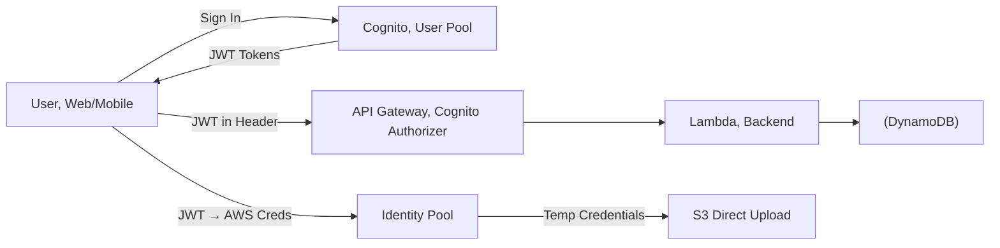
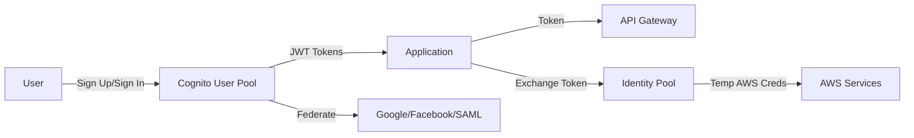

# Chapter 11 — Amazon Cognito

---

## Prerequisite Chapters
- Chapter 01 — AWS IAM (federated access, roles)
- Chapter 09 — Amazon API Gateway (API authentication)

## Used In Production Practicals
- Practical 20 — Cognito + API Gateway + Lambda + DynamoDB
- Practical 15 — Flagship Production Architecture (auth layer)

---

## 1. Learning Objectives

By the end of this chapter, you will be able to:

1. **Explain** User Pools vs Identity Pools and when to use each.
2. **Create** a User Pool with sign-up, sign-in, and MFA.
3. **Integrate** Cognito with API Gateway for JWT authentication.
4. **Configure** social login (Google, Facebook, Apple) and SAML federation.
5. **Implement** the Hosted UI for quick authentication flows.
6. **Use** Identity Pools to grant temporary AWS credentials.
7. **Configure** Lambda triggers for custom authentication logic.
8. **Troubleshoot** authentication errors and token issues.
9. **Answer** interview questions about authentication and authorization.

---

## 2. What is Amazon Cognito?

Amazon Cognito provides **authentication, authorization, and user management** for web and mobile applications. Users can sign in directly or through third-party identity providers.

### Two Main Components

| Component | Purpose | Returns |
|-----------|---------|---------|
| **User Pool** | User directory (sign-up, sign-in, MFA) | JWT tokens (ID, Access, Refresh) |
| **Identity Pool** | Exchange tokens for AWS credentials | Temporary AWS STS credentials |

### How They Work Together
```
1. User signs in via User Pool → receives JWT tokens
2. Application sends JWT to API Gateway → validates and authorizes
3. (Optional) JWT exchanged via Identity Pool → temp AWS credentials
4. User accesses AWS services directly (S3 upload) with temp credentials
```

---

## 3. Why Do We Need It?

### Without Cognito
```
Building authentication from scratch:
  - User database (passwords, hashing)
  - Sign-up flow (email verification)
  - Password reset flow
  - MFA implementation
  - OAuth 2.0 / OIDC implementation
  - Token management (JWT generation, validation)
  - Social login (Google, Facebook APIs)
  - Security: brute force protection, account lockout

Months of work. Security vulnerabilities likely.
```

### With Cognito
```
All handled by AWS:
  - User directory with sign-up/sign-in
  - Email/phone verification
  - MFA (SMS, TOTP)
  - Password policies
  - JWT tokens (standards-compliant)
  - Social login (one-click setup)
  - Hosted UI (pre-built auth pages)
  - Advanced security (risk-based auth)

Days to integrate. AWS handles security.
```

---

## 4. Core Concepts

### User Pool Features
```
User Management:
  - Sign-up with email/phone verification
  - Password policies (length, complexity, history)
  - MFA (SMS, TOTP authenticator app)
  - Account recovery (email/SMS)
  - User groups (admin, users, readonly)

Authentication:
  - Username/password
  - Social login (Google, Facebook, Apple, Amazon)
  - SAML federation (corporate SSO)
  - OIDC federation
  - Custom auth flows (Lambda triggers)

Tokens:
  ID Token:      User identity claims (name, email, groups) — 1 hour
  Access Token:  Authorization scopes (API access) — 1 hour
  Refresh Token: Get new tokens without re-authenticating — 30 days
```

### JWT Token (Decoded)
```json
{
    "sub": "abc123-def456",
    "email": "alice@example.com",
    "cognito:groups": ["admin", "developers"],
    "name": "Alice",
    "iss": "https://cognito-idp.ap-south-1.amazonaws.com/ap-south-1_ABC123",
    "aud": "app-client-id",
    "exp": 1695050400,
    "token_use": "id"
}
```

### Lambda Triggers
```
Pre sign-up:          Validate/reject sign-up, auto-confirm
Post confirmation:    Send welcome email, create user record in DynamoDB
Pre authentication:   Custom validation (IP check, account status)
Post authentication:  Logging, analytics, update last login
Pre token generation: Add custom claims to JWT
Custom message:       Customize verification email/SMS
Define auth challenge: Custom authentication flow (CAPTCHA, security questions)
```

### Hosted UI
```
Pre-built authentication UI:
  URL: https://your-domain.auth.ap-south-1.amazoncognito.com/login

Features:
  - Sign up, sign in, forgot password
  - Social login buttons (Google, Facebook)
  - SAML federation
  - Customizable logo and CSS
  - OAuth 2.0 / OIDC compliant
  
Use for: Quick MVPs, internal tools, rapid prototyping
Don't use for: Highly branded consumer apps (build custom UI)
```

---

## 5. Architecture



---

## 6. Architecture



---

## 7. Important Components

```
User Pool:
  - User directory (sign-up, sign-in, MFA)
  - Returns JWT tokens (ID, Access, Refresh)
  - Supports: email/phone verification, password policies
  - Triggers: Lambda for custom auth flows

Identity Pool:
  - Exchanges tokens for temporary AWS credentials
  - Supports: Cognito, Google, Facebook, SAML, OIDC
  - Maps to IAM roles (authenticated vs guest)

App Client:
  - Configuration for your application
  - OAuth 2.0 flows: authorization code, implicit, client credentials
  - Hosted UI for quick authentication pages
```

---

## 8. How It Works

```
Authentication Flow:
  1. User signs up (email + password) -> Cognito creates user
  2. Cognito sends verification code (email/SMS)
  3. User confirms -> account activated
  4. User signs in -> Cognito returns JWT tokens
  5. Application includes token in API requests
  6. API Gateway validates JWT -> allows/denies

Token Types:
  - ID Token: user identity claims (email, name, groups)
  - Access Token: API authorization (scopes)
  - Refresh Token: get new ID/Access tokens without re-login
```

---

## 9. AWS Console Walkthrough

### Create User Pool
1. **Cognito Console** -> **Create user pool**
2. **Sign-in**: Email
3. **Password policy**: Minimum 8 chars, uppercase, lowercase, number, symbol
4. **MFA**: Optional (TOTP or SMS)
5. **Email**: Send with Cognito (default) or SES
6. **App client**: Create with hosted UI
7. **Callback URL**: https://your-app.com/callback

---

## 10. AWS CLI Commands

```bash
# Create user pool
POOL_ID=$(aws cognito-idp create-user-pool \
    --pool-name prod-users \
    --auto-verified-attributes email \
    --mfa-configuration OPTIONAL \
    --query 'UserPool.Id' --output text)

# Create app client
aws cognito-idp create-user-pool-client \
    --user-pool-id $POOL_ID \
    --client-name web-app \
    --explicit-auth-flows ALLOW_USER_PASSWORD_AUTH ALLOW_REFRESH_TOKEN_AUTH

# Admin create user
aws cognito-idp admin-create-user \
    --user-pool-id $POOL_ID \
    --username user@example.com \
    --temporary-password TempPass123!
```

### Create User Pool
```bash
POOL_ID=$(aws cognito-idp create-user-pool \
    --pool-name "prod-app-users" \
    --auto-verified-attributes email \
    --mfa-configuration OPTIONAL \
    --policies '{
        "PasswordPolicy": {
            "MinimumLength": 12,
            "RequireUppercase": true,
            "RequireLowercase": true,
            "RequireNumbers": true,
            "RequireSymbols": true
        }
    }' \
    --schema '[
        {"Name": "email", "Required": true, "Mutable": true},
        {"Name": "name", "Required": true, "Mutable": true}
    ]' \
    --query 'UserPool.Id' --output text)

# Create App Client (no secret for public clients)
CLIENT_ID=$(aws cognito-idp create-user-pool-client \
    --user-pool-id $POOL_ID \
    --client-name "web-app" \
    --no-generate-secret \
    --explicit-auth-flows ALLOW_USER_PASSWORD_AUTH ALLOW_REFRESH_TOKEN_AUTH ALLOW_USER_SRP_AUTH \
    --query 'UserPoolClient.ClientId' --output text)
```

### User Operations
```bash
# Sign up
aws cognito-idp sign-up \
    --client-id $CLIENT_ID \
    --username "alice@example.com" \
    --password "StrongP@ss123!" \
    --user-attributes Name=email,Value=alice@example.com

# Confirm sign-up
aws cognito-idp confirm-sign-up \
    --client-id $CLIENT_ID \
    --username "alice@example.com" \
    --confirmation-code "123456"

# Sign in
aws cognito-idp initiate-auth \
    --client-id $CLIENT_ID \
    --auth-flow USER_PASSWORD_AUTH \
    --auth-parameters USERNAME=alice@example.com,PASSWORD=StrongP@ss123!
```

### Python Integration
```python
import boto3
import requests

cognito = boto3.client('cognito-idp')

# Sign in
response = cognito.initiate_auth(
    ClientId='YOUR_CLIENT_ID',
    AuthFlow='USER_PASSWORD_AUTH',
    AuthParameters={
        'USERNAME': 'alice@example.com',
        'PASSWORD': 'StrongP@ss123!'
    }
)
id_token = response['AuthenticationResult']['IdToken']

# Use token for API Gateway
headers = {'Authorization': id_token}
response = requests.get('https://api.example.com/users', headers=headers)
```

---

## 11. Hands-On Practical

### Practical: User Pool with Hosted UI
```bash
# Create user pool domain
aws cognito-idp create-user-pool-domain \
    --domain "my-app-auth" \
    --user-pool-id $POOL_ID

# Test: navigate to hosted UI
# https://my-app-auth.auth.REGION.amazoncognito.com/login
```

---

## 12. Production Architecture

```
Production Cognito Setup:
  - User Pool with MFA enabled (TOTP preferred)
  - Custom domain with ACM certificate
  - SES for email delivery (not Cognito default)
  - Lambda triggers: pre-sign-up validation, post-confirmation
  - Advanced security: adaptive authentication, compromised credentials check
  - Groups for role-based access control
```

---

## 13. Security Best Practices

1. **Enable MFA** -- TOTP (authenticator app) preferred over SMS
2. **Strong password policy** -- min 12 chars, complexity requirements
3. **Advanced security features** -- risk-based adaptive auth
4. **Email verification required** -- prevent fake accounts
5. **Lambda pre-sign-up trigger** -- validate email domain
6. **Token expiration** -- short access tokens (1 hour), longer refresh (30 days)
7. **Use Authorization Code flow** -- not Implicit (more secure for web apps)

---

## 14. High Availability

```
Cognito Built-in HA:
  - Fully managed, multi-AZ within a region
  - 99.9% SLA
  - No capacity planning needed
  - Automatic scaling for millions of users
```

---

## 15. Scalability

```
Limits:
  - User Pool: millions of users
  - Sign-in: thousands of requests/second
  - Soft limits can be increased via AWS Support
  - Lambda triggers add latency (keep them fast)
```

---

## 16. Monitoring & Observability

```
CloudWatch Metrics:
  - SignUpSuccesses, SignInSuccesses
  - TokenRefreshSuccesses
  - AccountTakeOverRisk, CompromisedCredentialsRisk

CloudTrail:
  - All Cognito API calls logged
  - Monitor: AdminCreateUser, UpdateUserPool, DeleteUserPool

Alarms:
  - SignInFailures spike -> alert (brute force attempt)
  - CompromisedCredentialsRisk -> alert (credential stuffing)
```

---

## 17. Cost Optimization

```
Pricing:
  - First 50,000 MAU: free (User Pool)
  - 50,001-100,000: $0.0055 per MAU
  - Advanced security: $0.050 per MAU (additional)
  - SAML/OIDC federation: $0.015 per MAU

Cost Tips:
  - Use free tier for small apps
  - Advanced security only for production
  - Cognito Identity Pool: free (you pay for AWS services used)
```

---

## 18. Disaster Recovery

```
DR Considerations:
  - Cognito is regional -- no built-in cross-region replication
  - Export users: aws cognito-idp list-users (metadata only, not passwords)
  - Passwords cannot be exported or migrated
  - DR strategy: Lambda migration trigger (re-authenticate on first login)
  - Alternative: use SAML/OIDC with external IdP for portability
```

### Production Cognito Configuration
```
User Pool:
  - Strong password policy (12+ chars)
  - MFA: OPTIONAL (SMS + TOTP)
  - Email verification required
  - Advanced security features enabled
  - Custom domain (auth.example.com)
  - Lambda triggers for custom logic

API Gateway:
  - Cognito authorizer validates JWT
  - No Lambda call for auth (faster, cheaper)

Token Configuration:
  - ID/Access token: 1 hour (default)
  - Refresh token: 30 days (configurable)
  - Configure token revocation

Groups:
  - admin, developers, users, readonly
  - Map to API Gateway method permissions
```

---

## 19. Troubleshooting

### Problem 1: "NotAuthorizedException"
```
Causes:
  - Wrong username or password
  - User not confirmed (check email verification)
  - User disabled by admin
  - MFA code required but not provided
  - Auth flow not enabled on app client
```

### Problem 2: Token Expired (API returns 401)
```
Fix: Use Refresh Token to get new tokens:
  cognito.initiate_auth(
      ClientId='...', AuthFlow='REFRESH_TOKEN_AUTH',
      AuthParameters={'REFRESH_TOKEN': refresh_token}
  )
```

### Problem 3: API Gateway Returns 401
```
Check:
  1. Using ID token (not Access token) for Cognito authorizer
  2. Token not expired
  3. Token issued by correct User Pool
  4. Authorization header format correct
```

---

## 20. Common Production Problems

| # | Problem | Root Cause | Prevention |
|---|---------|------------|------------|
| 1 | Users can't sign in | Password policy mismatch | Test with same policy in dev |
| 2 | Token expired errors | Short expiration, no refresh | Implement token refresh logic |
| 3 | Lambda trigger timeout | Slow external API in trigger | Optimize trigger, add timeout |
| 4 | Email not delivered | Cognito email limit (50/day) | Use SES for production email |

---

## 21. Real-World Scenario

### Scenario: Credential Stuffing Attack

**Event**: Spike in failed sign-in attempts from multiple IPs.

**Response**:
1. Enable Advanced Security features (adaptive authentication)
2. Block compromised credentials (Cognito checks against leaked DB)
3. Enforce MFA for high-risk sign-ins
4. WAF rate limiting on Cognito endpoint
5. Lambda pre-auth trigger: block known bad IPs

---

## 22. Interview Questions

### Basic Questions (10)

**Q1: What is Amazon Cognito?**
A: A managed authentication service. User Pool = user directory (sign-up, sign-in, MFA, JWT tokens). Identity Pool = exchange tokens for temporary AWS credentials.

**Q2: User Pool vs Identity Pool?**
A: User Pool: authentication (who are you?) — returns JWT. Identity Pool: authorization (what AWS resources?) — returns STS credentials. Use together: User Pool authenticates, Identity Pool authorizes AWS access.

**Q3: How does Cognito integrate with API Gateway?**
A: Create Cognito Authorizer on API Gateway pointing to User Pool. Client sends JWT in Authorization header. API Gateway validates token (signature, expiry, issuer) without Lambda — faster and cheaper.

**Q4: What are Lambda triggers?**
A: Hooks at key authentication events: pre-sign-up (validation), post-confirmation (welcome email), pre-authentication (custom checks), pre-token-generation (add custom claims).

**Q5: What tokens does Cognito return?**
A: ID Token (user identity claims), Access Token (authorization scopes), Refresh Token (get new tokens without re-authenticating).

**Q6: What is the Hosted UI?**
A: Pre-built authentication pages provided by Cognito. Handles sign-up, sign-in, password reset, social login. Quick to set up, customizable with CSS.

**Q7: How do you add social login?**
A: Configure Google/Facebook/Apple as identity providers in User Pool. Add provider details (client ID, secret). Users see social login buttons in Hosted UI.

**Q8: What MFA options does Cognito support?**
A: SMS-based OTP, TOTP authenticator apps (Google Authenticator, Authy), and email OTP. You can set MFA to optional, required, or adaptive (risk-based — only required when Cognito detects suspicious sign-in). For production, require TOTP over SMS since SMS can be intercepted via SIM swap.

**Q9: How do you set up a custom domain for Cognito Hosted UI?**
A: Two options: 1) **Cognito domain prefix** — `https://your-prefix.auth.region.amazoncognito.com` (free, quick). 2) **Custom domain** — `https://auth.example.com` — requires an ACM certificate in us-east-1 and a CNAME/Alias record in Route 53. Custom domains give a branded login experience.

**Q10: How do Cognito groups enable RBAC?**
A: Create groups (Admin, Editor, Viewer) and assign IAM roles to each. Add users to groups. The ID token includes a `cognito:groups` claim. API Gateway or Lambda authorizers read this claim and enforce access. Identity Pools map groups to IAM roles for AWS resource access.

### Intermediate Questions (10)

**Q11: How does SAML federation work with Cognito?**
A: Configure your enterprise IdP (Okta, ADFS, Azure AD) as a SAML identity provider in the User Pool. Users click "Sign in with SSO" → redirected to IdP → authenticate → SAML assertion sent back to Cognito → Cognito maps SAML attributes to user pool attributes and issues JWTs. No passwords stored in Cognito.

**Q12: What are custom authentication challenges?**
A: The Custom Auth flow uses three Lambda triggers: Define Auth Challenge (decide next step), Create Auth Challenge (generate OTP/CAPTCHA), Verify Auth Challenge Response (check answer). Use for: passwordless login with magic links, CAPTCHA verification, or custom MFA like biometrics.

**Q13: What are Cognito Advanced Security features?**
A: Risk-based adaptive authentication that evaluates each sign-in for compromised credentials, unusual device/location, and brute-force attempts. Actions: allow, require MFA, or block. It also detects credential stuffing attacks. Costs $0.050/MAU (Monthly Active User) on top of the base price.

**Q14: How does the user migration Lambda trigger work?**
A: When a user that doesn't exist in Cognito tries to sign in, Cognito calls your migration Lambda. The Lambda verifies credentials against your legacy database. If valid, it returns user attributes and Cognito creates the user in the User Pool. Users are migrated on-demand with zero downtime — no bulk migration required.

**Q15: How do you customize tokens?**
A: Use the **Pre Token Generation** Lambda trigger (V2 for access token, V1 for ID token only). You can add, suppress, or override claims. Example: add `tenant_id`, `plan`, or `permissions` claims. The trigger runs after authentication but before tokens are issued. Keep the Lambda fast (<5 sec) to avoid login timeouts.

**Q16: How do you implement cross-app SSO with Cognito?**
A: Create one User Pool shared by multiple app clients. Each app client has its own OAuth settings (callback URLs, scopes). Users authenticate once and the Cognito session cookie keeps them signed in. Subsequent apps redirect to Cognito, which returns tokens without re-prompting for credentials (if the session is valid).

**Q17: How does Identity Pool role mapping work?**
A: Identity Pools map authenticated users to IAM roles. Mapping rules: 1) **Token-based** — use `cognito:groups` or `cognito:preferred_role` claim to pick a role. 2) **Rules-based** — match claims (e.g., email domain) to roles. 3) **Default** — all authenticated users get one role, unauthenticated get another. The IAM role policy determines what AWS resources they can access.

**Q18: How does Cognito integrate with ALB?**
A: ALB has built-in Cognito authentication support. Add an authentication action to the HTTPS listener rule pointing to your User Pool. ALB redirects unauthenticated users to Cognito Hosted UI, then validates the returned token and forwards authenticated requests to the target group with user claims in HTTP headers (`x-amzn-oidc-data`).

**Q19: How do you handle token revocation?**
A: Call `GlobalSignOut` (revoke all sessions) or `AdminUserGlobalSignOut`. Refresh tokens are immediately invalidated. Access and ID tokens remain valid until expiry (max 1 hour) because they are stateless JWTs. For immediate enforcement, check the token against the revocation endpoint or use short token lifetimes (5 min) and validate on every API call.

**Q20: What are Cognito security best practices?**
A: Require MFA (TOTP preferred). Use Authorization Code + PKCE flow (not Implicit). Set short access token lifetimes (15–60 min). Validate JWTs server-side (verify signature, issuer, audience, expiry). Use Advanced Security. Move email to SES (Cognito default is 50/day). Store tokens in httpOnly secure cookies, not localStorage. Enable deletion protection.

### Advanced Questions (10)

**Q21: Design an authentication architecture for a multi-tenant SaaS using Cognito.**
A: **Pooled model**: one User Pool, tenant isolation via a `custom:tenant_id` attribute. Pre Token Generation Lambda adds `tenant_id` to tokens. API Gateway Lambda authorizer extracts tenant from token and enforces data isolation. For strict isolation, use **siloed model**: one User Pool per tenant, a routing Lambda determines which pool to authenticate against. Use custom domains per tenant.

**Q22: How do you migrate millions of users to Cognito without downtime?**
A: 1) Set up User Migration Lambda trigger on the new User Pool. 2) Point your app's login to Cognito. 3) Existing users are migrated transparently on first sign-in (Lambda validates against the old DB). 4) For users who haven't logged in after a deadline, use `AdminCreateUser` with `SUPPRESS` message action and force password reset. 5) Monitor with CloudWatch metrics on the Lambda.

**Q23: How do you implement fine-grained authorization with Cognito + API Gateway?**
A: Use a Lambda authorizer that inspects JWT claims (`cognito:groups`, custom claims like `permissions`). The authorizer returns an IAM policy allowing or denying specific API resources and methods. Cache the policy for the token's lifetime. For more complex rules, integrate with Amazon Verified Permissions which evaluates Cedar policies against token claims.

**Q24: What is the machine-to-machine (M2M) auth flow in Cognito?**
A: Use the `client_credentials` OAuth grant. Create an app client with a client secret and define custom resource servers with scopes. The service calls the `/oauth2/token` endpoint with client ID + secret and receives an access token with the requested scopes. No user is involved. Use for: microservice-to-microservice auth, API access by partner systems.

**Q25: How do you handle account linking when a user signs in with both social and email/password?**
A: By default, Cognito creates separate accounts. Enable `auto_verified_attributes` and the Pre Sign-up Lambda trigger to detect existing accounts with the same email and call `AdminLinkProviderForUser` to merge them. The user then has one account with multiple linked providers. Be careful: verify email ownership before linking to prevent account takeover.

**Q26: How do you set up Cognito for a mobile app with offline support?**
A: Use AWS Amplify Auth library with Cognito. Amplify handles token storage (Keychain/Keystore), automatic refresh, and offline caching. Use the refresh token (valid up to 10 years) to get new access tokens when the user comes back online. Identity Pool provides temporary AWS credentials for direct S3/DynamoDB access from the device.

**Q27: How do you enforce password policies and prevent weak passwords?**
A: Configure User Pool password policy: minimum length (8+), require uppercase, lowercase, numbers, symbols. Enable Advanced Security for compromised credential detection (checks against known breach databases). Use the Pre Sign-up Lambda to enforce custom rules (e.g., block common passwords, check against your own blocklist).

**Q28: How does Cognito pricing work and how do you optimize costs?**
A: User Pools: first 50K MAU free, then $0.0055/MAU. Advanced Security: $0.050/MAU. SAML/OIDC federation: $0.015/MAU. M2M tokens: $2.25 per 10K requests. Optimize by: deactivating inactive users, using one User Pool across apps (not per-app), avoiding Advanced Security on dev environments, and using the free tier for small projects.

**Q29: How do you implement step-up authentication for sensitive operations?**
A: After initial login, when the user tries a sensitive action (e.g., transfer money), prompt for additional verification. Use Custom Auth flow or MFA challenge. Check the `auth_time` claim in the token — if too old, force re-authentication. Alternatively, use Verified Permissions with context (time since auth) to make the access decision.

**Q30: What are the limits of Cognito and when would you choose an alternative?**
A: Limits: 40M users per pool (soft), 50 custom attributes, limited Hosted UI customization, no built-in RBAC policy engine. Choose alternatives when: you need full UI control (use Auth0/Keycloak), complex authorization rules (add Verified Permissions), more than 50 attributes, or compliance requirements Cognito doesn't meet (e.g., data residency in specific countries).

### Scenario-Based Questions (10)

**Q31: Users complain that social login works but email/password registration doesn't send verification emails. Why?**
A: Cognito's default email sender has a limit of 50 emails/day. You've likely hit this limit. Fix: configure Amazon SES as the email provider in the User Pool settings. Verify your domain in SES, move out of sandbox, and Cognito will send through SES with no daily limit. Also check: is the `email` attribute marked as auto-verified?

**Q32: Your API Gateway returns 401 even though the user just logged in. How do you debug?**
A: Check: 1) Token expired (short access token lifetime). 2) Wrong token type (sending ID token instead of access token, or vice versa). 3) Token audience (`aud`) doesn't match the app client ID in the authorizer. 4) Clock skew between client and server. 5) Authorizer caching returning stale results. Decode the JWT at jwt.io to inspect claims.

**Q33: A competitor is brute-forcing your sign-in endpoint with millions of requests. How do you respond?**
A: 1) Enable Advanced Security (adaptive auth blocks suspicious sign-ins). 2) Add WAF in front of Cognito with rate limiting rules. 3) Pre-authentication Lambda trigger: check IP reputation, implement CAPTCHA after N failures. 4) Enable MFA so stolen passwords alone aren't enough. 5) Monitor `SignInThrottles` and `CompromisedCredentialsRisk` metrics.

**Q34: You're migrating from Auth0 to Cognito. What's your strategy?**
A: 1) Export users from Auth0 (hashed passwords are not exportable). 2) Create the User Pool with matching attributes. 3) Use `AdminCreateUser` with `SUPPRESS` to create accounts, set `FORCE_CHANGE_PASSWORD` status. 4) OR use User Migration Lambda: on first sign-in, validate against Auth0 API, then create in Cognito. 5) Update all app clients to use Cognito endpoints. 6) Parallel run both IdPs with feature flag.

**Q35: Your mobile app's refresh token stops working after users update the app. Why?**
A: The app client ID or secret changed in the new version, or you recreated the app client. Refresh tokens are bound to the app client. If you change the client, existing refresh tokens become invalid. Fix: keep the same app client ID across versions. For the affected users, they must re-authenticate once.

**Q36: You need to add a `department` claim to tokens but the attribute already has data in a different format. What do you do?**
A: Use the Pre Token Generation Lambda V2 trigger. Read the existing `custom:department` attribute, transform it to the new format, and add/override the claim in the token. The underlying attribute data doesn't change, but every issued token will have the correctly formatted claim. Migrate the attribute data separately with `AdminUpdateUserAttributes` in batches.

**Q37: A user reports they can still access your API after you deactivated their account. Why?**
A: Access tokens are stateless JWTs valid until expiry. Disabling the user prevents new sign-ins but doesn't invalidate already-issued tokens. Fix: call `AdminUserGlobalSignOut` to revoke refresh tokens, and set short access token lifetimes (5–15 min). For immediate enforcement, check the token against the Cognito revocation endpoint or maintain a deny-list.

**Q38: Your Cognito-authenticated API works in dev but gets `InvalidIdentityToken` in production Identity Pool. What's wrong?**
A: The Identity Pool's authentication provider configuration (User Pool ID + App Client ID) doesn't match the production User Pool. Or the production User Pool is in a different Region than configured. Verify: Identity Pool → Authentication Providers → Cognito tab has the correct User Pool ID and App Client ID for production.

**Q39: How would you implement a passwordless magic-link login with Cognito?**
A: Use Custom Auth flow: 1) Define Auth Challenge Lambda: initiate `CUSTOM_CHALLENGE`. 2) Create Auth Challenge Lambda: generate a unique code, store it (DynamoDB with TTL), send an email via SES with a link containing the code. 3) User clicks the link → app calls `respondToAuthChallenge` with the code. 4) Verify Auth Challenge Lambda validates the code. Return tokens on success.

**Q40: Your app needs to support both B2C (social login) and B2B (SAML enterprise SSO) users. How do you architect it?**
A: One User Pool with multiple identity providers: Google/Apple for B2C, and SAML IdPs (Okta, Azure AD) for each enterprise tenant. Use attribute mapping to normalize claims. Pre Token Generation Lambda adds `tenant_id` and `user_type` claims. App clients can restrict which providers are visible. Enterprise users see only their IdP; B2C users see social login buttons.

---

## 23. Scenario-Based Interview Questions

*(Covered in section 22 above)*

---

## 24. Common Mistakes

1. **No MFA** -- accounts vulnerable to credential stuffing
2. **Using Cognito email for production** -- 50/day limit, use SES
3. **Implicit OAuth flow** -- less secure, use Authorization Code + PKCE
4. **Not validating tokens server-side** -- always verify JWT signature
5. **Storing tokens in localStorage** -- use httpOnly cookies instead

---

## 25. Production Checklist

- [ ] Strong password policy configured
- [ ] MFA enabled (OPTIONAL or REQUIRED)
- [ ] Email verification required
- [ ] App client configured (no secret for public clients)
- [ ] API Gateway Cognito authorizer configured
- [ ] Lambda triggers for custom logic
- [ ] Advanced security features enabled
- [ ] Custom domain for Hosted UI
- [ ] Token expiration configured
- [ ] User groups for RBAC

---

## 26. Chapter Summary

1. **User Pool for authentication** — sign-up, sign-in, MFA, JWT tokens
2. **Identity Pool for AWS access** — exchange tokens for temp credentials
3. **API Gateway integration** — built-in JWT validation (no Lambda)
4. **Social login built-in** — Google, Facebook, Apple, SAML
5. **Lambda triggers** — customize auth at every stage
6. **Hosted UI for quick start** — pre-built, customizable auth pages
7. **Tokens expire in 1 hour** — use Refresh Token for renewal
8. **Don't build your own auth** — Cognito handles security

---
---

# 🔬 Practical Lab 36 — Cognito Authentication

## Lab Overview
| Item | Detail |
|------|--------|
| **Difficulty** | Intermediate |
| **Duration** | 35 minutes |
| **Cost** | Free tier: 50K MAU |
| **Prerequisites** | Practical 35 (Serverless CRUD) |
| **Lab Environment** | Environment 8 — Serverless |

## Business Scenario
> Your API is currently open to anyone. You need authentication — only signed-in users should access the API.

### Step 1 — Create User Pool
1. **Cognito** → **Create user pool**
   - **Sign-in**: Email
   - **Password policy**: 12+ characters, mixed case + symbols
   - **MFA**: Optional (TOTP)
   - **App client**: `web-app` (no secret)

📸 **Screenshot 01** — User Pool Created
> **Verify**: User pool ID and app client ID displayed

### Step 2 — Create Test User
```bash
aws cognito-idp sign-up --client-id YOUR_CLIENT_ID \
    --username test@example.com --password "Test@Pass123!"
aws cognito-idp admin-confirm-sign-up --user-pool-id YOUR_POOL_ID \
    --username test@example.com
```

📸 **Screenshot 02** — Test User Confirmed

### Step 3 — Add Cognito Authorizer to API Gateway
1. API Gateway → **Authorizers** → **Create** → Cognito → Select user pool

📸 **Screenshot 03** — Cognito Authorizer Created

### Step 4 — Test Authenticated API
```bash
# Get token
TOKEN=$(aws cognito-idp initiate-auth --client-id YOUR_CLIENT_ID \
    --auth-flow USER_PASSWORD_AUTH \
    --auth-parameters USERNAME=test@example.com,PASSWORD="Test@Pass123!" \
    --query 'AuthenticationResult.IdToken' --output text)

# Call API with token
curl -s -H "Authorization: $TOKEN" https://xxx.execute-api.ap-south-1.amazonaws.com/prod/items

# Call without token — should get 401
curl -s https://xxx.execute-api.ap-south-1.amazonaws.com/prod/items
```

📸 **Screenshot 04** — Authenticated Access Works, Unauthenticated Blocked
> **Verify**: With token = 200, without token = 401

🎯 **Interview Insight**: "How do you secure an API?"
> **Strong answer**: "Cognito User Pool for authentication (JWT tokens). API Gateway Cognito authorizer validates JWT without Lambda (faster, cheaper). Add API keys + usage plans for rate limiting. WAF for DDoS protection. CloudFront for caching."
