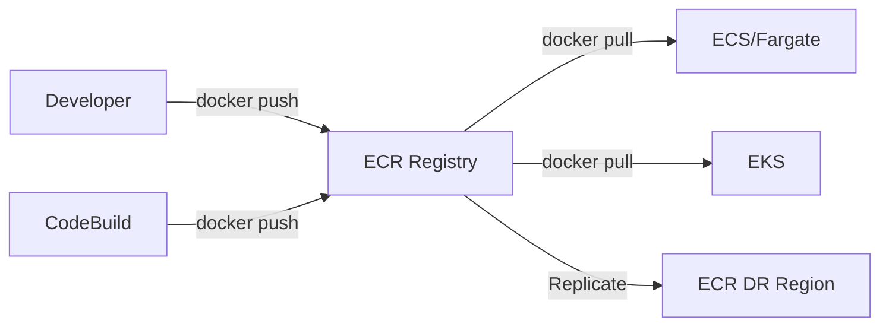

# Chapter 15 — Amazon ECR (Elastic Container Registry)

---

## Prerequisite Chapters
- Chapter 01 — AWS IAM (ECR access policies)
- Chapter 03 — Amazon EC2 (Docker basics)
- Chapter 04 — Amazon VPC (VPC endpoints for ECR)

## Used In Production Practicals
- Practical 25 — Docker + ECR
- Practical 26 — ECS + EC2 + ALB
- Practical 27 — ECS + Fargate + ALB + RDS
- Practical 33 — Container CI/CD (CodeBuild → ECR → ECS)
- Practical 15 — Flagship Production Architecture

---

## 1. Learning Objectives

By the end of this chapter, you will be able to:

1. **Explain** ECR's role in the container workflow.
2. **Create** repositories and push/pull Docker images.
3. **Configure** lifecycle policies to manage image storage costs.
4. **Enable** image scanning for vulnerability detection.
5. **Set up** cross-account and cross-region replication.
6. **Implement** immutable tags for production image management.
7. **Troubleshoot** authentication, push/pull errors, and access issues.
8. **Answer** interview questions about container registries.

---

## 2. What is Amazon ECR?

ECR is a fully managed Docker container registry that stores, manages, and deploys container images. It integrates natively with ECS, EKS, Lambda, and CodeBuild.

### ECR in the Container Workflow
```
Developer → Dockerfile → docker build → docker push → ECR
                                                        ↓
ECS/EKS/Lambda ← docker pull ← ECR
```

### Key Characteristics
- **Fully managed** — no registry servers to operate
- **IAM integrated** — fine-grained access control
- **Image scanning** — detect vulnerabilities (Inspector integration)
- **Lifecycle policies** — auto-delete old images
- **Cross-region replication** — images in DR region
- **Immutable tags** — prevent overwriting production images
- **OCI compatible** — Docker and OCI image formats

---

## 3. Core Concepts

### Repository Types
| Type | Visibility | Use Case |
|------|-----------|----------|
| **Private** | IAM-controlled access | Production applications |
| **Public** | Anyone can pull (ECR Public Gallery) | Open-source projects |

### Image Tagging Strategy
```
Production Strategy:
  - Every build: myapp:a1b2c3d (git commit SHA — unique)
  - Version tags: myapp:v2.1.0 (semantic version)
  - Latest: myapp:latest (mutable pointer)
  - Environment: myapp:prod-v2.1.0

Enable immutable tags → prevent overwriting tagged images
```

---

## 4. Real-World Production Use Cases

### 1. CI/CD Pipeline Image Storage
CodeBuild builds Docker image -> pushes to ECR -> ECS/EKS pulls from ECR.

### 2. Multi-Account Image Sharing
Central account hosts images -> cross-account policies allow dev/staging/prod to pull.

### 3. Vulnerability Management
ECR image scanning identifies CVEs before deployment.

---

## 5. Core Concepts

```
Repository: stores Docker images (like Docker Hub repo)
Image: tagged container image (e.g., my-app:latest, my-app:v1.2.3)
Registry: per-account, per-region (ACCOUNT.dkr.ecr.REGION.amazonaws.com)
Lifecycle Policy: auto-delete old/untagged images
Image Scanning: on-push or manual CVE scanning (Inspector integration)
Replication: cross-region and cross-account image replication
```

---

## 6. Architecture



---

## 7. Important Components

```
Private Repository: default, IAM-based access
Public Repository: ECR Public (public.ecr.aws)
Pull-through Cache: cache Docker Hub/public images in your ECR
Image Tag Immutability: prevent tag overwrite (recommended for prod)
Encryption: AES-256 (default) or KMS CMK
```

---

## 8. How It Works

```
Push Flow:
  1. Authenticate: aws ecr get-login-password | docker login
  2. Tag image: docker tag my-app:latest ACCOUNT.dkr.ecr.REGION.amazonaws.com/my-app:v1.0
  3. Push: docker push ACCOUNT.dkr.ecr.REGION.amazonaws.com/my-app:v1.0
  4. ECR stores image layers (deduplicated)

Pull Flow:
  1. ECS task definition references ECR image URI
  2. ECS/Fargate authenticates to ECR (task execution role)
  3. Image layers pulled and cached
```

---

## 9. AWS Console Walkthrough

### Create ECR Repository
1. **ECR Console** -> **Create repository**
2. **Visibility**: Private
3. **Name**: `my-app`
4. **Tag immutability**: Enabled
5. **Scan on push**: Enabled
6. **Encryption**: KMS

---

## 10. AWS CLI Commands

```bash
# Create repository
aws ecr create-repository --repository-name my-app \
    --image-tag-mutability IMMUTABLE \
    --image-scanning-configuration scanOnPush=true \
    --encryption-configuration encryptionType=KMS

# Authenticate Docker
aws ecr get-login-password | docker login --username AWS \
    --password-stdin ACCOUNT.dkr.ecr.REGION.amazonaws.com

# Push image
docker tag my-app:latest ACCOUNT.dkr.ecr.REGION.amazonaws.com/my-app:v1.0
docker push ACCOUNT.dkr.ecr.REGION.amazonaws.com/my-app:v1.0

# Lifecycle policy (keep last 10 images)
aws ecr put-lifecycle-policy --repository-name my-app \
    --lifecycle-policy-text '{"rules":[{"rulePriority":1,"selection":{"tagStatus":"any","countType":"imageCountMoreThan","countNumber":10},"action":{"type":"expire"}}]}'
```

### Repository Management
```bash
# Create repository
aws ecr create-repository \
    --repository-name my-app \
    --image-scanning-configuration scanOnPush=true \
    --image-tag-mutability IMMUTABLE \
    --encryption-configuration encryptionType=KMS

# List repositories
aws ecr describe-repositories --query 'repositories[*].[repositoryName,repositoryUri]' --output table
```

### Docker Push/Pull
```bash
# Authenticate Docker (12-hour token)
aws ecr get-login-password --region ap-south-1 | \
    docker login --username AWS --password-stdin \
    123456789012.dkr.ecr.ap-south-1.amazonaws.com

# Build, tag, push
docker build -t my-app .
docker tag my-app:latest 123456789012.dkr.ecr.ap-south-1.amazonaws.com/my-app:v1.0.0
docker push 123456789012.dkr.ecr.ap-south-1.amazonaws.com/my-app:v1.0.0

# Pull
docker pull 123456789012.dkr.ecr.ap-south-1.amazonaws.com/my-app:v1.0.0
```

### Lifecycle Policy
```bash
aws ecr put-lifecycle-policy --repository-name my-app \
    --lifecycle-policy-text '{
        "rules": [
            {"rulePriority": 1, "description": "Keep last 10 versioned images",
             "selection": {"tagStatus": "tagged", "tagPrefixList": ["v"], "countType": "imageCountMoreThan", "countNumber": 10},
             "action": {"type": "expire"}},
            {"rulePriority": 2, "description": "Delete untagged after 1 day",
             "selection": {"tagStatus": "untagged", "countType": "sinceImagePushed", "countUnit": "days", "countNumber": 1},
             "action": {"type": "expire"}}
        ]
    }'
```

### Image Scanning
```bash
aws ecr start-image-scan --repository-name my-app --image-id imageTag=v1.0.0
aws ecr describe-image-scan-findings --repository-name my-app --image-id imageTag=v1.0.0 \
    --query 'imageScanFindings.findingSeverityCounts'
```

---

## 11. Hands-On Practical

### Practical: Push and Pull Container Image
```bash
# Build, tag, push, and pull a container image
docker build -t my-app .
aws ecr get-login-password | docker login --username AWS --password-stdin ACCOUNT.dkr.ecr.REGION.amazonaws.com
docker tag my-app:latest ACCOUNT.dkr.ecr.REGION.amazonaws.com/my-app:v1.0
docker push ACCOUNT.dkr.ecr.REGION.amazonaws.com/my-app:v1.0
```

---

## 12. Production Architecture

```
Production ECR Setup:
  - Repository per microservice
  - Image tag immutability enabled
  - Scan on push enabled (Inspector integration)
  - Lifecycle policy: keep last 20 tagged images
  - Cross-region replication for DR
  - Cross-account access via repository policy
  - VPC endpoint for private pulls (no internet)
```

---

## 13. Security Best Practices

1. **Image tag immutability** -- prevent overwriting production tags
2. **Scan on push** -- catch CVEs before deployment
3. **Repository policy** -- restrict who can push/pull
4. **VPC endpoint** -- pull images without internet access
5. **Encryption** -- KMS CMK for sensitive workloads
6. **IAM least privilege** -- separate push (CI/CD) from pull (ECS) roles

---

## 14. High Availability

```
ECR Built-in HA:
  - Fully managed, multi-AZ storage
  - 99.9% availability SLA
  - Image layers stored in S3 (11 nines durability)
```

---

## 15. Scalability

```
Limits:
  - 10,000 repositories per region
  - No limit on images per repository
  - Pull rate: depends on instance/task throughput
  - Use VPC endpoint for high-throughput pulls
```

---

## 16. Monitoring & Observability

```
CloudWatch Metrics:
  - API call counts via CloudTrail
  - Image scan findings (Inspector)

EventBridge Events:
  - ECR Image Scan Completed -> trigger notification
  - ECR Image Push -> trigger deployment pipeline

Alarms:
  - Critical/High CVE found on scan -> alert + block deployment
```

---

## 17. Cost Optimization

```
Pricing:
  - Storage: $0.10 per GB/month
  - Data transfer: free within same region
  - Cross-region: standard data transfer rates

Cost Tips:
  - Lifecycle policies: auto-delete old images
  - Multi-stage Docker builds: smaller images
  - Use ECR pull-through cache for public images
```

---

## 18. Disaster Recovery

```
DR Strategy:
  - Cross-region replication: auto-replicate to DR region
  - Images stored in S3 (highly durable)
  - IaC: repository creation in CloudFormation
  - CI/CD: push to both regions
```

---

## 19. Troubleshooting

### Problem 1: "no basic auth credentials"
```
Cause: Docker login expired (12-hour token)
Fix: aws ecr get-login-password | docker login --username AWS --password-stdin $ECR_URI
CI/CD: Add login step before every push
```

### Problem 2: AccessDenied on Push
```
Check: IAM role has ecr:GetAuthorizationToken, ecr:PutImage, ecr:InitiateLayerUpload
Cross-account: Set repository policy for cross-account access
```

---

## 20. Common Production Problems

| # | Problem | Root Cause | Prevention |
|---|---------|------------|------------|
| 1 | docker login fails | Token expired or wrong region | Regenerate token, check region |
| 2 | Pull denied in ECS | Task execution role missing ECR perms | Add ecr:GetDownloadUrlForLayer |
| 3 | Image scan critical CVE | Vulnerable base image | Update base image, automate scanning |
| 4 | Storage costs growing | No lifecycle policy | Add lifecycle rules |

---

## 21. Real-World Scenario

### Scenario: Critical CVE Found in Production Image

**Event**: ECR scan detects critical CVE in base image used by all services.

**Response**:
1. EventBridge triggers SNS alert to security team
2. Update base image (e.g., python:3.12-slim -> latest patched version)
3. Rebuild all service images in CI/CD
4. Push new images with incremented tags
5. Rolling deployment via ECS/EKS
6. Verify scan passes on new images

---

## 22. Interview Questions

### Basic Questions (10)

**Q1: What is Amazon ECR?**
A: A managed Docker container registry. Stores, scans, and deploys container images. Integrates with ECS, EKS, Lambda, CodeBuild.

**Q2: How do you authenticate Docker with ECR?**
A: `aws ecr get-login-password | docker login --username AWS --password-stdin ECR_URI`. Token valid for 12 hours.

**Q3: What is image scanning?**
A: ECR scans images for known vulnerabilities (CVEs) using Amazon Inspector. Enable scan-on-push for automatic scanning.

**Q4: What are lifecycle policies?**
A: Rules to automatically delete old images. Keep last N tagged images, delete untagged after N days. Reduces storage costs.

**Q5: What are immutable tags?**
A: Prevents overwriting existing image tags. Once v1.0.0 is pushed, it can't be replaced. Ensures production images are never accidentally changed.

**Q6: How does cross-region replication work?**
A: Configure replication rules on the registry level. ECR automatically copies images to destination Regions when pushed. Supports same-account and cross-account replication. Use for: disaster recovery, faster pulls in other Regions, compliance with data locality. Replication copies all tags and manifests.

**Q7: How do you grant cross-account access to ECR?**
A: Set a **repository policy** on the source account's repo allowing `ecr:GetDownloadUrlForLayer`, `ecr:BatchGetImage`, and `ecr:GetAuthorizationToken` to the target account's IAM principal. The target account authenticates with `aws ecr get-login-password` against the source account's registry URI. Alternatively, use Organizations and Service Control Policies.

**Q8: What are repository policies vs IAM policies?**
A: **Repository policies** (resource-based) are attached to the ECR repo and define who can push/pull — good for cross-account access. **IAM policies** (identity-based) are attached to IAM users/roles in the same account — good for granting your CI/CD role access. Both are evaluated together. Use repository policies for cross-account, IAM policies for same-account.

**Q9: How is ECR encryption handled?**
A: Images are encrypted at rest by default using AES-256 (AWS-managed key). Optionally use a customer-managed KMS key for: audit trail, key rotation control, and cross-account key sharing. KMS encryption must be set at repository creation — cannot be changed later. In-transit encryption is HTTPS by default.

**Q10: What is the difference between ECR Public and ECR Private?**
A: **ECR Private**: default, requires authentication, costs for storage and transfer, supports scanning and lifecycle policies. **ECR Public** (public.ecr.aws): no authentication for pulls, free for public images, used for open-source projects. You can use ECR Public Gallery to host images anyone can pull without an AWS account.

### Intermediate Questions (10)

**Q11: How do you integrate ECR with a CI/CD pipeline?**
A: In CodeBuild/GitHub Actions: 1) Authenticate: `aws ecr get-login-password | docker login`. 2) Build: `docker build -t $REPO:$TAG .`. 3) Push: `docker push $REPO:$TAG`. 4) Update ECS service or Kubernetes deployment with the new image URI. Use image tag with commit SHA for traceability. Cache layers with `--cache-from` for faster builds.

**Q12: Why use VPC endpoints for ECR and how do you set them up?**
A: Without VPC endpoints, ECS tasks in private subnets pull images through a NAT Gateway (data transfer costs, slower). Create Interface VPC Endpoints for `ecr.api` and `ecr.dkr`, plus a Gateway Endpoint for S3 (image layers are stored in S3). This keeps traffic on the AWS network, eliminates NAT costs, and improves pull speed.

**Q13: What is a good image tag strategy?**
A: Use **semantic versioning** (`v1.2.3`) for releases, **git commit SHA** (`abc123f`) for CI builds, and **environment tags** (`staging`, `production`) for deployment tracking. Enable **immutable tags** to prevent overwrites. Never use `:latest` in production — it's not reproducible. Store the mapping of tag → commit in your deployment system.

**Q14: How do you build multi-architecture images for ECR?**
A: Use `docker buildx` with `--platform linux/amd64,linux/arm64`. This creates a manifest list pointing to platform-specific images. Push the manifest list to ECR. When a Fargate task (Graviton/ARM or x86) pulls the image, Docker automatically selects the correct architecture. Saves money since Graviton is ~20% cheaper.

**Q15: How do you use ECR images with Lambda?**
A: Create a Lambda function with the package type `Image`. Push your container image (up to 10 GB) to ECR. The image must implement the Lambda Runtime Interface (use AWS-provided base images or add the Runtime Interface Client). Lambda caches the image for fast cold starts. Update the function to point to a new image URI for deployments.

**Q16: How do you sign and verify container images?**
A: Use **Sigstore/cosign** or **AWS Signer** (Notation) to sign images after pushing to ECR. Store signatures alongside the image in ECR. In your deployment pipeline, verify signatures before deploying — reject unsigned images. Combine with ECR image scanning to ensure images are both signed and vulnerability-free.

**Q17: What is the ECR pull-through cache?**
A: ECR can cache images from public registries (Docker Hub, Quay, GitHub Container Registry, ECR Public) in your private ECR. First pull fetches from upstream and caches locally. Subsequent pulls come from your ECR — faster, avoids Docker Hub rate limits, and images are scanned. Configure pull-through cache rules in ECR settings.

**Q18: How does Enhanced Scanning differ from Basic Scanning?**
A: **Basic**: uses Clair (open-source), scans OS packages only, on-demand or on-push. **Enhanced**: uses Amazon Inspector, scans OS packages AND programming language libraries (npm, pip, Maven), continuous re-scanning when new CVEs are published, integrates with Security Hub and EventBridge. Enhanced costs more but catches far more vulnerabilities.

**Q19: How do you optimize Docker image size for ECR?**
A: 1) Use multi-stage builds (build stage + minimal runtime stage). 2) Use slim/distroless base images. 3) Combine RUN commands to reduce layers. 4) Add `.dockerignore` to exclude unnecessary files. 5) Order Dockerfile instructions by change frequency (least changing first for better caching). Smaller images = faster pulls, less storage cost, smaller attack surface.

**Q20: How do you handle ECR lifecycle policies effectively?**
A: Rules evaluated by priority number (lower = higher priority). Common rules: keep last 10 tagged images, delete untagged images older than 1 day, keep images matching `prod-*` tag prefix indefinitely, delete `dev-*` tagged images older than 7 days. Test with `get-lifecycle-policy-preview` before applying. Lifecycle policies run asynchronously (up to 24 hours).

### Advanced Questions (10)

**Q21: Design an enterprise container image pipeline with ECR.**
A: 1) Base images: maintain hardened base images in a central ECR repo, scan weekly. 2) Build: CodeBuild pulls base, builds app, scans with Inspector, signs with AWS Signer. 3) Promote: push to dev ECR → test → promote tag to staging → test → promote to prod ECR (cross-account replication). 4) Deploy: ECS/EKS pulls from prod ECR only. 5) Lifecycle: auto-delete old dev images, keep prod for 90 days minimum.

**Q22: How do you implement a vulnerability remediation workflow?**
A: ECR Enhanced Scanning finds CVE → EventBridge rule triggers → Lambda creates a Jira/ServiceNow ticket with CVE details and affected images. If critical: SNS alerts the security team, the pipeline blocks deployment of that image. Engineer updates the base image or dependency, rebuilds, and re-scans. Track remediation SLA (critical: 24h, high: 7 days) via Security Hub dashboard.

**Q23: How do you prevent deploying unscanned or vulnerable images?**
A: 1) Enable scan-on-push. 2) In the CI/CD pipeline, after pushing, poll scan results with `describe-image-scan-findings`. 3) Fail the pipeline if critical/high CVEs are found. 4) Use OPA/Gatekeeper in EKS or a pre-deployment Lambda in ECS to validate that the image has a clean scan before allowing deployment. 5) Use image signing to ensure only approved images deploy.

**Q24: How do you manage ECR costs at scale?**
A: Storage: aggressive lifecycle policies (delete untagged within 1 day, keep only last N releases). Transfer: use VPC endpoints (no NAT costs), pull-through cache (avoid redundant pulls from Docker Hub). Scanning: use Basic for dev, Enhanced only for staging/prod. Replication: replicate only production images, not dev/test. Monitor costs with Cost Explorer filtered by ECR.

**Q25: How do you handle ECR in a multi-account AWS Organization?**
A: Central "shared services" account hosts golden base images. Repository policies grant read access to all Organization accounts (`aws:PrincipalOrgID` condition). Application accounts push their own images to their own ECR repos. Cross-account replication copies prod images to a DR account. Use SCPs to prevent deletion of production repositories.

**Q26: What happens when ECR is unavailable and how do you mitigate?**
A: If ECR is down, new container launches fail to pull images. Mitigation: 1) ECS/EKS cache recently pulled images locally (configured in daemon). 2) Replicate critical images to another Region. 3) Use pull-through cache from a public registry as fallback. 4) For Kubernetes, set `imagePullPolicy: IfNotPresent` so existing nodes use cached images. 5) Keep running tasks alive — they don't re-pull.

**Q27: How do you audit who pushed or pulled specific images?**
A: CloudTrail logs all ECR API calls: `PutImage`, `GetDownloadUrlForLayer`, `BatchGetImage`. Enable CloudTrail data events for ECR. Query with Athena: "who pulled image X in the last 30 days?" For compliance, send CloudTrail logs to a centralized S3 bucket with Object Lock. Tag repositories with owner/team for cost allocation and accountability.

**Q28: How do you migrate from Docker Hub or another registry to ECR?**
A: 1) List all images and tags in the source registry. 2) Script: `docker pull source/image:tag && docker tag source/image:tag ECR_URI:tag && docker push ECR_URI:tag`. 3) For many images, use Skopeo (`skopeo copy docker://source docker://ecr`) — faster, no local Docker daemon needed. 4) Update all Dockerfiles, CI/CD configs, and Kubernetes manifests to reference ECR URIs. 5) Set up pull-through cache for images you don't own.

**Q29: How do you implement image promotion across environments?**
A: Use separate repositories or tag prefixes per environment. After tests pass in dev: re-tag the image (`docker tag dev-repo:sha prod-repo:sha`) and push to the prod repository (or cross-account). Never rebuild for prod — promote the exact tested image. Use a deployment manifest (GitOps) that references the promoted SHA. Automate with CodePipeline or Argo CD.

**Q30: What are SBOM exports and how do you use them?**
A: Software Bill of Materials — a list of all packages in an image. Amazon Inspector generates SBOMs in SPDX or CycloneDX format. Export with `inspector2:ListSbomExports`. Use SBOMs for: compliance (know exactly what's deployed), license auditing, and rapid CVE response ("which images contain log4j?"). Store SBOMs alongside images in S3 for audit trails.

### Scenario-Based Questions (10)

**Q31: Your ECS deployment fails with "CannotPullContainerError". How do you troubleshoot?**
A: Check: 1) Task execution role has `ecr:GetAuthorizationToken` + `ecr:BatchGetImage` + `ecr:GetDownloadUrlForLayer`. 2) Image URI and tag are correct (exact Region, account, repo, tag). 3) Network: task's subnet has a route to ECR (NAT Gateway or VPC endpoints). 4) Security group allows outbound HTTPS (443). 5) Image exists (wasn't deleted by lifecycle policy). 6) Repository policy allows the account.

**Q32: Docker Hub rate-limited your CI/CD pipeline. How do you fix it with ECR?**
A: Set up ECR pull-through cache rules for Docker Hub. Change your Dockerfiles to pull base images from `<account>.dkr.ecr.<region>.amazonaws.com/docker-hub/library/python:3.12` instead of `python:3.12`. First pull is cached; subsequent builds pull from your ECR without rate limits. Automate cache refresh with a scheduled pipeline.

**Q33: A lifecycle policy accidentally deleted a production image. How do you prevent this?**
A: 1) Use immutable tags for production releases. 2) Lifecycle rules should exclude tags matching `prod-*` or `v*` patterns. 3) Test policies with `get-lifecycle-policy-preview` before applying. 4) ECR cross-region replication serves as a backup. 5) Store image manifests/digests in your deployment system so you can identify what was running. Prevention: tag discipline + careful lifecycle rule priority ordering.

**Q34: Your security audit requires proving all production containers are vulnerability-free. How?**
A: 1) Enable Enhanced Scanning (Inspector) on all prod repos. 2) Export scan results to Security Hub for a unified dashboard. 3) Block deployments with critical/high findings using pipeline gates. 4) Generate SBOMs for every prod image. 5) Continuous scanning re-evaluates images when new CVEs are published. 6) Produce compliance reports from Security Hub and Inspector findings exported to S3.

**Q35: Image pulls from ECR are very slow for your large ML model images (10+ GB). How do you speed them up?**
A: 1) Enable **Seekable OCI (SOCI)** indices — Fargate pulls only the needed parts of the image, reducing cold start. 2) Use multi-stage builds to shrink the image. 3) Store model weights in S3/EFS instead of baking them into the image. 4) Use VPC endpoints (avoid NAT bottleneck). 5) Pre-pull images onto warm instances. 6) Use Graviton (Fargate ARM) for lower cost while keeping performance.

**Q36: You need to share ECR images with a partner company's AWS account. How?**
A: Add a repository policy granting the partner's account ID (or specific IAM role ARN) `ecr:BatchGetImage` and `ecr:GetDownloadUrlForLayer` permissions. The partner authenticates against your registry URI with their own credentials. For security: scope the policy to specific roles, use condition keys, and audit pulls via CloudTrail. Consider using ECR Public if the images aren't sensitive.

**Q37: An engineer pushed a secret (API key) into a Docker image layer. How do you respond?**
A: 1) Immediately rotate the exposed secret. 2) Delete the affected image tag and all untagged manifests from ECR. 3) Rebuild the image without the secret (use Secrets Manager or build-time secrets that don't persist in layers). 4) Audit CloudTrail to see who pulled the compromised image. 5) Add a pre-push scan (e.g., TruffleHog/Gitleaks in CI) to prevent future leaks.

**Q38: Your organization has 200 microservices each with their own ECR repo. How do you manage this at scale?**
A: 1) IaC: create repos with CloudFormation/Terraform with consistent naming, tags, and policies. 2) Apply lifecycle policies via a shared Terraform module. 3) Enable Enhanced Scanning and replication at the registry level. 4) Use repository prefixes by team (`team-a/service-x`). 5) Central dashboard with Inspector/Security Hub for vulnerability visibility. 6) Tag repos with owner/cost-center for accountability.

**Q39: After enabling immutable tags, your CI/CD pipeline fails because it tries to push the same tag twice. How do you fix it?**
A: Change your tagging strategy: use unique tags per build, such as the git commit SHA (`abc123f`) or build number (`build-42`). Stop using `:latest` or reusable environment tags. If you need a "current production" pointer, maintain a deployment manifest or SSM parameter that stores the current image SHA. Update the pointer in the deployment step, not by re-tagging the image.

**Q40: How do you set up a complete ECR disaster recovery strategy?**
A: 1) Enable cross-region replication to the DR Region. 2) Verify replication status regularly. 3) Store all Dockerfiles and build configs in Git (rebuild capability). 4) Keep ECR repository creation in IaC (CloudFormation/Terraform). 5) Test DR: deploy services in the DR Region using replicated images. 6) For critical images, also push to a second account as an additional backup. 7) Document image dependencies and base image sources.

---

## 23. Scenario-Based Interview Questions

*(Covered in section 22 above)*

---

## 24. Common Mistakes

1. **No lifecycle policy** -- thousands of old images consuming storage
2. **Using :latest tag** -- not reproducible, use semantic versioning
3. **No image scanning** -- deploying vulnerable images to production
4. **Missing VPC endpoint** -- pulling via NAT Gateway (cost + latency)
5. **Mutable tags** -- :latest can be overwritten, use immutable tags

---

## 25. Production Checklist

- [ ] Scan on push enabled
- [ ] Immutable tags enabled
- [ ] Lifecycle policy configured
- [ ] KMS encryption enabled
- [ ] Cross-region replication (for DR)
- [ ] VPC endpoint for ECR (avoid NAT costs)
- [ ] CI/CD pushes with git SHA + semantic version
- [ ] Cross-account access policy (if multi-account)

---

## 26. Chapter Summary

1. **Scan on push** — catch vulnerabilities before deployment
2. **Immutable tags** — prevent overwriting production images
3. **Lifecycle policies** — auto-delete old images, control costs
4. **Git SHA + version tags** — traceability from image to code
5. **VPC endpoint** — pull images privately without NAT
6. **12-hour auth tokens** — re-authenticate in CI/CD pipelines
7. **Cross-region replication** — images in DR region
8. **Integrates natively** — ECS, EKS, Lambda, CodeBuild

---
---

# 🔬 Practical Lab 41 — Docker + ECR

## Lab Overview
| Item | Detail |
|------|--------|
| **Difficulty** | Intermediate |
| **Duration** | 25 minutes |
| **Cost** | ~$0.10/GB storage |
| **Prerequisites** | Docker installed, Practical 01 (IAM) |
| **Lab Environment** | Environment 9 — Containers |

### Step 1 — Create ECR Repository
1. **ECR** → **Create repository**
   - **Name**: `prod-web-app`
   - ✅ Scan on push
   - ✅ Immutable tags

📸 **Screenshot 01** — ECR Repository Created
> **Verify**: Scan on push enabled, tag immutability on

### Step 2 — Build and Push Docker Image
```bash
# Authenticate
aws ecr get-login-password | docker login --username AWS --password-stdin $ECR_URI

# Build
docker build -t prod-web-app .
docker tag prod-web-app:latest $ECR_URI/prod-web-app:v1.0.0

# Push
docker push $ECR_URI/prod-web-app:v1.0.0
```

📸 **Screenshot 02** — Image Pushed to ECR
> **What you should see**: Image with tag v1.0.0, scan results showing

📸 **Screenshot 03** — Vulnerability Scan Results
> **Verify**: Scan findings show severity counts (CRITICAL, HIGH, etc.)

🎯 **Interview Insight**: "How do you handle container image security?"
> **Strong answer**: "ECR scan on push with Inspector integration. Immutable tags prevent overwriting production images. Lifecycle policies delete untagged images. CI/CD pipeline fails on CRITICAL vulnerabilities. Base images from trusted sources, minimal images (Alpine/distroless)."
