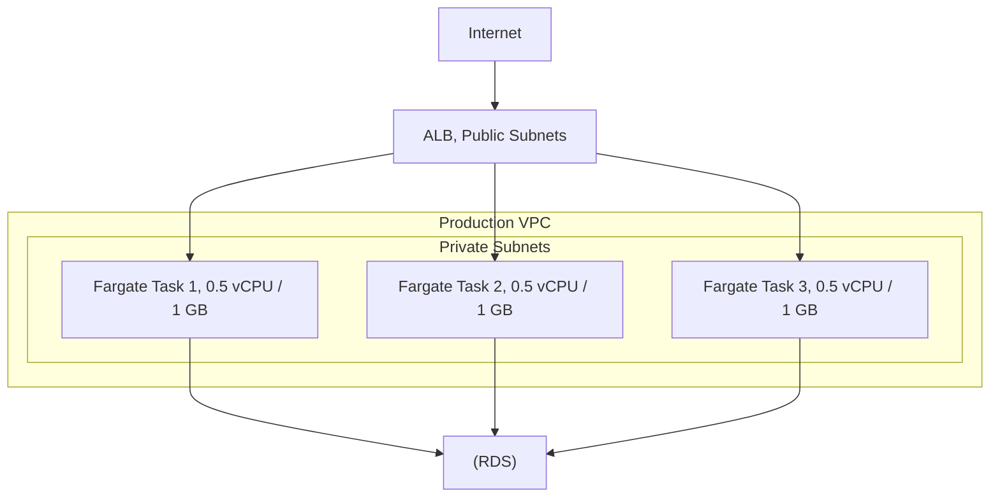
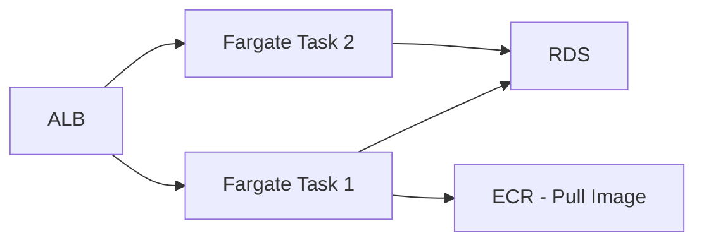

# Chapter 17 — AWS Fargate

---

## Prerequisite Chapters
- Chapter 15 — Amazon ECR (container images)
- Chapter 16 — Amazon ECS (task definitions, services)
- Chapter 04 — Amazon VPC (subnets, security groups)

## Used In Production Practicals
- Practical 27 — ECS + Fargate + ALB + RDS
- Practical 33 — Container CI/CD
- Practical 15 — Flagship Production Architecture

---

## 1. Learning Objectives

By the end of this chapter, you will be able to:

1. **Explain** Fargate vs EC2 launch type and when to use each.
2. **Deploy** containers on Fargate without managing servers.
3. **Configure** task CPU, memory, networking, and IAM roles.
4. **Implement** Fargate with ECS services, ALB, and auto scaling.
5. **Optimize** costs with Fargate Spot and ARM (Graviton).
6. **Debug** running containers with ECS Exec.
7. **Troubleshoot** task failures, networking, and resource issues.
8. **Answer** interview questions about serverless containers.

---

## 2. What is AWS Fargate?

Fargate is a **serverless compute engine for containers**. You define your containers (CPU, memory, image) and Fargate runs them — no EC2 instances to provision or manage.

### Fargate vs EC2 Launch Type

| Feature | Fargate | EC2 Launch Type |
|---------|---------|----------------|
| **Server management** | None (serverless) | You manage EC2 instances |
| **Scaling** | Per-task scaling | Must scale EC2 fleet |
| **Pricing** | Per vCPU/memory per second | EC2 instance pricing |
| **Patching** | AWS patches runtime | You patch EC2 instances |
| **GPU support** | ❌ No | ✅ Yes |
| **SSH access** | ❌ No (use ECS Exec) | ✅ Yes |
| **Best for** | Variable workloads, less ops | GPU, steady-state, cost optimize |

---

## 3. Core Concepts

### Fargate Task Definition
```json
{
    "family": "web-app",
    "requiresCompatibilities": ["FARGATE"],
    "networkMode": "awsvpc",
    "cpu": "512",
    "memory": "1024",
    "executionRoleArn": "arn:aws:iam::123:role/ecsTaskExecutionRole",
    "taskRoleArn": "arn:aws:iam::123:role/webAppTaskRole",
    "containerDefinitions": [{
        "name": "web",
        "image": "123.dkr.ecr.ap-south-1.amazonaws.com/web-app:v1.0.0",
        "portMappings": [{"containerPort": 8080, "protocol": "tcp"}],
        "logConfiguration": {
            "logDriver": "awslogs",
            "options": {
                "awslogs-group": "/ecs/web-app",
                "awslogs-region": "ap-south-1",
                "awslogs-stream-prefix": "web"
            }
        },
        "secrets": [
            {"name": "DB_PASSWORD", "valueFrom": "arn:aws:secretsmanager:..."}
        ]
    }]
}
```

### CPU/Memory Combinations

| CPU (vCPU) | Memory (GB) Options |
|------------|-------------------|
| 0.25 | 0.5, 1, 2 |
| 0.5 | 1, 2, 3, 4 |
| 1 | 2, 3, 4, 5, 6, 7, 8 |
| 2 | 4 – 16 (1 GB increments) |
| 4 | 8 – 30 (1 GB increments) |
| 8 | 16 – 60 (4 GB increments) |
| 16 | 32 – 120 (8 GB increments) |

### Two IAM Roles
```
Execution Role (ecsTaskExecutionRole):
  Used by ECS agent to: pull images from ECR, push logs to CloudWatch, read secrets
  Permissions: ecr:GetAuthorizationToken, ecr:BatchGetImage, logs:PutLogEvents

Task Role (application-specific):
  Used by YOUR application code to: access DynamoDB, S3, SQS
  Equivalent of EC2 Instance Profile
  Unique per application
```

### Networking (awsvpc)
```
Each Fargate task gets its own ENI:
  - Own private IP address in your VPC subnet
  - Security groups applied directly to the task
  - Must be in your VPC subnet

Production:
  - Tasks in private subnets
  - ALB in public subnets → routes to tasks
  - NAT Gateway for outbound (or VPC endpoints)
```

---

## 4. Architecture



---

## 5. Core Concepts

```
Fargate = serverless compute for containers
  - No EC2 instances to manage
  - Pay per vCPU + memory per second
  - Each task runs in its own isolated environment
  - Works with both ECS and EKS

Task Definition: container config (image, CPU, memory, ports, env vars)
Task: running instance of a task definition
Service: maintains desired count of tasks (like ASG for containers)
```

---

## 6. Architecture



---

## 7. Important Components

```
Platform Version: runtime environment (latest = 1.4.0)
  - 1.4.0+: EFS support, ephemeral storage (up to 200 GB)
  - ENI per task: each task gets its own network interface
  - Security group per task: fine-grained network control

Resource Allocation:
  - vCPU: 0.25, 0.5, 1, 2, 4, 8, 16
  - Memory: 0.5 GB to 120 GB (depends on vCPU)
```

---

## 8. How It Works

```
Deployment Flow:
  1. Push image to ECR
  2. Create/update task definition (image URI, CPU, memory)
  3. ECS service launches Fargate tasks
  4. Fargate provisions isolated compute (micro-VM)
  5. Image pulled from ECR, container started
  6. ALB routes traffic to task ENIs
  7. Auto-scaling adjusts task count based on metrics
```

---

## 9. AWS Console Walkthrough

### Create Fargate Service
1. **ECS Console** -> **Task Definitions** -> **Create new**
2. **Launch type**: Fargate
3. **Container**: ECR image URI, port 8080
4. **CPU/Memory**: 0.5 vCPU, 1 GB
5. **Create Service**: desired count = 2, ALB target group

---

## 10. AWS CLI Commands

```bash
# Register task definition
aws ecs register-task-definition --cli-input-json file://task-def.json

# Create service
aws ecs create-service \
    --cluster prod-cluster \
    --service-name my-service \
    --task-definition my-task:1 \
    --desired-count 2 \
    --launch-type FARGATE \
    --network-configuration "awsvpcConfiguration={subnets=[$PRIV_SUB_A,$PRIV_SUB_B],securityGroups=[$SG],assignPublicIp=DISABLED}"
```

### Create Fargate Service
```bash
aws ecs create-service \
    --cluster prod-cluster \
    --service-name web-app \
    --task-definition web-app:1 \
    --desired-count 3 \
    --launch-type FARGATE \
    --network-configuration '{
        "awsvpcConfiguration": {
            "subnets": ["subnet-priv-a", "subnet-priv-b"],
            "securityGroups": ["sg-web-app"],
            "assignPublicIp": "DISABLED"
        }
    }' \
    --load-balancers '[{
        "targetGroupArn": "arn:aws:elasticloadbalancing:...",
        "containerName": "web", "containerPort": 8080
    }]'
```

### ECS Exec (Debug Running Container)
```bash
aws ecs execute-command \
    --cluster prod-cluster \
    --task $TASK_ARN \
    --container web \
    --interactive \
    --command "/bin/sh"
```

---

## 11. Hands-On Practical

*(Covered in ECS chapter practical with Fargate launch type)*

---

## 12. Production Architecture

```
Production Fargate Setup:
  - Private subnets, no public IP
  - VPC endpoints for ECR, S3, CloudWatch Logs
  - ALB for traffic distribution
  - Auto-scaling on CPU/memory or custom metrics
  - Task IAM role with least privilege
  - CloudWatch Logs for container stdout/stderr
```

---

## 13. Security Best Practices

1. **Private subnets** -- no public IP for tasks
2. **Task IAM role** -- least privilege, separate from execution role
3. **Execution role** -- only ECR pull + CloudWatch Logs write
4. **Non-root container** -- run as non-root user in Dockerfile
5. **Read-only root filesystem** -- set readonlyRootFilesystem=true
6. **Secrets Manager** -- inject secrets as environment variables

---

## 14. High Availability

```
Fargate HA:
  - Deploy tasks across multiple AZs via ECS service
  - ECS replaces failed tasks automatically
  - ALB health checks detect unhealthy tasks
  - No underlying host to fail (Fargate manages infrastructure)
```

---

## 15. Scalability

```
Auto-Scaling:
  - Target Tracking: maintain CPU at 60%
  - Step Scaling: add tasks when queue depth increases
  - Scheduled: pre-scale for known traffic patterns
  - Min/Max: set guardrails for task count

Limits:
  - 500 tasks per service (soft limit, can increase)
  - vCPU: up to 16 per task
  - Memory: up to 120 GB per task
```

---

## 16. Monitoring & Observability

```
CloudWatch Metrics:
  - CPUUtilization, MemoryUtilization (per service)
  - RunningTaskCount, DesiredTaskCount
  - HealthyHostCount (via ALB target group)

CloudWatch Logs:
  - Container stdout/stderr -> CloudWatch Logs
  - awslogs driver in task definition

X-Ray:
  - Sidecar pattern: X-Ray daemon as separate container
  - Trace requests across services
```

---

## 17. Cost Optimization

```
Pricing (per second, 1 min minimum):
  vCPU: ~$0.04048/vCPU/hour
  Memory: ~$0.004445/GB/hour

Example: 0.5 vCPU + 1 GB, 24/7 for 30 days = $17.77/task/month

Optimization:
  Fargate Spot:  50-70% savings (fault-tolerant workloads)
  ARM (Graviton): 20% cheaper
  Right-size:    Match CPU/memory to actual usage
  Scale to zero: Min tasks = 0 (off-hours)
```

---

## 18. Disaster Recovery

```
Fargate DR:
  - IaC: task definitions + service config in CloudFormation
  - ECR cross-region replication for images
  - Deploy same service in DR region (min tasks = 0)
  - Route 53 failover -> scale up DR tasks
```

---

## 19. Troubleshooting

### Problem 1: Task Keeps Stopping
```
aws ecs describe-tasks --tasks $TASK_ARN → check stoppedReason
Common: App crash (check logs), health check failing, OOM, image pull failure
```

### Problem 2: Task Can't Pull Image
```
Causes: Missing ECR permissions on execution role, no NAT/VPC endpoint, image doesn't exist
```

### Problem 3: Task Can't Reach Database
```
Check: SG allows outbound to DB port, DB SG allows inbound from task SG, correct subnet
```

---

## 20. Common Production Problems

| # | Problem | Root Cause | Prevention |
|---|---------|------------|------------|
| 1 | Task won't start | Image pull error or OOM | Check execution role, increase memory |
| 2 | High costs | Over-provisioned CPU/memory | Right-size based on CloudWatch metrics |
| 3 | Slow image pull | Large image, no VPC endpoint | Multi-stage builds, add ECR endpoint |
| 4 | Task stopped unexpectedly | OOM killed or health check fail | Check stopped reason, increase memory |

---

## 21. Real-World Scenario

### Scenario: Container OOM Killed in Production

**Event**: Fargate tasks keep stopping with "OutOfMemoryError".

**Response**:
1. CloudWatch Logs: container logs show memory exhaustion
2. Check task definition memory limit vs actual usage
3. Increase memory allocation in task definition
4. Check for memory leaks in application
5. Implement memory-based auto-scaling

---

## 22. Interview Questions

### Basic Questions (10)

**Q1: What is Fargate?**
A: Serverless compute engine for containers. Define CPU/memory/image, Fargate runs it. No EC2 instances to manage.

**Q2: Fargate vs EC2 launch type?**
A: Fargate: no server management, per-task pricing, variable workloads. EC2: GPU support, SSH access, cheaper for steady workloads with Reserved Instances.

**Q3: Execution role vs task role?**
A: Execution role: used by ECS agent (pull images, push logs). Task role: used by your application code (access DynamoDB, S3).

**Q4: How does networking work?**
A: awsvpc mode — each task gets own ENI with private IP. Security groups applied at task level. Same as EC2 networking.

**Q5: How do you debug a Fargate container?**
A: 1) CloudWatch Logs (stdout/stderr). 2) ECS Exec (interactive shell). 3) Check stopped task reason. 4) Container Insights metrics.

**Q6: What is Fargate Spot?**
A: Runs tasks on spare AWS capacity at up to 70% discount. Tasks can be interrupted with a 2-minute warning (SIGTERM). Use for: batch processing, dev/test, fault-tolerant workloads. Not for production serving. Mix Spot and On-Demand with capacity provider strategies (e.g., 70% Spot, 30% On-Demand).

**Q7: How do you use Graviton (ARM) with Fargate?**
A: Set `runtimePlatform` in the task definition: `cpuArchitecture: ARM64`, `operatingSystemFamily: LINUX`. Build ARM images with `docker buildx --platform linux/arm64` or multi-arch manifests. Graviton Fargate is ~20% cheaper and ~20% better performance than x86 for most workloads. Ensure all dependencies support ARM.

**Q8: How does Fargate auto-scaling work?**
A: Use ECS Service Auto Scaling (Application Auto Scaling). Policies: **Target Tracking** (e.g., average CPU at 70%), **Step Scaling** (CloudWatch alarm thresholds), **Scheduled Scaling** (cron for known traffic patterns). Scale on CPU, memory, ALB request count per target, or custom metrics. Set min/max capacity and scale-in cooldown to prevent flapping.

**Q9: What is service discovery with Fargate?**
A: ECS integrates with **AWS Cloud Map**. Each task registers itself with a DNS name (e.g., `orders.prod.local`). Other services discover it via DNS (A records for IPs) or API (attributes). When tasks start/stop, Cloud Map updates automatically. Alternative: use an ALB with internal DNS, or App Mesh for advanced service mesh routing.

**Q10: How do you inject secrets into Fargate containers?**
A: In the task definition, use the `secrets` field referencing Secrets Manager ARNs or SSM Parameter Store ARNs. ECS injects them as environment variables at container startup. The execution role needs `secretsmanager:GetSecretValue` or `ssm:GetParameters`. Secrets are fetched at task launch — changes require a new deployment. For file-based secrets, use an init container.

### Intermediate Questions (10)

**Q11: How do you achieve zero-downtime deployments with Fargate?**
A: Use **rolling updates** (default): ECS starts new tasks, waits for them to pass ALB health checks, then drains and stops old tasks. Key settings: `minimumHealthyPercent=100`, `maximumPercent=200` (double capacity during deploy). Set proper health check grace period and deregistration delay. For blue/green: use CodeDeploy with traffic shifting (canary 10% → 100%).

**Q12: What is the ECS circuit breaker?**
A: Automatically rolls back a failed deployment. If new tasks keep failing to reach a running state (e.g., crash loops, health check failures), the circuit breaker stops the deployment and rolls back to the last stable version. Enable with `deploymentCircuitBreaker: { enable: true, rollback: true }`. Prevents a bad deploy from taking down all tasks.

**Q13: What are capacity providers and capacity provider strategies?**
A: Capacity providers define where tasks run: `FARGATE` (On-Demand) and `FARGATE_SPOT` (discounted). A **strategy** weights them: e.g., `FARGATE_SPOT weight=3, FARGATE weight=1` runs 75% on Spot. Set a `base` count on FARGATE to guarantee minimum On-Demand tasks. Use for cost optimization while maintaining availability.

**Q14: How do sidecar containers work in Fargate?**
A: Define multiple containers in one task definition. They share the same network namespace (communicate via localhost) and can share volumes. Common sidecars: log router (Fluent Bit → CloudWatch/S3), reverse proxy (Envoy/Nginx), monitoring agent (X-Ray daemon), and secrets injection. Mark essential containers — if an essential container dies, the whole task is stopped.

**Q15: How do you configure health checks properly?**
A: Two levels: 1) **Container health check** (`HEALTHCHECK` in Dockerfile or task definition): determines container status. 2) **ALB/NLB target group health check**: determines if the task receives traffic. Set the ALB health check grace period long enough for the app to start. Match the health check path to an endpoint that validates dependencies (DB connectivity, etc.).

**Q16: What logging patterns work with Fargate?**
A: 1) **awslogs driver**: sends stdout/stderr to CloudWatch Logs (simplest). 2) **FireLens (Fluent Bit sidecar)**: routes logs to multiple destinations (CloudWatch, S3, Elasticsearch, Datadog) with filtering and enrichment. 3) **awsfirelens driver**: configures FireLens declaratively. Use structured JSON logging. Set log retention policies to control costs.

**Q17: What VPC endpoints does Fargate need in a private subnet?**
A: Interface endpoints: `ecr.api`, `ecr.dkr` (image pull), `logs` (CloudWatch Logs), `secretsmanager` or `ssm` (if injecting secrets), `ecs-agent`, `ecs-telemetry`, `ecs`. Gateway endpoint: `s3` (ECR image layers, also for logs export). Without these, you need a NAT Gateway (more expensive). Security groups on endpoints must allow 443 from task SGs.

**Q18: How do you right-size Fargate tasks?**
A: Monitor actual CPU/memory usage with CloudWatch Container Insights over 2+ weeks. Compare utilization vs allocated. Fargate has fixed CPU/memory combos (0.25 vCPU/0.5 GB to 16 vCPU/120 GB). Right-size to ~70% peak utilization. Over-provisioning wastes money; under-provisioning causes OOM kills or throttling. Use AWS Compute Optimizer for recommendations.

**Q19: How does Fargate networking differ from EC2 launch type?**
A: Fargate always uses `awsvpc` network mode — each task gets its own ENI with a private IP, its own security group, and appears as a first-class citizen in the VPC. EC2 launch type supports `bridge` and `host` modes too. With Fargate, you can't use dynamic port mapping (no need — each task has its own IP). NLB works well since it can target IPs directly.

**Q20: How do you share data between containers in a Fargate task?**
A: Use **bind mounts** (ephemeral volumes) in the task definition — containers within the same task can mount the same volume. Use for: shared config files, Unix sockets, and file-based communication. Fargate also supports EFS volumes for persistent shared storage across tasks. Bind mount storage is ephemeral (20 GB default, configurable up to 200 GB).

### Advanced Questions (10)

**Q21: Design a production Fargate architecture for a microservices platform.**
A: VPC with private subnets across 3 AZs. ALB in public subnets → ECS services in private subnets. Each microservice: separate ECS service + task definition. VPC endpoints for ECR, Logs, Secrets Manager, S3. Fluent Bit sidecar for logging. X-Ray sidecar for tracing. Service auto-scaling on ALB request count. Capacity provider: 80% Spot + 20% On-Demand with base=2 on-demand. Blue/green deploys via CodeDeploy. Container Insights enabled.

**Q22: How do you implement a CI/CD pipeline for Fargate?**
A: CodeCommit/GitHub → CodeBuild (build Docker image, push to ECR, run tests) → CodeDeploy or ECS rolling update. Pipeline: 1) Source stage: git push trigger. 2) Build stage: multi-stage Docker build, tag with commit SHA, push to ECR, scan. 3) Deploy to staging: update ECS service. 4) Integration tests. 5) Manual approval. 6) Deploy to prod: CodeDeploy blue/green with canary. Store `imagedefinitions.json` as build artifact.

**Q23: How do you compare Fargate costs with EC2 launch type?**
A: Fargate: pay per task (vCPU-second + GB-second). No charge for idle capacity. EC2: pay for instances regardless of utilization. Fargate is cheaper when: utilization is variable, tasks run briefly, or ops overhead matters. EC2 is cheaper when: steady high utilization (70%+), using Reserved Instances or Savings Plans, or you need GPUs. Fargate Spot + Graviton narrows the gap significantly.

**Q24: How do you migrate from EC2 launch type to Fargate?**
A: 1) Ensure containers don't need Docker socket, privileged mode, or host networking. 2) Set `networkMode: awsvpc` (required for Fargate). 3) Define CPU/memory at task level (required). 4) Replace instance-role with task-role and execution-role. 5) Add VPC endpoints or NAT. 6) Remove host-mounted volumes (use EFS or bind mounts). 7) Update service to use FARGATE capacity provider. Deploy to staging first, then prod.

**Q25: How does ECS Exec work for debugging Fargate tasks?**
A: Enable `enableExecuteCommand: true` on the service. The task role needs SSM permissions. Run `aws ecs execute-command --interactive --command "/bin/sh"`. Uses SSM Session Manager under the hood — all sessions are logged. Requires SSM agent (included in Fargate platform 1.4.0+). Use for live debugging but disable in production (or restrict via IAM).

**Q26: What is Fargate ephemeral storage and when do you increase it?**
A: Fargate tasks get 20 GB ephemeral storage by default (for the OS, Docker image layers, and container writable layer). You can increase it up to 200 GB in the task definition. Increase for: large ML models, data processing, temporary file-heavy workloads. Additional storage costs $0.000111/GB/hour. The storage is tied to the task lifecycle — lost when the task stops.

**Q27: How do you implement graceful shutdown in Fargate?**
A: When ECS stops a task (deploy, scale-in, Spot interruption), it sends SIGTERM to PID 1. Your app should: catch SIGTERM, stop accepting new requests, finish in-flight requests, close DB connections, flush logs, and exit. Configure `stopTimeout` (default 30 sec, max 120 sec). ALB deregistration delay should be ≤ stopTimeout. If the app doesn't exit in time, SIGKILL is sent.

**Q28: How do you handle persistent storage with Fargate?**
A: Use **Amazon EFS** — mount an EFS file system in the task definition. Multiple tasks can share the same file system (good for CMS uploads, shared config, ML model files). EFS access points provide per-app directories with POSIX permissions. Use EFS Infrequent Access for cost savings. For high-performance block storage, consider processing data from S3 instead.

**Q29: How do you monitor Fargate tasks comprehensively?**
A: 1) **Container Insights**: CPU, memory, network, storage metrics per task/service/cluster. 2) **CloudWatch Logs**: application logs via awslogs or FireLens. 3) **X-Ray sidecar**: distributed tracing. 4) **CloudWatch alarms**: on RunningTaskCount, CPUUtilization, MemoryUtilization. 5) **EventBridge**: task state changes (RUNNING → STOPPED with reason). 6) **CloudWatch Contributor Insights**: top talkers. 7) **Application-level metrics**: custom CloudWatch metrics via SDK.

**Q30: How do you secure Fargate tasks?**
A: 1) Run as non-root user (`user` in Dockerfile or `runAsNonRoot` in task def). 2) Read-only root filesystem where possible. 3) Task-specific IAM roles (least privilege). 4) Private subnets + VPC endpoints. 5) Security groups per task (minimize ingress/egress). 6) Secrets from Secrets Manager (never env vars in task def). 7) Encrypt with KMS (EFS, logs). 8) ECR image scanning. 9) No SSH — use ECS Exec only when needed.

### Scenario-Based Questions (10)

**Q31: Your Fargate tasks keep getting OOM-killed. How do you investigate and fix it?**
A: Check CloudWatch Container Insights for memory utilization trends. Review the `stoppedReason` field (`OutOfMemoryError` or `CannotPullContainer`). Common causes: memory leak in the app, JVM heap too large for the container limit, or multiple containers sharing the task memory. Fix: increase task memory, set JVM `-Xmx` to 75% of container memory, fix leaks, or split containers into separate tasks.

**Q32: Fargate costs are too high for your dev/test environment. How do you reduce them?**
A: 1) Use Fargate Spot (up to 70% off) for dev/test. 2) Scale to 0 tasks outside business hours with scheduled scaling. 3) Use Graviton (ARM64) for ~20% savings. 4) Right-size tasks (devs often over-provision). 5) Reduce min task count to 1 in dev. 6) Use Compute Savings Plans (up to 50% off) if you have committed spend. 7) Smaller images = faster start = less billable time.

**Q33: Your Fargate service has high latency spikes during deployments. Why?**
A: During rolling updates, old tasks are draining while new ones are starting. If the health check grace period is too short, traffic hits tasks that aren't fully ready. If deregistration delay is too long, connections hang. Fix: set health check grace period ≥ app startup time, set deregistration delay to 30–60s, ensure the health check validates dependencies, and set `maximumPercent=200` so new tasks are ready before old ones stop.

**Q34: A Spot interruption caused data loss in your batch processing. How do you prevent this?**
A: Design for interruption: 1) Save checkpoints to S3/DynamoDB periodically. 2) Process work in small idempotent chunks. 3) On SIGTERM (2-min warning), save state and exit gracefully. 4) Use SQS with visibility timeout: incomplete messages become visible again for retry. 5) Use `FARGATE` (On-Demand) with base=1 in the capacity provider for critical tasks that cannot be interrupted.

**Q35: You need to run a container that requires 30 GB of temporary disk space. How?**
A: Set `ephemeralStorage` in the task definition to 30 GB (or more, up to 200 GB). The additional storage is charged at $0.000111/GB/hour. Alternatively, mount an EFS volume for persistent or shared storage. For very large data processing, stream data from/to S3 instead of downloading it all to disk.

**Q36: Your Fargate tasks can't connect to an RDS database in the same VPC. What do you check?**
A: 1) Both in the same VPC (or peered VPCs). 2) RDS security group allows inbound on the DB port from the Fargate task's security group. 3) Fargate tasks are in subnets that can route to the RDS subnets. 4) NACLs allow the traffic (both inbound and outbound rules). 5) Task is using the correct DB hostname, port, and credentials. 6) DB is in `available` state. 7) Connection string matches the RDS engine (PostgreSQL vs MySQL).

**Q37: You want to deploy a new version to 5% of traffic first, then gradually shift. How?**
A: Use CodeDeploy blue/green deployment with ECS. Create a deployment group with `Canary10Percent5Minutes` or a custom config (`5%` for 10 minutes, then `100%`). CodeDeploy creates new tasks (green), routes 5% of ALB traffic to them, monitors CloudWatch alarms, and shifts remaining traffic if no alarms fire. If alarms trigger, it automatically rolls back.

**Q38: Your application needs to process messages from SQS. Should you use Fargate or Lambda?**
A: **Lambda**: best for short processing (<15 min), simple logic, low to moderate throughput, pay-per-invocation. **Fargate**: best for long-running processing, complex dependencies, sustained high throughput, stateful processing, or when you need more than 10 GB memory. Hybrid: Lambda for lightweight messages, Fargate for heavy processing. Use SQS → EventBridge Pipes → ECS (auto-scale tasks based on queue depth).

**Q39: How do you implement a multi-Region active-active setup with Fargate?**
A: Deploy the same ECS services in two Regions. ECR cross-region replication for images. Each Region has its own ALB. Route 53 latency-based routing sends users to the nearest Region. Share state through DynamoDB Global Tables or Aurora Global Database. Deployments go to one Region first (canary), then the other. Monitor both Regions with cross-region CloudWatch dashboards.

**Q40: Your container runs fine locally but crashes on Fargate with "exec format error". What's wrong?**
A: The image was built for a different CPU architecture. If you built on an M1/M2 Mac (ARM), the image is `linux/arm64`, but your Fargate task defaults to `linux/amd64` (x86). Fix: either set `runtimePlatform.cpuArchitecture: ARM64` in the task definition, or build for the correct platform: `docker buildx build --platform linux/amd64`. Best practice: build multi-arch images.

---

## 23. Scenario-Based Interview Questions

*(Covered in section 22 above)*

---

## 24. Common Mistakes

1. **Over-provisioning CPU/memory** -- pay for what you allocate, not use
2. **No VPC endpoints** -- image pulls via NAT Gateway (slow + expensive)
3. **Running as root** -- security risk in containers
4. **:latest tag** -- not reproducible deployments
5. **No auto-scaling** -- manual scaling wastes money or drops requests

---

## 25. Production Checklist

- [ ] Tasks in private subnets
- [ ] ALB for external traffic
- [ ] Execution role with minimal permissions
- [ ] Task role with app-specific permissions
- [ ] Secrets via Secrets Manager
- [ ] CloudWatch Logs configured
- [ ] Health check on ALB
- [ ] Auto Scaling configured
- [ ] Container Insights enabled
- [ ] ECS Exec enabled for debugging
- [ ] VPC endpoints for ECR, S3, CloudWatch Logs

---

## 26. Chapter Summary

1. **Serverless containers** — no EC2 to manage
2. **awsvpc networking** — each task gets own ENI
3. **Two IAM roles** — execution (ECS agent) + task (your app)
4. **Private subnets + ALB** — production pattern
5. **Right-size CPU/memory** — don't over-provision
6. **Fargate Spot** — 50-70% savings
7. **ECS Exec** — debug without SSH
8. **Secrets Manager** — no plaintext env vars
9. **VPC endpoints** — reduce NAT costs
10. **Container Insights** — per-task observability

---
---

# 🔬 Practical Lab 43 — ECS + Fargate (Serverless Containers)

## Lab Overview
| Item | Detail |
|------|--------|
| **Difficulty** | Advanced |
| **Duration** | 35 minutes |
| **Cost** | ~$0.50/day |
| **Prerequisites** | Practical 41 (ECR), Practical 06 (VPC) |
| **Lab Environment** | Environment 9 — Containers |

### Step 1 — Create Fargate Task Definition
1. Task definition with `requiresCompatibilities: FARGATE`
   - **Network mode**: awsvpc
   - **CPU**: 0.25 vCPU, **Memory**: 0.5 GB
   - **Container**: ECR image, port 8080
   - **Secrets**: DB password from Secrets Manager

📸 **Screenshot 01** — Fargate Task Definition

### Step 2 — Create Fargate Service
1. **Service**: `prod-web-fargate`
   - **Launch type**: Fargate
   - **Tasks**: 2
   - **Subnets**: Private subnets
   - **ALB**: Attach target group

📸 **Screenshot 02** — Fargate Tasks Running
> **Verify**: 2 tasks running, each with own private IP (awsvpc mode)

📸 **Screenshot 03** — Website via ALB → Fargate
> **What you should see**: Same website, but no EC2 instances to manage

🎯 **Interview Insight**: "EC2 vs Fargate launch type?"
> **Strong answer**: "Fargate: serverless, no instance management, per-task pricing. EC2: SSH access, GPU, cheaper with RIs for steady workloads. Fargate for variable workloads and less ops overhead. EC2 for GPU or cost optimization with Reserved Instances."
