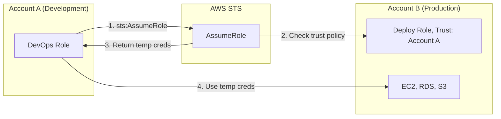
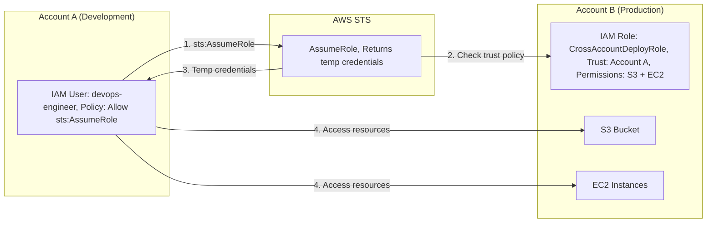

# Chapter 23 — AWS STS (Security Token Service)

---

## Prerequisite Chapters
- Chapter 01 — AWS IAM (roles, policies, federation)

## Used In Production Practicals
- Practical 01 — IAM Foundation (cross-account roles)
- Practical 02 — Enterprise AWS Accounts (assume role)
- Practical 15 — Flagship Production Architecture

---

## 1. Learning Objectives

By the end of this chapter, you will be able to:

1. **Explain** STS and how temporary credentials work.
2. **Use** AssumeRole for cross-account access and service access.
3. **Implement** federation with SAML and OIDC.
4. **Configure** session duration, session policies, and ExternalId.
5. **Troubleshoot** assume role failures and token issues.
6. **Answer** interview questions about temporary credentials and federation.

---

## 2. What is AWS STS?

STS provides **temporary security credentials** (access key + secret key + session token) for users or applications that need limited-time access to AWS resources.

### Key Characteristics
- **Temporary** — credentials expire automatically (15 min to 36 hours)
- **No long-term storage** — no password rotation needed
- **Scoped** — session policies can further restrict permissions
- **Auditable** — every AssumeRole call logged in CloudTrail
- **Cross-account** — the primary mechanism for multi-account access
- **Federation** — allows external identities (AD, Google) to access AWS

---

## 3. Why Do We Need It?

### Without STS (Long-term Access Keys)
```
Problems:
  - Keys never expire unless manually rotated
  - If leaked → unlimited access until discovered
  - Hard to track which application used which key
  - Cross-account: share keys? Create IAM users in every account?
```

### With STS (Temporary Credentials)
```
Benefits:
  - Expire automatically (1 hour default)
  - If leaked → damage limited to session duration
  - Every AssumeRole logged in CloudTrail
  - Cross-account: assume role, no credential sharing
  - Can be further scoped with session policies
```

---

## 4. Real-World Production Use Cases

### 1. Cross-Account Access
DevOps team in Account A assumes a role in Account B (production) to deploy infrastructure. No IAM users in Account B.

### 2. EC2 Instance Roles
EC2 instance assumes its instance profile role → STS provides temporary credentials → application accesses S3/DynamoDB.

### 3. CI/CD Pipeline
CodeBuild assumes a deployment role in the production account to deploy CloudFormation stacks.

### 4. Third-Party Access
External vendor assumes a role in your account with ExternalId to prevent confused deputy attacks.

### 5. Federation
Corporate employees sign in via Active Directory → SAML → AssumeRoleWithSAML → temporary AWS credentials.

---

## 5. Core Concepts

### STS API Operations

| Operation | Use Case | Duration |
|-----------|----------|----------|
| **AssumeRole** | Cross-account access, service roles | 15 min — 12 hrs |
| **AssumeRoleWithSAML** | Enterprise SSO (Active Directory) | 15 min — 12 hrs |
| **AssumeRoleWithWebIdentity** | Mobile/web apps (Google, Facebook) | 15 min — 12 hrs |
| **GetSessionToken** | MFA-protected API access | 15 min — 36 hrs |
| **GetFederationToken** | Temporary access for federated users | 15 min — 36 hrs |

### How AssumeRole Works
```
Step 1: Caller in Account A calls sts:AssumeRole
  → Target: arn:aws:iam::222222222222:role/DeployRole

Step 2: STS checks:
  a. Caller's IAM policy allows sts:AssumeRole on the target role ARN
  b. Target role's trust policy allows the caller's principal
  c. ExternalId matches (if required in trust policy)

Step 3: STS returns temporary credentials:
  {
    "AccessKeyId": "ASIA...",          (starts with ASIA, not AKIA)
    "SecretAccessKey": "wJalr...",
    "SessionToken": "FwoGZX...",       (MUST be included in API calls)
    "Expiration": "2026-09-18T15:00:00Z"
  }

Step 4: Caller uses credentials to access Account B resources
Step 5: Credentials expire → caller must re-assume
```

### Trust Policy (on the target role)
```json
{
    "Version": "2012-10-17",
    "Statement": [{
        "Effect": "Allow",
        "Principal": {
            "AWS": "arn:aws:iam::111111111111:role/DevOpsRole"
        },
        "Action": "sts:AssumeRole",
        "Condition": {
            "StringEquals": {
                "sts:ExternalId": "unique-id-12345"
            }
        }
    }]
}
```

### ExternalId (Confused Deputy Prevention)
```
Without ExternalId:
  Attacker tricks a third-party service into assuming YOUR role
  → Third-party has legitimate AssumeRole permission
  → Attacker gains access to your account through the third party

With ExternalId:
  Trust policy requires ExternalId = "unique-id-12345"
  → Only the legitimate third party knows the ExternalId
  → Attacker can't provide the correct ExternalId → denied
```

### Session Policies
```
Session policies FURTHER RESTRICT the assumed role's permissions
  → Cannot GRANT additional permissions
  → Effective permissions = intersection of role policy AND session policy

Use case: Assume a powerful role but restrict to specific S3 bucket
```

### Role Chaining
```
Role A assumes Role B, Role B assumes Role C

Limitation: Maximum session duration = 1 hour (regardless of individual role settings)
Each AssumeRole in the chain = one STS API call logged in CloudTrail
```

---

## 6. Architecture

### Cross-Account Access with STS



---

## 7. Important Components

```
AssumeRole: get temporary credentials for a different role
  - Cross-account access, service roles, federated users
  - Returns: AccessKeyId, SecretAccessKey, SessionToken
  - Duration: 15 min to 12 hours

GetSessionToken: get temporary credentials for MFA-authenticated requests
GetFederationToken: create federated user with custom policy
AssumeRoleWithSAML: exchange SAML assertion for AWS credentials
AssumeRoleWithWebIdentity: exchange OIDC token (Cognito, Google) for credentials
```

---

## 8. How It Works

```
AssumeRole Flow:
  1. Principal (user/role/service) calls sts:AssumeRole
  2. STS validates: IAM policy allows, trust policy allows caller
  3. STS returns temporary credentials (AccessKey + Secret + SessionToken)
  4. Principal uses temporary credentials to call AWS APIs
  5. Credentials expire after specified duration
```

---

## 9. AWS Console Walkthrough

### Switch Roles in Console
1. Click username in top-right -> **Switch Role**
2. Enter: Account ID, Role name, Display name
3. Console now operates with assumed role permissions
4. Switch back: click role name -> **Back to original**

---

## 10. AWS CLI Commands

```bash
# Assume role
CREDS=$(aws sts assume-role \
    --role-arn arn:aws:iam::ACCOUNT:role/CrossAccountRole \
    --role-session-name my-session \
    --duration-seconds 3600 \
    --query 'Credentials')

# Extract and export
export AWS_ACCESS_KEY_ID=$(echo $CREDS | jq -r .AccessKeyId)
export AWS_SECRET_ACCESS_KEY=$(echo $CREDS | jq -r .SecretAccessKey)
export AWS_SESSION_TOKEN=$(echo $CREDS | jq -r .SessionToken)

# Verify identity
aws sts get-caller-identity
```

### AWS CLI — AssumeRole
```bash
# Assume role in another account
CREDS=$(aws sts assume-role \
    --role-arn arn:aws:iam::222222222222:role/DeployRole \
    --role-session-name "deploy-session" \
    --duration-seconds 3600 \
    --external-id "unique-id-12345")

# Extract credentials
export AWS_ACCESS_KEY_ID=$(echo $CREDS | jq -r '.Credentials.AccessKeyId')
export AWS_SECRET_ACCESS_KEY=$(echo $CREDS | jq -r '.Credentials.SecretAccessKey')
export AWS_SESSION_TOKEN=$(echo $CREDS | jq -r '.Credentials.SessionToken')

# Now all AWS CLI commands use Account B credentials
aws s3 ls  # Lists Account B's buckets
```

### AWS CLI Profile (Simpler)
```ini
# ~/.aws/config
[profile prod-deploy]
role_arn = arn:aws:iam::222222222222:role/DeployRole
source_profile = default
external_id = unique-id-12345
region = ap-south-1

# Usage:
aws s3 ls --profile prod-deploy
```

### Python (Boto3)
```python
import boto3

sts = boto3.client('sts')

# Assume role
response = sts.assume_role(
    RoleArn='arn:aws:iam::222222222222:role/DeployRole',
    RoleSessionName='my-session',
    DurationSeconds=3600,
    ExternalId='unique-id-12345'
)

credentials = response['Credentials']

# Create client with temporary credentials
s3 = boto3.client('s3',
    aws_access_key_id=credentials['AccessKeyId'],
    aws_secret_access_key=credentials['SecretAccessKey'],
    aws_session_token=credentials['SessionToken']
)

# Access resources in Account B
buckets = s3.list_buckets()
```

### Get Caller Identity (Who am I?)
```bash
# Check which identity you're currently using
aws sts get-caller-identity
# Returns: Account, UserId, ARN
```

---

## 11. Hands-On Practical

### Practical: Cross-Account Role Assumption
```bash
# In Account A: create role with trust policy for Account B
# In Account B: assume the role
aws sts assume-role --role-arn arn:aws:iam::ACCOUNT_A:role/SharedRole \
    --role-session-name cross-account-test
```

---

## 12. Production Architecture

```
STS Usage Patterns:
  - Cross-account: central account assumes roles in workload accounts
  - CI/CD: pipeline assumes deployment role in target account
  - Federation: SAML/OIDC users get temporary AWS credentials
  - Service roles: Lambda, ECS assume execution roles automatically
```

---

## 13. Security Best Practices

1. **Short session duration** -- minimize exposure window
2. **External ID** -- prevent confused deputy attacks for cross-account
3. **MFA required** -- condition in trust policy for sensitive roles
4. **Condition keys** -- restrict by source IP, time, or service
5. **Least privilege** -- temporary credentials should have minimal permissions
6. **Session tags** -- pass attributes for ABAC (attribute-based access control)

---

## 14. High Availability

```
STS is a global service with regional endpoints:
  - Use regional endpoints (sts.REGION.amazonaws.com) for lower latency
  - Regional endpoints are independent (survive other region failures)
  - Global endpoint (sts.amazonaws.com) routes to us-east-1
```

---

## 15. Scalability

```
STS Limits:
  - AssumeRole: no explicit rate limit (AWS-managed)
  - GetSessionToken: high throughput
  - Token size: max ~2,048 bytes for session policies
```

---

## 16. Monitoring & Observability

```
CloudTrail:
  - Every STS API call logged
  - AssumeRole: logs who assumed, which role, session name
  - Critical for: security audit, incident investigation

Alarms:
  - AssumeRole from unexpected source account -> alert
  - AssumeRole failures spike -> potential attack
  - Cross-account role assumption outside business hours -> alert
```

---

## 17. Cost Optimization

```
STS is free -- no charges for API calls
  - Temporary credentials are free
  - Only pay for AWS services accessed using the credentials
```

---

## 18. Disaster Recovery

```
STS DR:
  - Use regional STS endpoints (survive us-east-1 outage)
  - Activate regional endpoints in STS settings
  - Trust policies should not hardcode regions
```

### Production STS Patterns
```
Pattern 1: Cross-Account Deployment
  CI/CD (Account A) → AssumeRole → Deploy (Account B)

Pattern 2: Break-Glass Access
  Engineer → AssumeRole (requires MFA) → Emergency admin access

Pattern 3: Third-Party Vendor
  Vendor → AssumeRole (requires ExternalId) → Read-only access

Pattern 4: Service-to-Service
  Lambda (Account A) → AssumeRole → DynamoDB (Account B)
```

---

## 19. Troubleshooting

### Problem 1: "AccessDenied" on AssumeRole
```
Check (in order):
  1. Caller's IAM policy allows sts:AssumeRole on the target role ARN?
  2. Target role's trust policy allows the caller's principal?
  3. ExternalId matches (if required)?
  4. Session duration within allowed max?
  5. Role chaining? (max 1 hour)
  6. MFA required but not provided?
```

### Problem 2: Temporary Credentials Not Working
```
Check:
  1. Including SessionToken in API calls? (required!)
  2. Credentials expired? (check Expiration timestamp)
  3. Role has permissions for the action?
  4. Session policy further restricting? (intersection logic)
```

---

## 20. Common Production Problems

| # | Problem | Root Cause | Prevention |
|---|---------|------------|------------|
| 1 | AccessDenied on AssumeRole | Trust policy doesn't allow caller | Check trust policy principal |
| 2 | Token expired | Session duration too short | Increase duration, implement refresh |
| 3 | Confused deputy | No external ID in trust policy | Always use external ID for third-party |
| 4 | MFA required but not provided | Condition in trust policy requires MFA | Pass MFA serial + token code |

---

## 21. Real-World Scenario

### Scenario: Cross-Account CI/CD Pipeline

**Setup**: CodePipeline in DevOps account deploys to Dev, Staging, Prod accounts.

**Implementation**:
1. Each target account has a deployment role with trust policy for DevOps account
2. CodePipeline assumes role in target account for each stage
3. External ID used for additional security
4. CloudTrail logs all cross-account AssumeRole calls
5. IAM Access Analyzer monitors cross-account role usage

| # | Problem | Root Cause | Prevention |
|---|---------|------------|------------|
| 1 | AssumeRole denied | Trust policy wrong | Verify principal ARN exactly |
| 2 | Missing SessionToken | Not included in API call | Always set AWS_SESSION_TOKEN |
| 3 | Credentials expired | Session too short | Re-assume before expiry |
| 4 | Role chaining fails | > 1 hour session | Design architecture to avoid chains |
| 5 | Confused deputy | No ExternalId | Always require ExternalId for third parties |

---

## 22. Interview Questions

### Basic Questions (10)

**Q1: What is AWS STS?**
A: STS provides temporary security credentials for users and applications. Credentials include AccessKeyId, SecretAccessKey, and SessionToken, and they expire automatically.

**Q2: What is AssumeRole?**
A: An STS API call that returns temporary credentials for a specified IAM role. Used for cross-account access, service roles, and federation. Requires trust policy on the target role.

**Q3: What is the difference between long-term and temporary credentials?**
A: Long-term: IAM user access keys, never expire, must rotate manually. Temporary: STS credentials, expire automatically, no rotation needed, auditable via CloudTrail.

**Q4: What is a trust policy?**
A: A resource-based policy on an IAM role that specifies who can assume it. Defines the trusted principals (users, roles, accounts, services).

**Q5: What is ExternalId?**
A: A unique identifier required in AssumeRole calls for third-party access. Prevents confused deputy attacks where an attacker tricks a trusted service into accessing your resources.

**Q6: How do EC2 instances get AWS credentials?**
A: Via Instance Profile (IAM role). STS automatically provides temporary credentials to the instance, refreshed before expiry. Applications use the instance metadata service (IMDS) to retrieve them.

**Q7: What is the maximum session duration?**
A: AssumeRole: up to 12 hours (configurable on the role). GetSessionToken: up to 36 hours. Role chaining: always 1 hour.

**Q8: How do you check which identity you're using?**
A: `aws sts get-caller-identity` — returns Account, UserId, and ARN.

**Q9: What is a session policy?**
A: An inline policy passed during AssumeRole that further restricts the assumed role's permissions. Cannot grant additional permissions beyond the role's policy.

**Q10: How do you verify if AssumeRole was successful?**
A: Check the response for Credentials (AccessKeyId, SecretAccessKey, SessionToken, Expiration). Or call `aws sts get-caller-identity` with the new credentials.

### Intermediate Questions (10)

**Q11: Explain the confused deputy problem with an example.**
A: Service X is trusted by your Account A. Attacker tells Service X to assume the role in Account A on their behalf. Without ExternalId, Service X can access your resources for the attacker. With ExternalId, Service X must provide the correct ExternalId that only the legitimate customer knows.

**Q12: What is role chaining and what is its limitation?**
A: Assuming a role, then using those credentials to assume another role. Each hop is a separate STS call. Limitation: maximum session duration is always 1 hour regardless of role settings.

**Q13: How does SAML federation work with STS?**
A: User authenticates with corporate IdP (AD). IdP sends SAML assertion to AWS. STS validates assertion → AssumeRoleWithSAML → returns temporary credentials. User accesses AWS resources.

**Q14: What is the difference between AssumeRoleWithSAML and AssumeRoleWithWebIdentity?**
A: SAML: for enterprise IdPs (Active Directory, Okta). WebIdentity: for web/mobile apps (Google, Facebook, Amazon). Both return temporary credentials but use different identity sources.

**Q15: When would you use federation instead of creating IAM users?**
A: Use federation when: users already have identities elsewhere (corporate AD, Google, Okta), you don't want to manage passwords in AWS, you need SSO across multiple accounts, or for compliance (centralized identity). Use IAM users only for: service accounts that can't use roles, or very small teams with no existing IdP. Federation scales better and is more secure.

**Q16: How does MFA work with STS AssumeRole?**
A: The trust policy can include `aws:MultiFactorAuthPresent: true` and `aws:MultiFactorAuthAge` conditions. The caller must first authenticate with MFA (e.g., `aws sts get-session-token --serial-number MFA_ARN --token-code 123456`), then use those MFA-backed credentials to call `AssumeRole`. Without MFA, the AssumeRole call is denied. Use for: sensitive roles like production admin.

**Q17: Are STS calls regional or global?**
A: STS has a global endpoint (`sts.amazonaws.com`) and regional endpoints (`sts.us-east-1.amazonaws.com`). AWS recommends using regional endpoints for: lower latency, fault isolation (global endpoint is in us-east-1), and compliance. Enable STS in each Region via IAM console. Some services automatically use regional endpoints.

**Q18: What are STS session tags and how are they used?**
A: Tags passed during `AssumeRole` as key-value pairs. They become part of the session and can be used in IAM policy conditions (`aws:PrincipalTag/Project`). Use for: tenant isolation (`TenantId=abc`), cost allocation, and ABAC (Attribute-Based Access Control). Transitive tags persist when chaining roles. Maximum 50 session tags.

**Q19: What is GetAccessKeyInfo used for?**
A: Returns the account ID that owns an access key. Useful when investigating security incidents: "Which account does this leaked access key belong to?" Works for both long-term IAM user keys (AKIA prefix) and temporary STS credentials (ASIA prefix). Does not reveal the IAM entity — only the account.

**Q20: What happens to STS credentials when the source IAM user is deleted?**
A: Existing temporary credentials remain valid until they expire. Deleting the user does not immediately revoke issued STS tokens. To revoke: 1) Delete the user (prevents new tokens). 2) Add a deny-all inline policy on the role with a `DateLessThan` condition matching the compromise time. 3) Or use `aws:TokenIssueTime` condition to invalidate old sessions., and STS + Organizations SCPs.)*

### Advanced & Scenario Questions (20)

**Q21: Design a cross-account access strategy for a 50-account organization.**
A: Use IAM Identity Center (SSO) for human access. For service-to-service: define roles in target accounts with trust policies for source account roles. Use Organizations SCPs as guardrails. Log all AssumeRole calls in centralized CloudTrail.

**Q22: A developer's temporary credentials are being used from an unexpected IP. Investigation?**
A: 1) CloudTrail: find AssumeRole call, check source IP. 2) If compromised: revoke active sessions on the role. 3) Add IP condition to trust policy. 4) Investigate how credentials were exposed.

**Q23: What is a break-glass access pattern and how does STS support it?**
A: Emergency access for when normal paths fail. Create a highly privileged role (`BreakGlassAdmin`) with MFA and ExternalId required. Only a few trusted principals can assume it. Log all usage with CloudTrail. Alert via EventBridge + SNS when assumed. Review and rotate ExternalId after each use. Normal operations use least-privilege roles; break-glass is the exception.

**Q24: How do you revoke all active STS sessions for a compromised role?**
A: Add an inline deny policy to the role with condition `aws:TokenIssueTime < <current_time>`. All tokens issued before that time are effectively denied. New AssumeRole calls get fresh tokens that pass the condition. This is the "revoke all sessions" button in the IAM console. Remember: this doesn't prevent re-assumption — update the trust policy to block the compromised principal too.

**Q25: What is the difference between IAM policies and trust policies?**
A: **IAM policies** (identity-based): define what actions the role can perform (permissions). Attached to the role itself. **Trust policies** (resource-based): define who can assume the role. Attached as the role's AssumeRolePolicyDocument. Both must allow the action. Common mistake: granting permissions in the trust policy — it only controls who can assume, not what they can do.

**Q26: How does IAM Identity Center use STS under the hood?**
A: When a user signs in via Identity Center and selects an account/permission set, Identity Center calls `AssumeRole` on the corresponding IAM role in the target account. The user gets temporary credentials scoped to that permission set. Session duration is configurable (1-12 hours). All of this is abstracted — users see a portal, but STS does the heavy lifting.

**Q27: Explain role chaining limitations in detail.**
A: Role chaining = assuming Role B from Role A's credentials. Limitation: maximum session duration is capped at 1 hour regardless of the role's configured maximum. Also, `aws:SourceIdentity` must be set on the first role and propagates through the chain (can't be changed). Chaining adds latency and makes debugging harder. Avoid long chains; use direct assumption where possible.

**Q28: How do you implement cross-account access for 100+ accounts in an Organization?**
A: 1) Use IAM Identity Center with permission sets (preferred — no per-account role management). 2) Or create a standard role (e.g., `OrgReadOnlyRole`) via CloudFormation StackSets across all accounts with a trust policy trusting the management/security account. 3) Use `aws:PrincipalOrgID` condition in trust policies. 4) Use SCP to enforce role naming and trust policy standards.

**Q29: What is source identity and how does it help auditing?**
A: `SourceIdentity` is set during the initial AssumeRole call and persists through role chaining. It identifies the original human or system (e.g., `john.doe`). CloudTrail logs include it, making it easy to trace actions back to the original actor even after multiple role assumptions. Once set, it cannot be changed in the chain.

**Q30: How do you use STS with Lambda functions?**
A: Lambda automatically assumes its execution role and gets temporary credentials (refreshed before expiry). For cross-account access, the Lambda function calls `sts.assume_role()` with the target role ARN. Cache the credentials for the session duration (not per-invocation). Use environment variables or Secrets Manager for ExternalId if needed.

### Scenario-Based Questions (10)

**Q31: A developer accidentally leaked temporary credentials on GitHub. What do you do?**
A: 1) Identify the role from the access key (ASIA prefix → `GetAccessKeyInfo`). 2) Determine when the credentials expire. 3) Add an inline deny-all policy with `aws:TokenIssueTime < now` to the role to revoke all existing sessions. 4) Review CloudTrail for unauthorized actions during the exposure window. 5) Rotate any resources accessed. 6) Add GitHub secret scanning to prevent future leaks.

**Q32: AssumeRole fails with "AccessDenied" but the trust policy looks correct. What do you check?**
A: 1) The source principal has `sts:AssumeRole` permission for the role ARN. 2) The trust policy principal ARN is exact (no wildcards for cross-account). 3) ExternalId matches if required. 4) MFA condition is met if required. 5) SCP in the Organization doesn't deny cross-account assume. 6) The role's maximum session duration isn't conflicting. 7) The source account ID is correct in the trust policy.

**Q33: You need to give a vendor temporary access to specific S3 buckets. How?**
A: Create a role with a trust policy trusting the vendor's AWS account ID, require ExternalId (vendor-specific secret), and attach a policy granting only `s3:GetObject`/`s3:ListBucket` on the specific bucket ARNs. Set a short session duration (1 hour). Monitor with CloudTrail. Revoke by changing ExternalId or removing the trust policy entry.

**Q34: CloudTrail shows AssumeRole calls from an unknown account. How do you investigate?**
A: 1) Check the `sourceIdentity` and `userAgent` in CloudTrail. 2) Look at the trust policy to see which accounts are allowed. 3) If the account isn't authorized, immediately update the trust policy to remove it. 4) Revoke sessions with inline deny. 5) Check if the role was modified (trust policy change event in CloudTrail). 6) Verify SCP and guardrails. 7) Report to the security team.

**Q35: Your application's STS credentials expire mid-operation causing failures. How do you fix?**
A: 1) Request longer session duration (`--duration-seconds`, up to the role's max, typically 1-12 hours). 2) Implement credential refresh logic — before expiry, call AssumeRole again. 3) Use the AWS SDK's built-in credential provider chain which handles refresh automatically. 4) For role chaining, remember the 1-hour hard limit. 5) For long operations, use IAM user credentials (less preferred) or restructure the operation.

**Q36: How do you prevent privilege escalation through role assumption?**
A: 1) Trust policies should never use `*` as principal. 2) Limit `sts:AssumeRole` permissions to specific role ARNs. 3) Use permission boundaries on roles to cap maximum permissions. 4) Require MFA and ExternalId for sensitive roles. 5) Use SCPs to deny assumption of admin roles except from specific accounts. 6) Monitor with CloudTrail and alert on unexpected AssumeRole calls.

**Q37: A CI/CD pipeline needs to deploy to dev, staging, and prod accounts. Design the STS flow.**
A: Pipeline runs in a tools account. Three roles: `DevDeployRole`, `StagingDeployRole`, `ProdDeployRole` in respective accounts. Each trusts the pipeline's IAM role. DevDeploy and StagingDeploy: auto-assumed by the pipeline. ProdDeploy: requires manual approval step + MFA. Session tags: `Environment=prod`, `Pipeline=my-app`. CloudTrail logs which pipeline deployed what. SCPs prevent the pipeline role from accessing non-deployment resources.

**Q38: You're seeing "ThrottlingException" on STS calls. How do you resolve?**
A: STS has API rate limits. 1) Use regional endpoints (distribute load across regions). 2) Cache credentials instead of calling AssumeRole on every request. 3) Use SDK credential providers that cache automatically. 4) Reduce the number of distinct roles being assumed. 5) Implement exponential backoff. 6) Request a limit increase via AWS Support if legitimate usage is high.

**Q39: How do you implement attribute-based access control (ABAC) with STS?**
A: Pass session tags during AssumeRole: `--tags Key=Project,Value=phoenix Key=CostCenter,Value=1234`. IAM policies use `${aws:PrincipalTag/Project}` in conditions and resource ARNs: e.g., allow `s3:*` on `arn:aws:s3:::${aws:PrincipalTag/Project}-*`. This lets one role serve many projects — the tags determine which resources are accessible, not the policy. Reduces the number of roles needed.

**Q40: When should you NOT use STS temporary credentials?**
A: 1) AWS services that don't support temporary credentials (rare, legacy). 2) Very long-running operations (>12 hours) where credential refresh isn't possible. 3) IoT devices that need persistent credentials (use IoT certificates instead). 4) Third-party tools that only accept long-term access keys (push vendor to fix this). In almost all modern scenarios, temporary credentials via STS are the correct choice.ies, cross-account Lambda access, STS regional endpoints, credential forwarding risks, and temporary credentials in CI/CD.)*

---

## 23. Scenario-Based Interview Questions

*(Covered in section 22 above)*

---

## 24. Common Mistakes

1. **Forgetting SessionToken** — API calls fail without it
2. **Wrong principal in trust policy** — must be exact ARN
3. **No ExternalId for third parties** — confused deputy risk
4. **Role chaining with long sessions** — always capped at 1 hour
5. **Using long-term keys when STS is available** — prefer temporary
6. **Not checking trust policy** — common AssumeRole failure cause
7. **Hardcoding credentials from STS** — they expire, use SDK auto-refresh

---

## 25. Production Checklist

- [ ] Cross-account roles use AssumeRole (no shared credentials)
- [ ] ExternalId required for all third-party trust relationships
- [ ] Session duration set appropriately (not maximum)
- [ ] Trust policies specify exact principal ARNs (not wildcards)
- [ ] CloudTrail logs all AssumeRole calls
- [ ] EC2 instances use Instance Profiles (not access keys)
- [ ] Lambda uses execution roles (not embedded keys)
- [ ] Role chaining avoided where possible

---

## 26. Chapter Summary

STS is how AWS does identity federation and cross-account access. Key takeaways:

1. **Temporary credentials > long-term keys** — always prefer STS
2. **AssumeRole for cross-account** — no credential sharing between accounts
3. **Trust policy + IAM policy** — both must allow for AssumeRole to work
4. **ExternalId for third parties** — prevents confused deputy attacks
5. **Session Token is required** — include in every API call
6. **Role chaining = 1 hour max** — plan architecture accordingly
7. **EC2 Instance Profiles use STS** — auto-refreshed, no key management
8. **Every AssumeRole is audited** — CloudTrail captures all STS calls

---
---

# 🔬 Practical Lab 03 — Cross-Account IAM Role (AssumeRole)

## Lab Overview

| Item | Detail |
|------|--------|
| **Difficulty** | Intermediate |
| **Duration** | 40 minutes |
| **Cost** | Free (IAM + STS are free) |
| **Prerequisites** | Practical 01 completed, understanding of IAM roles |
| **Lab Environment** | Environment 1 — Foundation |
| **AWS Region** | ap-south-1 (Mumbai) |

## Business Scenario

> Your company has two AWS accounts: **Development** (Account A) and **Production** (Account B). The DevOps engineer in Account A needs to deploy infrastructure in Account B without creating an IAM user in Account B. You need to implement **cross-account access using AssumeRole** — the AWS-recommended pattern for multi-account access.

> **If you only have one AWS account**: You can simulate this by creating a role in your own account with a trust policy that allows your own account's IAM user to assume it. The concepts are identical.

## Architecture



## What You Will Learn

1. Create a cross-account IAM role with a trust policy
2. Create a permissions policy on the source account to allow AssumeRole
3. Use `aws sts assume-role` to get temporary credentials
4. Access resources in the target account using temporary credentials
5. Use AWS CLI profiles for seamless cross-account access
6. Understand ExternalId for third-party access

---

### Step 1 — Create the Cross-Account Role (in Account B / Target)

> **If single account**: Create this role in your own account. Set the trust to your own account ID.

#### AWS Console

1. Navigate to **IAM Console** → **Roles** → **Create role**
2. **Trusted entity type**: AWS account
3. **An AWS account**: Select **Another AWS account**
   - **Account ID**: Enter Account A's 12-digit ID (or your own account ID)
   - ✅ **Require external ID**: `devops-access-2026` (optional but best practice)
4. Click **Next**
5. **Attach policies**: Select `AmazonS3FullAccess` and `AmazonEC2ReadOnlyAccess`
6. Click **Next**
7. **Role name**: `CrossAccountDeployRole`
8. **Description**: `Allows Account A DevOps engineers to access S3 and view EC2 in this account`
9. Click **Create role**

📸 **Screenshot 01** — Role Created with Trust Policy
> **What you should see**: Role "CrossAccountDeployRole" with 2 policies, trust showing Account A's ID
> **Verify**: Trust relationship tab shows the source account ID and ExternalId condition

10. Click the role → **Trust relationships** tab → Verify the trust policy:

```json
{
    "Version": "2012-10-17",
    "Statement": [{
        "Effect": "Allow",
        "Principal": {
            "AWS": "arn:aws:iam::111111111111:root"
        },
        "Action": "sts:AssumeRole",
        "Condition": {
            "StringEquals": {
                "sts:ExternalId": "devops-access-2026"
            }
        }
    }]
}
```

📸 **Screenshot 02** — Trust Policy JSON
> **What you should see**: Principal showing Account A's root ARN, Condition with ExternalId
> **Verify**: The Account ID is correct and ExternalId matches what you entered

#### AWS CLI

```bash
# In Account B (or your account for single-account simulation)
ACCOUNT_A_ID="111111111111"  # Replace with actual Account A ID

cat > cross-account-trust.json << EOF
{
    "Version": "2012-10-17",
    "Statement": [{
        "Effect": "Allow",
        "Principal": {"AWS": "arn:aws:iam::${ACCOUNT_A_ID}:root"},
        "Action": "sts:AssumeRole",
        "Condition": {
            "StringEquals": {"sts:ExternalId": "devops-access-2026"}
        }
    }]
}
EOF

aws iam create-role \
    --role-name CrossAccountDeployRole \
    --assume-role-policy-document file://cross-account-trust.json

aws iam attach-role-policy --role-name CrossAccountDeployRole \
    --policy-arn arn:aws:iam::aws:policy/AmazonS3FullAccess
aws iam attach-role-policy --role-name CrossAccountDeployRole \
    --policy-arn arn:aws:iam::aws:policy/AmazonEC2ReadOnlyAccess
```

🎯 **Interview Insight**: "What is ExternalId and why do you need it?"
> **What they're testing**: Understanding of the confused deputy problem
> **Strong answer**: "ExternalId prevents confused deputy attacks. Without it, a malicious third party could trick a trusted service into assuming a role in your account on their behalf. ExternalId acts as a shared secret — only the legitimate party knows it, so the attacker can't forge the AssumeRole request."
> **Weak answer**: "It's extra security." (Too vague — interviewers want the confused deputy explanation)

---

### Step 2 — Grant AssumeRole Permission (in Account A / Source)

#### AWS Console (Account A)

1. Navigate to **IAM Console** → **Users** → select `devops-engineer` (or create one)
2. **Add permissions** → **Create inline policy** → **JSON**:

```json
{
    "Version": "2012-10-17",
    "Statement": [{
        "Effect": "Allow",
        "Action": "sts:AssumeRole",
        "Resource": "arn:aws:iam::222222222222:role/CrossAccountDeployRole"
    }]
}
```

3. **Policy name**: `AllowAssumeDeployRole`
4. Click **Create policy**

📸 **Screenshot 03** — AssumeRole Permission on Source User
> **What you should see**: Inline policy "AllowAssumeDeployRole" attached to the user
> **Verify**: Resource ARN points to Account B's CrossAccountDeployRole

#### AWS CLI

```bash
# In Account A
ACCOUNT_B_ID="222222222222"  # Replace with actual Account B ID

cat > assume-role-policy.json << EOF
{
    "Version": "2012-10-17",
    "Statement": [{
        "Effect": "Allow",
        "Action": "sts:AssumeRole",
        "Resource": "arn:aws:iam::${ACCOUNT_B_ID}:role/CrossAccountDeployRole"
    }]
}
EOF

aws iam put-user-policy \
    --user-name devops-engineer \
    --policy-name AllowAssumeDeployRole \
    --policy-document file://assume-role-policy.json
```

🎯 **Interview Insight**: "Both accounts need to allow the access — explain why."
> **What they're testing**: Cross-account authorization model
> **Strong answer**: "Cross-account access requires TWO things: 1) The trust policy on the target role must allow the source principal. 2) The IAM policy on the source principal must allow sts:AssumeRole on the target role ARN. If either is missing, the AssumeRole call fails. It's like a door with two locks — both must be unlocked."

---

### Step 3 — Assume the Role and Access Resources

#### AWS CLI

```bash
# From Account A — Assume the role in Account B
CREDS=$(aws sts assume-role \
    --role-arn arn:aws:iam::222222222222:role/CrossAccountDeployRole \
    --role-session-name "devops-deploy-session" \
    --external-id "devops-access-2026" \
    --duration-seconds 3600 \
    --output json)

echo "Assumed role successfully!"
echo $CREDS | python3 -m json.tool

# Extract credentials
export AWS_ACCESS_KEY_ID=$(echo $CREDS | python3 -c "import sys,json;print(json.load(sys.stdin)['Credentials']['AccessKeyId'])")
export AWS_SECRET_ACCESS_KEY=$(echo $CREDS | python3 -c "import sys,json;print(json.load(sys.stdin)['Credentials']['SecretAccessKey'])")
export AWS_SESSION_TOKEN=$(echo $CREDS | python3 -c "import sys,json;print(json.load(sys.stdin)['Credentials']['SessionToken'])")

# Verify identity — should show Account B's role
aws sts get-caller-identity
```

📸 **Screenshot 04** — AssumeRole Output
> **What you should see**: JSON with AccessKeyId (starts with ASIA), SecretAccessKey, SessionToken, Expiration
> **Verify**: `get-caller-identity` shows Account B's account ID and the CrossAccountDeployRole ARN

```bash
# Now access Account B resources
aws s3 ls  # Lists Account B's buckets
aws ec2 describe-instances --region ap-south-1  # Lists Account B's instances
```

📸 **Screenshot 05** — Cross-Account Resource Access
> **What you should see**: S3 buckets from Account B, EC2 instances from Account B
> **Verify**: These are NOT Account A's resources — you're operating in Account B

```bash
# Try something NOT allowed (e.g., IAM — not in the role's permissions)
aws iam list-users  # Should get AccessDenied
```

📸 **Screenshot 06** — Least Privilege Verification
> **What you should see**: AccessDenied error for IAM actions
> **Verify**: Role only has S3 and EC2 ReadOnly — IAM is denied (least privilege)

---

### Step 4 — Configure AWS CLI Profile for Seamless Access

Instead of manually exporting credentials, configure a CLI profile:

```bash
# Add to ~/.aws/config
cat >> ~/.aws/config << 'EOF'

[profile account-b-deploy]
role_arn = arn:aws:iam::222222222222:role/CrossAccountDeployRole
source_profile = default
external_id = devops-access-2026
region = ap-south-1
EOF
```

```bash
# Now use it seamlessly — CLI handles AssumeRole automatically!
aws s3 ls --profile account-b-deploy
aws ec2 describe-instances --profile account-b-deploy
aws sts get-caller-identity --profile account-b-deploy
```

📸 **Screenshot 07** — CLI Profile Working
> **What you should see**: Resources from Account B returned when using --profile account-b-deploy
> **Verify**: `get-caller-identity` shows the CrossAccountDeployRole ARN

🎯 **Interview Insight**: "How do you manage credentials for multiple AWS accounts?"
> **What they're testing**: Practical multi-account workflow
> **Strong answer**: "Use AWS CLI profiles with role_arn and source_profile. The CLI automatically handles AssumeRole and credential refresh. For many accounts, use IAM Identity Center (SSO) with `aws configure sso` for centralized access. Never share or copy access keys between accounts."
> **Weak answer**: "Create IAM users in every account." (Anti-pattern, doesn't scale)

---

### Step 5 — Verify in CloudTrail

#### AWS Console (Account B)

1. Navigate to **CloudTrail Console** → **Event history**
2. Filter: **Event name** = `AssumeRole`
3. Find the event → Click to expand

📸 **Screenshot 08** — CloudTrail AssumeRole Event
> **What you should see**: AssumeRole event showing: source Account A principal, target role ARN, session name "devops-deploy-session"
> **Verify**: Event details show requestParameters with roleArn and externalId

---

## Validation

### Test 1 — Verify Cross-Account Identity
```bash
# From Account A with profile
aws sts get-caller-identity --profile account-b-deploy
```
**Expected**: Account shows Account B's ID, ARN shows `assumed-role/CrossAccountDeployRole/devops-deploy-session`

### Test 2 — Verify Permissions
```bash
aws s3 ls --profile account-b-deploy  # Should work
aws iam list-users --profile account-b-deploy  # Should be denied
```
**Expected**: S3 allowed, IAM denied

---

## Troubleshooting

| Problem | Likely Cause | Fix |
|---------|-------------|-----|
| "AccessDenied" on AssumeRole | Trust policy wrong | Verify Account A's ID in trust policy Principal |
| "AccessDenied" with correct trust | Source user missing sts:AssumeRole permission | Add sts:AssumeRole policy to source user |
| ExternalId mismatch | Different ExternalId in trust vs CLI call | Match exactly, case-sensitive |
| "Token is expired" | Session expired | Re-assume the role (or let CLI profile auto-refresh) |
| Can't access resources after assuming | Wrong session token | Verify AWS_SESSION_TOKEN is exported |

---

## Interview Questions From This Practical

**Q1: Walk me through how cross-account access works.**
A: Two authorization gates: 1) Trust policy on target role allows the source principal. 2) IAM policy on source principal allows sts:AssumeRole. Both must pass. STS returns temporary credentials. All calls use those credentials to access the target account. Everything is logged in CloudTrail.

**Q2: Can you use a role's permissions to modify the trust policy of that same role?**
A: Only if the role has iam:UpdateAssumeRolePolicy permission. This is dangerous — a compromised role could expand its own trust. Don't grant IAM write permissions to cross-account roles.

**Q3: Why should you use ExternalId when granting access to a third-party vendor?**
A: To prevent confused deputy attacks. Without ExternalId, an attacker could trick the vendor into assuming your role on their behalf (since the vendor's principal is trusted). ExternalId is a shared secret that only the legitimate customer-vendor relationship knows.

---

## Cleanup

```bash
# Clear environment variables
unset AWS_ACCESS_KEY_ID AWS_SECRET_ACCESS_KEY AWS_SESSION_TOKEN

# Remove CLI profile (edit ~/.aws/config manually)

# In Account B: Delete the role
aws iam detach-role-policy --role-name CrossAccountDeployRole \
    --policy-arn arn:aws:iam::aws:policy/AmazonS3FullAccess
aws iam detach-role-policy --role-name CrossAccountDeployRole \
    --policy-arn arn:aws:iam::aws:policy/AmazonEC2ReadOnlyAccess
aws iam delete-role --role-name CrossAccountDeployRole

# In Account A: Remove inline policy
aws iam delete-user-policy --user-name devops-engineer --policy-name AllowAssumeDeployRole
```

📸 **Screenshot 09** — Cleanup Complete
> **Verify**: Role deleted from Account B, inline policy removed from Account A user
