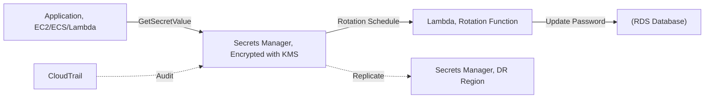

# Chapter 24 — AWS Secrets Manager

---

## Prerequisite Chapters
- Chapter 01 — AWS IAM (access to secrets)
- Chapter 22 — AWS KMS (encryption of secrets)
- Chapter 06 — Amazon RDS (database password management)

## Used In Production Practicals
- Practical 03 — Secure Secrets
- Practical 14 — Secure Application (ALB → EC2 → Secrets Manager → RDS)
- Practical 15 — Flagship Production Architecture

---

## 1. Learning Objectives

By the end of this chapter, you will be able to:

1. **Explain** Secrets Manager vs SSM Parameter Store — when to use each.
2. **Store** and retrieve secrets (database passwords, API keys, OAuth tokens).
3. **Configure** automatic rotation for RDS and custom secrets.
4. **Integrate** secrets with Lambda, ECS, Fargate, and EC2.
5. **Implement** cross-region replication for DR.
6. **Troubleshoot** access denied, rotation failures, and caching.
7. **Answer** interview questions about secret management.

---

## 2. What is AWS Secrets Manager?

Secrets Manager stores, rotates, and retrieves secrets securely. It encrypts secrets with KMS and supports **automatic rotation** — the killer feature that distinguishes it from Parameter Store.

### Secrets Manager vs SSM Parameter Store

| Feature | Secrets Manager | SSM Parameter Store |
|---------|----------------|-------------------|
| **Primary use** | Secrets (passwords, keys, tokens) | Configuration + simple secrets |
| **Automatic rotation** | ✅ Built-in (Lambda-powered) | ❌ No built-in rotation |
| **Cost** | $0.40/secret/month + $0.05/10K API | Free (Standard) |
| **Cross-region replication** | ✅ Built-in | ❌ Not available |
| **Size** | Up to 65 KB | 4 KB (std) / 8 KB (advanced) |
| **RDS integration** | ✅ Native rotation for RDS | ❌ Manual |
| **Versioning** | ✅ Automatic (current, previous, pending) | ✅ Labels |
| **KMS encryption** | ✅ Always encrypted | Optional (SecureString) |

### When to Use Each
```
Secrets Manager:
  ✅ Database passwords (needs rotation)
  ✅ API keys that expire
  ✅ OAuth tokens
  ✅ Multi-region secret replication

Parameter Store:
  ✅ Feature flags (ON/OFF)
  ✅ Database endpoints (non-secret config)
  ✅ Application settings
  ✅ Cost-sensitive (free tier)
  ✅ Hierarchical config (/app/prod/db-host)
```

---

## 3. Why Do We Need It?

### Without Secrets Manager
```
Where are your passwords?
  - Hardcoded in application code (leaked in git)
  - Environment variables (visible in console)
  - Config files on disk (compromised if server breached)
  - Shared team spreadsheet (yes, this happens)
  
Problems:
  - No rotation (same password for years)
  - No audit trail (who accessed what?)
  - No encryption at rest (plaintext files)
  - Password change = redeploy every application
```

### With Secrets Manager
```
Passwords stored securely:
  - Encrypted with KMS (AES-256)
  - Automatic rotation every 30 days
  - Full audit trail (CloudTrail)
  - Application retrieves at runtime (no hardcoding)
  - Password change = automatic, no redeploy
```

---

## 4. Real-World Production Use Cases

### 1. RDS Database Credentials
Store master password in Secrets Manager → auto-rotate every 30 days → application retrieves current password at runtime.

### 2. Third-Party API Keys
Store API keys for Stripe, Twilio, SendGrid → rotate when compromised → Lambda rotation function calls third-party API.

### 3. ECS/Fargate Container Secrets
Task definition references Secrets Manager ARN → ECS injects secret as environment variable at task launch.

### 4. Cross-Region DR
Replicate secrets to DR region → application in DR region uses the same secret ARN pattern.

---

## 5. Core Concepts

### Secret Structure
```json
{
    "SecretId": "prod/db-credentials",
    "SecretString": "{\"username\":\"admin\",\"password\":\"StrongP@ss123!\",\"host\":\"prod-db.abc.rds.amazonaws.com\",\"port\":\"5432\",\"dbname\":\"myapp\"}",
    "VersionId": "a1b2c3d4-5678-90ab-cdef-EXAMPLE11111",
    "VersionStages": ["AWSCURRENT"]
}

Versions:
  AWSCURRENT  → active version (used by applications)
  AWSPREVIOUS → previous version (rollback)
  AWSPENDING  → being rotated (temporary)
```

### Rotation Process
```
1. createSecret: Lambda creates new password in AWSPENDING
2. setSecret:    Lambda updates RDS with new password
3. testSecret:   Lambda tests connection with new password
4. finishSecret: Lambda moves AWSPENDING → AWSCURRENT
                 Old AWSCURRENT → AWSPREVIOUS

If any step fails → rotation fails → old password still works
```

### Rotation Strategies

| Strategy | How | Use Case |
|----------|-----|----------|
| **Single user** | Change password for one user | Simple apps, single DB user |
| **Alternating users** | Alternate between user1 and user2 | Zero-downtime rotation |

---

## 6. Architecture



---

## 7. Important Components

```
Secret: stored credential (password, API key, DB connection string)
Secret Version: AWSCURRENT (active), AWSPREVIOUS (last rotated)
Rotation: Lambda function that updates the secret and the service
Replication: cross-region secret replication for DR
Resource Policy: control cross-account access to secrets
```

---

## 8. How It Works

```
Secret Lifecycle:
  1. Create secret (plaintext -> encrypted with KMS key)
  2. Application calls GetSecretValue API
  3. Secrets Manager decrypts and returns plaintext
  4. Rotation Lambda runs on schedule (e.g., every 30 days):
     a. Creates new password
     b. Updates the database/service
     c. Updates the secret in Secrets Manager
  5. Application gets new credential on next GetSecretValue call
```

---

## 9. AWS Console Walkthrough

### Create and Retrieve a Secret
1. **Secrets Manager Console** -> **Store a new secret**
2. **Type**: Credentials for RDS database
3. **Username/Password**: enter credentials
4. **Database**: select RDS instance
5. **Rotation**: enable, 30-day schedule
6. **Name**: prod/myapp/db-credentials

---

## 10. AWS CLI Commands

```bash
# Create secret
aws secretsmanager create-secret \
    --name prod/myapp/api-key \
    --secret-string '{"api_key":"sk-xxxx","api_url":"https://api.example.com"}'

# Get secret
aws secretsmanager get-secret-value --secret-id prod/myapp/api-key \
    --query 'SecretString' --output text

# Rotate secret
aws secretsmanager rotate-secret --secret-id prod/myapp/api-key \
    --rotation-lambda-arn arn:aws:lambda:REGION:ACCOUNT:function:rotation-fn \
    --rotation-rules AutomaticallyAfterDays=30

# Replicate to DR region
aws secretsmanager replicate-secret-to-regions \
    --secret-id prod/myapp/api-key \
    --add-replica-regions Region=eu-west-1
```

### Store and Retrieve Secrets
```bash
# Create secret
aws secretsmanager create-secret \
    --name "prod/db-credentials" \
    --description "Production database credentials" \
    --secret-string '{"username":"admin","password":"StrongP@ss123!","host":"prod-db.abc.rds.amazonaws.com","port":"5432","dbname":"myapp"}'

# Retrieve secret
aws secretsmanager get-secret-value --secret-id "prod/db-credentials" \
    --query 'SecretString' --output text | python -m json.tool

# Update secret
aws secretsmanager update-secret --secret-id "prod/db-credentials" \
    --secret-string '{"username":"admin","password":"NewP@ss456!","host":"prod-db.abc.rds.amazonaws.com"}'

# List secrets
aws secretsmanager list-secrets --query 'SecretList[*].{Name:Name,Rotation:RotationEnabled}'
```

### Enable Rotation
```bash
aws secretsmanager rotate-secret \
    --secret-id "prod/db-credentials" \
    --rotation-lambda-arn arn:aws:lambda:ap-south-1:123:function:SecretsManagerRDSRotation \
    --rotation-rules '{"AutomaticallyAfterDays": 30}'
```

### Python (Boto3)
```python
import boto3
import json

def get_db_credentials():
    client = boto3.client('secretsmanager')
    response = client.get_secret_value(SecretId='prod/db-credentials')
    return json.loads(response['SecretString'])

# Use in application
creds = get_db_credentials()
connection = psycopg2.connect(
    host=creds['host'], port=int(creds['port']),
    user=creds['username'], password=creds['password'],
    dbname=creds['dbname']
)
```

### ECS Task Definition Integration
```json
{
    "containerDefinitions": [{
        "name": "web-app",
        "secrets": [
            {
                "name": "DB_PASSWORD",
                "valueFrom": "arn:aws:secretsmanager:ap-south-1:123:secret:prod/db-credentials:password::"
            },
            {
                "name": "API_KEY",
                "valueFrom": "arn:aws:secretsmanager:ap-south-1:123:secret:prod/api-key"
            }
        ]
    }]
}
```

### Lambda Environment Variable Integration
```yaml
# SAM / CloudFormation
Environment:
  Variables:
    DB_SECRET_ARN: !Ref MySecret

# Lambda code retrieves at runtime
import boto3
secret = boto3.client('secretsmanager').get_secret_value(
    SecretId=os.environ['DB_SECRET_ARN']
)
```

---

## 11. Hands-On Practical

### Practical: RDS with Managed Password
```bash
# RDS manages password in Secrets Manager automatically
aws rds create-db-instance \
    --db-instance-identifier prod-db \
    --manage-master-user-password \
    --engine postgres
# Secret auto-created in Secrets Manager
```

---

## 12. Production Architecture

```
Production Secrets Manager Setup:
  - One secret per credential (not one secret for all)
  - Rotation enabled (30 days for passwords)
  - KMS CMK for encryption (not default key)
  - Cross-region replication for DR
  - Resource policy for cross-account access
  - Application caches secret (5-min TTL)
```

---

## 13. Security Best Practices

1. **Rotate all secrets** -- 30-day rotation for passwords
2. **CMK encryption** -- use customer managed key for audit
3. **Least privilege IAM** -- restrict GetSecretValue to specific secrets
4. **VPC endpoint** -- access Secrets Manager without internet
5. **No secrets in code** -- always fetch at runtime
6. **Resource policy** -- control cross-account access explicitly

---

## 14. High Availability

```
Secrets Manager HA:
  - Regional service, multi-AZ by default
  - 99.9% SLA
  - Caching SDK: reduces API calls, survives brief outages
```

---

## 15. Scalability

```
Limits:
  - 500,000 secrets per region
  - GetSecretValue: 10,000 requests/second
  - Use caching (AWS SDK or custom) to reduce calls
```

---

## 16. Monitoring & Observability

```
CloudTrail:
  - All API calls logged (GetSecretValue, RotateSecret, etc.)
  - Monitor: who accessed which secret, when

CloudWatch:
  - No built-in metrics
  - Use CloudTrail + Athena for access analytics

Alarms:
  - Rotation failure -> alert (secret stale, app will break)
  - Unusual GetSecretValue from new principal -> alert
```

---

## 17. Cost Optimization

```
Pricing:
  - $0.40 per secret per month
  - $0.05 per 10,000 API calls

Cost Tips:
  - Cache secrets in application (reduce API calls)
  - Use SSM Parameter Store for non-rotating config ($0/free tier)
  - Consolidate related values in one secret (JSON format)
```

---

## 18. Disaster Recovery

```
DR Strategy:
  - Cross-region replication: secret auto-replicated
  - Replica is read-only (becomes primary if promoted)
  - KMS: uses region-specific key in DR region
  - Application: use regional endpoint, failover automatic
```

### Production Secrets Configuration
```
Every application secret:
  - Stored in Secrets Manager (never in code/config)
  - Encrypted with CMK (per-application key)
  - Rotation enabled (30 days for DB passwords)
  - Cross-region replication (for DR)
  - Access via IAM role (least privilege)
  - CloudTrail auditing (who accessed what)

Naming Convention:
  {environment}/{service}/{secret-name}
  prod/web-app/db-credentials
  prod/payment-service/stripe-api-key
  staging/web-app/db-credentials
```

---

## 19. Troubleshooting

### Problem 1: "AccessDeniedException" on GetSecretValue
```
Check:
  1. IAM policy allows secretsmanager:GetSecretValue on the secret ARN
  2. KMS key policy allows kms:Decrypt for the caller
  3. Resource policy on the secret allows the caller (if set)
  4. VPC endpoint policy allows the action (if using PrivateLink)
```

### Problem 2: Rotation Fails
```bash
# Check Lambda rotation function logs
aws logs tail /aws/lambda/SecretsManagerRDSRotation --follow

# Common causes:
# - Lambda can't reach RDS (VPC/SG issue)
# - Lambda role missing permissions (SM, RDS, KMS)
# - RDS max_connections reached
# - Secret JSON format wrong (missing required fields)
```

### Problem 3: Application Gets Old Password After Rotation
```
Causes:
  - Application caches the secret and doesn't refresh
  - Using AWSPREVIOUS version instead of AWSCURRENT

Fix:
  - Use AWS Secrets Manager caching library
  - Set appropriate cache TTL (e.g., 1 hour)
  - Handle connection errors by re-fetching secret
```

---

## 20. Common Production Problems

| # | Problem | Root Cause | Prevention |
|---|---------|------------|------------|
| 1 | Rotation failed | Lambda can't reach DB | Check VPC config for rotation Lambda |
| 2 | App can't read secret | IAM policy missing GetSecretValue | Add specific secret ARN to policy |
| 3 | Stale credentials | Rotation succeeded but app cached old | Implement cache refresh on auth failure |
| 4 | Cross-account denied | No resource policy on secret | Add resource policy for target account |

---

## 21. Real-World Scenario

### Scenario: Database Password Rotation Broke the App

**Event**: Secrets Manager rotated DB password, but app used cached old password.

**Response**:
1. App gets authentication error from RDS
2. App retry logic calls GetSecretValue (gets new password)
3. App reconnects with new credentials
4. Fix: implement connection pool refresh on auth failure
5. Use multi-user rotation strategy for zero-downtime

---

## 22. Interview Questions

### Basic Questions (10)

**Q1: What is AWS Secrets Manager?**
A: A managed service to store, rotate, and retrieve secrets (passwords, API keys). Encrypted with KMS. Supports automatic rotation. Integrates with RDS, ECS, Lambda.

**Q2: Secrets Manager vs Parameter Store — when to use each?**
A: Secrets Manager: passwords that need rotation, database credentials, API keys ($0.40/secret/month). Parameter Store: configuration values, feature flags, non-rotating secrets (free).

**Q3: How does automatic rotation work?**
A: A Lambda function runs on schedule (e.g., every 30 days). It creates a new password, updates the database, tests the connection, then promotes the new password to AWSCURRENT.

**Q4: How do ECS tasks access secrets?**
A: In the task definition, reference the secret ARN in the `secrets` section. ECS retrieves the secret at task launch and injects it as an environment variable. Requires execution role with secretsmanager:GetSecretValue.

**Q5: How is a secret encrypted?**
A: With KMS. Each secret version is encrypted with a data key generated from the specified KMS key (default: aws/secretsmanager or your CMK).

**Q6: What is secret versioning?**
A: Each secret has versions with staging labels: `AWSCURRENT` (active), `AWSPREVIOUS` (last version), `AWSPENDING` (during rotation). Applications retrieving without specifying a version get `AWSCURRENT`. This allows rollback to `AWSPREVIOUS` if rotation fails. You can also reference specific version IDs.

**Q7: How does cross-region replication work?**
A: Configure replica Regions on a secret. Secrets Manager automatically keeps replicas in sync. Use for: DR (applications in a failover Region can access secrets locally), and multi-Region apps (lower latency). Replicas are read-only. Rotation happens in the primary Region and propagates. Each replica has its own ARN.

**Q8: How do Lambda functions access secrets?**
A: 1) Use the **AWS Parameters and Secrets Lambda Extension** (caches secrets in the execution environment, reduces API calls). 2) Or call `secretsmanager:GetSecretValue` in your Lambda code via the SDK. Cache the result outside the handler for reuse across invocations. The Lambda execution role needs `secretsmanager:GetSecretValue` and `kms:Decrypt` permissions.

**Q9: What are resource policies on secrets?**
A: JSON policies attached directly to a secret (like S3 bucket policies). Use for: cross-account access (grant another account's role access to your secret without sharing credentials), restricting access from specific VPC endpoints, or denying access to certain principals. Evaluated together with IAM policies.

**Q10: What is the Secrets Manager caching library?**
A: Client-side caching libraries (available for Java, Python, .NET, Go) that cache secret values locally with a configurable TTL (default 1 hour). Reduces API calls, lowers latency, and cuts costs. The cache refreshes automatically. Essential for high-throughput applications that access secrets on every request.

### Intermediate Questions (10)

**Q11: What is the alternating users rotation strategy?**
A: Two database users (user1, user2). Rotation alternates between them. While one is being rotated, the other serves traffic. Zero-downtime rotation.

**Q12: How do you handle a failed rotation?**
A: Rotation Lambda logs errors to CloudWatch. The old password (AWSCURRENT) remains active. Fix the issue (VPC, permissions, connectivity), then manually trigger rotation.

**Q13: How do multi-region secrets work and when do you need them?**
A: Create a primary secret, then add replica Regions. Secrets Manager replicates values automatically (including rotation updates). Use when: applications in multiple Regions need the same credentials, DR requires local secret access, or compliance mandates data in-Region. Replicas use their own KMS key. Replication lag is typically seconds.

**Q14: What VPC requirements does a rotation Lambda have?**
A: The rotation Lambda must reach both: 1) The database (in a private subnet) — Lambda needs to be in the VPC with a security group that allows outbound to the DB port. 2) The Secrets Manager API — either through a NAT Gateway or a VPC endpoint for `secretsmanager`. Without this, the Lambda can reach the DB but can't update the secret, or vice versa.

**Q15: How do resource policies help with cross-account secret sharing?**
A: Attach a resource policy to the secret allowing the target account's role: `secretsmanager:GetSecretValue` and `kms:Decrypt`. The target account's role also needs IAM permissions to call Secrets Manager. This avoids sharing actual credentials — each account uses its own IAM role to retrieve the secret value. The KMS key policy must also allow the cross-account role.

**Q16: How do you optimize Secrets Manager costs?**
A: $0.40/secret/month + $0.05/10K API calls. Strategies: 1) Use caching libraries (reduce API calls by 90%+). 2) Store multiple related values in one secret as JSON (one secret instead of five). 3) Use Parameter Store (free) for non-rotating config. 4) Delete unused secrets. 5) Right-size rotation frequency (90 days for non-critical vs 30 days for production DB).

**Q17: What caching strategies should you use?**
A: Client-side: use the Secrets Manager Caching Library with TTL matching your rotation window minus a buffer (e.g., TTL of 30 min if rotating every 30 days). For Lambda: cache outside the handler and use the Lambda Extension. For ECS: secrets are injected at launch, so restart tasks after rotation. Never cache forever — set a maximum TTL.

**Q18: How do you audit secret access with CloudTrail?**
A: Every `GetSecretValue`, `CreateSecret`, `UpdateSecret`, `DeleteSecret`, and `RotateSecret` call is logged in CloudTrail. Query with Athena: "Who accessed `prod/db/credentials` in the last 30 days?" Set up EventBridge rules for sensitive events (secret deletion, rotation failure). Send logs to a centralized security account.

**Q19: How do you share secrets across accounts securely?**
A: 1) Resource policy on the secret + KMS key policy allowing the target account's role. 2) OR use cross-region replication to a shared-services account. 3) OR use RAM (Resource Access Manager) for secret sharing in Organizations. The consuming account's application assumes its own role and calls `GetSecretValue` with the secret ARN from the source account.

**Q20: How do you migrate from plaintext credentials to Secrets Manager?**
A: 1) Inventory all hardcoded credentials (config files, env vars, code). 2) Create secrets in Secrets Manager with the current values. 3) Update applications to retrieve from Secrets Manager (using SDK or ECS/Lambda native integration). 4) Remove hardcoded values from code and config. 5) Enable rotation. 6) Rotate immediately to replace the credentials that were in plaintext. 7) Scan repos for leaked secrets.

### Advanced & Scenario Questions (20)

**Q21: Design a secrets management strategy for a microservices architecture.**
A: Per-service secrets (blast radius). Per-environment (prod/staging). CMK per application. 30-day rotation. ECS injects at launch. Lambda retrieves at invocation. Centralized audit via CloudTrail.

**Q22: How do you handle rotation during deployments?**
A: Coordinate rotation with deploy windows. If rotation happens mid-deploy, old tasks have the old password and new tasks get the new password — both must work simultaneously. The **alternating users** strategy handles this: two DB users rotate alternately, so both old and new passwords are always valid. Never rotate during a deployment — use rotation windows or pause rotation during deploys.

**Q23: How do you prevent secret sprawl?**
A: 1) Naming convention: `/<environment>/<service>/<secret-type>` (e.g., `/prod/orders/db-credentials`). 2) Tags: team, application, cost center. 3) Regular audits: list all secrets, find unused ones (CloudTrail shows no `GetSecretValue` calls). 4) Delete or archive unused secrets. 5) Centralized governance with AWS Config rules checking for unrotated or untagged secrets.

**Q24: How do you meet compliance requirements (SOC2, PCI-DSS) with Secrets Manager?**
A: Use customer-managed KMS keys (audit trail for key usage). Enable automatic rotation (compliance requires regular password changes). CloudTrail provides full access audit. Resource policies restrict access to authorized roles only. Cross-region replication meets data availability requirements. VPC endpoints keep traffic off the internet. Tag secrets with compliance scope.

**Q25: How do you implement zero-downtime password rotation?**
A: Use the **alternating users** strategy: create two DB users (user_v1, user_v2). Rotation creates a new password for user_v2 while user_v1 still works. After rotation, `AWSCURRENT` points to user_v2. Applications using `AWSCURRENT` seamlessly switch. The old user_v1 (`AWSPREVIOUS`) remains valid until the next rotation cycle. Both passwords work during the transition.

**Q26: How do you handle emergency secret revocation?**
A: 1) Immediately rotate the compromised secret (`aws secretsmanager rotate-secret`). 2) Change the database password directly if faster. 3) Update the secret value manually (`put-secret-value`). 4) Restart all consuming services to pick up the new value. 5) Invalidate any cached copies. 6) Check CloudTrail for unauthorized access during the compromise window. 7) Post-incident: review why rotation wasn't sufficient.

**Q27: How do you integrate Secrets Manager with third-party vaults (HashiCorp Vault)?**
A: Options: 1) Migrate secrets from Vault to Secrets Manager (simplify operations). 2) Use a sync Lambda that copies secrets from Vault to Secrets Manager on a schedule. 3) Use Vault for on-prem and Secrets Manager for AWS-native apps. 4) For ECS/Lambda, Secrets Manager is more natural (native integration). Vault excels in hybrid/multi-cloud scenarios.

### Scenario-Based Questions (13)

**Q28: A rotation failed and your application is down. What do you do?**
A: 1) The old password (`AWSPREVIOUS`) should still work. Update the app to use `AWSPREVIOUS` temporarily. 2) Check the rotation Lambda logs in CloudWatch. 3) Common failures: Lambda can't reach DB (VPC/SG), Lambda can't reach Secrets Manager (no NAT/endpoint), DB rejects the new password (complexity requirements). 4) Fix the issue and manually trigger rotation. 5) Add CloudWatch alarms on rotation failures.

**Q29: You need to rotate passwords for 50 databases. How do you scale?**
A: 1) One secret per database. 2) Secrets Manager creates a rotation Lambda per secret (or share one Lambda with filtering). 3) Stagger rotation schedules (don't rotate all 50 at once). 4) Use CloudFormation to deploy secrets and rotation configurations consistently. 5) Monitor all rotations with CloudWatch metrics and EventBridge rules. 6) Use the alternating-users strategy to avoid downtime.

**Q30: A developer stored a secret in Parameter Store instead of Secrets Manager. Does it matter?**
A: Yes, if the secret needs rotation. Parameter Store (SecureString) encrypts with KMS but has no built-in rotation. The developer must manually rotate and update all consumers. Secrets Manager automates this. Migration: create the secret in Secrets Manager, update the app to read from there, enable rotation, then delete the Parameter Store entry.

**Q31: Your ECS service has 100 tasks all calling GetSecretValue on startup. You're getting throttled. How do you fix?**
A: 1) Use the caching library so tasks don't call the API on every request. 2) Stagger task restarts (rolling deployments). 3) Use ECS native secret injection (secrets are fetched once at task launch by the ECS agent, not by your app). 4) Request a throughput increase from AWS if legitimate. 5) Combine related secrets into one JSON secret to reduce API calls.

**Q32: How do you ensure a secret is deleted securely and can't be recovered?**
A: `DeleteSecret` schedules deletion with a recovery window (7-30 days, or immediate with `--force-delete-without-recovery`). During the recovery window, the secret is not accessible but can be restored. After deletion, the secret value is permanently removed. The KMS data key is also dereferenced. For compliance: document the deletion, ensure CloudTrail captures it, and verify no replicas remain.

**Q33: Your database uses SSL client certificates, not passwords. Can you still use Secrets Manager?**
A: Yes. Store the client certificate and private key as a binary secret (`SecretBinary`). Your application retrieves the binary value at runtime and uses it for the SSL connection. Rotation is more complex — the rotation Lambda must generate a new certificate, register it with the DB, and update the secret. But the storage, encryption, and access control work the same way.

**Q34: A secret was accidentally deleted. How do you recover?**
A: If within the recovery window (default 30 days): `aws secretsmanager restore-secret --secret-id <name>`. The secret and all its versions are restored. If `--force-delete-without-recovery` was used, the secret is gone. Prevention: use resource policies denying `secretsmanager:DeleteSecret`, enable deletion protection via SCPs, and replicate critical secrets to another Region.

**Q35: How do you handle secrets for ephemeral environments (CI/CD, feature branches)?**
A: Options: 1) Use Parameter Store (free) for non-production secrets. 2) Create secrets dynamically in CloudFormation/Terraform for the environment, delete on teardown. 3) Use a shared non-prod secret with environment-specific naming (`/dev/feature-123/db-creds`). 4) Generate temporary DB credentials with STS for short-lived environments. Keep dev/test secrets separate from production.

**Q36: How do you rotate secrets for third-party APIs (not RDS)?**
A: Write a custom rotation Lambda. The four steps: `createSecret` (generate new API key via the third-party API), `setSecret` (register the new key with the third-party service), `testSecret` (call the API with the new key to verify), `finishSecret` (promote `AWSPENDING` to `AWSCURRENT`). Store the third-party API endpoint and admin credentials needed for rotation as environment variables or in another secret.

**Q37: An auditor asks how you prove no one accessed production database credentials inappropriately. What do you show?**
A: 1) CloudTrail logs: every `GetSecretValue` call with principal ARN, timestamp, source IP. 2) IAM policies: only specific roles (ECS task roles, Lambda execution roles) have access. 3) Resource policies: restrict by VPC endpoint or principal. 4) KMS key policy: shows who can decrypt. 5) Rotation history: passwords changed every 30 days. 6) No humans have `GetSecretValue` — only service roles.

**Q38: How do you handle database credential rotation with connection pooling?**
A: Connection pools (RDS Proxy, PgBouncer) hold connections with the old password. After rotation: RDS Proxy automatically uses the new password for new connections. Self-managed pools: watch for authentication failures, trigger a pool refresh, and reconnect with the new credentials. Use the multi-user rotation strategy so the pool's existing connections (old user) continue working while new connections use the rotated user.

**Q39: Your team uses 200 secrets across 10 microservices. How do you organize and govern this?**
A: 1) Naming: `/<team>/<service>/<env>/<type>` (e.g., `/payments/api/prod/stripe-key`). 2) Tags: `Team`, `Service`, `Environment`, `CostCenter`. 3) Per-service IAM roles with access only to their secrets (path-based resource ARN). 4) AWS Config rules: check for unrotated secrets, missing tags, overly permissive policies. 5) Central dashboard with secret inventory, rotation status, and cost per team.

**Q40: When should you NOT use Secrets Manager?**
A: 1) Simple configuration values (use Parameter Store — free). 2) Secrets that never need rotation and cost matters (Parameter Store SecureString). 3) Large binary data >64 KB (store in S3 with KMS). 4) Secrets needed by on-prem-only applications with no AWS connectivity (use HashiCorp Vault). 5) Very high-frequency reads where even caching isn't enough (consider a local vault agent).

---

## 23. Scenario-Based Interview Questions

*(Covered in section 22 above)*

---

## 24. Common Mistakes

1. **Hardcoding passwords in code** — use Secrets Manager, always
2. **No rotation configured** — same password for years
3. **Rotation Lambda can't reach DB** — Lambda in VPC without SG/NAT access to RDS
4. **Caching without TTL** — application uses stale password after rotation
5. **Using Secrets Manager for config** — use Parameter Store (free) for non-secrets
6. **No KMS CMK** — using default key means less control and no cross-account sharing
7. **No cross-region replication** — DR region can't access secrets

---

## 25. Production Checklist

- [ ] All database passwords in Secrets Manager
- [ ] All API keys in Secrets Manager
- [ ] Automatic rotation enabled (30 days for DB)
- [ ] KMS CMK used (not default key)
- [ ] ECS/Lambda retrieve secrets at runtime
- [ ] Cross-region replication for DR
- [ ] CloudTrail auditing enabled
- [ ] IAM least-privilege access to secrets
- [ ] Rotation Lambda tested and monitored
- [ ] Secret naming convention established

---

## 26. Chapter Summary

1. **Never hardcode credentials** — always use Secrets Manager or Parameter Store
2. **Automatic rotation** — 30-day rotation for database passwords (set and forget)
3. **Secrets Manager for passwords** — Parameter Store for configuration
4. **ECS/Lambda native integration** — inject secrets as environment variables
5. **KMS encryption** — every secret encrypted at rest
6. **Cross-region replication** — secrets available in DR region
7. **Caching** — use SDK caching library to reduce API calls and cost
8. **CloudTrail** — full audit trail of who accessed which secret

---
---

# 🔬 Practical Lab 18 — RDS + Secrets Manager

## Lab Overview
| Item | Detail |
|------|--------|
| **Difficulty** | Intermediate |
| **Duration** | 25 minutes |
| **Cost** | $0.40/secret/month |
| **Prerequisites** | Practical 16 (RDS) |
| **Lab Environment** | Environment 4 — Database |

## Business Scenario
> Your team has been hardcoding database passwords in config files. The security audit flagged this. Migrate to Secrets Manager for automatic rotation and secure retrieval.

### Step 1 — Store RDS Credentials
1. **Secrets Manager** → **Store a new secret**
   - **Secret type**: Credentials for Amazon RDS database
   - **Username**: `dbadmin`
   - **Password**: (your RDS password)
   - **Database**: Select `prod-db`
   - **Secret name**: `prod/db/credentials`

📸 **Screenshot 01** — Secret Created
> **What you should see**: Secret "prod/db/credentials" with status "Active"

### Step 2 — Configure Automatic Rotation
1. Select secret → **Rotation** → **Edit rotation**
   - **Rotation schedule**: Every 30 days
   - **Lambda function**: Create new (Secrets Manager auto-creates)

📸 **Screenshot 02** — Rotation Configured
> **Verify**: Next rotation date displayed, Lambda function created

### Step 3 — Retrieve Secret from EC2
```bash
# From EC2 via SSM
aws secretsmanager get-secret-value --secret-id prod/db/credentials \
    --query 'SecretString' --output text | python3 -m json.tool
```

📸 **Screenshot 03** — Secret Retrieved Programmatically
> **What you should see**: JSON with username, password, host, port, dbname
> **Verify**: Password matches, no hardcoded credentials on disk

```python
# Python example — production pattern
import json, boto3
client = boto3.client('secretsmanager')
secret = json.loads(client.get_secret_value(SecretId='prod/db/credentials')['SecretString'])
# Use secret['username'], secret['password'] to connect to RDS
```

🎯 **Interview Insight**: "How do you manage database credentials?"
> **Strong answer**: "Store in Secrets Manager, not in code/config files. Enable automatic rotation (30-90 days). Application retrieves at runtime via SDK. IAM role on EC2/Lambda grants secretsmanager:GetSecretValue. Secrets Manager handles the rotation Lambda and database password update."

---

# 🔬 Practical Lab 19 — Secure Patching with ASM (Systems Manager) & Secrets Manager

## Lab Overview
| Item | Detail |
|------|--------|
| **Difficulty** | Intermediate |
| **Duration** | 30 minutes |
| **Cost** | $0.40/secret/month |
| **Prerequisites** | EC2 Instance with SSM Agent installed |
| **Lab Environment** | Environment 5 — Operations |

## Business Scenario
> You are using AWS Systems Manager (ASM/SSM) to patch your EC2 instances. During the patching process, the instances need to download proprietary patches from a third-party private repository that requires authentication. You need to store the repository credentials securely in AWS Secrets Manager and retrieve them dynamically using an SSM Run Command during the patching cycle.

### Step 1 — Store Repository Credentials in Secrets Manager
1. Go to **AWS Secrets Manager** → **Store a new secret**.
2. **Secret type**: Other type of secret (e.g., API key, custom text).
3. **Key/Value pairs**:
   - Key: `repo_username` | Value: `patchadmin`
   - Key: `repo_password` | Value: `SuperSecretPatchPass123!`
4. **Secret name**: `prod/patching/repo-creds`
5. Click **Next** and **Store**.

📸 **Screenshot 01** — Patching Secret Created
> **What you should see**: Secret `prod/patching/repo-creds` successfully created.

### Step 2 — Configure IAM Role for the EC2 Instance
The EC2 instance needs permission to read the secret from Secrets Manager during the SSM patching process.
1. Go to **IAM** → **Roles** and find your EC2 Instance Profile role (e.g., `SSMInstanceProfile`).
2. Attach an inline policy:
```json
{
    "Version": "2012-10-17",
    "Statement": [
        {
            "Effect": "Allow",
            "Action": "secretsmanager:GetSecretValue",
            "Resource": "arn:aws:secretsmanager:REGION:ACCOUNT:secret:prod/patching/repo-creds-XXXXXX"
        }
    ]
}
```
3. Save the policy.

### Step 3 — Create an SSM Document for Patching
1. Go to **AWS Systems Manager (ASM)** → **Documents** → **Create document** → **Command or Session**.
2. **Name**: `SecurePatchingDocument`
3. **Content**:
```yaml
schemaVersion: '2.2'
description: "Download secure patches using Secrets Manager credentials"
mainSteps:
- action: "aws:runShellScript"
  name: "SecurePatch"
  inputs:
    runCommand:
    - "#!/bin/bash"
    - "echo 'Retrieving credentials from Secrets Manager...'"
    - "SECRET=$(aws secretsmanager get-secret-value --secret-id prod/patching/repo-creds --query SecretString --output text --region us-east-1)"
    - "USERNAME=$(echo $SECRET | jq -r .repo_username)"
    - "PASSWORD=$(echo $SECRET | jq -r .repo_password)"
    - "echo 'Authenticating to private repo and starting patch process...'"
    - "# Simulated patch command:"
    - "# curl -u $USERNAME:$PASSWORD https://private-repo.example.com/patches/download"
    - "yum update -y"
    - "echo 'Patching completed successfully.'"
```
4. **Create document**.

### Step 4 — Run the Patching Command
1. Go to **Systems Manager** → **Run Command**.
2. Select your new document: `SecurePatchingDocument`.
3. Select your target EC2 instance(s).
4. Click **Run**.
5. Once completed, view the **Output**.

📸 **Screenshot 02** — SSM Run Command Output
> **Verify**: The output should indicate that the script successfully retrieved the credentials and executed the update.

🎯 **Interview Insight**: "How do you securely handle sensitive data during automated SSM operations?"
> **Strong answer**: "Instead of passing plain-text parameters to SSM Run Command, I store sensitive data in AWS Secrets Manager or SSM Parameter Store SecureString. The SSM document executes a script that calls the Secrets Manager API dynamically at runtime, ensuring credentials are never logged in Systems Manager history or CloudTrail."
