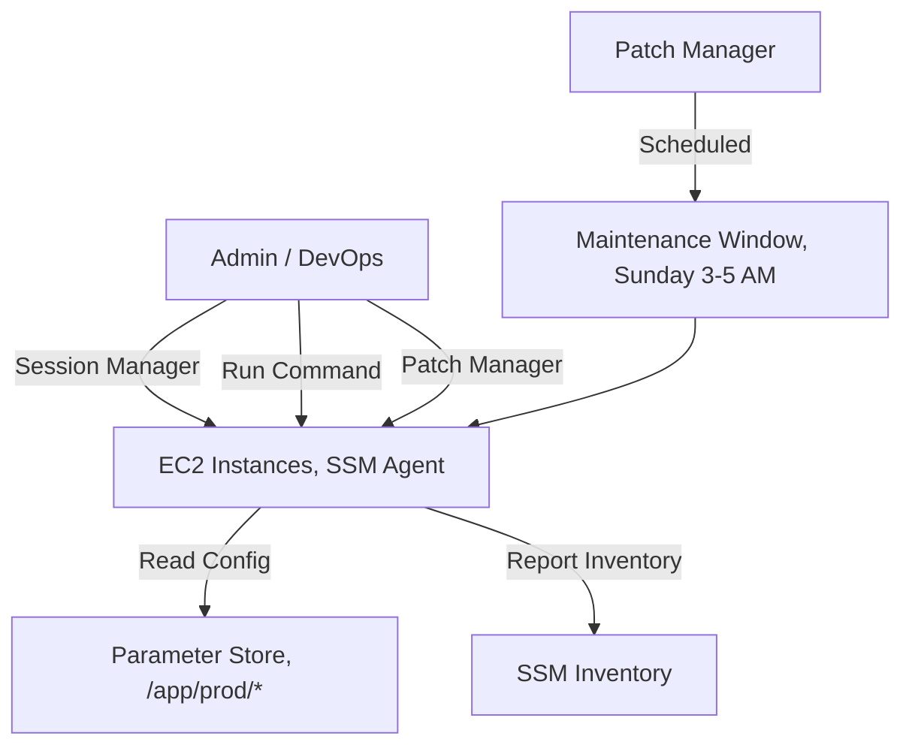

# Chapter 25 — AWS Systems Manager (SSM)

---

## Prerequisite Chapters
- Chapter 01 — AWS IAM (SSM roles, managed instance permissions)
- Chapter 03 — Amazon EC2 (managed instances)
- Chapter 05 — Amazon CloudWatch (SSM + monitoring)

## Used In Production Practicals
- Practical 10 — EC2 Web Server (Session Manager access)
- Practical 12 — Auto Scaling (Run Command fleet management)
- Practical 15 — Flagship Production Architecture
- Practical 34 — CloudWatch Monitoring (Parameter Store config)

---

## 1. Learning Objectives

By the end of this chapter, you will be able to:

1. **Explain** SSM components — Session Manager, Parameter Store, Patch Manager, Run Command, Automation.
2. **Use** Session Manager to access EC2 instances without SSH.
3. **Store** configuration and secrets in Parameter Store.
4. **Automate** patching with Patch Manager.
5. **Run** commands across a fleet of instances with Run Command.
6. **Create** automation runbooks for operational tasks.
7. **Troubleshoot** SSM agent connectivity and permission issues.
8. **Answer** interview questions about operations management.

---

## 2. What is AWS Systems Manager?

SSM is a **unified management service** for your AWS infrastructure. It provides operational tools for viewing data, automating tasks, and managing EC2 instances and on-premises servers — all without SSH.

### Key Characteristics
- **No SSH needed** — Session Manager provides secure shell access via IAM
- **Fleet management** — run commands across hundreds of instances
- **Automated patching** — schedule OS security patches
- **Configuration store** — Parameter Store for config and secrets
- **Automation** — runbooks for complex multi-step operations
- **Inventory** — track software and configurations

---

## 3. Why Do We Need It?

### Without SSM
```
Access: SSH with key pairs → manage keys, open port 22, bastion hosts
Patching: SSH into each server → apt update → manual, error-prone
Config: Store in files, environment variables, or application code
Commands: SSH into each server individually → doesn't scale
```

### With SSM
```
Access: Session Manager → IAM-controlled, auditable, no port 22
Patching: Patch Manager → scheduled, automated, compliance reports
Config: Parameter Store → centralized, versioned, encrypted
Commands: Run Command → execute on hundreds of instances at once
```

---

## 4. Core Concepts

### SSM Agent
```
SSM Agent = software installed on EC2 instances that enables SSM features
  - Pre-installed on Amazon Linux 2023, Amazon Linux 2, Ubuntu (AWS AMIs)
  - Must be installed manually on custom AMIs
  - Requires IAM role with AmazonSSMManagedInstanceCore policy
  - Communicates with SSM service via HTTPS (port 443)
```

### Key Components

| Component | Purpose | Use Case |
|-----------|---------|----------|
| **Session Manager** | Shell access via browser/CLI | Replace SSH entirely |
| **Parameter Store** | Key-value config store | Feature flags, DB endpoints, simple secrets |
| **Run Command** | Execute scripts on fleet | Install software, run maintenance |
| **Patch Manager** | Automated OS patching | Monthly security patches |
| **State Manager** | Enforce desired state | Ensure agent running, config applied |
| **Automation** | Multi-step runbooks | AMI creation, instance remediation |
| **Inventory** | Collect instance metadata | Software inventory, compliance |
| **Maintenance Windows** | Schedule operations | Patching during off-hours |

---

## 5. Session Manager (Replace SSH)

```bash
# Connect to instance — no key pair, no port 22 needed
aws ssm start-session --target i-0abc123def456

# Benefits over SSH:
# ✅ No port 22 open in security group
# ✅ No key pair to manage or rotate
# ✅ Full session audit in CloudTrail
# ✅ Session logging to S3/CloudWatch
# ✅ IAM-controlled (who can start sessions)
# ✅ Works without public IP (via NAT/VPC endpoint)
# ✅ No bastion host needed
# ✅ Browser-based access (AWS Console)
```

### Session Manager Logging
```bash
# Log all session activity to S3 and CloudWatch
# Configure in SSM Console → Session Manager → Preferences:
#   S3 bucket: my-session-logs
#   CloudWatch log group: /ssm/sessions
#   Encryption: KMS key

# Now every keystroke is audited!
```

---

## 6. Parameter Store

### Store and Retrieve Configuration
```bash
# String parameter (free)
aws ssm put-parameter \
    --name "/app/prod/db-host" \
    --value "prod-db.abc.rds.amazonaws.com" \
    --type String

# SecureString parameter (encrypted with KMS)
aws ssm put-parameter \
    --name "/app/prod/api-key" \
    --value "sk_live_abc123" \
    --type SecureString \
    --key-id alias/app-config-key

# Retrieve
aws ssm get-parameter --name "/app/prod/db-host" --query 'Parameter.Value' --output text

# Retrieve secret (with decryption)
aws ssm get-parameter --name "/app/prod/api-key" --with-decryption --query 'Parameter.Value'

# Get all params by path (hierarchical)
aws ssm get-parameters-by-path --path "/app/prod/" --recursive --with-decryption
```

### Parameter Store Tiers

| Feature | Standard (Free) | Advanced |
|---------|----------------|---------|
| **Max params** | 10,000 | 100,000 |
| **Max size** | 4 KB | 8 KB |
| **Cost** | Free | $0.05/param/month |
| **Parameter policies** | No | TTL, notification |

### Parameter Store vs Secrets Manager
```
Parameter Store:
  /app/prod/db-host = "prod-db.abc.rds.amazonaws.com"  (String, free)
  /app/prod/feature-flag = "true"                       (String, free)
  /app/prod/api-key = "sk_live_..."                     (SecureString, free)

Secrets Manager:
  prod/db-credentials = {"user":"admin","pass":"..."}   ($0.40/month, rotation)
  prod/stripe-key = "sk_live_..."                       ($0.40/month, rotation)

Rule of thumb:
  Needs rotation? → Secrets Manager
  Just config or rarely-changing secret? → Parameter Store
```

---

## 7. Run Command

```bash
# Execute a command on all production instances
aws ssm send-command \
    --targets '[{"Key":"tag:Environment","Values":["production"]}]' \
    --document-name "AWS-RunShellScript" \
    --parameters '{"commands":["yum update -y","systemctl restart httpd"]}' \
    --comment "Monthly maintenance restart"

# Check command status
aws ssm list-command-invocations --command-id $CMD_ID \
    --query 'CommandInvocations[*].{Instance:InstanceId,Status:Status}'

# Get command output
aws ssm get-command-invocation --command-id $CMD_ID --instance-id i-0abc123
```

---

## 8. Patch Manager

```bash
# Create patch baseline
aws ssm create-patch-baseline \
    --name "prod-linux-security" \
    --operating-system AMAZON_LINUX_2023 \
    --approval-rules '{
        "PatchRules": [{
            "PatchFilterGroup": {
                "PatchFilters": [
                    {"Key": "CLASSIFICATION", "Values": ["Security"]},
                    {"Key": "SEVERITY", "Values": ["Critical", "Important"]}
                ]
            },
            "ApproveAfterDays": 7,
            "ComplianceLevel": "CRITICAL"
        }]
    }'

# Scan for missing patches
aws ssm send-command \
    --document-name "AWS-RunPatchBaseline" \
    --targets '[{"Key":"tag:PatchGroup","Values":["production"]}]' \
    --parameters '{"Operation":["Scan"]}'

# Install patches
aws ssm send-command \
    --document-name "AWS-RunPatchBaseline" \
    --targets '[{"Key":"tag:PatchGroup","Values":["production"]}]' \
    --parameters '{"Operation":["Install"]}'
```

---

## 9. Automation

```bash
# Run automation document (create AMI)
aws ssm start-automation-execution \
    --document-name "AWS-CreateImage" \
    --parameters '{"InstanceId":["i-0abc123"],"NoReboot":["true"]}'

# Custom automation: restart instance and verify
aws ssm create-document \
    --name "RestartAndVerify" \
    --document-type "Automation" \
    --content '{
        "schemaVersion": "0.3",
        "description": "Restart instance and verify health",
        "mainSteps": [
            {"name": "stopInstance", "action": "aws:changeInstanceState", "inputs": {"DesiredState": "stopped", "InstanceIds": ["{{InstanceId}}"]}},
            {"name": "startInstance", "action": "aws:changeInstanceState", "inputs": {"DesiredState": "running", "InstanceIds": ["{{InstanceId}}"]}},
            {"name": "verifyHealth", "action": "aws:waitForAwsResourceProperty", "inputs": {"PropertySelector": "$.InstanceStatuses[0].InstanceStatus.Status", "DesiredValues": ["ok"]}}
        ]
    }'
```

---

## 10. AWS CLI Commands

```bash
# Start SSM session (replace SSH)
aws ssm start-session --target i-1234567890abcdef0

# Send command to multiple instances
aws ssm send-command --document-name "AWS-RunShellScript" \
    --targets "Key=tag:Environment,Values=prod" \
    --parameters commands=["yum update -y"]

# Get parameter
aws ssm get-parameter --name /prod/db/endpoint --with-decryption

# Put parameter
aws ssm put-parameter --name /prod/db/endpoint \
    --value "prod-db.xxx.rds.amazonaws.com" \
    --type SecureString
```

---

## 11. Hands-On Practical

*(Session Manager demo covered in EC2 and VPC practicals)*

---

## 12. Production Architecture

```
Production SSM Setup:
  - Session Manager: replace SSH/RDP for all instances
  - Parameter Store: all config values (endpoints, feature flags)
  - Patch Manager: weekly patching with maintenance windows
  - Run Command: execute commands across fleet
  - Automation: runbooks for common operations
  - State Manager: enforce desired state on instances
```

---

## 13. Security Best Practices

1. **Session Manager over SSH** -- no port 22, all sessions logged
2. **IAM-based access** -- control who can start sessions on which instances
3. **Session logging** -- CloudWatch Logs + S3 for audit
4. **SecureString parameters** -- encrypt sensitive values with KMS
5. **Parameter Store hierarchy** -- /env/app/setting for organization
6. **Patch Manager baselines** -- define approved patches

---

## 14. High Availability

```
SSM Built-in HA:
  - Regional managed service, multi-AZ
  - Agent-based: SSM Agent on each instance
  - No single point of failure
  - Works in private subnets (with VPC endpoints)
```

---

## 15. Scalability

```
Parameter Store:
  - Standard: 10,000 parameters, free, 40 TPS
  - Advanced: 100,000 parameters, $0.05/param/month, higher TPS
  - Use standard tier unless you need more

Run Command:
  - Target thousands of instances simultaneously
  - Use tags or resource groups for targeting
```

---

## 16. Monitoring & Observability

```
Session Manager Logging:
  - CloudWatch Logs: real-time session transcripts
  - S3: session logs for long-term storage
  - CloudTrail: who started sessions, when

Run Command:
  - Command execution status and output in console
  - CloudWatch Events for command completion

Alarms:
  - Patch compliance < 100% -> alert
  - Failed Run Commands -> alert
```

---

## 17. Cost Optimization

```
Pricing:
  - Session Manager: free
  - Run Command: free
  - Parameter Store (Standard): free (10,000 params)
  - Parameter Store (Advanced): $0.05/param/month
  - Patch Manager: free
  - Automation: free for AWS-provided runbooks
```

---

## 18. Disaster Recovery

```
DR:
  - Parameter Store: replicate to DR region via Lambda/IaC
  - Automation runbooks: stored as SSM documents (version controlled)
  - Patch baselines: create same baselines in DR region
  - IaC: define all SSM resources in CloudFormation
```

### Production SSM Architecture


---

## 19. Troubleshooting

### Problem 1: Instance Not Showing in SSM
```
Check:
  1. SSM Agent installed and running?
     sudo systemctl status amazon-ssm-agent
  2. IAM role attached with AmazonSSMManagedInstanceCore?
  3. Instance can reach SSM endpoint?
     - Public subnet: internet access
     - Private subnet: NAT Gateway or SSM VPC endpoints
  4. Instance metadata service (IMDS) accessible?
```

### Problem 2: Session Manager Connection Fails
```
Check:
  1. IAM user/role has ssm:StartSession permission
  2. Instance has SSM Agent running
  3. Network: instance can reach ssm.region.amazonaws.com (port 443)
  4. VPC endpoint or NAT Gateway configured (for private subnets)
```

### Problem 3: Run Command Times Out
```
Check:
  1. Command timeout too short (default 3600 seconds)
  2. Instance responding? (check SSM Agent status)
  3. Command requires sudo but script doesn't use it
  4. Network connectivity issue (can't report back)
```

---

## 20. Common Production Problems

| # | Problem | Root Cause | Prevention |
|---|---------|------------|------------|
| 1 | SSM Agent offline | Instance can't reach SSM endpoint | VPC endpoints or NAT Gateway |
| 2 | Session Manager fails | Missing IAM role/policy | Attach AmazonSSMManagedInstanceCore |
| 3 | Parameter not found | Wrong path or region | Use full path, check region |
| 4 | Patch compliance failure | Instances not in patch group | Tag instances correctly |

---

## 21. Real-World Scenario

### Scenario: Emergency Patching Across 500 Instances

**Event**: Critical CVE announced, need to patch all instances immediately.

**Response**:
1. SSM Patch Manager: create patch baseline with critical patch
2. Run Command: target all instances by tag (Environment=prod)
3. Maintenance window: immediate (override scheduled window)
4. Monitor: patch compliance dashboard shows progress
5. Result: 500 instances patched in 30 minutes, no SSH needed

---

## 22. Interview Questions

### Basic Questions (10)

**Q1: What is AWS Systems Manager?**
A: A management service that provides tools for operations: Session Manager (shell access), Parameter Store (config), Run Command (fleet commands), Patch Manager (automated patching), Automation (runbooks).

**Q2: Why use Session Manager instead of SSH?**
A: No port 22 open, no key pairs, IAM-controlled access, full audit trail (CloudTrail), session logging, works without public IP. More secure and auditable than SSH.

**Q3: What is Parameter Store?**
A: A hierarchical key-value store for configuration and secrets. Types: String (free), SecureString (KMS encrypted, free). Supports hierarchy: /app/prod/db-host.

**Q4: Parameter Store vs Secrets Manager?**
A: Parameter Store: free, no rotation, config + simple secrets. Secrets Manager: $0.40/secret/month, automatic rotation, RDS integration. Use Secrets Manager for passwords that need rotation.

**Q5: What is SSM Agent?**
A: Software running on EC2 that enables SSM features. Pre-installed on Amazon Linux. Communicates with SSM service over HTTPS (443). Requires IAM role with AmazonSSMManagedInstanceCore.

**Q6: What is Run Command?**
A: Execute commands on one or many instances simultaneously. Target by tags, instance IDs, or resource groups. No SSH needed. Results logged.

**Q7: What is Patch Manager?**
A: Automates OS patching. Define baselines (which patches, severity), schedule maintenance windows, scan and install patches, report compliance.

**Q8: How does Session Manager differ from EC2 Instance Connect?**
A: Session Manager: IAM-controlled, auditable, supports all OS, no port needed. Instance Connect: pushes temporary SSH key, requires port 22, Linux only. Session Manager is preferred for production.

**Q9: What is an SSM document?**
A: A JSON or YAML definition of actions to perform. Types: Command (Run Command), Automation (multi-step), Session (Session Manager config). AWS provides pre-built documents.

**Q10: Can SSM manage on-premises servers?**
A: Yes. Install SSM Agent on on-premises servers, register as managed instances. Enables Session Manager, Run Command, Patch Manager for hybrid environments.

### Intermediate Questions (10)

**Q11: How do you use SSM with instances in private subnets that have no internet access?**
A: Create **Interface VPC Endpoints** for `com.amazonaws.<region>.ssm`, `ssmmessages`, and `ec2messages` (plus `kms` if sessions are encrypted, `logs` for CloudWatch logging, and an S3 **Gateway** endpoint for patch baselines and output). Enable Private DNS on the endpoints. Allow HTTPS (443) from the instance security group to the endpoint security group. Then SSM Agent reaches Systems Manager without a NAT Gateway or public IP.

**Q12: What are Maintenance Windows?**
A: Scheduled time ranges (cron/rate expressions, with duration and cutoff) when SSM runs tasks on registered targets: Run Command, Automation, Lambda, or Step Functions. Use them for patching, AMI updates, and backups outside business hours. You can control concurrency (`MaxConcurrency`) and error thresholds (`MaxErrors`) so a bad patch doesn't take down the whole fleet.

**Q13: What is State Manager and what is an association?**
A: State Manager keeps instances in a defined state. An **association** binds an SSM document (e.g., install CloudWatch Agent, enforce config, join domain) to targets on a schedule. If something drifts (e.g., someone uninstalls the agent), the next run fixes it. It is useful for configuration enforcement and bootstrapping new instances that match a tag.

**Q14: What does SSM Inventory collect?**
A: Metadata from managed nodes: installed applications, AWS components, network config, Windows updates, services, files, registry, and custom inventory. Use **Resource Data Sync** to send inventory from all accounts and Regions to one S3 bucket, then query it with Athena or QuickSight, e.g., "which instances run OpenSSL < 3.0?"

**Q15: What are Automation runbooks?**
A: Multi-step workflows (YAML/JSON) that call AWS APIs, run scripts, branch, wait for approval, and run Run Command on instances. Examples: `AWS-RestartEC2Instance`, `AWS-CreateImage`, and custom "patch → test → create golden AMI". They can be triggered manually, by EventBridge, by Config remediation, or by maintenance windows. They support rate control across many targets and accounts.

**Q16: How do you organize Parameter Store parameters?**
A: Use hierarchies like `/<app>/<env>/<component>/<key>` (e.g., `/orders/prod/db/host`). Fetch a whole environment with `GetParametersByPath --recursive`. Restrict IAM by path (`arn:aws:ssm:*:*:parameter/orders/prod/*`). Use tags for ownership, parameter labels and versions for rollback, and **Advanced** tier for values over 4 KB or for parameter policies (expiration and notifications).

**Q17: How do you enable session logging and auditing in Session Manager?**
A: In Session Manager preferences, enable logging of session output to S3 (encrypted) and/or CloudWatch Logs, and require KMS encryption of the session data. CloudTrail logs `StartSession`/`TerminateSession` (who, when, which instance). Use the `SSM-SessionManagerRunShell` document to set the run-as user, idle timeout, and shell profile.

**Q18: How do you restrict who can start sessions on which instances?**
A: Use IAM policies on `ssm:StartSession` with resource ARNs and tag conditions (`ssm:resourceTag/Environment = dev`). Limit the documents users can call (e.g., only `AWS-StartPortForwardingSession`). Allow `ssm:TerminateSession` only for the user's own sessions (`${aws:userid}`). Enable run-as with OS users mapped through the `SSMSessionRunAs` tag.

**Q19: What is port forwarding with Session Manager?**
A: Session Manager can tunnel a local port to a port on the instance (`AWS-StartPortForwardingSession`) or to a remote host through the instance (`AWS-StartPortForwardingSessionToRemoteHost`), e.g., to reach a private RDS database from your laptop. No bastion host, no open inbound ports, and everything is audited.

**Q20: How does SSM integrate with CloudWatch?**
A: Run Command and Session Manager output go to CloudWatch Logs. The CloudWatch Agent config is stored in Parameter Store and deployed through State Manager or Run Command. EventBridge rules react to SSM events (command failed, non-compliant patch status) to send notifications or remediate. Use dashboards and alarms on compliance metrics and OpsCenter OpsItems created by alarms.

### Advanced Questions (10)

**Q21: What is Change Manager?**
A: A change-management framework in SSM. You define change templates with required approvers, then submit change requests that run Automation runbooks after approval. It respects change calendars (freeze periods), works across accounts through Organizations, and keeps a full audit trail. It integrates with ITSM tools such as ServiceNow and Jira.

**Q22: What is OpsCenter?**
A: A central place to view and fix operational issues (OpsItems). CloudWatch alarms, EventBridge rules, Config, and Security Hub can create OpsItems automatically, including related resources, runbooks, and logs. Engineers can run Automation runbooks from the OpsItem to fix it. It cuts mean time to resolution (MTTR) and de-duplicates similar issues.

**Q23: How do you manage a hybrid (on-prem + AWS) fleet?**
A: Create a **hybrid activation** (activation code + ID with an IAM service role), install SSM Agent on on-prem servers or VMs, and register them. They show up as `mi-xxxxxxxx` managed nodes. You can then use Session Manager, Run Command, Patch Manager, Inventory, and State Manager the same way as on EC2. Use the advanced-instances tier for Session Manager on many on-prem nodes.

**Q24: How do you achieve fleet-wide patch compliance across multiple accounts?**
A: Use **Quick Setup** or Patch Policies with AWS Organizations to deploy patch baselines and schedules to all accounts and Regions. Use custom baselines per OS with auto-approval delays (e.g., critical patches after 7 days). Patch dev first, then prod, with maintenance windows. Aggregate compliance via Resource Data Sync and Security Hub, and alert on non-compliant nodes.

**Q25: What is Distributor?**
A: An SSM feature to package and publish software (agents, tools) as versioned packages, then install or uninstall them across the fleet through Run Command or State Manager. AWS publishes packages such as the CloudWatch Agent and security agents. It is good for standardizing third-party agent rollout.

**Q26: What is Fleet Manager?**
A: A console UI to manage nodes remotely: file system browser, performance counters, logs, users/groups, Windows registry, and RDP (Remote Desktop) to Windows instances through Session Manager without opening port 3389. It removes the need for jump boxes.

**Q27: How do you use Parameter Store in Lambda and ECS without slowing every request?**
A: For Lambda, use the **AWS Parameters and Secrets Lambda Extension**, which caches values locally with a TTL, or fetch once during init outside the handler. For ECS, reference parameters in the task definition `secrets` field (`valueFrom: arn:aws:ssm:...`). They are injected as environment variables at container start. Watch the Parameter Store throughput limits (raise with higher throughput settings).

**Q28: What is AppConfig and how does it relate to Parameter Store?**
A: AWS AppConfig (a Systems Manager capability) handles dynamic configuration and feature flags with **controlled deployments**: validators (JSON schema/Lambda), gradual rollout strategies, and automatic rollback on CloudWatch alarms. Parameter Store is a simple key-value store with no deployment safety. Use AppConfig for runtime flags you change often in production.

**Q29: What IAM permissions does an instance need to be managed by SSM?**
A: An instance profile with `AmazonSSMManagedInstanceCore` (core agent communication). Add `CloudWatchAgentServerPolicy` for the CloudWatch agent, S3 and KMS permissions for session logs and encryption, and `ssm:GetParameter*` only on required paths. Alternatively, enable **Default Host Management Configuration** so EC2 instances are managed without attaching a profile.

**Q30: How do you troubleshoot an instance that doesn't appear in Fleet Manager?**
A: Check: 1) SSM Agent installed and running (`systemctl status amazon-ssm-agent`). 2) The instance profile has `AmazonSSMManagedInstanceCore` (or DHMC is enabled). 3) Network path to SSM endpoints (NAT or VPC endpoints, SG/NACL on 443, DNS resolution). 4) Correct Region. 5) Agent logs at `/var/log/amazon/ssm/amazon-ssm-agent.log`. 6) Run the `AWSSupport-TroubleshootManagedInstance` automation runbook.

### Scenario-Based Questions (10)

**Q31: Your security team wants to close port 22 on all EC2 instances. How do you do it?**
A: Roll out SSM Agent and the `AmazonSSMManagedInstanceCore` role (or DHMC) to all instances. Add VPC endpoints for private subnets. Enable Session Manager logging to S3 and CloudWatch with KMS. Train engineers on `aws ssm start-session` and port forwarding. Then remove port 22 rules from security groups and use AWS Config rules (`restricted-ssh`) with auto-remediation to keep them closed.

**Q32: A critical CVE needs patching across 2,000 instances tonight. What is your approach?**
A: Use Patch Manager with a custom baseline that approves the CVE patch. Run `AWS-RunPatchBaseline` through a maintenance window or Run Command targeting by tags. Use rate control: start with a canary of 5%, `MaxConcurrency=10%`, and `MaxErrors=2%`. Use ASG instance refresh or a new golden AMI for immutable fleets. Track progress in Patch compliance and Inventory, and report to stakeholders.

**Q33: An application keeps failing because someone manually changes a config file on servers. How do you prevent it?**
A: Store the desired configuration in an SSM document or S3, and create a State Manager association that re-applies it every 30 minutes. Remove direct SSH and use Session Manager with restricted run-as users. Use Change Manager for approved changes. Alert on drift through association compliance status in EventBridge.

**Q34: You need to rotate a config value used by 50 microservices without redeploying them. What do you do?**
A: Put the value in Parameter Store (or AppConfig for safe rollout). Services read it at runtime with caching (TTL of a few minutes) through the SDK or Lambda extension. Update the parameter and services pick it up on the next refresh. For instant propagation, use EventBridge on the `Parameter Store Change` event to trigger cache refresh. For risky changes, use AppConfig with gradual deployment and alarm-based rollback.

**Q35: A developer needs temporary access to a production database in a private subnet. How do you grant it securely?**
A: Use Session Manager port forwarding to a remote host through an SSM-managed instance (or ECS task). Grant time-bound IAM permissions through IAM Identity Center with a permission set allowing `ssm:StartSession` only with the `AWS-StartPortForwardingSessionToRemoteHost` document on that target. Use database credentials from Secrets Manager. Everything is logged and no inbound port is opened.

**Q36: Your patching window keeps running over and causing outages. How do you improve it?**
A: Split the fleet into patch groups (by tag) and stagger windows. Use rate control and `MaxErrors` to stop early. Use pre- and post-patch hooks (Automation) to take instances out of the load balancer, patch, run health checks, and add them back. Move to immutable infrastructure: build a patched golden AMI with EC2 Image Builder and roll it out with ASG instance refresh.

**Q37: How would you automatically remediate a non-compliant resource found by AWS Config?**
A: Attach an SSM Automation runbook as the Config rule's remediation action (e.g., `AWS-DisablePublicAccessForSecurityGroup`, `AWS-EnableS3BucketEncryption`). Set automatic remediation with a retry limit and give it an assume role with least privilege. Track results in Config and OpsCenter.

**Q38: Run Command shows "Undeliverable" or "Pending" for some instances. What do you check?**
A: The instance is offline or not connected: agent stopped, outdated agent, wrong IAM role, missing endpoints/NAT, DNS issues, or the instance is stopped. Check the ping status in Fleet Manager, then update the agent (`AWS-UpdateSSMAgent`). Run `AWSSupport-TroubleshootManagedInstance`. Make sure targets match the right tags and that the command's timeout is long enough.

**Q39: How do you build a golden AMI pipeline using SSM?**
A: Automation runbook (or EC2 Image Builder): launch from the latest base AMI (read from the public SSM parameter `/aws/service/ami-amazon-linux-latest/...`), run patching and hardening (CIS) with Run Command, install agents, run Inspector scans, create the AMI, store its ID in Parameter Store (`/golden-ami/latest`), share it with accounts, and terminate the build instance. Schedule it monthly. Launch templates reference the parameter.

**Q40: What are SSM operational best practices for production?**
A: Use Session Manager only (no SSH) with logging and KMS. Use VPC endpoints for private subnets. Organize Parameter Store by hierarchy with path-based IAM. Use patch baselines with staged maintenance windows and rate control. Enforce configuration with State Manager. Centralize Inventory and compliance with Resource Data Sync. Use Automation and Change Manager for repeatable, approved changes. Use OpsCenter for incidents. Set up Quick Setup across the Organization.

---

## 23. Scenario-Based Interview Questions

*(Covered in section 22 above)*

---

## 24. Common Mistakes

1. **Using SSH when Session Manager is available** — less secure, less auditable
2. **Not installing SSM Agent on custom AMIs** — only pre-installed on AWS AMIs
3. **Missing IAM role** — AmazonSSMManagedInstanceCore required
4. **No VPC endpoint in private subnet** — instance can't reach SSM service
5. **Using Parameter Store for rotating secrets** — use Secrets Manager instead
6. **Not setting up session logging** — lose audit trail
7. **Running Patch Manager without testing** — test in staging first

---

## 25. Production Checklist

- [ ] SSM Agent running on all instances
- [ ] IAM Instance Profile with AmazonSSMManagedInstanceCore
- [ ] Session Manager configured with logging (S3 + CloudWatch)
- [ ] SSH port 22 removed from security groups
- [ ] Parameter Store used for application config
- [ ] Patch Manager configured with maintenance windows
- [ ] Run Command used for fleet operations
- [ ] VPC endpoints for SSM (private subnets)
- [ ] Automation runbooks for common tasks (AMI creation, restart)

---

## 26. Chapter Summary

1. **Session Manager replaces SSH** — more secure, auditable, no port 22
2. **Parameter Store for configuration** — free, hierarchical, KMS encryption
3. **Secrets Manager for rotating passwords** — don't use Parameter Store for these
4. **Run Command for fleet management** — execute scripts on tagged instances
5. **Patch Manager for compliance** — automated security patching
6. **SSM Agent is the foundation** — must be installed and have IAM role
7. **VPC endpoints for private subnets** — SSM needs network access
8. **Automation for runbooks** — AMI creation, remediation, multi-step operations

---
---

# 🔬 Practical Lab 12 — EC2 + SSM (Session Manager)

## Lab Overview
| Item | Detail |
|------|--------|
| **Difficulty** | Beginner |
| **Duration** | 20 minutes |
| **Cost** | Free tier |
| **Prerequisites** | Practical 11 (EC2 with IAM role) |
| **Lab Environment** | Environment 3 — Compute |

## Business Scenario
> Your security team mandates: "No SSH keys, no port 22." You need to demonstrate that Session Manager provides secure, auditable access to EC2 instances without SSH.

### Step 1 — Verify SSM Agent
1. EC2 instance must have `AmazonSSMManagedInstanceCore` policy on its IAM role
2. **Systems Manager** → **Fleet Manager** → Verify instance appears

📸 **Screenshot 01** — Instance in Fleet Manager
> **What you should see**: Instance listed as "Online" in Fleet Manager
> **Verify**: SSM Agent status shows "Online"

### Step 2 — Start Session
1. **Session Manager** → **Start session** → Select instance → **Start session**

📸 **Screenshot 02** — Session Manager Terminal
> **What you should see**: Browser-based terminal connected to instance
> **Verify**: No SSH key or port 22 needed

```bash
# Run commands as ssm-user
whoami          # ssm-user
sudo su -       # switch to root
hostname -I     # shows private IP
aws sts get-caller-identity  # shows IAM role
```

📸 **Screenshot 03** — Commands Running via SSM

### Step 3 — View Session Logs in CloudTrail
1. **CloudTrail** → Filter: Event name = `StartSession`

📸 **Screenshot 04** — Session Audit in CloudTrail
> **What you should see**: StartSession event with user identity and instance ID
> **Verify**: Full audit trail without SSH

🎯 **Interview Insight**: "How do you access EC2 without SSH?"
> **Strong answer**: "SSM Session Manager. No port 22, no SSH keys, full CloudTrail audit. Can log session output to S3/CloudWatch. Supports Run Command for fleet-wide operations. Uses IAM for access control instead of SSH key management."
