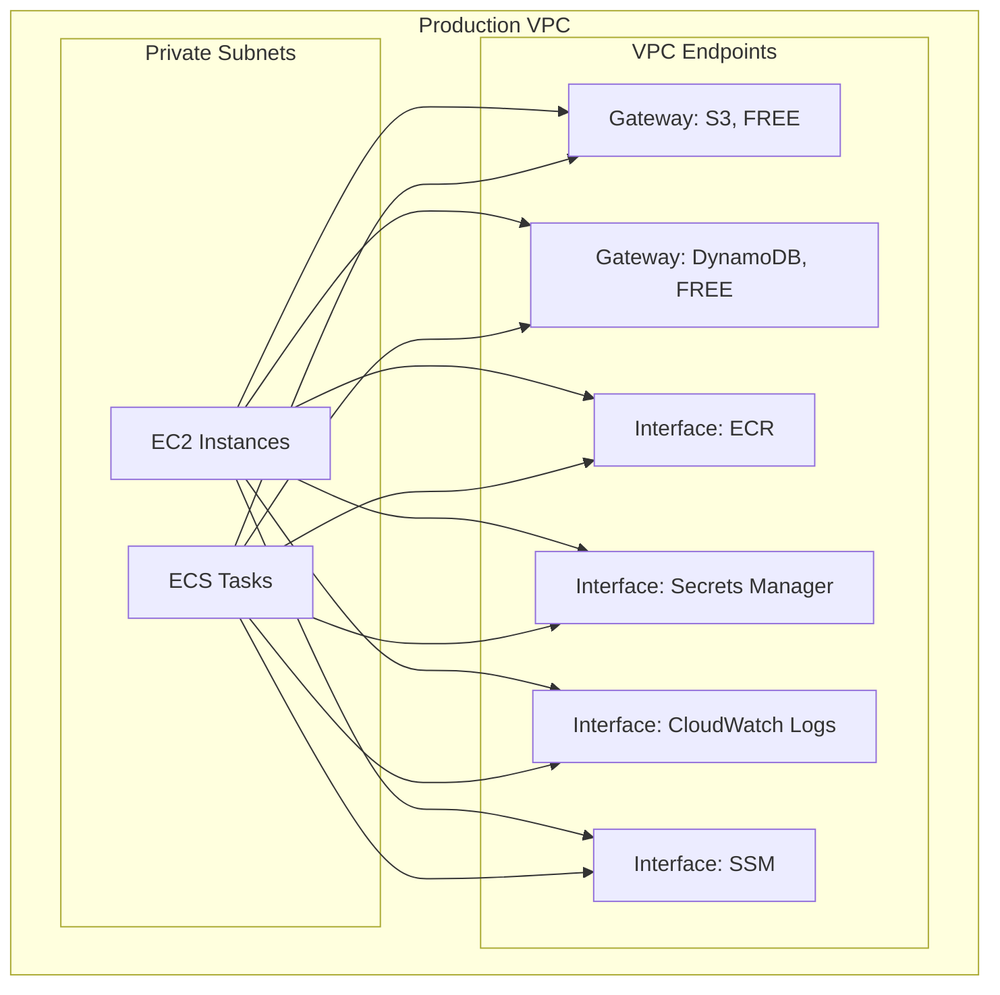
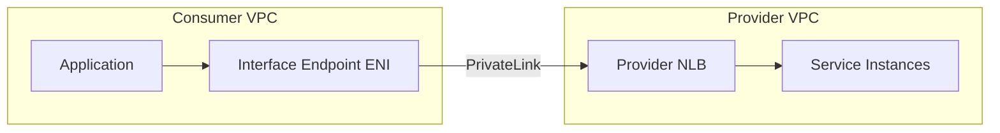

# Chapter 32 — AWS PrivateLink

---

## Prerequisite Chapters
- Chapter 04 — Amazon VPC (VPC endpoints, networking)
- Chapter 01 — AWS IAM (endpoint policies)

## Used In Production Practicals
- Practical 08 — Private Connectivity
- Practical 15 — Flagship Production Architecture
- Practical 06 — Production VPC

---

## 1. Learning Objectives

By the end of this chapter, you will be able to:

1. **Explain** PrivateLink, Interface Endpoints, Gateway Endpoints, and when to use each.
2. **Create** VPC Endpoints for AWS services (S3, SQS, ECR, Secrets Manager).
3. **Expose** your own services via PrivateLink (Endpoint Service).
4. **Configure** endpoint policies and security groups.
5. **Compare** PrivateLink vs VPC Peering vs Transit Gateway.
6. **Troubleshoot** DNS resolution, connectivity, and access issues.
7. **Answer** interview questions about private connectivity.

---

## 2. What is AWS PrivateLink?

PrivateLink provides **private connectivity** between VPCs, AWS services, and on-premises networks without exposing traffic to the public internet. Traffic stays on the AWS network backbone.

### The Problem PrivateLink Solves
```
Without PrivateLink:
  EC2 (private subnet) → NAT Gateway → IGW → Internet → S3/SQS
  
  Problems:
  - Traffic traverses the public internet
  - NAT Gateway cost: $0.045/GB processed
  - NAT Gateway is a bottleneck (45 Gbps limit)
  - Security: data exposed to internet threats

With PrivateLink (VPC Endpoint):
  EC2 (private subnet) → VPC Endpoint → S3/SQS (private network)
  
  Benefits:
  - Traffic stays on AWS private network
  - No NAT Gateway needed for AWS services
  - Lower cost for high-volume services
  - More secure (no internet exposure)
```

---

## 3. Core Concepts

### Two Types of VPC Endpoints

| Type | Endpoint Type | How It Works | Cost | Services |
|------|-------------|-------------|------|----------|
| **Gateway Endpoint** | Route table entry | Route table directs traffic to endpoint | **FREE** | S3, DynamoDB |
| **Interface Endpoint** | ENI in subnet | Creates ENI with private IP | $0.01/AZ/hr + $0.01/GB | SQS, SNS, ECR, KMS, SM, CloudWatch, etc. |

### Gateway Endpoints (S3, DynamoDB) — FREE
```
How: Add a prefix list to the route table
  Route table → destination: pl-12345 (S3 prefix list) → target: vpce-abc
  
No ENI, no IP address, no security group
Just a route table entry → traffic goes directly to S3/DynamoDB

Configure:
  aws ec2 create-vpc-endpoint \
    --vpc-id $VPC_ID \
    --vpc-endpoint-type Gateway \
    --service-name com.amazonaws.ap-south-1.s3 \
    --route-table-ids $PRIV_RT_A $PRIV_RT_B
```

### Interface Endpoints (Everything Else)
```
How: Creates an ENI in your subnet with a private IP
  EC2 → ENI (10.0.1.100) → AWS service (private network)

Features:
  - Security group on the ENI (control who can use it)
  - Private DNS (use same service URL, no code changes)
  - Multiple AZs for HA (one ENI per AZ)

Configure:
  aws ec2 create-vpc-endpoint \
    --vpc-id $VPC_ID \
    --vpc-endpoint-type Interface \
    --service-name com.amazonaws.ap-south-1.sqs \
    --subnet-ids $PRIV_SUBNET_A $PRIV_SUBNET_B \
    --security-group-ids $ENDPOINT_SG \
    --private-dns-enabled
```

### Common Interface Endpoints (Production)

| Service | Endpoint | Why You Need It |
|---------|----------|----------------|
| ECR (API + DKR) | `ecr.api`, `ecr.dkr` | Pull images in private subnet |
| CloudWatch Logs | `logs` | Push logs without NAT |
| Secrets Manager | `secretsmanager` | Retrieve secrets privately |
| KMS | `kms` | Decrypt without NAT |
| SQS | `sqs` | Queue operations privately |
| SSM | `ssm`, `ssmmessages`, `ec2messages` | Session Manager in private subnet |
| STS | `sts` | AssumeRole without NAT |
| S3 | Gateway (free) | S3 access without NAT |

### Endpoint Service (Your Own PrivateLink)
```
Expose your service to other VPCs/accounts via PrivateLink:

Your VPC:
  Your Application → NLB → Endpoint Service

Consumer VPC:
  Consumer → Interface Endpoint → Your Endpoint Service → NLB → Your App

Benefits:
  - Consumer doesn't need VPC peering
  - CIDR overlap is fine
  - One-way access (consumer → provider)
  - No internet exposure
```

### PrivateLink vs VPC Peering vs Transit Gateway

| Feature | PrivateLink | VPC Peering | Transit Gateway |
|---------|-------------|-------------|----------------|
| **Direction** | One-way (consumer→provider) | Bidirectional | Bidirectional |
| **CIDR overlap** | ✅ Allowed | ❌ Not allowed | ❌ Not allowed |
| **Transitive routing** | No | No | ✅ Yes |
| **Scale** | Thousands of consumers | Limited pairs | Thousands of VPCs |
| **Use case** | Service access | VPC-to-VPC | Hub-and-spoke |
| **Bandwidth** | NLB limits | 128 Gbps | 50 Gbps |

---

## 4. Architecture

### Production VPC with Endpoints



---

## 5. Core Concepts

```
VPC Endpoint (Interface): ENI in your VPC for AWS service or partner service
VPC Endpoint Service: your service exposed via NLB to other VPCs
PrivateLink: the underlying technology (private connectivity)
Endpoint Policy: IAM policy controlling access through the endpoint
Private DNS: resolve public service DNS to private endpoint IP
```

---

## 6. Architecture



---

## 7. Important Components

```
Interface Endpoints (for AWS services):
  - Creates ENIs in your subnets
  - Private DNS resolves service hostname to private IP
  - Charged: $0.01/hour + $0.01/GB

Gateway Endpoints (S3, DynamoDB only):
  - Route table entry, no ENI
  - Free!
  - Add via route table association

Endpoint Services (your own services):
  - Backed by NLB
  - Consumers create interface endpoints to connect
  - Approval workflow: manual or automatic
```

---

## 8. How It Works

```
Connection Flow:
  1. Provider creates NLB + Endpoint Service
  2. Consumer creates Interface Endpoint in their VPC
  3. PrivateLink creates cross-VPC connection (no peering needed)
  4. Traffic flows privately through AWS network
  5. No internet, no NAT, no IGW required
```

---

## 9. AWS Console Walkthrough

### Create VPC Endpoint for S3
1. **VPC Console** -> **Endpoints** -> **Create endpoint**
2. **Service**: com.amazonaws.REGION.s3
3. **Type**: Gateway
4. **VPC**: select your VPC
5. **Route tables**: select private subnet route tables

---

## 10. AWS CLI Commands

```bash
# Gateway endpoint (S3 - free)
aws ec2 create-vpc-endpoint \
    --vpc-id $VPC_ID \
    --service-name com.amazonaws.REGION.s3 \
    --route-table-ids $PRIV_RT

# Interface endpoint (SQS)
aws ec2 create-vpc-endpoint \
    --vpc-id $VPC_ID \
    --service-name com.amazonaws.REGION.sqs \
    --vpc-endpoint-type Interface \
    --subnet-ids $PRIV_SUB_A $PRIV_SUB_B \
    --security-group-ids $EP_SG \
    --private-dns-enabled
```

### Endpoint Policy (Restrict Access)
```json
{
    "Statement": [{
        "Effect": "Allow",
        "Principal": "*",
        "Action": "s3:GetObject",
        "Resource": "arn:aws:s3:::my-app-bucket/*"
    }]
}
// S3 endpoint only allows GetObject on specific bucket
```

### Security Group for Interface Endpoint
```bash
# Create SG allowing HTTPS from VPC CIDR
aws ec2 create-security-group \
    --group-name endpoint-sg \
    --description "Allow HTTPS to VPC endpoints" \
    --vpc-id $VPC_ID

aws ec2 authorize-security-group-ingress \
    --group-id $ENDPOINT_SG \
    --protocol tcp --port 443 --cidr 10.0.0.0/16
```

### Private DNS
```
With private DNS enabled:
  sqs.ap-south-1.amazonaws.com → resolves to private IP (10.0.1.100)
  
Your application code doesn't change!
  boto3.client('sqs')  → automatically uses private endpoint
  aws sqs send-message → goes through VPC endpoint

Without private DNS:
  Must use endpoint-specific URL: vpce-abc.sqs.ap-south-1.vpce.amazonaws.com
```

---

## 11. Hands-On Practical

*(Covered in VPC practical — creating S3 Gateway endpoint)*

---

## 12. Production Architecture

```
Production PrivateLink Setup:
  - S3 Gateway endpoint (mandatory, free)
  - DynamoDB Gateway endpoint (mandatory, free)
  - Interface endpoints for: ECR, CloudWatch Logs, KMS, SQS, SNS, Secrets Manager
  - Endpoint policies: restrict to specific buckets/resources
  - Deploy interface endpoints in multiple AZs for HA
```

---

## 13. Security Best Practices

1. **Endpoint policies** -- restrict access to specific resources (e.g., only your S3 buckets)
2. **Security groups** -- control who can access interface endpoints
3. **Private DNS** -- no code changes needed (service DNS resolves privately)
4. **No internet path** -- traffic stays on AWS private network
5. **VPC endpoint for Secrets Manager** -- secrets never traverse internet

---

## 14. High Availability

```
HA:
  - Gateway endpoints: regional, multi-AZ automatically
  - Interface endpoints: deploy ENIs in multiple AZs
  - AWS-managed, no maintenance required
```

---

## 15. Scalability

```
Limits:
  - 50 Gateway endpoints per VPC
  - 50 Interface endpoints per VPC (can increase)
  - Bandwidth: 10 Gbps per AZ for interface endpoints
```

---

## 16. Monitoring & Observability

```
CloudWatch:
  - VPC Flow Logs capture endpoint traffic
  - CloudTrail logs endpoint creation/modification

Monitoring:
  - Track data processed through endpoints
  - Alert on endpoint policy denials
```

---

## 17. Cost Optimization

```
Gateway Endpoints: FREE (always create S3 + DynamoDB)
Interface Endpoints: $0.01/hour (~$7.20/month) + $0.01/GB
  - Only create for frequently used services
  - Cost justified when NAT Gateway data processing > endpoint cost
  - S3 via NAT = $0.045/GB vs S3 Gateway = $0/GB
```

---

## 18. Disaster Recovery

```
DR:
  - Endpoints are regional -- recreate in DR region via IaC
  - Gateway endpoints: add to CloudFormation template
  - Interface endpoints: deploy in DR VPC
```

### Cost Analysis: NAT Gateway vs VPC Endpoints
```
Scenario: 100 GB/month of S3 traffic from private subnet

NAT Gateway:
  Hourly:    $0.045/hr × 720 = $32.40
  Data:      $0.045/GB × 100 = $4.50
  Total:     $36.90/month

S3 Gateway Endpoint:
  Total:     $0.00/month (FREE)

Savings:    $36.90/month = $442.80/year

Interface Endpoint (SQS, 2 AZs):
  Hourly:    $0.01/AZ/hr × 2 × 720 = $14.40
  Data:      $0.01/GB × 100 = $1.00
  Total:     $15.40/month

NAT for same SQS traffic:
  Total:     $36.90/month

Savings:    $21.50/month
```

---

## 19. Troubleshooting

### Problem 1: Interface Endpoint Not Resolving
```
Check:
  1. Private DNS enabled? (--private-dns-enabled)
  2. VPC DNS resolution enabled? (enableDnsHostnames, enableDnsSupport)
  3. Security group allows inbound HTTPS (443)?
  4. Endpoint in same AZ as the instance?
```

### Problem 2: Gateway Endpoint Not Working
```
Check:
  1. Route table associated with the subnet?
  2. Endpoint policy allows the action?
  3. S3 bucket policy allows the VPC endpoint?
  4. Correct prefix list in route table?
```

### Problem 3: Cross-Account Endpoint Service Connection Pending
```
Check:
  1. Endpoint service requires acceptance? (acceptance-required)
  2. Service owner accepted the connection?
  3. Service NLB healthy?
```

---

## 20. Common Production Problems

| # | Problem | Root Cause | Prevention |
|---|---------|------------|------------|
| 1 | High NAT costs for S3 | No S3 Gateway endpoint | Always create S3 + DynamoDB endpoints |
| 2 | Endpoint DNS not resolving | Private DNS not enabled | Enable private DNS on interface endpoint |
| 3 | Access denied through endpoint | Endpoint policy too restrictive | Check endpoint policy + IAM policy |

---

## 21. Real-World Scenario

### Scenario: NAT Gateway Cost Reduction with PrivateLink

**Event**: NAT Gateway bill is $800/month.

**Fix**:
1. Created S3 Gateway endpoint (free) -- 60% of NAT traffic was S3
2. Created ECR Interface endpoint -- container image pulls
3. Created CloudWatch Logs endpoint -- log shipping
4. Result: NAT costs dropped to $120/month

---

## 22. Interview Questions

### Basic Questions (10)

**Q1: What is AWS PrivateLink?**
A: PrivateLink provides private connectivity between VPCs and AWS services without internet exposure. Traffic stays on the AWS network. Implemented via VPC Endpoints.

**Q2: Gateway Endpoint vs Interface Endpoint?**
A: Gateway: route table-based, FREE, only S3 and DynamoDB. Interface: ENI-based, has cost ($0.01/AZ/hr), supports 100+ services, has security group.

**Q3: Why is Gateway Endpoint free for S3?**
A: AWS wants to encourage private S3 access. It's implemented as a route table entry with no infrastructure cost. Saves NAT Gateway costs.

**Q4: How does private DNS work with Interface Endpoints?**
A: When enabled, the service's public DNS name resolves to the endpoint's private IP. Your application code needs no changes — same boto3/CLI calls work.

**Q5: What is an Endpoint Service?**
A: Your own PrivateLink-powered service. Put your app behind an NLB, create an Endpoint Service. Other VPCs connect via Interface Endpoints. CIDR overlap OK.

**Q6: What are endpoint policies?**
A: IAM resource policies attached to VPC endpoints that control which API calls can pass through the endpoint. Example: restrict an S3 Gateway endpoint to only allow access to specific buckets. Without a policy, the endpoint allows all actions. Use for: restricting data exfiltration, limiting S3 access to approved buckets, and enforcing least-privilege on network access.

**Q7: How do security groups work with Interface Endpoints?**
A: Each Interface Endpoint has an ENI in your subnet with an associated security group. The SG controls inbound traffic to the endpoint. Allow inbound HTTPS (443) from the CIDR ranges or security groups that need to access the AWS service. Default SG allows all — always tighten it in production.

**Q8: How do multi-AZ endpoints provide high availability?**
A: Create the Interface Endpoint in multiple subnets across different AZs. Each AZ gets its own ENI. If one AZ fails, traffic routes to endpoints in other AZs. For Gateway Endpoints (S3, DynamoDB), HA is automatic — the route table entry works across AZs. Always deploy Interface Endpoints in at least 2 AZs for production.

**Q9: What VPC DNS requirements exist for PrivateLink?**
A: Enable **DNS resolution** and **DNS hostnames** in the VPC settings. When private DNS is enabled on the endpoint, the service's public DNS name (e.g., `ec2.us-east-1.amazonaws.com`) resolves to the endpoint's private IPs via Route 53 Resolver. Without these settings, private DNS won't work and you must use endpoint-specific DNS names.

**Q10: How does endpoint routing work?**
A: **Gateway Endpoints**: a route is added to the route table (`pl-xxxx` prefix list → vpce-xxxx). Traffic matching S3/DynamoDB prefixes is routed to the endpoint. **Interface Endpoints**: DNS-based routing — the service DNS name resolves to the endpoint's private IP, so traffic naturally flows to the ENI. No route table changes needed for Interface Endpoints.

### Intermediate-Advanced Questions (30)

**Q11: When would you use PrivateLink vs VPC Peering?**
A: PrivateLink: one-way service access, CIDR overlap OK, many consumers. VPC Peering: bidirectional, full network access, must have non-overlapping CIDRs.

**Q12: How do you secure a VPC Endpoint?**
A: 1) Endpoint policy (restrict actions/resources). 2) Security group (restrict source IPs/CIDRs). 3) S3 bucket policy with VPC endpoint condition.

**Q13: How do cross-account endpoint services work?**
A: Account A creates an NLB + Endpoint Service and adds Account B's ID to the allowed principals list. Account B creates an Interface Endpoint pointing to Account A's service name. If not in the same Organization, Account B receives a connection request that Account A must accept. Traffic flows privately without VPC peering.

**Q14: How do endpoint costs compare to NAT Gateway costs?**
A: NAT Gateway: $0.045/hour + $0.045/GB processed. Interface Endpoint: $0.01/hour per AZ + $0.01/GB processed. For services with high data transfer (e.g., S3 image pulls), Gateway Endpoints are free. For most services, PrivateLink is cheaper than NAT — especially in multi-AZ setups. Break-even: ~4.5 GB/hour per endpoint.

**Q15: How do you handle high-bandwidth scenarios with PrivateLink?**
A: Each Interface Endpoint ENI supports up to 10 Gbps per AZ (bursting higher). For higher throughput, the endpoint automatically scales. For Gateway Endpoints, there's no bandwidth limit. For Endpoint Services (your own NLB), scale the NLB target group. Use multiple AZs to distribute load. Monitor with CloudWatch `BytesProcessed` metric.

**Q16: How do you make endpoints highly available?**
A: 1) Deploy Interface Endpoints in at least 2 AZs (3 for critical services). 2) For your own Endpoint Service, use NLB with targets in multiple AZs and enable cross-zone load balancing. 3) Gateway Endpoints are HA by default. 4) Monitor endpoint state with CloudWatch. 5) If an AZ fails, DNS automatically routes to healthy AZ endpoints.

**Q17: How does DNS failover work with PrivateLink?**
A: When private DNS is enabled, the endpoint's DNS is managed by Route 53. If an endpoint ENI becomes unhealthy, DNS stops resolving to that AZ's IP. For custom Endpoint Services, configure health checks on the NLB targets. If all targets in an AZ fail, traffic shifts to healthy AZs automatically.

**Q18: How do you connect on-premises to AWS services via PrivateLink?**
A: 1) Establish Direct Connect or VPN to the VPC. 2) Create Interface Endpoints in the VPC. 3) On-premises DNS forwards AWS service queries to Route 53 Resolver inbound endpoints. 4) On-premises applications resolve AWS service DNS to private IPs. Traffic flows: on-prem → DX/VPN → VPC → PrivateLink endpoint → AWS service. Never touches the internet.

**Q19: How does Transit Gateway work with PrivateLink?**
A: Create Interface Endpoints in a shared-services VPC. Spoke VPCs connect via Transit Gateway. Route 53 Private Hosted Zones (associated with all spoke VPCs) resolve service DNS to the shared endpoint IPs. All spokes access AWS services through centralized endpoints. Reduces endpoint costs (one set of endpoints instead of per-VPC).

**Q20: How do you troubleshoot PrivateLink connectivity issues?**
A: 1) DNS: verify the service DNS resolves to private IPs (`nslookup`). 2) Security groups: endpoint SG allows inbound 443. 3) NACLs: allow ephemeral ports and 443. 4) Endpoint state: check it's `available` (not `pendingAcceptance`). 5) Endpoint policy: not too restrictive. 6) Private DNS enabled if using default service URLs. 7) VPC Flow Logs for traffic analysis.

### Advanced Questions (10)

**Q21: Design a centralized PrivateLink architecture for a 20-account Organization.**
A: Central networking account with a shared-services VPC. Create all Interface Endpoints here (ECR, S3, Secrets Manager, STS, CloudWatch). Transit Gateway connects all spoke VPCs. Route 53 Private Hosted Zones shared across accounts resolve service DNS to centralized endpoints. This reduces costs (5 accounts × 10 endpoints = 50 endpoints → just 10). Use endpoint policies to restrict per-account access.

**Q22: When should you use PrivateLink vs VPC Peering vs Transit Gateway?**
A: **PrivateLink**: one-way service access, CIDR overlap OK, scalable to many consumers, service-oriented. **VPC Peering**: bidirectional full-network access, non-overlapping CIDRs, simple 1:1 connections. **Transit Gateway**: hub-and-spoke, many VPCs, transitive routing, centralized control. Use PrivateLink for service access, Peering for tight integration between 2 VPCs, Transit Gateway for large-scale networking.

**Q23: How do you expose a microservice as a PrivateLink Endpoint Service?**
A: 1) Deploy your service behind an NLB (not ALB — PrivateLink requires NLB or GWLB). 2) Create an Endpoint Service pointing to the NLB. 3) Optionally require acceptance for connection requests. 4) Add allowed principals (AWS accounts or Organizations). 5) Consumers create Interface Endpoints to your service name. Traffic is private, encrypted, and CIDR overlap is OK.

**Q24: How do you handle PrivateLink for SaaS multi-tenant architectures?**
A: Each tenant's VPC creates an Interface Endpoint to your Endpoint Service. Your NLB routes to a shared backend. Use Proxy Protocol v2 to identify the source VPC endpoint ID — your application maps endpoint ID to tenant for isolation. This allows private, secure connectivity without exposing your service publicly.

**Q25: What are the limitations of PrivateLink?**
A: 1) Interface Endpoints support TCP only (no UDP). 2) Maximum 50 endpoints per VPC (adjustable). 3) Cross-region not supported (endpoints must be in the same Region as the service). 4) Endpoint Services require NLB/GWLB (not ALB). 5) 10 Gbps per AZ baseline. 6) DNS complexity with private DNS enabled. 7) IPv6 support is limited for some services.

**Q26: How do you implement PrivateLink with a Gateway Load Balancer?**
A: GWLB Endpoint Services enable inline traffic inspection. Create a GWLB with security appliances (firewalls, IDS/IPS) as targets. Create a GWLB Endpoint Service. Consumer VPCs create GWLB Endpoints and route traffic through them. Traffic is transparently inspected before reaching the destination. Use for: centralized firewall, DDoS protection, compliance inspection.

**Q27: How do you audit and monitor PrivateLink usage?**
A: 1) CloudTrail: `CreateVpcEndpoint`, `ModifyVpcEndpoint`, `DeleteVpcEndpoint` API calls. 2) VPC Flow Logs: traffic through endpoint ENIs. 3) CloudWatch metrics: `BytesProcessed`, `PacketsProcessed`, `ActiveConnections`. 4) AWS Config: track endpoint configuration changes. 5) Cost Explorer: filter by VPC endpoint usage. Set alarms on unusual data transfer patterns.

**Q28: How do you secure data exfiltration via S3 endpoints?**
A: Attach an endpoint policy that restricts access to only your organization's S3 buckets: condition `aws:PrincipalOrgID` or explicit bucket ARNs. This prevents a compromised workload from exfiltrating data to an attacker-controlled S3 bucket. Combine with S3 bucket policies that require the VPC endpoint (`aws:sourceVpce` condition). Defense in depth.

**Q29: How do you migrate from NAT Gateway to PrivateLink?**
A: 1) List all AWS services accessed via NAT (VPC Flow Logs). 2) Create Interface Endpoints for each (ECR, Logs, STS, etc.) + Gateway Endpoint for S3/DynamoDB. 3) Enable private DNS. 4) Test: applications should work without code changes. 5) Monitor for remaining NAT traffic (third-party APIs still need NAT). 6) Downsize or remove NAT if only used for AWS services. Cost savings can be 50-80%.

**Q30: How do you handle PrivateLink in a hybrid cloud setup?**
A: On-premises → Direct Connect/VPN → Transit Gateway → Shared Services VPC → PrivateLink endpoints. Route 53 Resolver routes DNS for AWS services to the endpoints. On-premises applications use standard AWS SDK/CLI — DNS resolves privately. For your own services: expose via NLB + Endpoint Service. On-premises consumes through the VPC endpoints.

### Scenario-Based Questions (10)

**Q31: Your application in a private subnet can't reach the S3 API. What do you check?**
A: 1) Is there a Gateway Endpoint for S3? Check the route table for a `pl-xxx` entry. 2) If using an Interface Endpoint: is private DNS enabled? Check security group allows outbound 443. 3) No endpoint at all? The subnet needs NAT Gateway for internet-routed S3 access. 4) Endpoint policy too restrictive? 5) S3 bucket policy denying the VPC/endpoint? 6) NACLs blocking 443?

**Q32: PrivateLink costs are higher than expected. How do you optimize?**
A: 1) Consolidate endpoints in a shared-services VPC (Transit Gateway routing). 2) Remove unused endpoints. 3) Use Gateway Endpoints for S3/DynamoDB (free). 4) Reduce AZ coverage for non-critical endpoints (2 AZs instead of 3). 5) Monitor `BytesProcessed` to identify high-traffic endpoints. 6) Compare vs NAT Gateway cost for low-traffic services.

**Q33: An Endpoint Service you created shows "pendingAcceptance" for a consumer. What's happening?**
A: You configured the Endpoint Service to require acceptance. The consumer created an endpoint but you haven't approved it yet. Go to VPC → Endpoint Services → Endpoint Connections → Accept. To auto-accept: add the consumer's account to the allowed principals and disable acceptance required. For Organizations, auto-accept is common.

**Q34: Your ECS tasks in private subnets can pull ECR images but can't write logs to CloudWatch. Why?**
A: You have VPC endpoints for ECR (`ecr.api`, `ecr.dkr`, `s3`) but not for CloudWatch Logs (`logs`). Create an Interface Endpoint for `com.amazonaws.<region>.logs`. Ensure the security group allows inbound 443 from the task subnet. Verify private DNS is enabled. Without this endpoint, log calls try to reach the public internet and fail.

**Q35: You need to expose your internal API to 50 partner accounts without making it public. How?**
A: Create an NLB in front of your API. Create an Endpoint Service. Add all 50 partner account IDs as allowed principals. Each partner creates an Interface Endpoint to your service. Traffic is private, encrypted, and CIDR overlap is OK. Use Proxy Protocol v2 to identify which partner is calling. Billing: you pay for the NLB; partners pay for their endpoints.

**Q36: After enabling private DNS on an S3 Interface Endpoint, your Lambda functions in the same VPC can't access S3 in other Regions. Why?**
A: Private DNS overrides `s3.amazonaws.com` to resolve to the endpoint's local IPs, but the endpoint only works for the local Region. Cross-Region S3 calls fail because they're routed to the local endpoint. Fix: use Region-specific endpoint DNS names (`s3.us-west-2.amazonaws.com`) for cross-Region calls, or disable private DNS and use endpoint-specific names.

**Q37: How do you design PrivateLink for disaster recovery across Regions?**
A: PrivateLink endpoints are regional — you can't fail over an endpoint to another Region. In each DR Region: pre-create endpoints for critical services. Your DR VPC should mirror the primary VPC's endpoint configuration. For your own Endpoint Services: deploy NLBs in both Regions. Use Route 53 health checks + failover routing for consumer-facing DNS.

**Q38: You want to allow only specific IAM roles to use an S3 Gateway Endpoint. How?**
A: Attach an endpoint policy with a `Condition` block: `aws:PrincipalArn` matching the allowed role ARNs. The endpoint policy restricts which principals can use the endpoint and which S3 actions/buckets they can access. Combine with IAM policies on the roles and S3 bucket policies for defense in depth.

**Q39: Your Interface Endpoint shows "available" but applications get connection timeouts. What's wrong?**
A: 1) Security group on the endpoint ENI doesn't allow inbound 443 from the application's subnet/SG. 2) NACLs blocking traffic (check both inbound on endpoint subnet and outbound on application subnet). 3) Private DNS not enabled — application is resolving to public IPs that aren't routable. 4) Route table issue (unlikely for Interface Endpoints). 5) Service endpoint has an outage (check AWS Health Dashboard).

**Q40: How do you estimate the total cost of a PrivateLink deployment for 10 services across 3 AZs?**
A: Per endpoint: $0.01/hour × 3 AZs = $0.03/hour = ~$21.60/month. 10 services = $216/month (hourly charges). Plus data processing: $0.01/GB. If each service processes 100 GB/month = $10/service = $100/month. Total: ~$316/month. Compare to NAT Gateway: $32.40/month/AZ × 3 = $97.20 + $0.045/GB × 1000 GB = $45 → $142.20. PrivateLink is more expensive for few services but adds security.

---

## 23. Scenario-Based Interview Questions

*(Covered in section 22 above)*

---

## 24. Common Mistakes

1. **Using NAT Gateway for S3 traffic** — use free Gateway Endpoint
2. **Not enabling private DNS** — code must use endpoint-specific URLs
3. **Missing security group on Interface Endpoint** — HTTPS (443) blocked
4. **Forgetting VPC DNS settings** — enableDnsHostnames and enableDnsSupport must be true
5. **Endpoint in one AZ only** — create in multiple AZs for HA
6. **No endpoint policy** — endpoint allows all actions by default

---

## 25. Production Checklist

- [ ] S3 Gateway Endpoint created (free, always do this)
- [ ] DynamoDB Gateway Endpoint created (if used)
- [ ] Interface Endpoints for ECR, Logs, SSM, KMS, Secrets Manager
- [ ] Security groups on all Interface Endpoints (port 443)
- [ ] Private DNS enabled on all Interface Endpoints
- [ ] Endpoint policies restricting to necessary actions
- [ ] Multi-AZ Interface Endpoints for HA
- [ ] NAT Gateway only for non-AWS internet access

---

## 26. Chapter Summary

1. **Gateway Endpoints for S3/DynamoDB** — free, always create these
2. **Interface Endpoints for everything else** — ENI-based, small hourly cost
3. **Private DNS** — same URLs work, no code changes
4. **Endpoint policies** — restrict what actions go through the endpoint
5. **Security groups on Interface Endpoints** — control who can access
6. **Saves NAT Gateway costs** — especially for high-volume S3 traffic
7. **PrivateLink for your services** — expose via NLB, consumers use Interface Endpoint
8. **CIDR overlap OK** — unlike VPC peering, PrivateLink handles overlapping ranges

---
---

# 🔬 Practical Lab 09 — VPC Endpoints

## Lab Overview
| Item | Detail |
|------|--------|
| **Difficulty** | Intermediate |
| **Duration** | 20 minutes |
| **Cost** | Gateway endpoints free, Interface ~$7.50/month |
| **Prerequisites** | Practical 06 (VPC) |
| **Lab Environment** | Environment 2 — Network |

### Step 1 — Create S3 Gateway Endpoint
1. **VPC** → **Endpoints** → **Create endpoint**
   - **Service**: com.amazonaws.ap-south-1.s3 (Gateway)
   - **VPC**: `prod-vpc`
   - **Route tables**: Private route table

📸 **Screenshot 01** — S3 Gateway Endpoint Created
> **Verify**: Route table shows s3 prefix list in routes

### Step 2 — Test S3 Access Without NAT
```bash
# From private EC2 (remove NAT route temporarily)
aws s3 ls  # Still works — traffic goes through VPC endpoint!
```

📸 **Screenshot 02** — S3 Access via Endpoint (No NAT)
> **Verify**: S3 accessible even without NAT Gateway route

🎯 **Interview Insight**: "Why use VPC endpoints?"
> **Strong answer**: "Traffic stays within AWS network (never hits internet). Gateway endpoints (S3, DynamoDB) are free. Interface endpoints for other services. Reduces NAT Gateway costs and improves security by keeping traffic private."

---
---

# 🔬 Practical Lab 51 — PrivateLink (Interface Endpoint)

### Step 1 — Create Interface Endpoint for ECR
```bash
aws ec2 create-vpc-endpoint --vpc-id $VPC_ID \
    --service-name com.amazonaws.ap-south-1.ecr.dkr \
    --vpc-endpoint-type Interface \
    --subnet-ids $PRIV_A $PRIV_B \
    --security-group-ids $ENDPOINT_SG
```

📸 **Screenshot 01** — Interface Endpoint Created
> **Verify**: ENIs created in private subnets with private IPs

📸 **Screenshot 02** — ECR Pull via PrivateLink (No NAT)
> **Verify**: Docker pull works from private subnet without NAT
