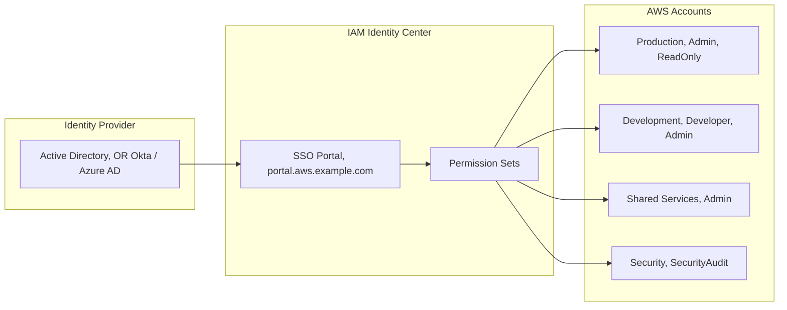
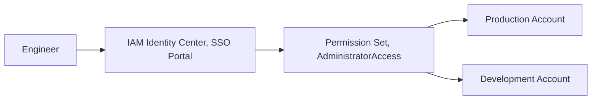

# Chapter 36 — AWS IAM Identity Center (SSO)

---

## Prerequisite Chapters
- Chapter 01 — AWS IAM (users, roles, federation)
- Chapter 23 — AWS STS (temporary credentials, AssumeRole)
- Chapter 31 — AWS Organizations & Control Tower (multi-account)

## Used In Production Practicals
- Practical 02 — Enterprise AWS Accounts
- Practical 39 — Enterprise Multi-Account AWS

---

## 1. Learning Objectives

By the end of this chapter, you will be able to:

1. **Explain** IAM Identity Center and why it replaces IAM users for human access.
2. **Configure** SSO with an external identity provider (Active Directory, Okta, Azure AD).
3. **Create** Permission Sets for different access levels.
4. **Assign** users and groups to AWS accounts with specific permissions.
5. **Use** the SSO portal and AWS CLI with SSO profiles.
6. **Troubleshoot** SSO login failures and permission issues.
7. **Answer** interview questions about centralized access management.

---

## 2. What is IAM Identity Center?

IAM Identity Center (formerly AWS SSO) provides **centralized access management** for all your AWS accounts and applications. Users sign in once and access any assigned account without separate IAM users.

### The Scale Problem
```
Without IAM Identity Center:
  50 employees × 10 accounts = 500 IAM users to manage
  - Password rotation for 500 users
  - Employee leaves = delete 10 IAM users
  - No single sign-on
  - No corporate directory integration
  - Access keys scattered everywhere

With IAM Identity Center:
  50 employees in ONE directory (AD/Okta)
  - One login → access to all assigned accounts
  - Employee leaves → disable in IdP → access revoked everywhere
  - SSO portal shows all accounts at a glance
  - No IAM users needed (except for break-glass)
  - CLI access via temporary credentials
```

---

## 3. Core Concepts

### Key Components

| Concept | Description |
|---------|-------------|
| **Identity Source** | Where users come from: built-in directory, Active Directory, or external IdP (Okta, Azure AD) |
| **Permission Set** | Collection of IAM policies that define what a user can do in an account |
| **Account Assignment** | Maps: user/group → account → permission set |
| **SSO Portal** | Web page where users see all assigned accounts and roles |
| **Access Portal URL** | `https://my-company.awsapps.com/start` |

### Permission Set Examples
```
AdministratorAccess:
  - AWS managed policy: AdministratorAccess
  - Session duration: 4 hours
  - Assigned to: Platform team → All accounts

DeveloperAccess:
  - Custom policy: EC2, Lambda, S3, DynamoDB, CloudWatch
  - Session duration: 8 hours
  - Assigned to: Developers group → Dev + Staging accounts only

ReadOnlyAccess:
  - AWS managed policy: ReadOnlyAccess
  - Session duration: 12 hours
  - Assigned to: Auditors group → All accounts

DatabaseAdmin:
  - Custom policy: RDS full, Secrets Manager, KMS
  - Session duration: 4 hours
  - Assigned to: DBA team → Production account only
```

### Identity Sources

| Source | Setup | Best For |
|--------|-------|----------|
| **Built-in** | Create users in IAM Identity Center | Small teams, no existing IdP |
| **Active Directory** | AWS Managed AD or AD Connector | Enterprise with on-premises AD |
| **External IdP** | SAML 2.0 (Okta, Azure AD, OneLogin) | Enterprise with cloud IdP |

---

## 4. Architecture



### How SSO Login Works
```
1. User visits https://my-company.awsapps.com/start
2. Redirected to IdP (Okta/AD) → authenticates
3. IdP sends SAML assertion to Identity Center
4. Identity Center shows portal with assigned accounts/roles
5. User clicks account + role → STS AssumeRole
6. Browser opens AWS Console with temporary credentials
7. Or user copies temporary credentials for CLI
```

---

## 5. Core Concepts (Continued)

```
Permission Sets:
  - Collection of IAM policies assigned to users/groups
  - Mapped to accounts -- one permission set can apply to multiple accounts
  - Types: AWS Managed policies, custom policies, inline policies

Identity Sources:
  - Identity Center directory (built-in)
  - Active Directory (AD Connector or AWS Managed AD)
  - External SAML 2.0 IdP (Okta, Azure AD)
```

---

## 6. Important Components

```
Users & Groups: managed in Identity Center or synced from external IdP
Permission Sets: define what access users have
Account Assignments: map users/groups + permission sets to AWS accounts
SSO Portal: web portal for users to access assigned accounts
CLI Access: aws configure sso for CLI/SDK access
```

---

## 7. How It Works

```
Login Flow:
  1. User navigates to SSO portal URL
  2. Authenticates (MFA if configured)
  3. Portal shows assigned AWS accounts + permission sets
  4. User clicks account -> opens console with assumed role
  5. CLI: aws configure sso -> browser-based auth -> temp credentials
```

---

## 8. AWS Console Walkthrough

### Set Up Identity Center
1. **IAM Identity Center** -> **Enable**
2. **Identity source**: Identity Center directory (or connect AD)
3. **Create users** and **groups**
4. **Create permission set**: AdministratorAccess, ReadOnly, etc.
5. **Assign**: group + permission set + AWS account

---

## 9. AWS Console Walkthrough (continued)

### Create Permission Set
1. **Permission sets** -> **Create**
2. **Type**: Predefined (AWS managed) or Custom
3. **Policy**: AdministratorAccess or custom JSON
4. **Session duration**: 1-12 hours
5. **Assign to account**: select accounts + groups

---

## 10. AWS CLI Commands

```bash
# Configure SSO profile
aws configure sso
# Follow prompts: SSO start URL, region, account, role

# Login
aws sso login --profile my-sso-profile

# Use profile
aws s3 ls --profile my-sso-profile

# List accounts
aws sso list-accounts --access-token TOKEN
```

### AWS CLI SSO Setup
```bash
# Configure SSO profile
aws configure sso
# SSO session name: my-company
# SSO start URL: https://my-company.awsapps.com/start
# SSO Region: ap-south-1
# → Browser opens, authenticate with IdP
# → Select account and role from list

# Login (opens browser)
aws sso login --profile prod-admin

# Use the profile
aws s3 ls --profile prod-admin
aws ec2 describe-instances --profile prod-admin
```

### ~/.aws/config SSO Profiles
```ini
[sso-session my-company]
sso_start_url = https://my-company.awsapps.com/start
sso_region = ap-south-1
sso_registration_scopes = sso:account:access

[profile prod-admin]
sso_session = my-company
sso_account_id = 111111111111
sso_role_name = AdministratorAccess
region = ap-south-1

[profile dev-developer]
sso_session = my-company
sso_account_id = 222222222222
sso_role_name = DeveloperAccess
region = ap-south-1

[profile prod-readonly]
sso_session = my-company
sso_account_id = 111111111111
sso_role_name = ReadOnlyAccess
region = ap-south-1
```

---

## 11. Hands-On Practical

*(Setting up Identity Center is an account-level operation covered in Organizations chapter)*

---

## 12. Production Architecture

```
Production Identity Center:
  - Management account: Identity Center enabled
  - External IdP (Okta/Azure AD): SCIM provisioning for users/groups
  - Permission sets: Admin, Developer, ReadOnly, SecurityAudit
  - Account assignments: per-team, per-environment
  - MFA enforced for all users
```

---

## 13. Security Best Practices

1. **MFA required** -- enforce for all users
2. **Least privilege permission sets** -- start with ReadOnly, add as needed
3. **Use groups, not individual users** -- easier management
4. **External IdP** -- centralize identity in corporate directory
5. **Short session duration** -- 1-4 hours for production accounts
6. **Audit** -- CloudTrail logs all SSO sign-in events

---

## 14. High Availability

```
Identity Center HA:
  - Managed by AWS, multi-AZ
  - Depends on management account region
  - External IdP: ensure IdP is also HA
```

---

## 15. Scalability

```
Limits:
  - 5,000 users, 100 groups (Identity Center directory)
  - 500 permission sets
  - For larger: use external IdP with SCIM
```

---

## 16. Monitoring & Observability

```
CloudTrail:
  - SSO sign-in events
  - Permission set changes
  - Account assignment changes

Alarms:
  - Sign-in from unusual location -> alert
  - Permission set modification -> alert
  - Failed sign-in attempts spike -> alert
```

---

## 17. Cost Optimization

```
IAM Identity Center: FREE
  - No per-user charges
  - No per-authentication charges
  - Only pay for AWS services accessed
```

---

## 18. Disaster Recovery

```
DR:
  - Identity Center is regional (management account region)
  - External IdP provides DR (IdP manages user directory)
  - Permission sets: define in CloudFormation for reproducibility
  - Risk: management account region outage = no SSO login
  - Mitigation: keep break-glass IAM users in each account
```

### Production Multi-Account Access Strategy
```
Platform Team:
  → All accounts: AdministratorAccess
  → Session: 4 hours

Development Team:
  → Dev account: DeveloperAccess (full dev permissions)
  → Staging account: DeveloperAccess
  → Production account: ReadOnlyAccess (no changes!)

DBA Team:
  → All accounts: DatabaseAdmin
  → Production: requires MFA + 4-hour session

Security Team:
  → All accounts: SecurityAudit (read-only security)
  → Security account: SecurityAdmin

On-Call Engineer:
  → Production account: IncidentResponse (broad but time-limited)
  → Session: 1 hour

Break-Glass:
  → IAM user with MFA in management account (not SSO)
  → Used only when Identity Center is unavailable
```

---

## 19. Troubleshooting

### Problem 1: SSO Login Fails
```
Check:
  1. Identity source configured correctly (SAML metadata)?
  2. IdP (Okta/AD) user is active?
  3. User assigned to at least one account + permission set?
  4. Browser allows cookies/popups for the SSO URL?
```

### Problem 2: "You do not have any accounts"
```
Check:
  1. User/group is assigned to accounts with permission sets?
  2. Account assignment completed (not just user created)?
  3. User is in the correct IdP group that's mapped?
```

### Problem 3: CLI Profile Not Working
```bash
# Re-login
aws sso login --profile prod-admin

# Check token cache
ls ~/.aws/sso/cache/

# Verify identity
aws sts get-caller-identity --profile prod-admin
```

---

## 20. Common Production Problems

| # | Problem | Root Cause | Prevention |
|---|---------|------------|------------|
| 1 | User can't see account | No assignment for their group | Check group membership + assignments |
| 2 | CLI SSO token expired | Session duration exceeded | Re-run aws sso login |
| 3 | MFA not enforced | Not configured in Identity Center | Enable MFA in settings |

---

## 21. Real-World Scenario

### Scenario: Onboarding 50 Developers to Multi-Account Setup

**Implementation**:
1. Connect Azure AD as external IdP (SCIM sync)
2. Create groups: DevTeam-Frontend, DevTeam-Backend, DevOps
3. Create permission sets: Developer (limited), DevOps (broader)
4. Assign groups to appropriate accounts
5. Developers sign in via SSO portal -> see only their accounts
6. MFA enforced, sessions logged in CloudTrail

---

## 22. Interview Questions

### Basic Questions (10)

**Q1: What is IAM Identity Center?**
A: Centralized access management for all AWS accounts. Users sign in once (SSO) and access any assigned account. Replaces creating IAM users in every account. Formerly called AWS SSO.

**Q2: Why use Identity Center instead of IAM users?**
A: Centralized management (one directory), single sign-on, easier onboarding/offboarding, works with corporate IdP, temporary credentials, no access keys to manage.

**Q3: What is a Permission Set?**
A: A collection of IAM policies that define what a user can do in an AWS account. Assigned to users/groups for specific accounts. Created centrally, deployed to accounts as IAM roles.

**Q4: What identity sources does Identity Center support?**
A: Built-in directory, AWS Managed AD, external IdP (SAML 2.0: Okta, Azure AD, OneLogin, Google Workspace).

**Q5: How does CLI access work with SSO?**
A: `aws configure sso` creates a profile. `aws sso login` opens browser for authentication. CLI uses temporary credentials from SSO session. No access keys stored.

**Q6: What happens when an employee leaves?**
A: Disable in the identity provider (AD/Okta). Access revoked from ALL AWS accounts immediately. No individual IAM users to find and delete.

**Q7: What is the SSO portal?**
A: A web page where authenticated users see all their assigned AWS accounts and roles. Click to open Console or copy CLI credentials. URL: `https://company.awsapps.com/start`.

**Q8: Can you use MFA with Identity Center?**
A: Yes. Configure in Identity Center settings or at the IdP level. Can require MFA for specific permission sets.

**Q9: What is an account assignment?**
A: The mapping of user/group → AWS account → permission set. "DevTeam group gets DeveloperAccess in the Dev account."

**Q10: Is Identity Center regional or global?**
A: Identity Center is deployed in ONE region (your chosen home region) but manages access across all accounts in the organization.

### Intermediate-Advanced Questions (30)

**Q11: How do Permission Sets become IAM roles?**
A: When you assign a permission set to an account, Identity Center creates an IAM role in that account with the permission set's policies. Users assume this role via SSO.

**Q12: How do you implement least-privilege with Identity Center?**
A: Create fine-grained permission sets per function (DeveloperAccess, DBAAccess, ReadOnly). Assign groups to specific accounts with appropriate permission sets. Developers get full access in dev, read-only in prod.

**Q13: How do you handle multi-IdP scenarios?**
A: Identity Center supports ONE identity source at a time (internal directory, AD Connector, or external SAML IdP). For multi-IdP: use your external IdP (Okta, Azure AD) as the single source and configure multiple IdPs within that platform. Or use Cognito for customer-facing auth and Identity Center for employee access — different use cases, not competing.

**Q14: What are permission set boundaries?**
A: Permission sets can include a **permissions boundary** — a managed policy that sets the maximum permissions. Even if the permission set grants `AdministratorAccess`, the boundary caps effective permissions. Use for: preventing IAM changes, blocking resource creation in restricted Regions, or ensuring developers can't escalate privileges beyond their function.

**Q15: How do session duration settings work?**
A: Configurable per permission set (1 to 12 hours, default 1 hour). When the session expires, the user must re-authenticate through the SSO portal. Set shorter durations (1-4 hours) for production admin roles. Longer durations (8-12 hours) for dev/read-only roles. Users can have different session durations per account/permission set combination.

**Q16: How does ABAC work with Identity Center?**
A: Assign attributes (tags) to users in the identity source (department, project, cost center). Map attributes to session tags in Identity Center. IAM policies use `aws:PrincipalTag/<key>` conditions. Example: a developer tagged `Project=Phoenix` only accesses resources tagged `Project=Phoenix`. One permission set serves many projects — attributes control access scope.

**Q17: What is delegated administration?**
A: Designate a member account (e.g., security account) as the delegated administrator for Identity Center instead of using the management account. The delegated admin can manage users, groups, permission sets, and assignments. Reduces the blast radius of the management account. Set up via `register-delegated-administrator` in Organizations.

**Q18: How do you implement emergency (break-glass) access?**
A: 1) Create a local IAM user in the management account with MFA and strong password stored in a physical safe. 2) Create a high-privilege permission set accessible only by a specific emergency group. 3) Alert via EventBridge when the break-glass role is assumed. 4) Regular drill: test the process quarterly. 5) The break-glass user bypasses Identity Center if it's unavailable.

**Q19: How do you audit Identity Center with CloudTrail?**
A: CloudTrail logs all Identity Center API calls: `CreatePermissionSet`, `CreateAccountAssignment`, `Authenticate`, and `Federate`. Track who logged in, to which account, with which permission set, and when. Filter for: failed logins, unusual account access, permission changes. Send to Security Hub for centralized monitoring.

**Q20: How do you migrate from IAM users to Identity Center?**
A: 1) Set up Identity Center with your existing IdP (or internal directory). 2) Map existing IAM users to Identity Center users/groups. 3) Create permission sets matching existing IAM policies. 4) Assign users/groups to accounts with appropriate permission sets. 5) Test with a pilot team. 6) Deactivate IAM user access keys and console passwords. 7) Keep one break-glass IAM admin user.

### Advanced Questions (10)

**Q21: Design an Identity Center architecture for a 100-account Organization.**
A: Structure: Management account (Identity Center deployment), Security account (delegated admin), shared services, dev/staging/prod workloads. Groups: Platform-Admins (all accounts, AdminAccess), Developers (dev accounts, DeveloperAccess + prod read-only), DBAs (DB accounts, DatabaseAdmin), Security (all accounts, SecurityAudit). Permission sets: 6-8 function-specific sets. ABAC for project-level isolation.

**Q22: How do you integrate Identity Center with third-party applications (Salesforce, Jira)?**
A: Identity Center supports SAML 2.0 and SCIM for application integration. Add the application in Identity Center → Applications. Configure SAML metadata exchange. Assign users/groups. Users access third-party apps from the same SSO portal alongside AWS accounts. SCIM enables automatic user provisioning/deprovisioning to supported applications.

**Q23: How do you implement temporary elevated access (just-in-time access)?**
A: 1) Create a high-privilege permission set (e.g., `ProductionAdmin`). 2) Normally, no one is assigned to it. 3) Use an approval workflow (ServiceNow, Slack bot → Lambda). 4) When approved, Lambda calls `CreateAccountAssignment` to grant access. 5) After a time window, Lambda calls `DeleteAccountAssignment` to revoke. 6) Log everything with CloudTrail.

**Q24: How does Identity Center handle MFA?**
A: Configure MFA in Identity Center settings (or in the external IdP if using one). Options: context-aware (prompt only on new devices/locations), always-on, or required for specific permission sets via IAM policy conditions. Support for TOTP apps, FIDO2 security keys, and built-in authenticators. Register multiple MFA devices per user.

**Q25: What are inline policies vs managed policies in permission sets?**
A: **Managed policies**: attach existing AWS managed or customer managed policies to the permission set. Reusable, versioned, shared across sets. **Inline policies**: JSON policy written directly in the permission set. Use for: custom permissions not covered by managed policies, resource-specific ARNs, or conditions. Both are combined when the IAM role is created.

**Q26: How do you handle Identity Center in a multi-Region disaster?**
A: Identity Center runs in one Region. If that Region has an outage, SSO is unavailable. Mitigation: 1) Break-glass IAM users for emergency access. 2) Document the break-glass process. 3) AWS doesn't support multi-Region Identity Center. 4) Consider the risk vs. the convenience of centralized SSO. 5) Test break-glass access regularly.

**Q27: How do you troubleshoot "Access Denied" when using Identity Center?**
A: Check: 1) User is assigned to the correct account with the right permission set. 2) Permission set policies include the needed actions. 3) Permissions boundary doesn't block the action. 4) SCP doesn't deny the action. 5) Resource policy doesn't deny (e.g., S3 bucket policy). 6) Session has expired (re-login). 7) Check CloudTrail for the exact denial reason.

**Q28: How does SCIM provisioning work with external IdPs?**
A: SCIM (System for Cross-domain Identity Management) automatically syncs users and groups from your IdP (Okta, Azure AD) to Identity Center. When a user is added/removed/modified in Okta, SCIM pushes the change to Identity Center. No manual user management in AWS. Enable SCIM in Identity Center → Settings → Identity source → Change to external IdP.

**Q29: How do you enforce Region restrictions through Identity Center?**
A: Add an SCP or inline policy to the permission set with a `Deny` effect and `aws:RequestedRegion` condition denying all Regions except allowed ones. Example: deny everything except `ap-south-1` and `us-east-1` (global services). This ensures users assigned this permission set can only operate in approved Regions.

**Q30: What are the limits of Identity Center?**
A: 100K users, 5K groups, 20 permission sets per account assignment, 2000 account assignments per permission set, 500 applications. One identity source at a time. Single Region deployment. No built-in JIT access (must build custom). Limited to Organizations (can't use with standalone accounts). Customer managed policies must exist in every target account.

### Scenario-Based Questions (10)

**Q31: A new developer needs access to three dev accounts. Walk through the setup.**
A: 1) Ensure the developer exists in the identity source (IdP/directory). 2) Add them to the `Developers` group. 3) If the group is already assigned to the dev accounts with `DeveloperAccess` permission set, the developer gets access automatically. 4) If not, assign the group: Identity Center → AWS Accounts → select accounts → Assign users/groups → Developers → DeveloperAccess. 5) Developer logs in at the SSO portal URL.

**Q32: An employee left the company. How do you revoke all AWS access immediately?**
A: 1) Disable/delete the user in the external IdP (Okta, AD). SCIM automatically deprovisions in Identity Center. 2) Existing sessions remain valid until they expire (up to session duration). 3) For immediate revocation: delete all account assignments for that user manually. 4) Verify with CloudTrail no new sessions are created. 5) Review any break-glass credentials the user knew about.

**Q33: Identity Center SSO portal is down. How do your teams access AWS?**
A: Use break-glass IAM users. Each critical team should have one stored securely (password in a safe, MFA device in a locked drawer). The break-glass user has console access and limited permissions to perform essential operations. After the outage: review all break-glass usage, rotate credentials, and document lessons learned.

**Q34: You need different permission levels for the same developer across dev, staging, and prod. How?**
A: Create three permission sets: `FullDeveloper` (dev), `RestrictedDeveloper` (staging), `ReadOnlyDeveloper` (prod). Assign the developer's group to each account with the corresponding permission set. The developer sees all three accounts in the portal and selects the appropriate one — each gives different permissions automatically.

**Q35: Your organization uses both Azure AD and Okta. Can Identity Center support both?**
A: No — Identity Center supports one identity source. Options: 1) Federate one into the other (e.g., Azure AD trusts Okta, or vice versa) and use the primary as Identity Center's source. 2) Use one for Identity Center and the other for Cognito (if it's for different use cases). 3) Migrate all users to one IdP. Most organizations standardize on one IdP.

**Q36: An auditor asks how you ensure no developer has admin access in production. What do you show?**
A: 1) Permission set assignments: show `ReadOnly` or `RestrictedDeveloper` assigned to dev groups for prod accounts. 2) SCPs: deny `iam:*`, `organizations:*` in production OUs. 3) Permission boundaries on permission sets capping max permissions. 4) CloudTrail: show no admin API calls from developer identities in prod. 5) Identity Center assignment report: generated via API.

**Q37: You want to give a contractor access for exactly 30 days. How?**
A: 1) Create the contractor in the IdP with an expiry date (Okta/AD support this). When the account expires, SCIM deprovisions automatically. 2) OR use a Lambda + EventBridge scheduled rule: after 30 days, call `DeleteAccountAssignment` to remove access. 3) Set a short session duration (1 hour) so they must re-authenticate frequently. 4) Tag the user for audit purposes.

**Q38: How do you generate a report of who has access to which accounts?**
A: Use the Identity Center API: `ListAccountAssignments` for each account and permission set. Script it: loop through all accounts, list assignments, output to CSV. Include: user/group, account, permission set, date assigned. Or use AWS Config's `AWS::SSO::Assignment` resource type. For visual reports, build a dashboard with QuickSight reading from the exported data.

**Q39: You're migrating from cross-account IAM roles to Identity Center. What's the strategy?**
A: 1) Inventory existing cross-account roles and their policies. 2) Map each role to a permission set. 3) Map each IAM user to an Identity Center user/group. 4) Create permission sets matching the role policies. 5) Assign groups to accounts. 6) Parallel run: both IAM roles and Identity Center active. 7) Have users test SSO access. 8) Deactivate IAM user credentials. 9) Delete old cross-account roles after validation.

**Q40: Your company acquires another company with its own AWS Organization. How do you unify access?**
A: 1) Invite acquired accounts into your Organization (or create new ones and migrate workloads). 2) Extend Identity Center to the new accounts. 3) Add acquired employees to your IdP. 4) Create appropriate groups and permission sets for the acquired team. 5) Assign them to their accounts. 6) Decommission the acquired company's separate IAM users. 7) Unify SCPs and governance policies.

---

## 23. Scenario-Based Interview Questions

*(Covered in section 22 above)*

---

## 24. Common Mistakes

1. **Still creating IAM users for humans** — use Identity Center
2. **One permission set for everyone** — create function-specific sets
3. **Developers with admin in production** — read-only for prod
4. **No break-glass IAM user** — need backup if Identity Center fails
5. **Not integrating with corporate IdP** — manual user management
6. **Long session durations** — 1-4 hours for production access
7. **No MFA** — always require MFA for admin permission sets

---

## 25. Production Checklist

- [ ] Identity Center enabled in management account
- [ ] External IdP configured (Okta/AD/Azure AD)
- [ ] Permission Sets created per function (Admin, Developer, ReadOnly, DBA)
- [ ] Account assignments completed for all teams
- [ ] MFA required (at IdP or Identity Center level)
- [ ] Session durations set appropriately per permission set
- [ ] CLI SSO profiles documented for the team
- [ ] Break-glass IAM user in management account (with MFA)
- [ ] CloudTrail logging SSO events
- [ ] Regular access review (quarterly)

---

## 26. Chapter Summary

1. **Replace IAM users with Identity Center** — for all human access to AWS
2. **One login, all accounts** — SSO portal shows all assigned accounts
3. **Permission Sets** — centrally managed, consistent access policies
4. **Works with existing IdP** — Active Directory, Okta, Azure AD
5. **CLI support** — `aws configure sso` for developer access
6. **Employee offboarding** — disable in IdP, revoked everywhere
7. **Break-glass IAM user** — backup access when SSO is unavailable
8. **No access keys** — temporary credentials, auto-refreshed

---
---

# 🔬 Practical Lab 05 — IAM Identity Center (SSO)

## Lab Overview
| Item | Detail |
|------|--------|
| **Difficulty** | Intermediate |
| **Duration** | 30 minutes |
| **Cost** | Free |
| **Prerequisites** | Practical 04 (Organizations) |
| **Lab Environment** | Environment 1 — Foundation |

## Business Scenario
> Your company has 50 engineers. Instead of creating IAM users in every account, implement centralized SSO using IAM Identity Center.

## Architecture


### Step 1 — Enable IAM Identity Center
1. **IAM Identity Center** → **Enable** (requires Organizations)

📸 **Screenshot 01** — Identity Center Dashboard
> **What you should see**: IAM Identity Center enabled, SSO portal URL displayed

### Step 2 — Create User
1. **Users** → **Add user** → Name: `devops-engineer`, Email, Set password

📸 **Screenshot 02** — User Created
> **Verify**: User shows "Active" status

### Step 3 — Create Permission Set
1. **Permission sets** → **Create** → Select `AdministratorAccess` managed policy
2. Session duration: 4 hours

📸 **Screenshot 03** — Permission Set Created
> **Verify**: Permission set "AdministratorAccess" visible

### Step 4 — Assign User to Account
1. **AWS accounts** → Select account → **Assign users** → Select devops-engineer → Select permission set

📸 **Screenshot 04** — Assignment Complete

### Step 5 — Test SSO Login
1. Open SSO portal URL → Sign in → Select account → Click "Management console"

📸 **Screenshot 05** — SSO Portal with Account Access
> **What you should see**: SSO portal showing available accounts and permission sets
> **Verify**: Can access Management Console via SSO without IAM user credentials

🎯 **Interview Insight**: "IAM Users vs IAM Identity Center?"
> **Strong answer**: "IAM Identity Center is the modern approach — centralized SSO, temporary credentials, integrates with corporate IdP (Active Directory, Okta). IAM users have long-term credentials. For enterprise, always use Identity Center."
