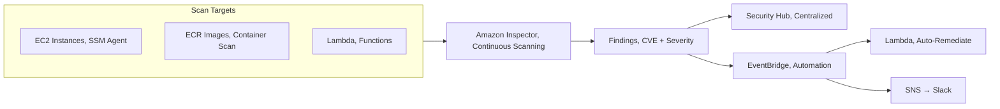
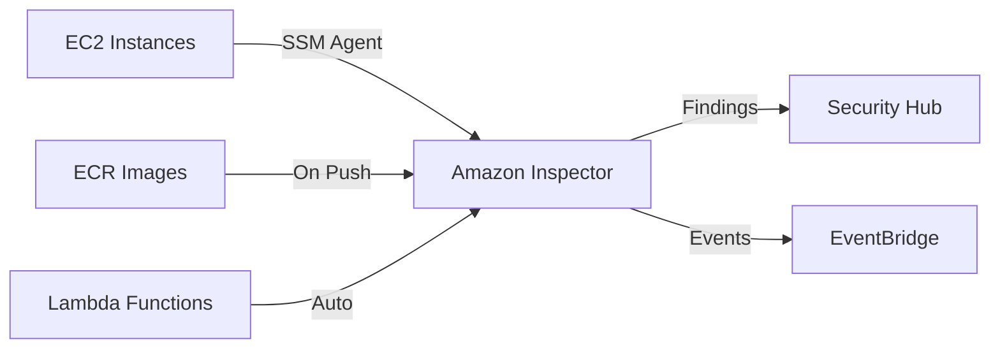

# Chapter 44 — Amazon Inspector

---

## Prerequisite Chapters
- Chapter 03 — Amazon EC2 (instance vulnerability scanning)
- Chapter 15 — Amazon ECR (container image scanning)
- Chapter 45 — AWS Security Hub (findings aggregation)

## Used In Production Practicals
- Practical 33 — Container CI/CD (scan images before deploy)
- Practical 15 — Flagship Production Architecture

---

## 1. Learning Objectives

By the end of this chapter, you will be able to:

1. **Explain** Inspector v2 and how it differs from traditional vulnerability scanning.
2. **Enable** Inspector for EC2 instances, ECR images, and Lambda functions.
3. **Understand** vulnerability findings, severity, and CVE references.
4. **Integrate** Inspector with Security Hub for centralized findings.
5. **Build** a CI/CD security pipeline with ECR image scanning.
6. **Troubleshoot** scanning failures and false positives.
7. **Answer** interview questions about vulnerability management.

---

## 2. What is Amazon Inspector?

Amazon Inspector is a **vulnerability management service** that automatically scans AWS workloads for software vulnerabilities and network exposure. Inspector v2 is agentless for ECR and uses SSM Agent for EC2.

### What Inspector Scans

| Target | What It Checks | How |
|--------|---------------|-----|
| **EC2 Instances** | OS packages, software vulnerabilities | SSM Agent (agentless optional) |
| **ECR Images** | Container image vulnerabilities | Scan on push + continuous |
| **Lambda Functions** | Code dependencies vulnerabilities | Automatic |

### Key Characteristics
- **Automatic** — enable once, scans continuously
- **Agentless for ECR** — no agent needed for container scans
- **CVE-based** — references NVD (National Vulnerability Database)
- **Risk scoring** — CVSS score + Inspector contextual scoring
- **Multi-account** — delegated admin in Organizations
- **Integrates** — Security Hub, EventBridge, S3 export

---

## 3. Core Concepts

### Finding Severity Levels
```
CRITICAL:  CVSS 9.0-10.0 — exploit available, remote code execution
HIGH:      CVSS 7.0-8.9  — serious vulnerability
MEDIUM:    CVSS 4.0-6.9  — moderate risk
LOW:       CVSS 0.1-3.9  — minimal risk
INFO:      Informational  — best practice recommendation
```

### Inspector Scoring vs CVSS
```
CVSS Score: Standard vulnerability severity (static)
Inspector Score: Adjusted for YOUR environment
  - Is the instance internet-facing? (higher risk)
  - Is the port open? (higher risk)
  - Is there an exploit available? (higher risk)

Inspector score may be HIGHER than CVSS if the vulnerability
is more exploitable in your specific configuration.
```

### Continuous vs One-Time Scanning
```
Inspector v2 = Continuous scanning:
  - EC2: re-scans when new CVE published or package changes
  - ECR: scans on push + re-scans when new CVE affects existing images
  - Lambda: scans on deploy + continuous re-assessment

No manual scan scheduling needed
```

---

## 4. Architecture



---

## 5. Core Concepts (Continued)

```
Findings: vulnerability reports with severity and remediation
  - Critical, High, Medium, Low, Informational
  - CVE reference, affected package, fix available

Scanning Types:
  - EC2: SSM Agent-based, scans installed packages
  - ECR: scans container images on push
  - Lambda: scans function code and dependencies
```

---

## 6. Architecture



---

## 7. Important Components

```
Assessment: automatic, continuous scanning (v2)
Findings: vulnerabilities with severity, CVE, and remediation
Suppression Rules: ignore known/accepted findings
Delegated Admin: central security account manages Inspector
SBOM Export: software bill of materials for compliance
```

---

## 8. How It Works

```
Inspector v2 Flow:
  1. Enable Inspector in account (or via Organizations)
  2. Automatically discovers EC2, ECR, Lambda resources
  3. Continuously scans for vulnerabilities
  4. New CVE published -> re-scans affected resources
  5. Findings sent to Security Hub + EventBridge
  6. EventBridge -> SNS -> alert security team
```

---

## 9. AWS Console Walkthrough

### Enable Inspector
1. **Inspector Console** -> **Get started**
2. **Enable**: EC2 scanning, ECR scanning, Lambda scanning
3. **Delegated admin**: set central security account
4. **View findings**: filter by severity, resource type

---

## 10. AWS CLI Commands

```bash
# Enable Inspector
aws inspector2 enable --resource-types EC2 ECR LAMBDA

# List findings
aws inspector2 list-findings \
    --filter-criteria '{"severity":[{"comparison":"EQUALS","value":"CRITICAL"}]}'

# Get findings count
aws inspector2 list-finding-aggregations --aggregation-type SEVERITY
```

### Enable Inspector
```bash
# Enable for all scan types
aws inspector2 enable --resource-types EC2 ECR LAMBDA

# Check status
aws inspector2 get-configuration

# List findings
aws inspector2 list-findings \
    --filter-criteria '{
        "severity": [{"comparison": "EQUALS", "value": "CRITICAL"}]
    }' \
    --query 'findings[*].{Title:title,Severity:severity,Resource:resources[0].id}'

# Get finding details
aws inspector2 get-findings-report-status --report-id $REPORT_ID
```

### EventBridge Rule for Critical Findings
```json
{
    "source": ["aws.inspector2"],
    "detail-type": ["Inspector2 Finding"],
    "detail": {
        "severity": ["CRITICAL"]
    }
}
// → Trigger Lambda → Create Jira ticket / Send Slack alert
```

---

## 11. Hands-On Practical

*(Inspector is automatically enabled -- findings appear after resource discovery)*

---

## 12. Production Architecture

```
Production Inspector Setup:
  - Enabled via Organizations (delegated admin in security account)
  - All member accounts auto-enrolled
  - EC2 + ECR + Lambda scanning enabled
  - Findings aggregated in central Security Hub
  - EventBridge rules: Critical findings -> SNS -> PagerDuty
```

---

## 13. Security Best Practices

1. **Enable all scan types** -- EC2, ECR, Lambda
2. **Delegated admin** -- centralize in security account
3. **Auto-remediation** -- EventBridge -> Lambda -> SSM Patch Manager
4. **Suppression rules** -- for accepted risks only (document reason)
5. **SBOM export** -- compliance and supply chain security

---

## 14. High Availability

```
Inspector HA:
  - Fully managed, regional service
  - Continuous scanning (no scheduled assessments needed)
  - Automatic re-scan when new CVEs are published
```

---

## 15. Scalability

```
Limits:
  - Scans all EC2 instances with SSM Agent
  - Scans all ECR images automatically
  - No per-account limit on resources scanned
```

---

## 16. Monitoring & Observability

```
Security Hub Integration:
  - All findings automatically sent to Security Hub
  - Centralized dashboard across accounts

EventBridge:
  - FINDING_CREATED, FINDING_UPDATED events
  - Route to SNS, Lambda, or Step Functions

Alarms:
  - Critical/High finding count > 0 -> alert
  - New finding on production resource -> alert
```

---

## 17. Cost Optimization

```
Pricing:
  - EC2 scanning: $1.258 per instance/month
  - ECR scanning: $0.09 per image scan + $0.01/rescan
  - Lambda scanning: $0.30 per function/month

Cost Tips:
  - Scan is continuous (no need to schedule extra scans)
  - Suppress known false positives to reduce noise
```

---

## 18. Disaster Recovery

```
DR:
  - Inspector is regional -- enable in DR region too
  - Findings are regional (not replicated)
  - Use Security Hub aggregation for cross-region view
```

### Production Inspector Configuration
```
Enable:
  - EC2 scanning (all instances with SSM Agent)
  - ECR scanning (scan on push + continuous)
  - Lambda scanning (all functions)

Alerts:
  - EventBridge rule for CRITICAL findings → SNS → PagerDuty
  - Weekly report of HIGH findings → email

Integration:
  - Security Hub (centralized findings)
  - S3 export (compliance reporting)
  - CI/CD gate: fail pipeline if CRITICAL CVE found in image

Suppression:
  - Suppress false positives with suppression rules
  - Document accepted risks
```

---

## 19. Troubleshooting

### Problem 1: EC2 Instance Not Scanned
```
Check:
  1. SSM Agent installed and running
  2. Instance has IAM role with AmazonSSMManagedInstanceCore
  3. Inspector enabled for EC2 in the account
  4. Instance is a supported OS
```

### Problem 2: ECR Image Shows "Scan Not Available"
```
Check:
  1. Inspector enabled for ECR
  2. Image pushed after Inspector was enabled
  3. Image OS supported (Amazon Linux, Ubuntu, Debian, Alpine)
```

---

## 20. Common Production Problems

| # | Problem | Root Cause | Prevention |
|---|---------|------------|------------|
| 1 | EC2 not scanned | SSM Agent not installed/running | Ensure SSM Agent is active |
| 2 | Too many findings | Old AMI with known CVEs | Update base AMIs regularly |
| 3 | False positives | Package detected but not used | Use suppression rules |

---

## 21. Real-World Scenario

### Scenario: Critical CVE Detected Across Fleet

**Event**: Inspector reports Critical CVE in OpenSSL across 200 EC2 instances.

**Response**:
1. EventBridge triggers SNS alert to security team
2. Inspector finding includes affected package and fix version
3. SSM Patch Manager: deploy patch to all affected instances
4. Re-scan confirms remediation
5. Security Hub finding status updated to RESOLVED

---

## 22. Interview Questions

### Basic Questions (10)

**Q1: What is Amazon Inspector?**
A: A vulnerability management service that continuously scans EC2, ECR, and Lambda for software vulnerabilities and network exposure. Uses CVE database for detection.

**Q2: How does Inspector scan EC2 instances?**
A: Uses SSM Agent (pre-installed on Amazon Linux). Scans installed packages against CVE database. Continuous — re-scans when new CVE published.

**Q3: How does Inspector scan container images?**
A: Scans ECR images on push and continuously. Detects OS and language package vulnerabilities without any agent.

**Q4: What is the difference between Inspector score and CVSS?**
A: CVSS is a static severity score. Inspector adjusts it for your environment (internet-facing, open ports, exploit availability). Inspector score may be higher if risk is contextually greater.

**Q5: How does Inspector integrate with Security Hub?**
A: Findings automatically sent to Security Hub. Security Hub aggregates findings from Inspector, GuardDuty, Config, and other services in one dashboard.

**Q6: How does Inspector scan Lambda functions?**
A: Inspector scans Lambda function code and layers for known vulnerabilities in language packages (Python, Node.js, Java, .NET, Go, Ruby). Scanning is continuous — when new CVEs are published, Inspector re-evaluates your functions. No agent or code changes needed. Findings include the vulnerable package, CVE ID, severity, and remediation guidance.

**Q7: What is finding suppression?**
A: Suppression rules let you filter out findings you've accepted (e.g., a CVE with no fix available, or a false positive). Create rules based on: vulnerability ID, resource type, tag, or account. Suppressed findings are hidden from the active list but still recorded. Review suppressions periodically — a fix may become available.

**Q8: How does Inspector work with Organizations (multi-account)?**
A: Designate a delegated administrator account. Inspector automatically enables scanning across all member accounts. Findings from all accounts are aggregated in the delegated admin's console. Use Organizations integration for: centralized vulnerability management, consistent scanning policies, and organization-wide dashboards.

**Q9: What's the difference between ECR scan-on-push and Enhanced Scanning?**
A: **Scan-on-push (Basic)**: uses Clair, scans OS packages only, one-time scan at push. **Enhanced Scanning (Inspector)**: scans OS AND language packages (npm, pip, Maven), continuous re-scanning when new CVEs are published, integrates with Security Hub and EventBridge. Enhanced catches 3-5x more vulnerabilities.

**Q10: How does Inspector support compliance reporting?**
A: Inspector findings map to compliance frameworks (CIS, PCI-DSS, NIST). Export findings to Security Hub for compliance dashboards. Generate SBOM exports for audit evidence. Track remediation progress over time. Integration with AWS Audit Manager for automated evidence collection.

### Intermediate-Advanced & Scenario Questions (30)

**Q11: How do you integrate Inspector into a CI/CD pipeline?**
A: 1) Push image to ECR → Enhanced Scanning auto-runs. 2) In CodeBuild post_build: call `describe-image-scan-findings` and poll for results. 3) If critical/high findings exist, fail the build. 4) For Lambda: deploy to a staging alias, scan results appear within minutes, gate production promotion on clean scan. 5) Use EventBridge rules to trigger pipeline actions based on findings.

**Q12: Design a vulnerability remediation workflow with Inspector.**
A: Inspector finding (critical CVE) → EventBridge rule → Lambda creates Jira ticket with CVE details, affected resource, remediation guidance. Assign to the owning team (based on resource tags). SLA: critical 24h, high 7 days, medium 30 days. Engineer patches the dependency/OS, deploys, Inspector re-scans and closes the finding. Dashboard tracks SLA compliance.

**Q13: How do you export and use SBOMs?**
A: Call `CreateSbomExport` API with filter (account, resource type). Inspector generates SBOM in SPDX or CycloneDX format, stores in your S3 bucket. Use SBOMs for: license compliance auditing, rapid CVE response ("which resources have log4j?"), supply chain security, and third-party vendor assessments. Automate weekly SBOM exports for all production resources.

**Q14: How do you prioritize Inspector findings?**
A: Inspector provides a contextual score (adjusted from CVSS based on: network reachability, exploit availability, resource exposure). Prioritize: 1) Critical + network-reachable + exploit available = immediate. 2) High + internet-facing = within 7 days. 3) Medium + internal = 30 days. 4) Low = next sprint. Use Inspector dashboards to see risk-ranked findings.

**Q15: How do you handle false positives?**
A: 1) Verify it's truly false (check the CVE, confirm the vulnerable function isn't called). 2) Create a suppression rule with a justification note. 3) Review suppressions quarterly. 4) Report false positives to AWS (Inspector feedback button). 5) Document accepted risks in your risk register. 6) Never suppress without investigation.

**Q16: How does automated patching work with Inspector findings?**
A: Inspector finding → EventBridge → SSM Automation. For EC2: trigger `AWS-RunPatchBaseline` on the affected instance. For containers: trigger a pipeline that rebuilds the image with updated base/dependencies and redeploys. For Lambda: update the runtime or layer. Validate with a re-scan after patching. Not all patches are automatic — some require code changes.

**Q17: How does Inspector pricing work?**
A: EC2 scanning: $1.258/instance/month (first 500), decreases at scale. ECR scanning: $0.09/image initially + $0.01/image/month for re-scans. Lambda scanning: $0.36/function/month (first 1000). Lambda code scanning: $0.50/function/month. CIS benchmarks: $0.048/instance/month. Free 15-day trial for all scan types.

**Q18: How do you monitor Inspector coverage?**
A: Inspector dashboard shows: coverage percentage (what % of resources are being scanned), resources not covered (and why — e.g., unsupported OS, SSM agent not installed). CloudWatch metric: `CoveragePercentage`. Set an alarm if coverage drops below 95%. Review uncovered resources weekly.

**Q19: What are Inspector CIS benchmark scans?**
A: Inspector evaluates EC2 instances against CIS (Center for Internet Security) benchmarks. Checks: password policies, SSH config, file permissions, network settings, etc. Runs on a schedule or on-demand. Results show pass/fail for each benchmark control. Use for: compliance validation, hardening verification, audit evidence.

**Q20: How does Inspector handle container scanning for EKS?**
A: Inspector scans container images used by EKS pods. It discovers running pods via the EKS cluster, identifies the ECR images, and correlates findings with the running workloads. Shows which EKS clusters are affected by each vulnerability. Network reachability analysis considers Kubernetes services and load balancers.

### Advanced Questions (10)

**Q21: Design an enterprise vulnerability management program using Inspector.**
A: 1) Enable Inspector across all accounts via Organizations (delegated admin in security account). 2) Configure: EC2 scanning, ECR Enhanced Scanning, Lambda scanning, CIS benchmarks. 3) EventBridge → SNS/Jira for critical findings. 4) Security Hub aggregates all findings. 5) Weekly vulnerability reports via QuickSight. 6) SLA enforcement with ticket tracking. 7) SBOM exports for compliance. 8) Monthly executive dashboard.

**Q22: How do you reduce the attack surface based on Inspector findings?**
A: Group findings by: 1) Network-reachable + critical = highest priority (reduce exposure). 2) Common vulnerabilities across many resources = patch base images. 3) End-of-life OS/runtimes = migrate to supported versions. 4) Unused dependencies = remove them. 5) Over-permissioned Lambda functions with code vulnerabilities = restrict IAM + fix code. Track attack surface reduction as a metric.

**Q23: How do you integrate Inspector with third-party security tools?**
A: Findings flow to Security Hub (ASFF format). From Security Hub: 1) Export to Splunk, Datadog, or Elastic via EventBridge. 2) Use Security Hub partner integrations (ServiceNow, Jira, PagerDuty). 3) Custom Lambda reads findings and calls third-party APIs. 4) S3 export for data lake analysis. 5) Inspector API directly for programmatic access.

**Q24: What is network reachability analysis and why is it important?**
A: Inspector analyzes VPC config (security groups, NACLs, route tables, IGW, NAT, ALB) to determine if a resource is reachable from the internet. A critical CVE on an internet-facing instance is far more urgent than the same CVE on an isolated internal instance. Inspector adjusts the severity score based on reachability. This contextual scoring is Inspector's key differentiator.

**Q25: How do you handle Inspector in a serverless-first architecture?**
A: Enable Lambda function scanning and Lambda code scanning. Inspector checks dependencies in deployment packages and layers. For containers on Fargate: ECR Enhanced Scanning covers the images. No EC2 scanning needed if fully serverless. Focus on: library vulnerabilities, code injection patterns (code scanning), and unused overly-broad IAM policies.

**Q26: How does Inspector handle zero-day vulnerabilities?**
A: When a new CVE is published, Inspector adds it to its database and re-scans all resources within 24 hours. If your resource is affected, a new finding appears immediately. For zero-day response: monitor Inspector for new critical findings via EventBridge, have a rapid-response runbook, and use SBOM exports to quickly identify all affected resources.

**Q27: How do you optimize Inspector costs?**
A: 1) Exclude dev/test instances with tags (Inspector supports exclusion tags). 2) Use Basic ECR scanning (free) for dev repos, Enhanced only for staging/prod. 3) Disable Lambda code scanning if you already use SAST tools (Snyk, SonarQube). 4) Consolidate container images (fewer unique images = fewer scans). 5) Clean up unused Lambda functions.

**Q28: How does Inspector differ from GuardDuty?**
A: **Inspector**: vulnerability management (finds known CVEs, misconfigurations). Preventive — patch before exploitation. **GuardDuty**: threat detection (finds active attacks, compromised instances, data exfiltration). Reactive — detect ongoing threats. Use both: Inspector to reduce the attack surface, GuardDuty to detect breaches. Both feed into Security Hub.

**Q29: How do you ensure 100% scanning coverage across an Organization?**
A: 1) Enable Inspector via Organizations (auto-enable for new accounts). 2) AWS Config rule: check SSM agent is installed on all EC2 instances. 3) Monitor Inspector coverage metric. 4) Alert on uncovered resources. 5) Remediate: install SSM agent, update to supported OS, enable ECR Enhanced Scanning. 6) Quarterly review of coverage gaps.

**Q30: How do you present vulnerability trends to leadership?**
A: Export Inspector findings to S3 (scheduled). Build a QuickSight dashboard showing: total findings over time (trending down = good), mean time to remediate (MTTR), findings by severity, top vulnerable packages, coverage percentage, SLA compliance rate. Monthly executive summary highlighting: new critical findings, remediation progress, and risk reduction metrics.

### Scenario-Based Questions (10)

**Q31: Inspector found a critical CVE in a base image used by 50 services. What's your response plan?**
A: 1) Identify all affected services (Inspector shows this or query SBOM). 2) Rebuild the base image with the patched package. 3) Push to ECR, scan to verify the CVE is fixed. 4) Rebuild all 50 service images using the new base. 5) Deploy to staging → test → production (rolling updates). 6) Verify Inspector findings are resolved. 7) Post-mortem: automate base image updates to prevent recurrence.

**Q32: Your Inspector coverage dropped from 95% to 60%. Why and how do you fix it?**
A: Common causes: 1) New EC2 instances without SSM agent (AMI missing it). 2) SSM agent stopped/crashed. 3) Instances in a subnet without internet/VPC endpoint for SSM. 4) IAM role missing SSM permissions. Fix: add SSM agent to AMIs, verify networking, check instance profiles. Use AWS Config to enforce SSM agent presence.

**Q33: Inspector shows a high-severity finding but the package maintainer says no fix is available. What do you do?**
A: 1) Assess actual exploitability (is the vulnerable function called? Is the resource internet-facing?). 2) If low risk: suppress with documented justification, set a review date. 3) If high risk: implement compensating controls (WAF rules, network isolation, runtime protection). 4) Monitor for a patch release. 5) Consider alternative packages. 6) Document in risk register.

**Q34: You need to prove to auditors that all production containers are scanned. How?**
A: 1) Inspector coverage report showing 100% ECR repos have Enhanced Scanning enabled. 2) Security Hub compliance report with Inspector findings. 3) SBOM exports for all production images. 4) CloudTrail showing scan events. 5) AWS Config rule confirming ECR scanning is enabled organization-wide. 6) Dashboard showing no unscanned images in production repos.

**Q35: Inspector finds a vulnerability in a Lambda layer you don't control. What do you do?**
A: 1) Check if the layer publisher has a patched version. 2) If yes, update the layer version in your function. 3) If no, consider: replacing the layer with a maintained alternative, bundling the dependency directly (where you can patch it), or removing the dependency entirely. 4) If it must stay: document the accepted risk, implement compensating controls (input validation, IAM restrictions).

**Q36: Your team gets 500 Inspector findings daily and ignores them all. How do you fix alert fatigue?**
A: 1) Create suppression rules for accepted risks (reduce noise). 2) Focus only on critical + high findings initially. 3) Set up tiered alerts: critical → PagerDuty, high → Jira, medium/low → weekly report. 4) Assign findings to teams based on resource tags (each team sees only their findings). 5) Automate patching for OS-level vulnerabilities. 6) Track and celebrate remediation progress.

**Q37: A developer argues that a code scanning finding is a false positive. How do you validate?**
A: 1) Review the specific code path Inspector flagged. 2) Check if the vulnerability pattern is actually exploitable in context (e.g., SQL injection flagged but input is sanitized elsewhere). 3) If truly false: suppress with the developer's justification. 4) If exploitable: require a fix before production deployment. 5) Document the review decision. 6) Report false positives to AWS to improve the scanner.

**Q38: You're migrating from Qualys/Tenable to Inspector. What's the transition plan?**
A: 1) Enable Inspector alongside existing tool (parallel run). 2) Compare findings: identify gaps and overlaps. 3) Map existing vulnerability workflow to Inspector → EventBridge → Jira. 4) Train the security team on Inspector dashboards. 5) Validate coverage matches (Inspector may not cover on-prem). 6) Retire Qualys/Tenable for AWS workloads after 1-month parallel run. Keep for on-prem if needed.

**Q39: Inspector found that 30% of your EC2 instances run an end-of-life OS. What's your remediation strategy?**
A: 1) Inventory affected instances and their workloads. 2) Create updated AMIs with supported OS (e.g., Amazon Linux 2023 or Ubuntu 22.04). 3) Test workloads on new OS. 4) Create a migration timeline: wave 1 (non-production, 2 weeks), wave 2 (production, 4 weeks). 5) Use Auto Scaling Group AMI updates for stateless workloads. 6) Manual migration for stateful instances. 7) Block new launches of EOL AMIs via SCP.

**Q40: How would you use Inspector to prevent vulnerable images from reaching production?**
A: 1) ECR Enhanced Scanning scans on push. 2) Pipeline gate: after push, check findings via API. If critical/high → block deployment. 3) Use image signing (AWS Signer): only sign images with clean scans. 4) ECS/EKS admission controller rejects unsigned images. 5) Continuous scanning catches new CVEs post-deployment — EventBridge triggers rollback or alert. Defense in depth across the pipeline.

---

## 23. Scenario-Based Interview Questions

*(Covered in section 22 above)*

---

## 24. Common Mistakes

1. **Not enabling all scan types** -- missing ECR or Lambda vulnerabilities
2. **Ignoring findings** -- critical CVEs left unpatched
3. **No auto-remediation** -- manual patching is too slow
4. **Not using delegated admin** -- scattered findings across accounts

---

## 25. Production Checklist

- [ ] Inspector enabled for EC2, ECR, Lambda
- [ ] SSM Agent on all EC2 instances
- [ ] EventBridge alerts for CRITICAL findings
- [ ] Security Hub integration configured
- [ ] CI/CD gate for image vulnerability scanning
- [ ] Suppression rules for accepted risks
- [ ] Weekly findings review process
- [ ] Multi-account with delegated admin

---

## 26. Chapter Summary

1. **Enable and forget** — continuous scanning, no scheduling
2. **EC2 + ECR + Lambda** — covers all compute workloads
3. **Inspector score > CVSS** — contextual risk assessment
4. **Security Hub integration** — centralized findings
5. **CI/CD gate** — block deployment of vulnerable images
6. **EventBridge automation** — auto-alert/remediate critical CVEs
7. **Multi-account** — delegated admin in Organizations
8. **Suppress false positives** — reduce noise, document accepted risks

---
---

# 🔬 Practical Lab 49 — Inspector Vulnerability Assessment

## Lab Overview
| Item | Detail |
|------|--------|
| **Difficulty** | Beginner |
| **Duration** | 15 minutes |
| **Cost** | 15-day free trial |
| **Prerequisites** | EC2 instances, ECR images |
| **Lab Environment** | Environment 11 — Security Ops |

### Step 1 — Enable Inspector
1. **Inspector** → **Get Started** → Enable for EC2, ECR, Lambda

📸 **Screenshot 01** — Inspector Enabled

### Step 2 — View Findings
1. **Findings** → Filter by severity: CRITICAL

📸 **Screenshot 02** — Vulnerability Findings
> **What you should see**: CVE-based findings with severity, affected resource, fix recommendation

📸 **Screenshot 03** — ECR Image Scan Results
> **Verify**: Container images scanned with vulnerability counts

🎯 **Interview Insight**: "How do you handle vulnerabilities?"
> **Strong answer**: "Inspector for continuous scanning. CRITICAL = patch within 24 hours. HIGH = within 7 days. CI/CD pipeline gate: fail build on CRITICAL CVEs. Auto-patching with SSM Patch Manager. Regular AMI rebuilds with latest patches."
