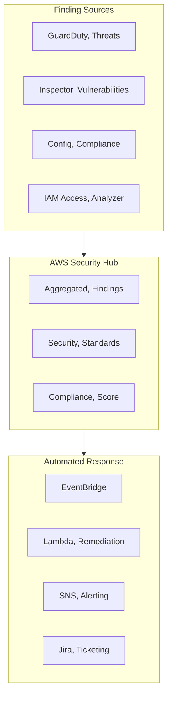
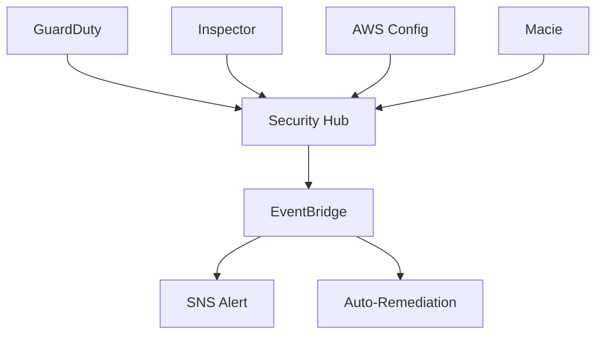

# Chapter 45 — AWS Security Hub

---

## Prerequisite Chapters
- Chapter 01 — AWS IAM (security policies)
- Chapter 43 — Amazon GuardDuty (threat detection findings)
- Chapter 44 — Amazon Inspector (vulnerability findings)
- Chapter 27 — AWS Config (compliance findings)

## Used In Production Practicals
- Practical 15 — Flagship Production Architecture (security posture)
- Practical 39 — Enterprise Multi-Account AWS

---

## 1. Learning Objectives

By the end of this chapter, you will be able to:

1. **Explain** Security Hub's role as the central security dashboard.
2. **Enable** Security Hub and configure security standards.
3. **Aggregate** findings from GuardDuty, Inspector, Config, and third-party tools.
4. **Automate** responses to security findings using EventBridge.
5. **Implement** multi-account security with Organizations.
6. **Troubleshoot** findings, compliance gaps, and integration issues.
7. **Answer** interview questions about security operations.

---

## 2. What is AWS Security Hub?

Security Hub provides a **centralized dashboard** for security findings across your AWS accounts. It aggregates findings from GuardDuty, Inspector, Config, Firewall Manager, and third-party tools into a single pane of glass.

### Key Characteristics
- **Centralized findings** — all security findings in one place
- **Security standards** — automated compliance checks (CIS, PCI DSS, AWS FSBP)
- **Cross-account** — aggregate findings from all accounts in Organization
- **Automated response** — EventBridge rules trigger remediation
- **ASFF format** — AWS Security Finding Format (standardized)

---

## 3. Core Concepts

### Finding Sources
```
AWS Services → Security Hub:
  - GuardDuty: Threat detection (malicious IPs, compromised credentials)
  - Inspector: Vulnerability management (CVEs, misconfigurations)
  - Config: Compliance rules (S3 public access, unencrypted resources)
  - Firewall Manager: WAF/SG compliance
  - IAM Access Analyzer: External access findings
  - Macie: S3 sensitive data exposure

Third-Party → Security Hub:
  - Palo Alto, CrowdStrike, Splunk, etc.
```

### Security Standards
```
AWS Foundational Security Best Practices (FSBP):
  - 200+ automated checks
  - IAM password policy, S3 encryption, RDS encryption
  - Most comprehensive AWS-specific standard

CIS AWS Foundations Benchmark:
  - 49 checks based on CIS benchmark
  - IAM, logging, networking, monitoring

PCI DSS:
  - Payment Card Industry compliance
  - 30+ automated checks
```

### Finding Severity
```
CRITICAL:  Immediate action required (public S3 bucket with sensitive data)
HIGH:      Urgent remediation needed (root account without MFA)
MEDIUM:    Should be addressed (security group with 0.0.0.0/0 SSH)
LOW:       Best practice improvement
INFORMATIONAL: For awareness
```

### Compliance Score
```
Security Hub calculates compliance score per standard:
  FSBP: 87% (174/200 checks passing)
  CIS:  92% (45/49 checks passing)

Overall security score: weighted average across all standards
```

---

## 4. Architecture



---

## 5. Core Concepts (Continued)

```
Standards: CIS AWS Foundations, AWS Foundational Best Practices, PCI DSS
Controls: individual security checks (e.g., "S3 bucket public access blocked")
Findings: ASFF format (AWS Security Finding Format)
Integrations: Inspector, GuardDuty, Config, Firewall Manager, 3rd party
Aggregation: cross-region, cross-account finding consolidation
```

---

## 6. Architecture



---

## 7. Important Components

```
Security Standards: enable CIS, AWS Best Practices
Automated Checks: Security Hub runs Config rules automatically
Custom Actions: trigger EventBridge from finding
Insights: saved filters for finding analysis
Cross-Region Aggregation: single-pane view across regions
```

---

## 8. How It Works

```
Security Hub Flow:
  1. Enable Security Hub + select standards
  2. Security Hub enables required Config rules
  3. Continuous evaluation against standards
  4. Findings from GuardDuty, Inspector, etc. aggregated
  5. Dashboard shows security posture score
  6. EventBridge rules trigger alerts/remediation
```

---

## 9. AWS Console Walkthrough

### Enable Security Hub
1. **Security Hub Console** -> **Go to Security Hub**
2. **Enable**: AWS Foundational Best Practices + CIS
3. **Integrations**: enable GuardDuty, Inspector
4. **Findings**: review by severity
5. **Standards**: check compliance score

---

## 10. AWS CLI Commands

```bash
# Enable Security Hub
aws securityhub enable-security-hub \
    --enable-default-standards

# Get findings
aws securityhub get-findings \
    --filters '{"SeverityLabel":[{"Value":"CRITICAL","Comparison":"EQUALS"}]}'

# Get security score
aws securityhub get-enabled-standards
```

### Enable Security Hub
```bash
# Enable with all standards
aws securityhub enable-security-hub \
    --enable-default-standards

# Enable specific standard
aws securityhub batch-enable-standards \
    --standards-subscription-requests '[{
        "StandardsArn": "arn:aws:securityhub:::ruleset/cis-aws-foundations-benchmark/v/1.4.0"
    }]'

# Get findings
aws securityhub get-findings \
    --filters '{
        "SeverityLabel": [{"Value": "CRITICAL", "Comparison": "EQUALS"}],
        "WorkflowStatus": [{"Value": "NEW", "Comparison": "EQUALS"}]
    }' \
    --query 'Findings[*].{Title:Title,Severity:Severity.Label,Resource:Resources[0].Id}'

# Get compliance status
aws securityhub get-enabled-standards

# Update finding workflow
aws securityhub batch-update-findings \
    --finding-identifiers '[{"Id": "FINDING_ID", "ProductArn": "PRODUCT_ARN"}]' \
    --workflow '{"Status": "RESOLVED"}'
```

### EventBridge Automation
```json
{
    "source": ["aws.securityhub"],
    "detail-type": ["Security Hub Findings - Imported"],
    "detail": {
        "findings": {
            "Severity": {"Label": ["CRITICAL"]},
            "Workflow": {"Status": ["NEW"]}
        }
    }
}
// → Lambda auto-remediates (e.g., disable public S3 access)
```

---

## 11. Hands-On Practical

*(Security Hub is enabled via console -- findings appear automatically)*

---

## 12. Production Architecture

```
Production Security Hub:
  - Delegated admin in central security account
  - All member accounts auto-enrolled via Organizations
  - Standards: AWS Foundational + CIS Benchmarks
  - Cross-region aggregation enabled
  - EventBridge: Critical findings -> SNS -> PagerDuty
  - Auto-remediation Lambda for common findings
```

---

## 13. Security Best Practices

1. **Enable via Organizations** -- centralized management
2. **All standards enabled** -- comprehensive coverage
3. **Integrate all sources** -- GuardDuty, Inspector, Config, Macie
4. **Auto-remediation** -- Lambda fixes common issues automatically
5. **Cross-region aggregation** -- single-pane view
6. **Regular review** -- weekly security posture meetings

---

## 14. High Availability

```
Security Hub HA:
  - Fully managed, regional service
  - Cross-region aggregation for resilience
  - No capacity planning needed
```

---

## 15. Scalability

```
Limits:
  - 10,000 findings per BatchImportFindings call
  - Findings retained for 90 days
  - Scales with Organization (hundreds of accounts)
```

---

## 16. Monitoring & Observability

```
Dashboard:
  - Security posture score per standard
  - Findings by severity, resource type, account
  - Trends over time

EventBridge:
  - Security Hub Findings - Imported events
  - Custom actions -> EventBridge for manual workflows

Alarms:
  - Critical findings count > 0 -> alert
  - Security score drops below threshold -> alert
```

---

## 17. Cost Optimization

```
Pricing:
  - Security checks: $0.0010 per check per account/region/month
  - Finding ingestion: $0.00003 per finding (first 10K free/month)
  - Config rules: separate Config pricing applies

Cost Tips:
  - Disable unused standards to reduce checks
  - Archive resolved findings promptly
```

---

## 18. Disaster Recovery

```
DR:
  - Security Hub is regional
  - Cross-region aggregation provides unified view
  - Enable in DR region for local compliance checking
  - Findings are regional (not replicated)
```

### Production Security Hub Configuration
```
Standards Enabled:
  - AWS Foundational Security Best Practices ✅
  - CIS AWS Foundations Benchmark ✅
  - PCI DSS (if processing payments) ✅

Integrations:
  - GuardDuty → Security Hub (automatic)
  - Inspector → Security Hub (automatic)
  - Config → Security Hub (automatic)
  - IAM Access Analyzer → Security Hub (automatic)

Automation:
  - CRITICAL findings → SNS → PagerDuty (immediate)
  - HIGH findings → Lambda → Jira ticket (next business day)
  - S3 public access → Lambda → block public access (auto-remediate)
  - SG with 0.0.0.0/0 SSH → Lambda → remove rule (auto-remediate)

Multi-Account:
  - Delegated admin in security account
  - All member accounts send findings
  - Cross-region aggregation
```

---

## 19. Troubleshooting

### Problem 1: Findings Not Appearing
```
Check:
  1. Security Hub enabled in the account/region
  2. Source service enabled (GuardDuty, Inspector, Config)
  3. Integration enabled in Security Hub settings
  4. Cross-account: member account linked
```

### Problem 2: Low Compliance Score
```
Investigation:
  1. View failed checks per standard
  2. Filter by severity (CRITICAL first)
  3. Common failures: unencrypted resources, public access, missing MFA
  4. Remediate programmatically (EventBridge + Lambda)
```

---

## 20. Common Production Problems

| # | Problem | Root Cause | Prevention |
|---|---------|------------|------------|
| 1 | Low security score | Many controls failing | Prioritize Critical/High findings |
| 2 | Too many findings | All standards enabled without review | Start with AWS Best Practices first |
| 3 | Config not enabled | Security Hub needs Config rules | Enable Config before Security Hub |

---

## 21. Real-World Scenario

### Scenario: Achieving 90% Security Score Across 50 Accounts

**Approach**:
1. Enable Security Hub via Organizations (delegated admin)
2. Start with AWS Foundational Best Practices standard
3. Auto-remediate top findings: public S3, unencrypted EBS, open SGs
4. Weekly review meetings with account owners
5. Custom actions for team-specific remediation workflows
6. Achieved 90% score in 3 months

---

## 22. Interview Questions

### Basic Questions (10)

**Q1: What is AWS Security Hub?**
A: A centralized security dashboard that aggregates findings from GuardDuty, Inspector, Config, and third-party tools. Provides compliance scoring against security standards.

**Q2: What security standards does Security Hub check?**
A: AWS Foundational Security Best Practices (FSBP), CIS AWS Foundations Benchmark, PCI DSS. Each runs automated compliance checks against your resources.

**Q3: How does Security Hub differ from GuardDuty?**
A: GuardDuty: threat detection (detects active threats). Security Hub: findings aggregation (collects findings from multiple services including GuardDuty, provides compliance scoring).

**Q4: What is ASFF?**
A: AWS Security Finding Format — standardized JSON format for security findings. All services and third-party tools use this format when sending to Security Hub.

**Q5: How do you automate remediation?**
A: Security Hub → EventBridge rule (filter by severity/type) → Lambda (remediate) or SNS (alert). Example: auto-block public S3 buckets.

**Q6: How do you set up Security Hub for a multi-account Organization?**
A: Designate a delegated administrator account (security account). Enable Security Hub with auto-enable for all member accounts. Findings from all accounts flow to the delegated admin. Use the aggregation Region to see findings from all Regions in one place. Configure standards and controls centrally.

**Q7: What is the compliance score?**
A: A percentage showing how many controls pass out of total enabled controls for each standard (e.g., CIS AWS Foundations 85%). Calculated per standard. 100% means all controls pass. Track improvement over time. Set organizational targets (e.g., 90% minimum). Failed controls show which resources need remediation.

**Q8: What are custom actions?**
A: User-defined actions that appear in the Security Hub console. When triggered on a finding, they send the finding to EventBridge. Use for: sending specific findings to Slack, creating Jira tickets, triggering Lambda remediation, or escalating to on-call. Custom actions bridge the gap between manual review and automated response.

**Q9: How does cross-region aggregation work?**
A: Designate one Region as the aggregation Region. Security Hub automatically replicates findings from all linked Regions to the aggregation Region. View all findings in one console. Enable in Settings → Regions. Critical for organizations operating in multiple Regions — single pane of glass for security posture.

**Q10: What are finding workflow states?**
A: Findings have workflow status: `NEW` (just discovered), `NOTIFIED` (team alerted), `SUPPRESSED` (accepted risk), `RESOLVED` (fixed). Track findings through the lifecycle. Suppressed findings are hidden from default views but still exist. Automated rules can change workflow status based on conditions.

### Intermediate-Advanced & Scenario Questions (30)

**Q11: What is a delegated administrator for Security Hub?**
A: A member account designated to manage Security Hub across the Organization. The delegated admin can: enable/disable standards, manage member accounts, view aggregated findings, and create automation rules. Best practice: use a dedicated security account (not the management account) to reduce blast radius.

**Q12: How do you create custom insights?**
A: Insights are saved filters on findings. Create: Security Hub → Insights → Create insight. Define filters (severity, resource type, compliance status, account). Example: "Critical findings in production accounts in the last 7 days." Custom insights help focus on what matters to your team. Share insights via CloudFormation.

**Q13: What third-party integrations does Security Hub support?**
A: 50+ partners including: Splunk, Datadog, Sumo Logic (SIEM), CrowdStrike, Trend Micro (endpoint), Palo Alto, Fortinet (network), Snyk, Aqua Security (container), ServiceNow, Jira (ticketing). Integrations send findings TO Security Hub (ASFF format) or receive FROM Security Hub (via EventBridge). Configure in Settings → Integrations.

**Q14: How do you build auto-remediation patterns?**
A: Pattern: Finding → EventBridge rule (filter by type/severity) → Lambda/SSM Automation (remediate). Examples: 1) Public S3 bucket → Lambda applies block-public-access. 2) Open security group → Lambda removes 0.0.0.0/0 rule. 3) Unencrypted EBS → SSM creates encrypted snapshot. 4) GuardDuty compromise → Lambda isolates instance. Always log actions and notify the team.

**Q15: How does Security Hub handle compliance reporting?**
A: Enable standards (CIS, PCI-DSS, NIST, AWS FSBP). Security Hub continuously evaluates controls. Dashboard shows: overall score, failed controls, affected resources. Export findings to S3 for audit evidence. Use with AWS Audit Manager for automated evidence collection. Track compliance trends over time with QuickSight dashboards.

**Q16: How do you suppress findings effectively?**
A: Create automation rules: if finding matches criteria (e.g., specific CVE in test accounts), set workflow status to `SUPPRESSED`. Or suppress manually in the console with a reason. Best practices: always document why, set review dates, never suppress in production without compensating controls. Suppressed findings still count in metrics — use them to track accepted risk.

**Q17: What is the security operations workflow with Security Hub?**
A: 1) **Detect**: Findings flow in from Inspector, GuardDuty, Config, third-party tools. 2) **Triage**: Filter by severity, prioritize with insights. 3) **Investigate**: Drill into finding details, check resource context. 4) **Respond**: Auto-remediate (Lambda) or manual fix. 5) **Track**: Workflow status changes to NOTIFIED → RESOLVED. 6) **Report**: Compliance dashboards, executive summaries.

**Q18: How do automation rules work?**
A: Rules that automatically update findings based on criteria. Actions: change severity, change workflow status, add notes, suppress. Run on new findings and updated findings. Use for: auto-suppressing known false positives, elevating severity for production resources, or auto-assigning findings to teams via notes. Up to 100 rules per Region.

**Q19: What are the Security Hub standards?**
A: **AWS Foundational Security Best Practices (FSBP)**: 200+ controls covering all major services. **CIS AWS Foundations Benchmark**: 1.2.0 and 1.4.0, covers IAM, logging, monitoring, networking. **PCI DSS v3.2.1**: payment card compliance. **NIST 800-53**: federal compliance. Each standard has controls that evaluate your resources continuously.

**Q20: How do you track remediation progress?**
A: 1) Custom insight: "Critical findings created last 30 days" — track if count decreases. 2) Export findings to S3 weekly, build a trend dashboard in QuickSight. 3) Track MTTR (Mean Time To Remediate) per severity. 4) Set organizational targets: critical < 24h, high < 7d. 5) Weekly review meetings with the security team reviewing the Security Hub dashboard.

### Advanced Questions (10)

**Q21: Design a Security Hub architecture for a 50-account Organization.**
A: Security account as delegated admin. All accounts auto-enrolled. Aggregation Region: us-east-1. Standards enabled: FSBP + CIS 1.4.0. Cross-region aggregation for all active Regions. EventBridge rules: critical → PagerDuty, high → Jira. Auto-remediation Lambdas for top 10 common failures. Weekly compliance report to QuickSight. Monthly executive summary. Findings exported to Splunk.

**Q22: How do you implement a security data lake with Security Hub?**
A: 1) Export findings to S3 via EventBridge → Firehose. 2) Partition by date, account, Region. 3) Query with Athena for ad-hoc analysis. 4) Build QuickSight dashboards for trending. 5) Combine with CloudTrail, Config, GuardDuty exports for comprehensive security analytics. 6) Use Glue for ETL and data catalog. 7) Retain data for compliance (1-7 years).

**Q23: How do you handle findings from multiple sources about the same issue?**
A: Security Hub deduplicates findings based on the finding ID. However, different sources may report the same underlying issue differently. Use: 1) Correlation by resource ID (which resource is affected). 2) Custom insights grouping by resource. 3) Automation rules to cross-reference. 4) Security Hub's related findings feature links associated findings together.

**Q24: How do you customize Security Hub controls per account?**
A: Disable specific controls that aren't relevant (e.g., disable PCI-DSS in dev accounts). Use automation rules to adjust severity per account type. Create separate insights for prod vs dev. Use organization-level control management to enable/disable controls centrally. Tag accounts (prod/dev) and filter findings accordingly.

**Q25: How do you integrate Security Hub with incident response?**
A: Critical GuardDuty finding → Security Hub → EventBridge → Step Functions workflow: 1) Isolate the resource (modify SG). 2) Create forensic snapshot. 3) Page on-call via PagerDuty. 4) Create incident ticket. 5) Collect evidence (CloudTrail logs). 6) Update finding workflow status. Playbooks codify the response for repeatable incidents.

**Q26: What is the cost of Security Hub and how do you optimize?**
A: $0.0010/finding ingestion check for the first 10K, decreasing at scale. Plus compliance check costs per control evaluation. Optimize: 1) Disable standards you don't need. 2) Disable controls not applicable to your environment. 3) Suppress noisy findings (reduces investigation cost, not ingestion cost). 4) Use automation to reduce manual review time. 5) Archive old findings.

**Q27: How does Security Hub compare to third-party SIEM tools?**
A: Security Hub: AWS-native, finding aggregation, compliance scoring, free-tier available, limited custom detection. SIEM (Splunk, Datadog): cross-cloud, custom detection rules, advanced correlation, log analysis, richer visualization. Best practice: use Security Hub as the AWS aggregation layer and forward findings to your SIEM for enterprise-wide visibility and custom detection.

**Q28: How do you enforce Security Hub standards across new accounts?**
A: 1) Delegated admin with auto-enable. 2) SCP preventing `securityhub:DisableSecurityHub`. 3) CloudFormation StackSets deploying Security Hub config to all accounts. 4) AWS Config rule checking Security Hub is enabled. 5) Automated alerting if a new account doesn't have Security Hub within 24 hours.

**Q29: How do you build executive security dashboards from Security Hub data?**
A: Export findings to S3 (EventBridge → Firehose). Build QuickSight dashboard with: compliance score per standard (trending), critical findings count by account/team, MTTR by severity, top 10 failing controls, remediation velocity (findings resolved/week), risk heat map by service. Refresh daily. Share with leadership via scheduled email reports.

**Q30: How do you handle Security Hub in a regulated industry?**
A: Enable all relevant standards (PCI-DSS for payments, NIST for government). Map controls to regulatory requirements. Export evidence to Audit Manager. Maintain 100% coverage (all accounts, all Regions). Document accepted risks (suppressed findings). Quarterly compliance reviews. Annual audit evidence packages generated from Security Hub + CloudTrail + Config.

### Scenario-Based Questions (10)

**Q31: Your compliance score dropped from 90% to 70% overnight. How do you investigate?**
A: 1) Check which controls failed (Security Hub → Standards → failed controls). 2) Filter by "new failures in last 24h." 3) Common causes: new resources deployed without compliance (e.g., unencrypted EBS), a CloudFormation deployment bypassed security controls, or a permission change. 4) Check CloudTrail for recent changes. 5) Remediate the new failures. 6) Add preventive controls (SCPs, Config rules with auto-remediation).

**Q32: Security Hub shows 5000 findings. How do you prioritize?**
A: 1) Filter: critical severity + production accounts = top priority. 2) Group by: control ID (fix one control, resolve hundreds of findings). 3) Focus on FSBP failures first (AWS-recommended). 4) Ignore info/low in the first pass. 5) Auto-suppress known accepted risks. 6) Create insights: "Critical findings in internet-facing resources." 7) Fix the top 3 most-common failures first for maximum impact.

**Q33: GuardDuty detected a cryptocurrency mining threat. Walk through the Security Hub response.**
A: Finding appears in Security Hub with HIGH severity. 1) EventBridge triggers incident Lambda. 2) Lambda: isolate EC2 instance (remove all SG rules except forensic SG). 3) Create EBS snapshot for forensics. 4) SNS notifies security team. 5) Investigate: who launched the instance? Check CloudTrail. Was the key compromised? 6) Terminate the instance. 7) Rotate affected credentials. 8) Update finding to RESOLVED.

**Q34: An auditor asks for evidence that all S3 buckets are encrypted. How do you provide it?**
A: Security Hub → Standards → AWS FSBP → S3.4 (S3 buckets should have server-side encryption enabled). Show: 100% pass rate. Export the finding details as evidence (passed checks include resource ARNs). Provide the compliance score trend showing continuous compliance. Supplement with AWS Config conformance pack results for the same control.

**Q35: Your team wants to use Jira for tracking Security Hub findings. How do you set it up?**
A: 1) EventBridge rule: filter Security Hub findings by severity (critical/high). 2) Target: Lambda function. 3) Lambda: calls Jira API to create a ticket with finding details (title, description, severity, resource, remediation guidance). 4) Include the finding ARN for back-reference. 5) When the engineer fixes the issue, the finding auto-resolves in Security Hub. 6) Lambda closes the Jira ticket when finding status changes to RESOLVED.

**Q36: A new team member accidentally disabled Security Hub in a production account. How do you prevent this?**
A: 1) Immediately re-enable via delegated admin. 2) Add an SCP: deny `securityhub:DisableSecurityHub` for all accounts except the delegated admin. 3) AWS Config rule monitoring Security Hub status. 4) EventBridge rule: alert if `DisableSecurityHub` is called (CloudTrail event). 5) Review IAM permissions — restrict who can modify Security Hub settings.

**Q37: Security Hub auto-remediation accidentally blocked a legitimate public S3 bucket (a static website). How do you handle this?**
A: 1) Restore the bucket to public access. 2) Add a suppression rule or exception tag for that specific bucket. 3) Modify the auto-remediation Lambda to check for exception tags before acting. 4) Review all auto-remediation rules for similar over-aggressive behavior. 5) Add a 30-minute delay with SNS notification before auto-remediation, allowing the team to cancel false positives.

**Q38: You're merging two companies' AWS accounts. How do you unify security monitoring?**
A: 1) Move acquired accounts into your Organization. 2) Auto-enable Security Hub via delegated admin. 3) Enable the same standards across all accounts. 4) Cross-region aggregation covers both sets of accounts. 5) Update EventBridge rules and Jira integration. 6) Baseline: generate an initial compliance report for the acquired accounts. 7) Create a remediation plan for new findings. 8) Unified executive dashboard.

**Q39: How do you reduce the time from finding to remediation?**
A: 1) Auto-remediate common findings (public SG, unencrypted resources). 2) Tiered alerting: critical → PagerDuty (immediate), high → Slack (same day). 3) Assign findings to teams via tags and automation. 4) Pre-built runbooks for top 20 finding types. 5) Measure MTTR and set targets. 6) Gamify: weekly leaderboard of teams by remediation speed. 7) Blameless post-mortems for SLA breaches.

**Q40: Your organization has zero Security Hub findings but you suspect the configuration is wrong. What do you check?**
A: 1) Is Security Hub enabled? (Check each Region). 2) Are any standards enabled? (No standards = no compliance findings). 3) Are integrations active? (GuardDuty, Inspector, Config must be enabled). 4) Is AWS Config running? (Security Hub relies on Config for many controls). 5) Are there AWS Config rules? 6) Check member account enrollment. 7) A truly clean environment is rare — validate by intentionally creating a non-compliant resource.

---

## 23. Scenario-Based Interview Questions

*(Covered in section 22 above)*

---

## 24. Common Mistakes

1. **Not enabling Config first** -- Security Hub depends on Config rules
2. **Ignoring findings** -- security score meaningless without action
3. **No auto-remediation** -- manual fixes don't scale
4. **Missing integrations** -- not connecting GuardDuty, Inspector

---

## 25. Production Checklist

- [ ] Security Hub enabled in all accounts and regions
- [ ] AWS FSBP and CIS standards enabled
- [ ] GuardDuty, Inspector, Config integrated
- [ ] EventBridge rules for CRITICAL findings
- [ ] Auto-remediation Lambda for common issues
- [ ] Delegated admin in security account
- [ ] Cross-region aggregation configured
- [ ] Weekly compliance review process
- [ ] Finding workflow (NEW → NOTIFIED → RESOLVED)

---

## 26. Chapter Summary

1. **Single pane of glass** — all security findings in one dashboard
2. **Compliance scoring** — FSBP, CIS, PCI DSS standards
3. **Aggregates from** — GuardDuty, Inspector, Config, third-party
4. **Auto-remediation** — EventBridge + Lambda for CRITICAL findings
5. **Multi-account** — delegated admin aggregates all accounts
6. **ASFF format** — standardized findings across all tools
7. **Compliance first** — focus on CRITICAL/HIGH findings
8. **Track progress** — compliance score improves over time

---
---

# 🔬 Practical Lab 50 — Security Hub Centralized Security

## Lab Overview
| Item | Detail |
|------|--------|
| **Difficulty** | Intermediate |
| **Duration** | 20 minutes |
| **Cost** | 30-day free trial |
| **Prerequisites** | Practical 48, 49 (GuardDuty, Inspector) |
| **Lab Environment** | Environment 11 — Security Ops |

### Step 1 — Enable Security Hub
1. **Security Hub** → **Go to Security Hub** → **Enable**
   - ✅ AWS Foundational Security Best Practices
   - ✅ CIS AWS Foundations Benchmark

📸 **Screenshot 01** — Security Hub Enabled with Standards

### Step 2 — View Compliance Score
1. **Security standards** → View compliance percentage

📸 **Screenshot 02** — Compliance Dashboard
> **What you should see**: Compliance score per standard (e.g., FSBP: 85%, CIS: 90%)

### Step 3 — View Aggregated Findings
1. **Findings** → See GuardDuty + Inspector + Config findings in one place

📸 **Screenshot 03** — Centralized Findings from Multiple Services
> **Verify**: Findings from different services aggregated in one dashboard

🎯 **Interview Insight**: "How do you manage security across multiple accounts?"
> **Strong answer**: "Security Hub as the central dashboard. GuardDuty for threat detection, Inspector for vulnerabilities, Config for compliance. All findings flow to Security Hub. EventBridge rules auto-remediate critical findings. Delegated admin in the security account aggregates all member accounts."
