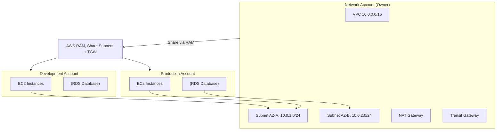
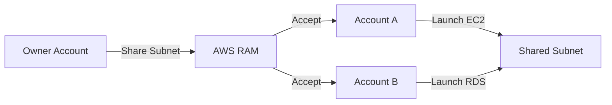

# Chapter 46 — AWS Resource Access Manager (RAM)

---

## Prerequisite Chapters
- Chapter 01 — AWS IAM (cross-account access)
- Chapter 04 — Amazon VPC (subnet sharing)
- Chapter 31 — AWS Organizations & Control Tower (multi-account)

## Used In Production Practicals
- Practical 39 — Enterprise Multi-Account AWS
- Practical 07 — Multi-AZ Network (shared subnets)

---

## 1. Learning Objectives

By the end of this chapter, you will be able to:

1. **Explain** RAM and why resource sharing matters in multi-account architectures.
2. **Share** VPC subnets, Transit Gateways, and other resources across accounts.
3. **Configure** sharing within AWS Organizations.
4. **Manage** permissions and ownership of shared resources.
5. **Troubleshoot** sharing failures and access issues.
6. **Answer** interview questions about multi-account resource sharing.

---

## 2. What is AWS Resource Access Manager?

RAM enables you to **share AWS resources** across accounts or within your Organization without creating duplicates. The most common use case is sharing VPC subnets.

### The Problem RAM Solves
```
Without RAM (duplicate resources):
  Account A: VPC-A, Subnets, NAT Gateway, Route Tables → Cost: $X
  Account B: VPC-B, Subnets, NAT Gateway, Route Tables → Cost: $X
  Account C: VPC-C, Subnets, NAT Gateway, Route Tables → Cost: $X
  
  3 NAT Gateways × $32/month = $96/month
  3 separate VPCs = complex peering/connectivity

With RAM (shared subnets):
  Network Account: VPC, Subnets, NAT Gateway, Route Tables → Cost: $X
  Account A: Launch EC2 in shared subnet → $0 extra network cost
  Account B: Launch RDS in shared subnet → $0 extra network cost
  Account C: Launch ECS in shared subnet → $0 extra network cost
  
  1 NAT Gateway = $32/month (shared)
  Centralized network management
```

---

## 3. Core Concepts

### Shareable Resources

| Resource | Owner Creates | Consumer Uses |
|----------|-------------|--------------|
| **VPC Subnets** | Network team creates VPC + subnets | Workload accounts launch EC2/RDS/ECS in shared subnet |
| **Transit Gateway** | Network team creates TGW | Workload accounts attach their VPCs |
| **Route 53 Resolver Rules** | DNS team creates rules | All accounts use centralized DNS |
| **License Manager** | Central team manages licenses | Workload accounts use shared licenses |
| **CodeBuild Projects** | DevOps team creates projects | Developer accounts run builds |

### Ownership Model
```
Owner Account (Network):
  - Creates and manages VPC, subnets, route tables, NAT, IGW
  - Controls network architecture
  - Shares subnets via RAM

Consumer Account (Workload):
  - Launches EC2, RDS, ECS in shared subnets
  - Creates own security groups
  - Manages own resources (instances, databases)
  - CANNOT modify subnet, route table, NACL (owner controls)

Result:
  Network team controls the network
  Workload teams control their applications
  Clean separation of responsibilities
```

### Sharing Within Organizations
```
If sharing within an Organization:
  - No invitation/acceptance needed (auto-approved)
  - Share with specific accounts or entire OU
  - Centralized control

If sharing outside Organization:
  - Invitation sent → consumer must accept
  - Manual process
```

---

## 4. Architecture



---

## 5. Core Concepts (Continued)

```
Resource Share: a named share containing resources and principals
Principals: AWS accounts, OUs, or Organization
Shareable Resources: subnets, Transit Gateways, Route 53 Resolver rules,
  License Manager configs, Aurora DB clusters, and more
```

---

## 6. Architecture



---

## 7. Important Components

```
Resource Share: container for shared resources + principals
Managed Permissions: control what consumers can do with shared resources
Organization Sharing: auto-accept for Organization members
Resource Types: VPC subnets, Transit GW, Resolver rules, License configs
```

---

## 8. How It Works

```
Sharing Flow:
  1. Owner creates resource share in RAM
  2. Adds resources (e.g., subnet) and principals (accounts/OUs)
  3. If within Organization: auto-accepted
  4. If external: invitation sent, must be accepted
  5. Consumer can now launch resources in shared subnet
  6. Consumer manages their own SGs and resources
```

---

## 9. AWS Console Walkthrough

### Share VPC Subnet
1. **RAM Console** -> **Create resource share**
2. **Name**: shared-network
3. **Resources**: select VPC subnets
4. **Principals**: add account IDs or OU ARNs
5. **Permissions**: AWSRAMDefaultPermission
6. **Create**

---

## 10. AWS CLI Commands

```bash
# Create resource share
aws ram create-resource-share \
    --name shared-network \
    --resource-arns arn:aws:ec2:REGION:ACCOUNT:subnet/subnet-xxx \
    --principals 111111111111 222222222222

# List resource shares
aws ram get-resource-shares --resource-owner SELF

# Accept invitation (consumer account)
aws ram accept-resource-share-invitation \
    --resource-share-invitation-arn arn:aws:ram:REGION:ACCOUNT:resource-share-invitation/xxx
```

### Share Subnets
```bash
# Create resource share
aws ram create-resource-share \
    --name "shared-network-subnets" \
    --resource-arns \
        arn:aws:ec2:ap-south-1:111111111111:subnet/subnet-priv-a \
        arn:aws:ec2:ap-south-1:111111111111:subnet/subnet-priv-b \
    --principals "arn:aws:organizations::111111111111:ou/o-abc/ou-xyz" \
    --allow-external-principals false

# List shares
aws ram get-resource-shares --resource-owner SELF

# List shared resources
aws ram list-resources --resource-owner SELF

# Accept invitation (if outside Organization)
aws ram accept-resource-share-invitation --resource-share-invitation-arn $INVITATION_ARN
```

### Consumer Account: Launch in Shared Subnet
```bash
# Consumer sees shared subnets in their account
aws ec2 describe-subnets --query 'Subnets[?OwnerId!=`CONSUMER_ACCOUNT_ID`]'

# Launch EC2 in shared subnet
aws ec2 run-instances \
    --image-id ami-abc123 \
    --instance-type t3.medium \
    --subnet-id subnet-shared-priv-a \
    --security-group-ids sg-consumer-app
```

---

## 11. Hands-On Practical

*(RAM sharing is demonstrated in VPC and Organizations practicals)*

---

## 12. Production Architecture

```
Production RAM Setup:
  - Network account owns VPCs and subnets
  - Subnets shared to workload accounts via RAM
  - Transit Gateway shared across Organization
  - Centralized networking, decentralized workloads
  - Each account manages its own SGs and resources
```

---

## 13. Security Best Practices

1. **Share within Organization only** -- enable Organization sharing
2. **Least privilege permissions** -- use managed permissions
3. **Network account pattern** -- centralize VPC ownership
4. **Tag shared resources** -- track ownership and purpose
5. **CloudTrail** -- monitor share creation/acceptance

---

## 14. High Availability

```
RAM HA:
  - Regional managed service
  - Shares are durable (persist until deleted)
  - Shared resources inherit source resource HA
```

---

## 15. Scalability

```
Limits:
  - 5,000 resource shares per account
  - Resources: depends on resource type limits
  - Organization-wide sharing: scales to thousands of accounts
```

---

## 16. Monitoring & Observability

```
CloudTrail:
  - CreateResourceShare, AssociateResource events
  - Monitor share modifications

CloudWatch:
  - No built-in RAM metrics
  - Use CloudTrail + Athena for analytics
```

---

## 17. Cost Optimization

```
RAM: FREE
  - No charges for sharing
  - Only pay for the resources themselves
  - Shared subnets reduce NAT Gateway costs (shared networking)
```

---

## 18. Disaster Recovery

```
DR:
  - RAM shares are regional
  - Recreate shares in DR region via IaC
  - Network architecture should be replicated via CloudFormation
```

### Production RAM Architecture
```
Network Account:
  - Owns VPC, subnets, NAT Gateways, Transit Gateway
  - Shares subnets via RAM to workload OUs
  - Centralizes network management and cost

Workload Accounts:
  - Launch resources in shared subnets
  - Own their security groups (can't modify NACL)
  - Independent resource management

Benefits:
  - Centralized IP address management (no CIDR conflicts)
  - Single NAT Gateway per AZ (shared cost)
  - Consistent network policies (route tables, NACLs)
  - Reduced VPC peering complexity
```

---

## 19. Troubleshooting

### Problem 1: Shared Subnet Not Visible in Consumer Account
```
Check:
  1. Resource share is active (not pending)
  2. Consumer account is in the correct OU/accepted invitation
  3. RAM sharing enabled in Organizations settings
  4. Correct region (RAM is regional)
```

### Problem 2: Can't Launch Instance in Shared Subnet
```
Check:
  1. Subnet has available IP addresses
  2. Consumer created their own security group in the shared VPC
  3. IAM permissions allow ec2:RunInstances in the subnet
```

---

## 20. Common Production Problems

| # | Problem | Root Cause | Prevention |
|---|---------|------------|------------|
| 1 | Can't launch in shared subnet | Missing permissions | Check RAM managed permissions |
| 2 | Share not visible | Invitation not accepted | Accept invitation or use Org sharing |
| 3 | CIDR conflicts | Consumer resources conflict with owner | Plan CIDR allocation |

---

## 21. Real-World Scenario

### Scenario: Centralized Network Architecture for 20 Accounts

**Implementation**:
1. Network account creates VPCs with shared subnets
2. RAM shares subnets to workload accounts via OU
3. Each workload account launches EC2/ECS/RDS in shared subnets
4. Centralized NAT Gateways (cost shared)
5. Transit Gateway shared for inter-VPC routing

---

## 22. Interview Questions

### Basic Questions (10)

**Q1: What is AWS RAM?**
A: Resource Access Manager enables sharing AWS resources across accounts without duplicating them. Most commonly used for sharing VPC subnets and Transit Gateways.

**Q2: Why share VPC subnets?**
A: Centralized network management, single NAT Gateway (cost savings), consistent policies, no VPC peering needed. Network team controls network, workload teams control applications.

**Q3: What is the ownership model?**
A: Owner creates and manages the resource (subnet, TGW). Consumer uses it (launches EC2, RDS). Consumer can't modify the shared resource (route tables, NACLs stay with owner).

**Q4: How does RAM work with Organizations?**
A: Sharing within Organizations is auto-approved (no invitation). Share with specific accounts or entire OUs. Enable RAM sharing in Organizations settings.

**Q5: What resources can be shared?**
A: VPC subnets, Transit Gateways, Route 53 Resolver rules, License Manager configurations, CodeBuild projects, and more.

**Q6: Can you share resources across Regions?**
A: Most RAM resources are regional — you share within the same Region. Exception: Route 53 Resolver rules can be shared across Regions (they work globally). For cross-region sharing of other resources, create the resource in each Region and share locally. Transit Gateways support cross-region peering, but sharing is per-Region.

**Q7: How do security groups work in shared VPCs?**
A: Each participant (consumer account) creates its own security groups in the shared subnet. The owner's security groups don't apply to participant resources. Participants can reference each other's security groups by ID for cross-account SG references. This allows fine-grained network control even in shared subnets.

**Q8: What are the cost implications of shared resources?**
A: The owner pays for the resource itself (subnet, Transit Gateway). Consumers pay for resources they create in the shared subnet (EC2, RDS, etc.) and their data transfer. Shared VPCs save money: one NAT Gateway, one Transit Gateway attachment, centralized networking infrastructure instead of per-account duplication.

**Q9: How does the invitation process work?**
A: Within Organizations (sharing enabled): auto-accepted, no invitation needed. Outside Organizations: RAM sends an invitation to the consumer account. The consumer must accept within 7 days or it expires. Use `aws ram accept-resource-share-invitation` or accept in the console. Pending invitations are visible in RAM.

**Q10: How do you remove a resource share?**
A: The owner can: 1) Remove specific principals from the share (disassociate). 2) Remove specific resources. 3) Delete the entire resource share. When removed, consumer resources in shared subnets continue running but can't create new resources. For Transit Gateway: routes are removed. Always notify consumers before removing shares.

### Intermediate-Advanced & Scenario Questions (30)

**Q11: Design a shared VPC architecture for a 10-account Organization.**
A: Central networking account owns the VPC (3 AZs, public/private/data subnets). Share private and data subnets via RAM to workload accounts (dev, staging, prod). Networking account manages: route tables, NACLs, NAT Gateways, Transit Gateway, VPN. Workload accounts deploy: EC2, RDS, ECS in shared subnets with their own security groups. Centralized network management, decentralized workloads.

**Q12: How does Transit Gateway sharing work?**
A: The networking account creates a Transit Gateway and shares it via RAM. Consumer accounts create Transit Gateway attachments (VPC or VPN) to the shared TGW. Route tables on the TGW are managed by the owner. This enables hub-and-spoke networking without each account creating its own TGW. Cost: owner pays for TGW, each account pays for their attachments.

**Q13: How do you manage IP addresses in shared VPCs?**
A: The networking team plans the entire VPC CIDR. Use IPAM (IP Address Manager) for centralized IP planning. Allocate subnet CIDRs per workload type, not per account. In shared subnets, all accounts' resources share the IP range. Use tags and security groups (not IP-based rules) for isolation. Plan for growth — shared subnets need larger CIDRs.

**Q14: How do you achieve network segmentation with shared subnets?**
A: 1) Security groups per workload account (each account's resources have their own SGs). 2) NACLs on subnets (managed by the network owner). 3) Separate subnets for different tiers (web, app, data). 4) Route table rules limiting inter-subnet traffic. 5) VPC Flow Logs for visibility. 6) AWS Network Firewall for deep packet inspection if needed.

**Q15: What compliance considerations exist for shared resources?**
A: 1) Resource-level CloudTrail logging shows which account performed actions. 2) The owner retains network-level control (NACLs, route tables). 3) Consumers can't modify shared resources. 4) Use SCPs to prevent consumers from creating their own VPCs (force shared VPC usage). 5) VPC Flow Logs captured by the owner for network audit. 6) Tag resources with compliance scope.

**Q16: How do you migrate to a shared VPC model?**
A: 1) Design the target shared VPC (CIDRs, subnets, routing). 2) Create the VPC in the networking account. 3) Share subnets via RAM. 4) Migrate workloads one at a time: create new resources in shared subnets, test, switch traffic, decommission old resources. 5) Can't move existing resources — must recreate. 6) Update DNS records. 7) Decommission old per-account VPCs.

**Q17: What resources can NOT be shared via RAM?**
A: Security groups, route tables, NACLs, NAT Gateways, Internet Gateways, VPN Gateways (these stay with the VPC owner). Also: S3 buckets, Lambda functions, DynamoDB tables (use resource policies or cross-account IAM instead). RAM focuses on network and infrastructure resources. Check the RAM documentation for the current supported resource list.

**Q18: How does RAM work with License Manager?**
A: Share license configurations across accounts. The licensing account creates a License Manager configuration (e.g., Windows Server licenses) and shares via RAM. Member accounts' EC2 instances automatically use the shared license. Prevents over-provisioning and ensures compliance with software licensing agreements across the Organization.

**Q19: How do you share Route 53 Resolver rules?**
A: Create Resolver rules in the networking account (e.g., forward `corp.internal` queries to on-premises DNS). Share the rules via RAM to all accounts. Each account's VPCs can associate with the shared rules. This ensures consistent DNS resolution across all accounts without duplicating Resolver rules in every account.

**Q20: What permissions does a consumer have on shared resources?**
A: Consumers can USE shared resources but NOT modify them. For shared subnets: launch EC2, create ENIs, deploy RDS — but can't change route tables, NACLs, or subnet settings. For Transit Gateway: create attachments but not modify TGW route tables. For Resolver rules: associate with their VPCs but not modify the rule. The owner retains full control.

### Advanced Questions (10)

**Q21: Design a multi-account networking architecture using RAM.**
A: Hub: Networking account with shared-services VPC, Transit Gateway, Direct Connect. Share TGW and selected subnets via RAM. Spoke: workload accounts create TGW attachments. Network account manages: TGW route tables (segment prod/dev traffic), VPN connections, firewall rules. Each spoke gets: shared subnets in the shared VPC + can create their own VPC attached to the shared TGW. Centralized egress through the networking account.

**Q22: How do you handle resource quotas in shared VPCs?**
A: Each account has its own ENI, security group, and resource quotas — even in shared subnets. A shared subnet can have resources from multiple accounts, each consuming their own account's quota. Monitor quotas with Service Quotas and CloudWatch. Request increases per account as needed. Plan: ensure subnets have enough IP addresses for all participants.

**Q23: How do you implement centralized egress with shared VPCs?**
A: Networking account owns NAT Gateways and Internet Gateways. Route tables (managed by the owner) direct internet-bound traffic through the centralized NAT. All accounts' resources in shared subnets use the same egress path. Benefits: one NAT Gateway to manage/monitor, centralized firewall/IDS inspection, consistent egress policies, lower cost.

**Q24: How do you troubleshoot connectivity issues in shared VPCs?**
A: 1) Check security groups (consumer's SG, not owner's). 2) Verify NACLs (owner-managed — contact network team). 3) Route tables (owner-managed). 4) Ensure the resource is in the correct shared subnet. 5) VPC Flow Logs (owner has network-level logs). 6) Check if the resource's account is still a participant in the share. 7) Verify IAM permissions for the resource.

**Q25: How do you prevent a consumer from consuming all IPs in a shared subnet?**
A: 1) Use larger CIDRs (/20 or bigger) for shared subnets. 2) Monitor IP utilization with VPC IP Address Monitor or custom scripts. 3) Set per-account resource limits via SCPs (e.g., max EC2 instances). 4) Use separate subnets for high-density workloads. 5) Alert when IP utilization exceeds 70%. 6) Plan subnet sizing based on expected workloads per account.

**Q26: How does RAM integrate with CloudFormation?**
A: CloudFormation supports `AWS::RAM::ResourceShare`. Automate share creation: define the resource ARNs, principals (account IDs or OU ARNs), and permissions in a template. Deploy via StackSets for Organization-wide shares. Consumers can reference shared resources (subnet IDs) in their own CloudFormation templates.

**Q27: How do you audit RAM sharing activity?**
A: CloudTrail logs all RAM API calls: `CreateResourceShare`, `AssociateResourceShare`, `DisassociateResourceShare`. Track: who created shares, which resources are shared, who accepted invitations. AWS Config tracks `AWS::RAM::ResourceShare` resources. Set up alerts for: new shares outside the Organization, shares to unexpected accounts.

**Q28: What is the relationship between RAM and Organizations?**
A: Enable RAM sharing in Organizations settings. Benefits: 1) Auto-accept (no invitations). 2) Share with entire OUs (all current and future accounts). 3) Use `aws:PrincipalOrgID` condition for security. Without Organizations: manual invitations, per-account sharing, harder to manage at scale. Organizations makes RAM practical for enterprise use.

**Q29: How do you share AWS CodeBuild projects via RAM?**
A: Create a CodeBuild project in the tools account. Share it via RAM to developer accounts. Developers in consumer accounts can start builds on the shared project without managing their own build infrastructure. The tools account owns the project configuration, build environment, and IAM roles. Consumers trigger builds and view results.

**Q30: What happens if the owner account deletes a shared resource?**
A: Consumer resources dependent on the shared resource are affected. For shared subnets: existing resources continue running but new resources can't be created, and existing resources can't be modified (e.g., can't change SG). For Transit Gateway: attachments are deleted. Best practice: never delete shared resources without coordinating with all consumers. Use deletion protection where available.

### Scenario-Based Questions (10)

**Q31: Two teams in different accounts deploy resources in the same shared subnet but need network isolation. How?**
A: Use security groups. Team A creates SG-A allowing only their own resources. Team B creates SG-B similarly. Neither SG allows traffic from the other team's SG. NACLs (managed by the network owner) can add an additional layer. VPC Flow Logs monitor cross-team traffic. The shared subnet provides IP space, not unrestricted access.

**Q32: Your shared VPC subnet is running out of IP addresses. What do you do?**
A: 1) Immediate: identify and clean up unused ENIs, stopped instances, and over-provisioned resources. 2) Short-term: add a secondary CIDR to the VPC and create a new shared subnet. 3) Long-term: plan larger subnets (/20+), implement IP monitoring with alarms, and set per-account resource limits. You cannot resize an existing subnet.

**Q33: A consumer account was compromised. How do you contain it in a shared VPC?**
A: 1) Remove the account from the RAM share (prevents new resource creation). 2) Owner updates NACLs to block the compromised account's known resources. 3) Identify compromised resources (VPC Flow Logs). 4) The compromised account's SG changes don't affect other accounts. 5) Coordinate with the account owner to terminate compromised resources. 6) Incident review: was lateral movement possible?

**Q34: You want to share a Transit Gateway with 50 accounts but only allow specific route table associations. How?**
A: Share the TGW via RAM. When consumer accounts create attachments, the TGW owner associates them with specific route tables (not the consumer). Use TGW route table associations and propagations to segment traffic: prod accounts → prod route table, dev accounts → dev route table. Consumers can't choose or modify route table associations.

**Q35: An account leaves the Organization. What happens to its resources in shared subnets?**
A: The account is automatically removed from all RAM shares (Organization-based). Existing resources in shared subnets continue running but: can't create new resources, can't modify existing resources (change SG, resize instance), may lose network connectivity if route tables change. The account should migrate resources OUT before leaving. Plan the transition.

**Q36: You need to share subnets with a partner company's AWS account (not in your Organization). How?**
A: Create a RAM resource share with the partner's account ID as a principal. RAM sends an invitation. The partner accepts and can deploy resources in the shared subnet. Use security groups and NACLs to restrict traffic. Monitor with VPC Flow Logs. Set a resource share with specific permissions. Consider the security implications — only share necessary subnets.

**Q37: Your dev team creates 500 security groups in a shared subnet, hitting the quota. How do you manage?**
A: 1) Security group limit is per-VPC (default 2500) and per-ENI (default 5). Each account's SGs count separately. 2) Review and consolidate SGs (many may be duplicates). 3) Use SG naming conventions and enforce with SCPs. 4) Request quota increases from AWS. 5) Implement a SG management policy: max SGs per workload, mandatory cleanup of unused SGs.

**Q38: How do you ensure the networking account doesn't become a bottleneck?**
A: 1) Automate network provisioning (IaC with Terraform/CloudFormation). 2) Self-service subnet requests via a ServiceCatalog product. 3) Pre-provision subnets for each account type. 4) Delegate some responsibilities (consumers manage their own SGs). 5) Build a network operations dashboard. 6) Use Infrastructure as Code reviews instead of manual ticketing.

**Q39: You shared a subnet but the consumer can't launch EC2 instances. What do you check?**
A: 1) The share is accepted (check RAM → Shared with me). 2) The consumer's IAM role has EC2 permissions. 3) The subnet has available IP addresses. 4) The AMI is available to the consumer's account (shared AMI or public). 5) The instance type is available in the AZ. 6) Service quotas (EC2 instance limit). 7) SCP doesn't block EC2 creation. 8) The consumer is selecting the correct shared subnet ID.

**Q40: Design a RAM-based architecture for a company with development, staging, and production environments.**
A: Networking account: 3 VPCs (dev, staging, prod), each with subnets across 3 AZs. Share dev subnets to dev accounts (OU-based), staging to staging accounts, prod to prod accounts. Transit Gateway shared to all — but route tables segmented (dev can't reach prod). Centralized NAT in each VPC. Direct Connect shared via TGW for on-prem connectivity. SCPs prevent dev accounts from accessing prod subnets.

---

## 23. Scenario-Based Interview Questions

*(Covered in section 22 above)*

---

## 24. Common Mistakes

1. **Sharing outside Organization** -- security risk, use Org sharing
2. **Not using network account pattern** -- scattered VPC management
3. **Over-sharing** -- share only necessary subnets
4. **No CIDR planning** -- conflicts across shared subnets

---

## 25. Production Checklist

- [ ] Network account owns all VPCs and subnets
- [ ] Subnets shared via RAM to workload OUs
- [ ] Transit Gateway shared for inter-VPC connectivity
- [ ] Organizations RAM sharing enabled
- [ ] Consumer accounts creating own security groups
- [ ] IP address management centralized
- [ ] Network policies (NACLs, route tables) managed by network team

---

## 26. Chapter Summary

1. **Share, don't duplicate** — one VPC, many accounts
2. **VPC subnet sharing** — most common RAM use case
3. **Owner controls network** — route tables, NACLs, NAT Gateways
4. **Consumer controls workloads** — EC2, RDS, security groups
5. **Cost savings** — shared NAT Gateways, no VPC peering
6. **Organizations integration** — auto-approved sharing
7. **Centralized IP management** — no CIDR conflicts
8. **Transit Gateway sharing** — hub-and-spoke for all accounts

---
---

# 🔬 Practical Lab 54 — RAM Multi-Account Resource Sharing

## Lab Overview
| Item | Detail |
|------|--------|
| **Difficulty** | Intermediate |
| **Duration** | 20 minutes |
| **Cost** | Free |
| **Prerequisites** | Practical 04 (Organizations), Practical 06 (VPC) |
| **Lab Environment** | Environment 12 — Advanced |

### Step 1 — Share VPC Subnets via RAM
1. **RAM** → **Create resource share**
   - **Name**: `shared-network-subnets`
   - **Resources**: Private subnets from prod-vpc
   - **Principals**: Organization OU

📸 **Screenshot 01** — Resource Share Created

### Step 2 — Use Shared Subnet from Consumer Account
1. Switch to consumer account → Verify shared subnets visible
2. Launch EC2 in the shared subnet

📸 **Screenshot 02** — EC2 Running in Shared Subnet
> **Verify**: Instance running in subnet owned by network account

🎯 **Interview Insight**: "Why share VPC subnets?"
> **Strong answer**: "Centralized network management: network team controls VPC/subnets/NAT/routes, workload teams deploy into shared subnets. One NAT Gateway shared = cost savings. No VPC peering needed. Consistent network policies across accounts."
