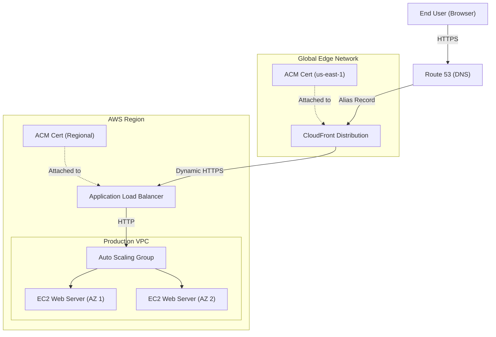

# Chapter 48 — Capstone Practical (Flagship Architecture)

---

## Lab Overview
| Item | Detail |
|------|--------|
| **Difficulty** | Advanced / Capstone |
| **Duration** | 90 - 120 minutes |
| **Cost** | Free tier eligible (except for Route 53 Domain registration) |
| **Prerequisites** | A registered domain name in Route 53 |
| **Core Services** | Route 53, ACM, CloudFront, ALB, EC2, ASG |

## Business Scenario
> Your company is launching a highly anticipated public-facing website. It needs to be highly available, scalable, secure (HTTPS everywhere), and cached globally for low latency. As the Lead Cloud Architect, you are tasked with deploying the "Flagship Production Architecture" from scratch.

## Architecture Diagram



---

## Step-by-Step Implementation Guide

### Step 1 — Register Domain & Request Certificates (ACM)
To serve HTTPS traffic, you need SSL/TLS certificates. Because CloudFront requires a certificate in `us-east-1` and your ALB requires a certificate in your specific region (if different), we will provision what is needed.

1. **Route 53 Domain**: Ensure you have a registered domain (e.g., `example.com`) in Route 53 Hosted Zones.
2. **Request Certificate for CloudFront (Global)**:
   - Navigate to **AWS Certificate Manager (ACM)** and switch region to **us-east-1 (N. Virginia)**.
   - Click **Request a certificate** → **Request a public certificate**.
   - Fully qualified domain name: `example.com` and `*.example.com`.
   - Validation method: **DNS validation**.
   - Click **Request**.
   - Open the certificate and click **Create records in Route 53** to validate it. Wait for status to become **Issued**.
3. **Request Certificate for ALB (Regional)**:
   - Switch ACM to your working region (e.g., `us-west-2`). (If you are already working in `us-east-1`, one certificate handles both).
   - Repeat the exact same request and DNS validation process for your regional ALB.

### Step 2 — Create the EC2 Launch Template
We need a blueprint for our Auto Scaling Group to launch web servers automatically.

1. Navigate to **EC2** → **Launch Templates** → **Create launch template**.
2. **Template name**: `Flagship-Web-Template`
3. **AMI**: Select Amazon Linux 2023.
4. **Instance type**: `t2.micro`.
5. **Security Group**: Create a new security group (`web-tier-sg`). Allow **HTTP (80)** and **HTTPS (443)** inbound from anywhere (we will lock this down later).
6. **Advanced Details (User Data)**:
   Scroll to the bottom and paste the following bash script to automatically start a web server:
   ```bash
   #!/bin/bash
   yum update -y
   yum install -y httpd
   systemctl start httpd
   systemctl enable httpd
   echo "<h1>Welcome to the Flagship Architecture running on $(hostname -f)</h1>" > /var/www/html/index.html
   ```
7. Click **Create launch template**.

### Step 3 — Create the Auto Scaling Group (ASG)
1. Navigate to **EC2** → **Auto Scaling Groups** → **Create Auto Scaling group**.
2. **Name**: `Flagship-Web-ASG`.
3. **Launch Template**: Select `Flagship-Web-Template` created in Step 2.
4. **Network**: Select your default VPC and choose at least **two different subnets** (Multi-AZ for High Availability).
5. **Load Balancing**: Skip this for now (we will attach it in the next step).
6. **Group size**: 
   - Desired capacity: 2
   - Minimum capacity: 2
   - Maximum capacity: 4
7. **Scaling policies**: Choose **Target tracking scaling policy**. Metric: **Average CPU utilization**, Target value: **50%**.
8. Skip to review and click **Create Auto Scaling group**.

### Step 4 — Create the Application Load Balancer (ALB)
The ALB will distribute traffic across the ASG and handle SSL termination.

1. Navigate to **EC2** → **Target Groups** → **Create target group**.
   - Target type: **Instances**.
   - Target group name: `Flagship-Web-TG`.
   - Protocol: **HTTP**, Port: **80**.
   - Click Next, skip registering targets (the ASG does this automatically), and click **Create**.
2. Navigate to **EC2** → **Load Balancers** → **Create load balancer** → **Application Load Balancer**.
   - **Name**: `Flagship-ALB`.
   - **Scheme**: Internet-facing.
   - **Network mapping**: Select your VPC and the same two subnets used in your ASG.
   - **Security groups**: Use a security group that allows HTTP/HTTPS from the internet.
   - **Listeners and routing**:
     - Protocol: **HTTPS (443)**.
     - Default action: Forward to `Flagship-Web-TG`.
   - **Secure listener settings**: Select the ACM certificate you created in your specific region (from Step 1).
3. Click **Create load balancer**.
4. **Attach ASG to ALB**: 
   - Go back to **Auto Scaling Groups** → select `Flagship-Web-ASG`.
   - Go to the **Load balancing** tab → **Edit**.
   - Select **Application, Network or Gateway Load Balancer target groups**.
   - Choose `Flagship-Web-TG` and save. 

### Step 5 — Configure CloudFront for Global Caching
CloudFront will cache the static content and terminate the global SSL connection, forwarding dynamic requests to the ALB.

1. Navigate to **CloudFront** → **Create Distribution**.
2. **Origin domain**: Select your ALB from the dropdown (e.g., `Flagship-ALB-12345.region.elb.amazonaws.com`).
3. **Protocol**: HTTP Only (since the ALB handles HTTPS termination, but for strict end-to-end you can configure ALB to trust CloudFront and use HTTPS origin). For this lab, select **Match Viewer**.
4. **Default cache behavior**:
   - Viewer protocol policy: **Redirect HTTP to HTTPS**.
   - Allowed HTTP methods: GET, HEAD, OPTIONS, PUT, POST, PATCH, DELETE.
   - Cache key and origin requests: Select **Cache policy and origin request policy**.
5. **Settings (Alternate Domain Names / CNAMEs)**:
   - Add your domain: `example.com` and `www.example.com`.
   - **Custom SSL certificate**: Select the `us-east-1` ACM certificate you created in Step 1.
6. Click **Create distribution**. (This takes 5-10 minutes to deploy).

### Step 6 — Point Route 53 to CloudFront
Finally, we update our DNS to point to the global edge network.

1. Navigate to **Route 53** → **Hosted zones** → select your domain.
2. Click **Create record**.
3. **Record name**: Leave blank for the root domain (`example.com`), or enter `www`.
4. **Record type**: `A - Routes traffic to an IPv4 address and some AWS resources`.
5. Toggle **Alias** to **On**.
6. **Route traffic to**: 
   - Choose **Alias to CloudFront distribution**.
   - Select your CloudFront distribution domain name (e.g., `d12345abcdef.cloudfront.net`).
7. Click **Create records**.

---

## 🎯 Verification and Testing
1. **Wait for Propagation**: Give DNS a few minutes to propagate.
2. **Access the Site**: Open a browser and navigate to `https://example.com`.
3. **Check SSL**: Click the padlock icon in the URL bar. Verify that the certificate is valid and issued by Amazon RSA.
4. **Check High Availability**: Refresh the page multiple times. You should see the hostname in the `<h1>` tag change as the ALB routes your requests between the two instances in your ASG.
5. **Check Scaling**: (Optional) Use a tool like Apache Benchmark (`ab`) to stress test your domain. Watch the ASG automatically provision a 3rd and 4th EC2 instance as CPU spikes!

## 🧹 Cleanup (Avoid Surprises on your Bill)
To avoid charges, tear down the architecture in reverse order:
1. Delete the Route 53 A-Record.
2. Disable and Delete the CloudFront Distribution.
3. Delete the ALB and Target Group.
4. Delete the Auto Scaling Group (this terminates the EC2 instances).
5. Delete the Launch Template.
6. Delete the ACM Certificates (optional, they are free, but good practice).
