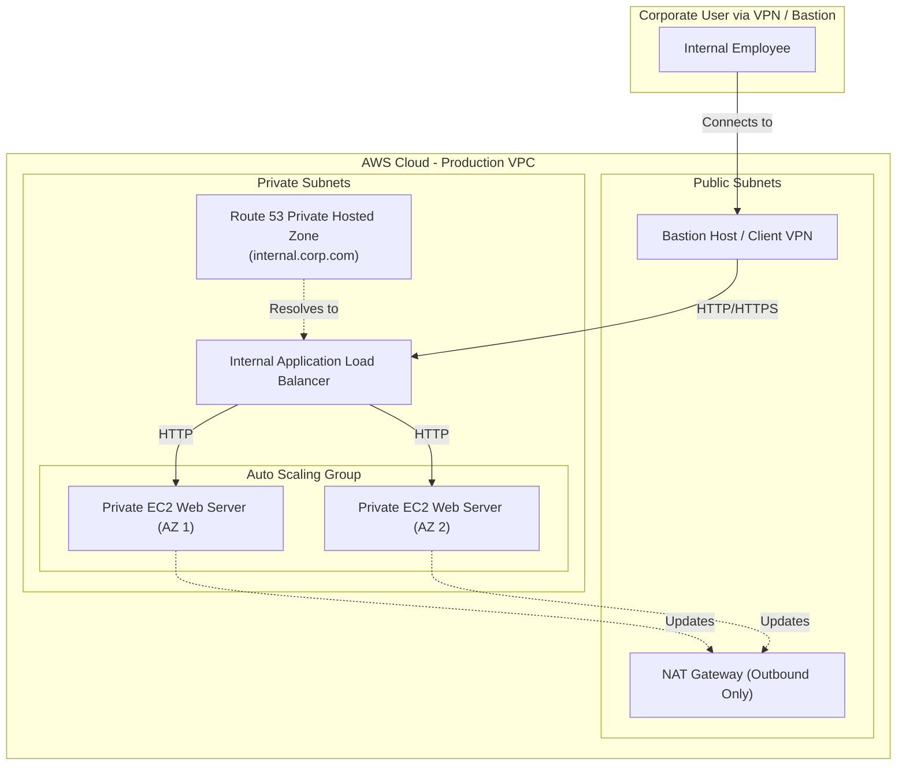

# Chapter 49 — Capstone Practical (Internal Corporate Architecture)

---

## Lab Overview
| Item | Detail |
|------|--------|
| **Difficulty** | Advanced / Capstone |
| **Duration** | 60 - 90 minutes |
| **Cost** | Minimal (Route 53 Private Hosted Zones and NAT/Endpoints incur small hourly charges) |
| **Prerequisites** | Understanding of VPCs, Private Subnets, and Internal DNS |
| **Core Services** | Route 53 (Private), Internal ALB, EC2, ASG, VPC Endpoints, Bastion/VPN |

## Business Scenario
> Your enterprise needs to host an internal employee portal (e.g., an intranet or HR dashboard). This website must **never** be accessible from the public internet. It must be hosted securely in private subnets, resolve via a private internal domain name, and be highly available. Employees will access it via a VPN or Bastion Host.

## Architecture Diagram



---

## Step-by-Step Implementation Guide

### Step 1 — Network Foundation (VPC & Subnets)
Since this is a strictly private architecture, your network boundaries are critical.
1. Navigate to **VPC** → **Create VPC** (Use the "VPC and more" wizard for speed).
2. **Name tag**: `Corp-Internal-VPC`
3. **Number of Availability Zones (AZs)**: 2
4. **Number of public subnets**: 2 (We need these for the NAT Gateway and Bastion Host).
5. **Number of private subnets**: 2 (This is where the ALB and EC2 instances will live).
6. **NAT Gateways**: 1 (in 1 AZ). *Note: The private EC2 instances need this to download web server packages, but it prevents inbound internet traffic.*
7. Click **Create VPC**.

### Step 2 — Create the Internal Application Load Balancer (ALB)
An Internal ALB routes traffic only within the VPC. It does not have a public IP address.
1. Navigate to **EC2** → **Target Groups** → **Create target group**.
   - Target type: **Instances**.
   - Target group name: `Internal-Web-TG`.
   - Protocol: **HTTP**, Port: **80**.
   - VPC: Select `Corp-Internal-VPC`.
   - Click Next and **Create**.
2. Navigate to **Load Balancers** → **Create load balancer** → **Application Load Balancer**.
   - **Name**: `Internal-Corp-ALB`.
   - **Scheme**: **Internal** (Crucial Step! Do NOT select Internet-facing).
   - **Network mapping**: Select `Corp-Internal-VPC` and the **Private Subnets**.
   - **Security groups**: Create/Select a security group that allows HTTP (80) inbound from the VPC CIDR block (e.g., `10.0.0.0/16`).
   - **Listeners and routing**: Forward HTTP 80 to `Internal-Web-TG`.
3. Click **Create load balancer**.

### Step 3 — Create Launch Template and Auto Scaling Group
We will launch our web servers directly into the private subnets.
1. Navigate to **EC2** → **Launch Templates** → **Create launch template**.
   - **Name**: `Internal-Web-Template`
   - **AMI**: Amazon Linux 2023.
   - **Instance type**: `t2.micro`.
   - **Network settings**: Create a security group `private-web-sg` allowing HTTP (80) ONLY from the `Internal-Corp-ALB` security group. Do not assign a public IP.
   - **User Data** (Advanced Details):
     ```bash
     #!/bin/bash
     yum update -y
     yum install -y httpd
     systemctl start httpd
     systemctl enable httpd
     echo "<h1>Welcome to the STRICTLY SECURE Internal Corporate Portal</h1>" > /var/www/html/index.html
     ```
2. Navigate to **Auto Scaling Groups** → **Create Auto Scaling group**.
   - **Name**: `Internal-Web-ASG`.
   - **Launch template**: `Internal-Web-Template`.
   - **Network**: Select `Corp-Internal-VPC` and the **Private Subnets**.
   - **Load balancing**: Attach to an existing target group → select `Internal-Web-TG`.
   - **Group size**: Desired: 2, Min: 2, Max: 4.
   - Click **Create**.

### Step 4 — Configure Route 53 Private Hosted Zone
Employees should access the site via a friendly internal URL (e.g., `portal.internal.corp`), not an ALB DNS string.
1. Navigate to **Route 53** → **Hosted zones** → **Create hosted zone**.
2. **Domain name**: `internal.corp` (or any custom internal domain).
3. **Type**: **Private hosted zone**.
4. **VPC ID**: Select `Corp-Internal-VPC`.
5. Click **Create hosted zone**.
6. Inside the new hosted zone, click **Create record**.
   - **Record name**: `portal` (Making the full URL `portal.internal.corp`).
   - **Record type**: A
   - Toggle **Alias** to **On**.
   - **Route traffic to**: Alias to Application and Classic Load Balancer → Choose your region → Select `Internal-Corp-ALB`.
7. Click **Create records**.

### Step 5 — Deploy a Bastion Host for Access
Because the website is completely private, you cannot access it from your personal laptop over the public internet. We must deploy a Bastion Host (jump box) in the public subnet to simulate an internal employee.
1. Navigate to **EC2** → **Launch Instance**.
2. **Name**: `Corporate-Bastion`.
3. **AMI**: Amazon Linux 2023.
4. **Network**: Select `Corp-Internal-VPC` and a **Public Subnet**.
5. **Auto-assign Public IP**: Enable.
6. **Security Group**: Allow SSH (22) from your specific IP address.
7. Click **Launch instance**.

---

## 🎯 Verification and Testing
To test this private architecture, you must act as an internal employee connected to the corporate network.

1. **SSH into the Bastion Host**: 
   Connect to the `Corporate-Bastion` instance using SSH. You are now "inside" the corporate VPC.
2. **Test Internal DNS**: 
   Run the following command from the Bastion terminal:
   ```bash
   curl http://portal.internal.corp
   ```
   *Note: Because the VPC is attached to the Route 53 Private Hosted Zone, the internal AWS DNS resolver automatically translates `portal.internal.corp` to the internal ALB's private IP addresses.*
3. **Verify Success**: You should see the HTML response: `<h1>Welcome to the STRICTLY SECURE Internal Corporate Portal</h1>`.
4. **Verify Privacy**: Try to `curl http://portal.internal.corp` or the ALB's DNS name directly from your local computer's terminal. It will fail, proving the architecture is completely shielded from the public internet.

## 🧹 Cleanup
To avoid ongoing charges for the NAT Gateway and Load Balancer:
1. Delete the Route 53 Private Hosted Zone.
2. Delete the Auto Scaling Group.
3. Delete the Internal ALB and Target Group.
4. Terminate the Bastion Host.
5. Delete the NAT Gateway (Wait a few minutes for it to delete).
6. Delete the `Corp-Internal-VPC`.
