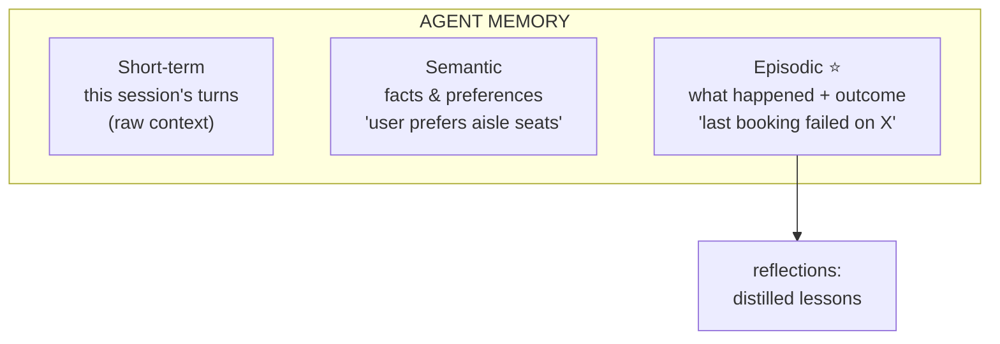
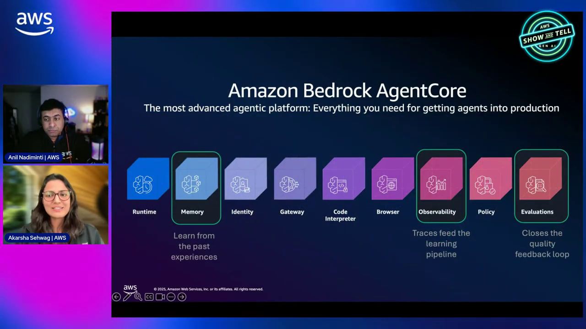
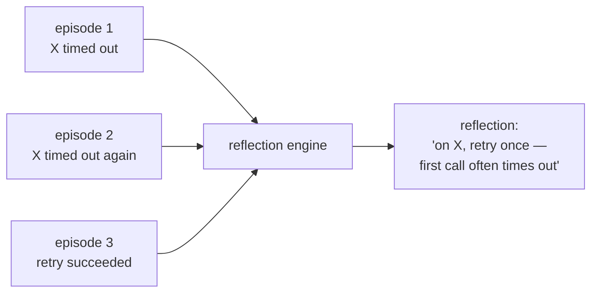

# AgentCore Episodic Memory Course — Chapter 1

# 🧠 Episodic Memory — Agents That Learn From Experience

## 🎬 About This Course — The Source Video

This course is built as **interactive, chapter-by-chapter notes** for the AWS Show & Tell episode **"Episodic memory and patterns"** — the memory tier that lets agents recall *what happened* and *what worked*, not just stored facts.

<VideoSection youtubeId="1EEIGsKIjGA" title="Episodic memory and patterns | AWS Show & Tell" />

---

## Chapter Goal

By the end of this chapter, the learner will be able to:

- Distinguish **episodic** memory from semantic facts and short-term context.
- Define an **episode** — a bounded stretch of interaction with an outcome.
- Explain **reflections** — distilled lessons extracted from episodes.
- Understand why episodic memory is what lets an agent improve over time.

---

## 1.1 🗂️ The Three Memory Tiers — Where Episodic Fits



| Tier | Holds | Example |
|---|---|---|
| Short-term | Recent turns of *this* conversation | The last few messages |
| Semantic | Extracted **facts** | "prefers aisle seats", "is a Pro member" |
| **Episodic** | **Episodes** — what happened and how it went | "when we tried X, it timed out; retry worked" |



<InfoCard title="Episodic = experience, not facts">
Semantic memory is *what is true*. Episodic memory is *what happened* — sequences of actions and their outcomes. That's the difference between knowing a fact and remembering an experience.
</InfoCard>

---

## 1.2 📦 What Is an Episode

An **episode** is a bounded unit of agent experience — the events of one task/interaction plus how it ended:

```text
episode
 ├── events: the turns / tool calls / steps taken
 ├── outcome: success / failure / what resulted
 └── context: when, which session, which actor
```

Think "the agent's diary entry" — not a fact, but a recorded experience with a result.

<ConceptCard title="Why bounded matters">
An episode has a beginning and an end and an *outcome* — so the agent can later ask "when I last did this task, how did it go?" Raw transcripts don't carry that structure; episodes do.
</ConceptCard>

---

## 1.3 🪞 Reflections — Lessons From Episodes

Episodes accumulate; **reflections** distill them into reusable lessons:



- **Episode** = what happened once
- **Reflection** = the generalized lesson across episodes — the *pattern*

This is how the agent gets better: not by re-reading raw history, but by storing distilled "here's what works" insights derived from experience.

---

## 1.4 🆚 Episodic vs Semantic — The Boundary

| | Semantic | Episodic |
|---|---|---|
| Stores | Facts, preferences | Events + outcomes |
| Answers | "what is true about the user?" | "what happened when we tried this?" |
| Produces | Entity/fact records | Episodes → **reflections** |
| Value | Personalization | Learning / avoiding repeated mistakes |

<WarningCard title="Don't conflate them">
"User prefers aisle seats" is semantic — a fact. "Last booking we retried the payment call and it worked" is episodic — an experience. Storing episodes as facts loses the outcome; storing facts as episodes loses the distilled truth.
</WarningCard>

---

## 🧠 Knowledge Check

<Quiz question="What does episodic memory store that semantic doesn't?" options={["Facts","Episodes — sequences of actions and their outcomes — plus reflections distilled from them","User preferences","Session IDs"]} answerIndex={1} explanation="Semantic = facts ('prefers aisle'). Episodic = experiences ('when we tried X it timed out; retry worked') and the lessons drawn from them." />

<Quiz question="What is an 'episode'?" options={["A whole user account","A bounded unit of agent experience — the steps taken and the outcome","A model call","A token"]} answerIndex={1} explanation="An episode is a bounded stretch of interaction with a recorded outcome — the agent's diary entry, not a fact." />

<Quiz question="What do 'reflections' add on top of episodes?" options={["More raw turns","Distilled, generalized lessons across episodes — 'here's what works' — rather than re-reading raw history","Logging","Auth"]} answerIndex={1} explanation="Reflections extract the pattern from many episodes — so the agent recalls a lesson, not a transcript." />

---

## 🏁 Chapter 1 Summary

- Three tiers: short-term (turns), semantic (facts), **episodic (experiences + outcomes)**.
- An **episode** is a bounded unit of experience with an outcome — "what happened."
- **Reflections** distill episodes into reusable lessons — how the agent improves.
- Episodic ≠ semantic: experiences with outcomes vs distilled facts — keep them distinct.

**Next:** Chapter 2 — how episodes and reflections are stored, retrieved and scoped.
