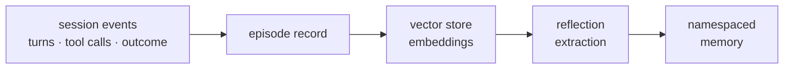
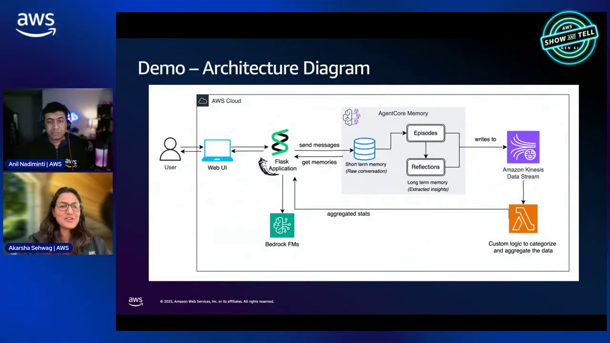
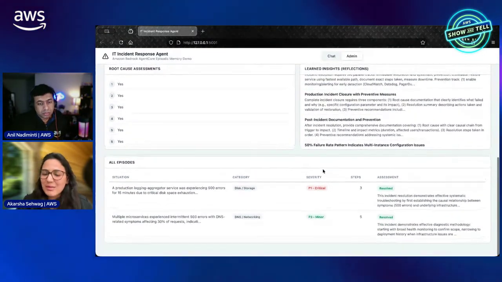
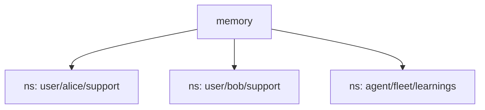
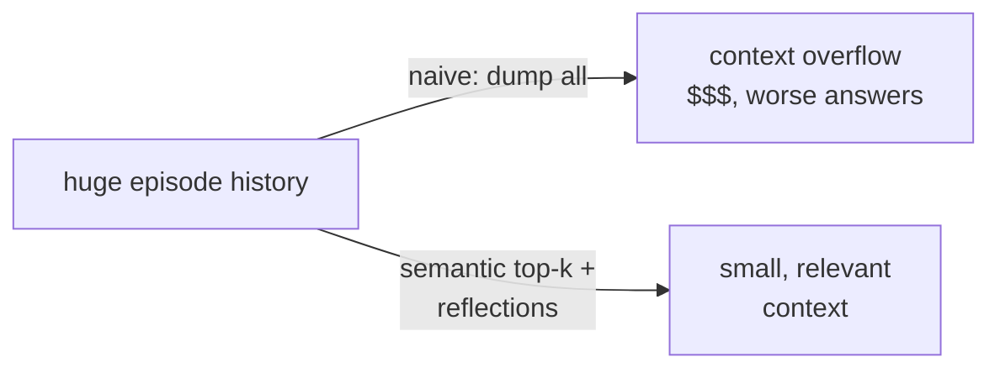

# AgentCore Episodic Memory Course — Chapter 2

# 🔄 Storing, Retrieving & Scoping Episodes

## Chapter Goal

By the end of this chapter, the learner will be able to:

- Explain how episodes get **recorded** and later **retrieved semantically**.
- Use **namespaces** and identifiers to scope episodic memory correctly.
- Describe how reflections turn retrieved episodes into injected context.
- Apply context-window discipline — retrieve the right memories, not all of them.

---

## 2.1 💾 How Episodes Get Recorded

As the agent works, the interaction is captured into episodic memory as episodes:



| Stage | What happens |
|---|---|
| Capture | Session turns + tool calls + outcome → an episode |
| Embed | Episode embedded → stored in a vector store |
| Reflect | Over episodes → distilled reflections |
| Namespace | Scoped by actor/agent/use-case identifiers |

<InfoCard title="Episodes are embedded, not just logged">
Episodes go into a vector store — so retrieval is *semantic* ("have we seen a situation like this?"), not keyword matching.
</InfoCard>



---

## 2.2 🔎 Semantic Retrieval — Pull the Relevant Ones

When the agent faces a task, relevant episodes/reflections are retrieved by similarity:

```text
current task → embed query → retrieve top-k episodes/reflections
→ inject into prompt → agent recalls "last time this happened…"
```

The point: the agent doesn't replay history — it recalls the *most relevant past experiences* for the current situation.

- **Query-driven** — retrieve by similarity to the current task
- **Top-k bounded** — only the most relevant few enter the context
- **Reflections preferred** — distilled lessons inject cleaner than raw episodes



---

## 2.3 🏷️ Namespaces & Identifiers

Episodes must be scoped — you don't want one user's experiences leaking into another's recall:



| Identifier | Scopes episodes to |
|---|---|
| **Actor / user ID** | One user's experiences |
| **Agent ID** | One agent's learnings |
| **Session ID** | A single conversation |
| **Namespace** | A use-case/feature boundary |

<TipCard title="Per-user vs shared namespaces">
Per-user namespaces → personalized recall. A *shared* namespace → fleet learnings ("this tool path usually works") that benefit every user — choose deliberately which experiences are private vs generalizable.
</TipCard>

---

## 2.4 🪟 Context-Window Discipline

The episode stresses token efficiency — you can't stuff all history into context:

| Approach | Cost |
|---|---|
| Dump all past episodes | Context blows up, cost/accuracy both suffer |
| **Retrieve top-k relevant** | Small, targeted recall — the point of episodic memory |
| Inject reflections over raw episodes | Lessons are compact; episodes are verbose |



<ConceptCard title="Reflections are the token-efficient form">
Injecting a one-line lesson ('retry X once') costs far fewer tokens than a raw episode transcript — and generalizes better. Retrieve episodes for detail; prefer reflections for injection.
</ConceptCard>

---

## 🧠 Knowledge Check

<Quiz question="How are episodes retrieved?" options={["Chronologically, all of them","Semantically — the current task is embedded and top-k relevant episodes/reflections returned","Randomly","By file name"]} answerIndex={1} explanation="Episodes are embedded into a vector store; retrieval pulls the most similar few — 'have we seen this before?' — not all history." />

<Quiz question="Why scope episodic memory with namespaces/actor IDs?" options={["For billing","To keep one user's experiences from leaking into another's recall — and to choose private vs fleet-shared learnings","It's required by IAM","For speed only"]} answerIndex={1} explanation="Namespaces scope recall — per-user for personalization, shared for generalizable fleet lessons; getting the boundary right matters." />

<Quiz question="Most token-efficient way to give the agent past experience?" options={["Dump all episodes","Inject distilled reflections — one-line lessons cost far fewer tokens than raw episode transcripts","Increase the context window","Disable memory"]} answerIndex={1} explanation="Reflections are compact lessons; retrieving top-k and preferring reflections keeps recall targeted and cheap." />

---

## 🏁 Chapter 2 Summary

- Episodes are **captured → embedded → reflected → namespaced**.
- Retrieval is **semantic top-k** — the most relevant experiences for the current task.
- **Namespaces/actor IDs** scope recall — per-user vs shared fleet learnings.
- Prefer **reflections** for injection — compact lessons beat raw episodes on token cost.

**Next:** Chapter 3 — feedback capture and the improvement loop.
