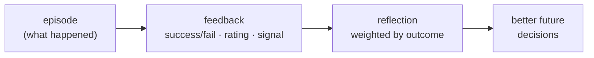
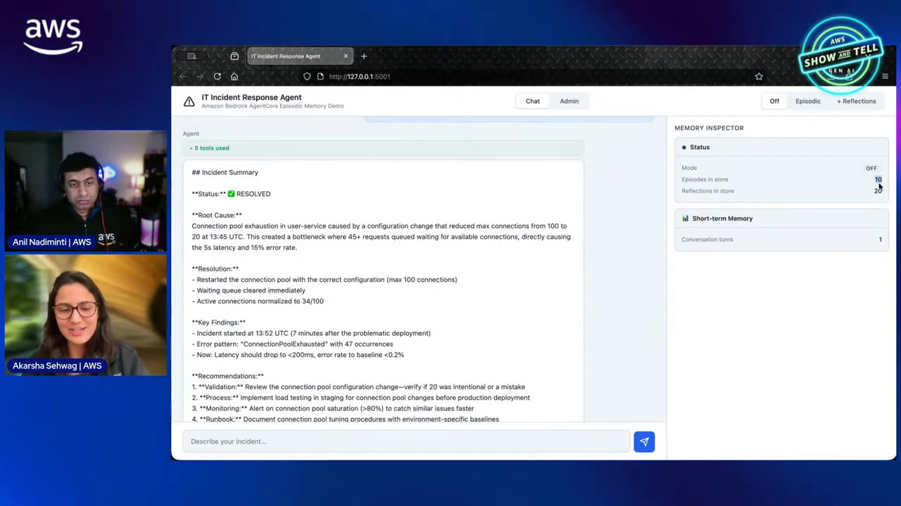
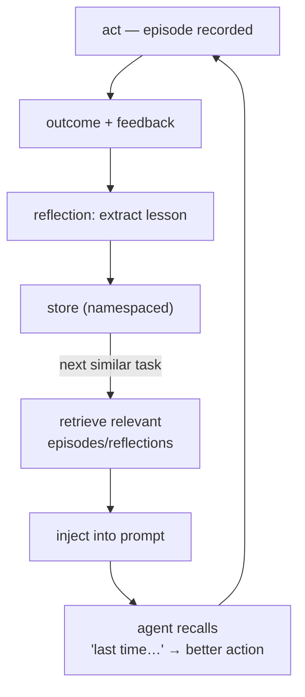
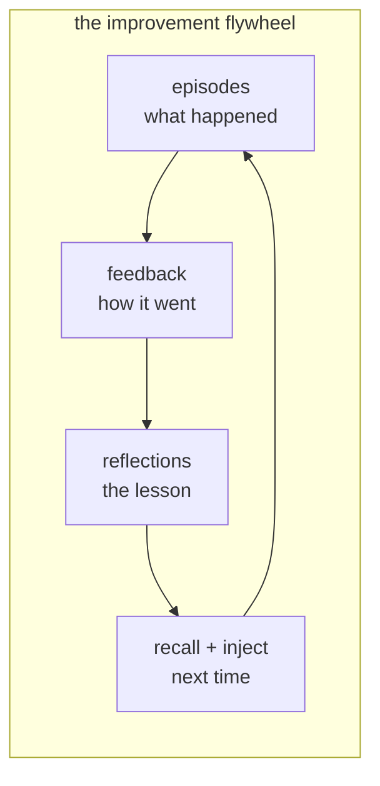
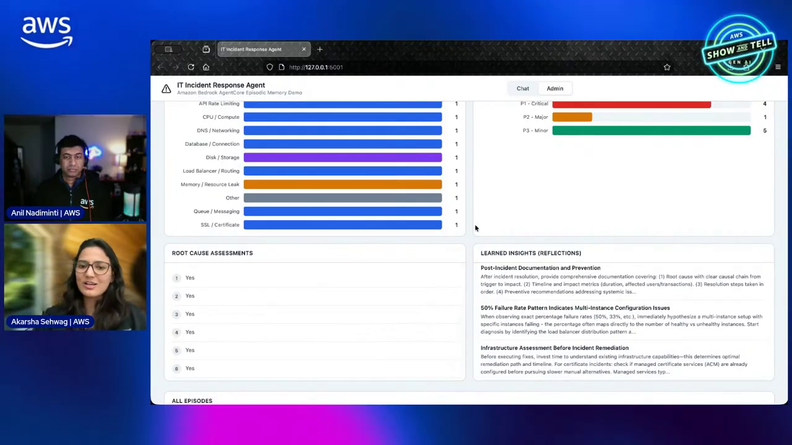
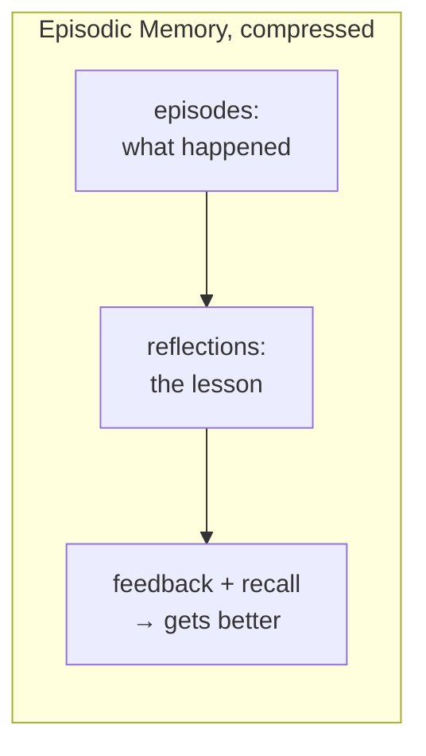

# AgentCore Episodic Memory Course — Chapter 3

# 🔁 Feedback Capture & the Improvement Loop

## Chapter Goal

By the end of this chapter, the learner will be able to:

- Explain how **feedback** becomes part of episodic memory.
- Close the loop — experience → reflection → better future behavior.
- Identify the identifiers that tie feedback to the right episodes.
- Describe the end-state: an agent that measurably improves over time.

---

## 3.1 📣 Feedback — Marking Episodes as Good or Bad

Episodes record what happened; **feedback** records whether it was good:



| Feedback source | Signal |
|---|---|
| **Outcome** | Did the task succeed? |
| **Explicit** | User rating / correction |
| **Implicit** | Retry needed, escalation, tool error |
| **Evaluation** | Eval scores feeding back (ties to Ep10) |

<InfoCard title="Outcome is the teacher">
An episode without feedback is just a recording. Attaching "this worked / this failed" is what lets reflections learn *what* to repeat and what to avoid.
</InfoCard>



---

## 3.2 🔁 The Improvement Loop

Put it together and the agent gets a learning cycle:



Each pass: experience → outcome → lesson → recall → better experience. That's the "gets better over time" the episode promises — not a bigger model, a remembered history.

---

## 3.3 🏷️ Identifiers Tie It Together

Feedback only helps if it lands on the right memory — the identifiers from Ch2 do the binding:

```text
feedback
 ├── session_id   → which conversation
 ├── actor_id     → which user
 ├── agent_id     → which agent
 └── episode ref  → which experience this judges
```

- Without the episode ref, a "that was wrong" can't update the right memory
- Actor/agent scoping decides whether feedback improves *this user's* agent or the *fleet's*

<WarningCard title="Misattributed feedback is worse than none">
If feedback lands on the wrong episode or the wrong namespace, the agent learns the wrong lesson — e.g. a shared-namespace "this path fails" poisoning everyone's recall. Bind feedback to the episode explicitly.
</WarningCard>

---

## 3.4 🎯 The End State — Agents That Improve

The episode's payoff — what episodic memory + feedback + reflections buys you:

| Without episodic memory | With it |
|---|---|
| Repeats the same mistakes | Recalls "that timed out, retry once" |
| Every session is day one | Lessons persist across sessions |
| Improving = retraining/tuning | Improving = accumulating reflections |
| Same behavior for all users | Per-user recall → personalized |



<TipCard title="This is where Evals and Memory meet">
Evaluation scores (Ep10) are a natural feedback source — a low faithfulness score on a session is exactly the "this went badly" signal that should mark its episodes for reflection.
</TipCard>



---

## 🧠 Knowledge Check

<Quiz question="What does feedback add to an episode?" options={["More turns","Whether the experience was good/bad — the signal that lets reflections learn what to repeat vs avoid","A model call","Nothing"]} answerIndex={1} explanation="Episodes record what happened; feedback records how it went — that's what makes reflections able to learn." />

<Quiz question="Why must feedback carry identifiers (session/actor/episode ref)?" options={["For billing","So it lands on the right memory — misattributed feedback teaches the wrong lesson","It's optional","For tracing"]} answerIndex={1} explanation="Feedback bound to the wrong episode/namespace teaches the wrong lesson — bind it explicitly to the experience it judges." />

<Quiz question="What makes the agent 'improve over time' here?" options={["A bigger model","Experience → feedback → reflection → recall → better action — accumulated lessons, not retraining","More tokens","Longer prompts"]} answerIndex={1} explanation="The flywheel — episodes + feedback distilled into reflections and recalled next time — is improvement via memory, not model changes." />

---

## 🏁 Chapter 3 Summary — and the Course

- **Feedback** marks episodes good/bad — the teacher signal.
- The **loop**: act → outcome → reflect → store → recall → act better.
- **Identifiers** bind feedback to the right memory — misattribution teaches wrong lessons.
- End state: agents that improve via **accumulated reflections**, not retraining — with Evals feeding the outcome signal.



### Watch the Original Tutorial

<VideoSection youtubeId="1EEIGsKIjGA" title="Episodic memory and patterns | AWS Show & Tell" />

**Related:** *AgentCore Memory* covers STM/LTM and namespaces; *AgentCore Evaluations* supplies the outcome feedback signal.
