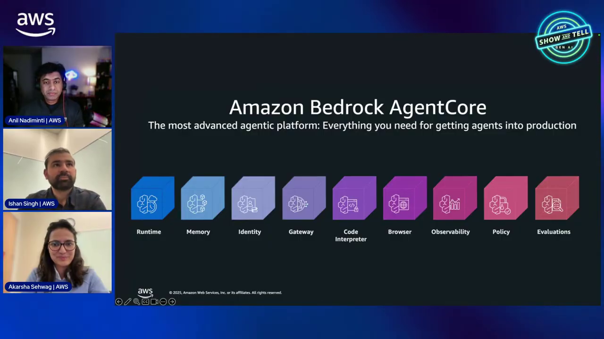
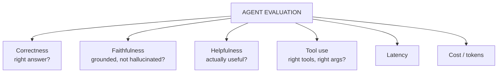
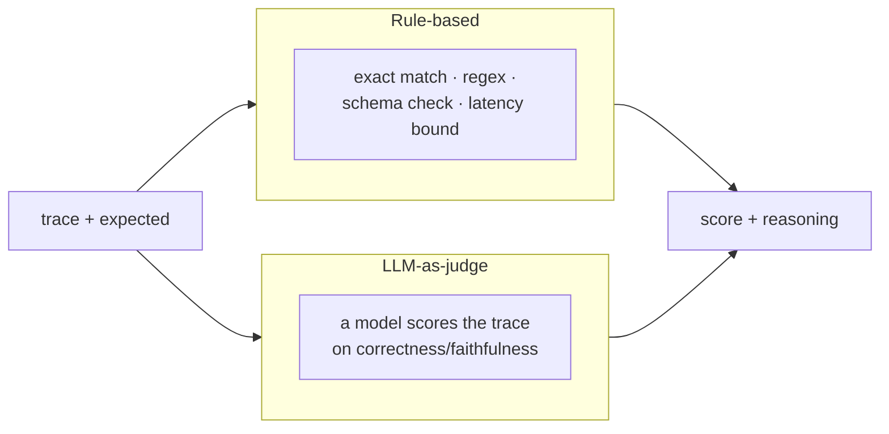

# AgentCore Evaluations Course — Chapter 1

# ✅ Why Agents Need Evaluation — Beyond "It Ran"

## 🎬 About This Course — The Source Video

This course is built as **interactive, chapter-by-chapter notes** for the AWS Show & Tell episode **"AgentCore Evaluations"** — how to *score* agent quality, not just observe it ran.

<VideoSection youtubeId="i0h7xA8cqYs" title="AgentCore Evaluations | AWS Show & Tell" />

---

## Chapter Goal

By the end of this chapter, the learner will be able to:

- Distinguish **observability** (what happened) from **evaluation** (was it good).
- Name the evaluation dimensions — correctness, faithfulness, helpfulness, latency, cost.
- Understand **judges** — LLM-scored vs rule-based.
- Explain session-level vs single-turn evaluation.

---

## 1.1 ⚖️ Observability vs Evaluation

The episode opens with the key distinction:

| | Observability | Evaluation |
|---|---|---|
| Question | *What did the agent do?* | *Was what it did good?* |
| Signal | Traces, spans, tokens | Scores, pass/fail, judge reasoning |
| When | Always-on | On-demand or continuous sampling |

| Answers | "tool X timed out" | "the answer was wrong / unfaithful" |

<InfoCard title="You need both">
Observability shows the trace; evaluation scores it. A trace with no errors can still contain a *wrong* answer — only evaluation catches that.
</InfoCard>

---

## 1.2 📏 The Evaluation Dimensions

What an agent gets scored on:

| Dimension | What it checks |
|---|---|
| **Correctness** | Did it reach the right answer/result? |
| **Faithfulness** | Is the answer grounded in retrieved/tool data — not hallucinated? |
| **Helpfulness** | Was the response actually useful to the user? |
| **Tool use** | Correct tool, correct arguments, efficient path? |
| **Latency / Cost** | Fast enough, cheap enough? |

<ConceptCard title="Faithfulness is the agentic one">
For agents, *faithfulness* matters most — the answer must be grounded in what the tools actually returned, not a plausible-sounding fabrication. This is the dimension generic LLM evals often miss.
</ConceptCard>

---

## 1.3 🧑‍⚖️ Judges — Who Scores

Evaluation needs a scorer. Two families:

- **Rule-based** — deterministic, cheap, great for exact-match and latency bounds
- **LLM-as-judge** — a model reads the trace/answer and scores open-ended quality (correctness, helpfulness, faithfulness), returning a score *plus reasoning*

<TipCard title="LLM judges give reasoning, not just a number">
The value of an LLM judge is the *explanation* — "the answer contradicted the tool output at step 3" — which points you at the fix, unlike a bare score.
</TipCard>

---

## 1.4 🔗 Turn-Level vs Session-Level

Agents are multi-turn — so evaluation can happen at two grains:

- **Turn-level** — score a single invoke's answer
- **Session-level** — score the whole conversation: did it accomplish the goal across turns? Did it stay coherent?

Session-level is the harder and more meaningful one for agents — a correct turn 3 can still follow a broken turn 1.

---

## 🧠 Knowledge Check

<Quiz question="What does evaluation add that observability doesn't?" options={["Traces","A quality judgment — was the answer correct/faithful/helpful — where observability only shows what happened","Logs","Metrics"]} answerIndex={1} explanation="Observability records the trace; evaluation scores its quality. A clean trace can still contain a wrong answer." />

<Quiz question="Which dimension is most distinctively 'agentic'?" options={["Latency","Faithfulness — is the answer grounded in what the tools actually returned","Throughput","Uptime"]} answerIndex={1} explanation="Agents must ground answers in tool output — faithfulness catches the plausible-but-fabricated answers generic evals miss." />

<Quiz question="Why prefer an LLM-as-judge for open-ended quality?" options={["It's cheaper","It returns a score plus reasoning — the explanation points at the fix","It's deterministic","It needs no model"]} answerIndex={1} explanation="LLM judges explain *why* a response failed (e.g. 'contradicted tool output at step 3'), which is actionable in a way a bare score isn't." />

---

## 🏁 Chapter 1 Summary

- **Observability** = what happened; **evaluation** = was it good. You need both.
- Dimensions: correctness, **faithfulness**, helpfulness, tool use, latency, cost.
- Judges: deterministic rules for checks, **LLM-as-judge** for open-ended quality — with reasoning.
- Evaluate per-turn *and* per-session — multi-turn coherence is the agentic challenge.

**Next:** Chapter 2 — on-demand evaluations and configuration.
