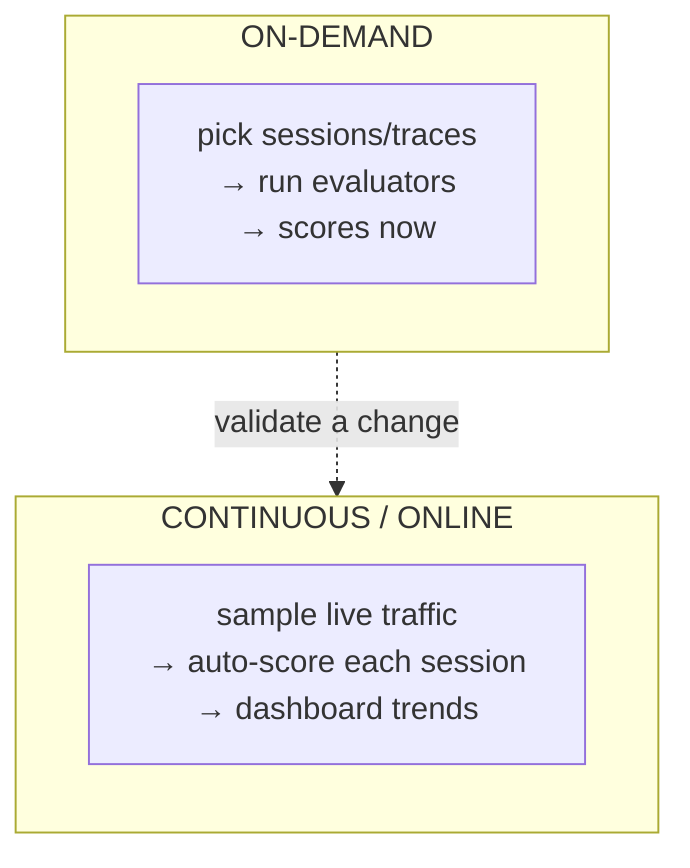
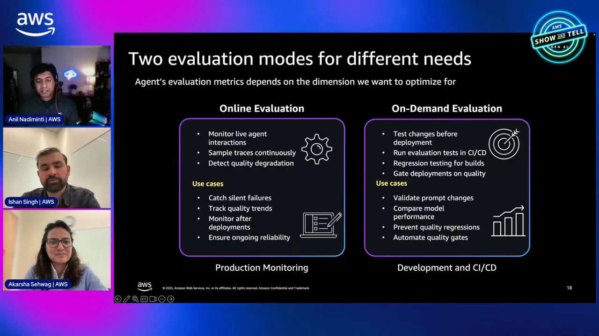
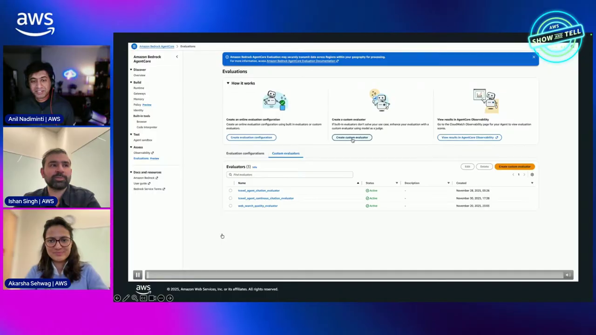
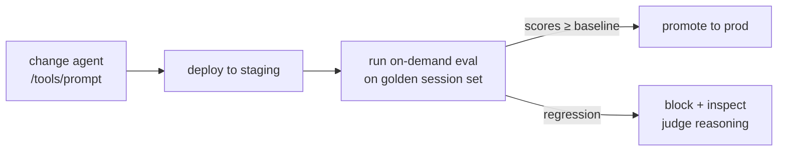

# AgentCore Evaluations Course — Chapter 2

# ⚙️ On-Demand Evaluations & Configuration

## Chapter Goal

By the end of this chapter, the learner will be able to:

- Run an **on-demand evaluation** against an agent's sessions/traces.
- Configure what gets evaluated — which sessions, which metrics, which judge.
- Understand built-in evaluators vs custom ones.
- Set up continuous/online evaluation sampling.

---

## 2.1 ▶️ On-Demand vs Continuous

Two modes the episode covers:



| | On-demand | Continuous |
|---|---|---|
| Trigger | You run it | Automatic on live traffic |
| Scope | Selected sessions | Sampled % of all sessions |
| Use | Validate a change, debug a complaint | Always-on quality monitoring |



<InfoCard title="On-demand for debugging, continuous for confidence">
Run on-demand to investigate "why did the agent say that" on a specific session; turn on continuous to watch quality drift over time.
</InfoCard>

---

## 2.2 🧾 What a Run Evaluates

An on-demand evaluation reads the **session's traces** — the same OTel spans from Observability — and scores them:

```text
input:   agent_id + session_ids (or a trace set)
config:  which evaluators, judge model, sampling
output:  per-metric score + judge reasoning per session
```

The evaluators consume the trace — user input, retrieved/tool context, final answer — so faithfulness can be scored against *what the tools actually returned*.

---

## 2.3 🧰 Built-In vs Custom Evaluators

| | Built-in | Custom |
|---|---|---|
| What | Correctness, faithfulness, helpfulness, goal-completion, tool-use | Your domain's criteria |
| Config | Pick + enable | Provide prompt/rubric or rules |
| Judge | Managed LLM judge | Your judge model + rubric |

```python
# shape of a custom evaluator config
evaluator = {
    "name": "refund-policy-faithfulness",
    "type": "llm_judge",
    "rubric": "Score 0-1: does the answer match the refund policy returned by the tool?",
    "model": "<judge-model-id>",
}
```

<TipCard title="Start built-in, add custom for your domain">
The built-ins cover the general dimensions; add a custom evaluator with your rubric when the domain has specific correctness rules (e.g. policy compliance).
</TipCard>



---

## 2.4 🔧 The Config Surface

What you configure per agent:

- **Evaluators** — which metrics to run (enable/disable each)
- **Judge model** — which model scores (for LLM-judge metrics)
- **Sampling rate** — for continuous eval, what % of sessions get scored (cost control)
- **Scope** — which sessions on-demand (by ID, time range, filter)

<WarningCard title="Judging costs tokens too">
Continuous eval on 100% of traffic doubles your model calls. Sample — e.g. 5–10% — and raise it only around a launch or a regression hunt.
</WarningCard>

---

## 2.5 🔁 Fit Into CI/CD

On-demand evals slot into your release loop — the same place you'd run tests:



Keep a **golden set** of representative sessions; re-score on every change; block promotion on regression — the judge reasoning tells you what broke.

---

## 🧠 Knowledge Check

<Quiz question="When to use on-demand vs continuous evaluation?" options={["On-demand always","On-demand to investigate specific sessions/validate a change; continuous to sample live traffic for drift","Continuous only for cost","They're identical"]} answerIndex={1} explanation="On-demand for targeted debugging and change validation; continuous for always-on quality monitoring on sampled traffic." />

<Quiz question="What does an evaluator read to score faithfulness?" options={["Only the prompt","The session's traces — user input, tool outputs, and the final answer","Only the final answer","CloudWatch alarms"]} answerIndex={1} explanation="Faithfulness is scored against the trace — the answer is checked against what the tools actually returned." />

<Quiz question="Why sample continuous evaluation rather than 100%?" options={["Sampling is inaccurate","Judging costs model calls — sampling controls eval cost while still catching drift","It's required","Traces aren't stored"]} answerIndex={1} explanation="Every judged session is more model calls — sample a % for steady-state, raise it around launches or regressions." />

---

## 🏁 Chapter 2 Summary

- **On-demand** for targeted runs; **continuous** for always-on quality on sampled traffic.
- Evaluators consume the session's traces — enabling grounded faithfulness scoring.
- Mix **built-in** evaluators with **custom** rubric-driven ones for domain rules.
- Control **sampling** for cost; wire on-demand evals into CI/CD against a golden set.

**Next:** Chapter 3 — dashboards, judges and reading the results.
