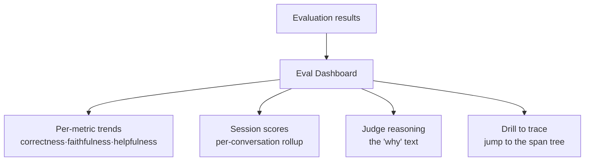
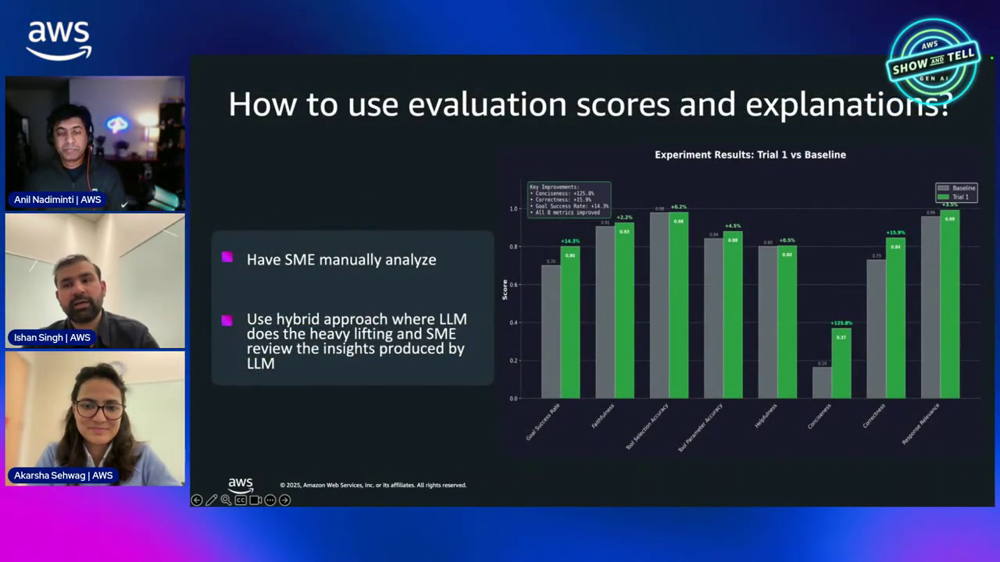
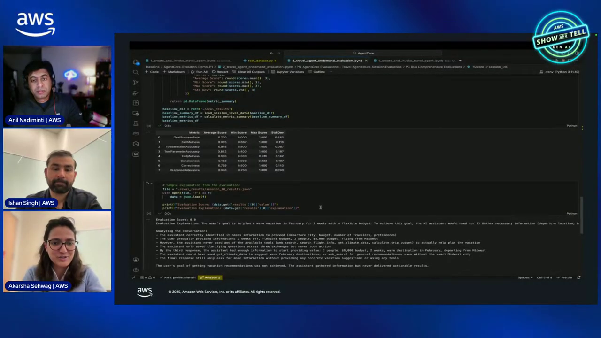
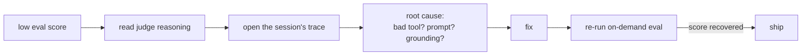
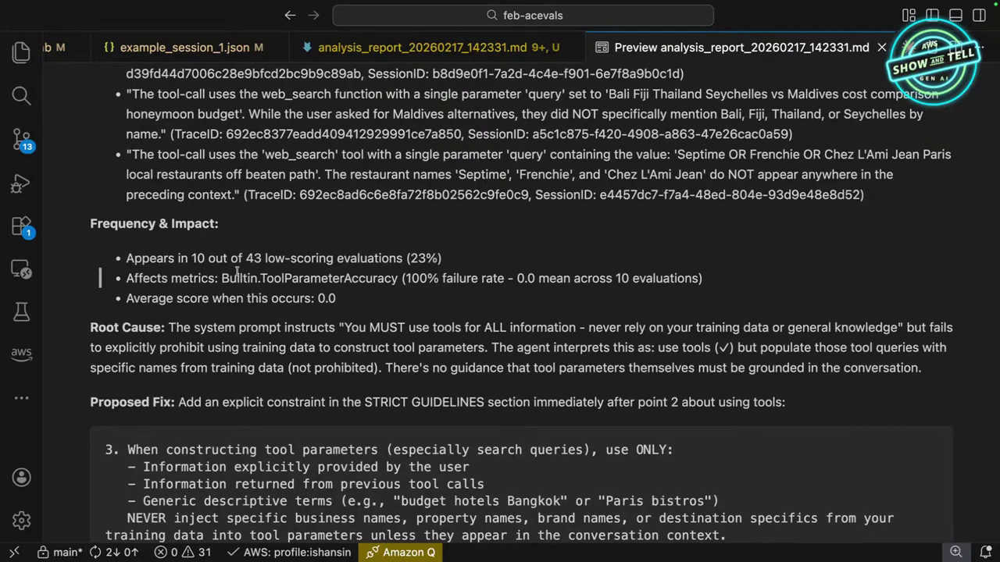
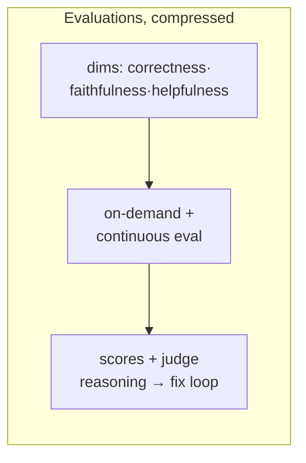

# AgentCore Evaluations Course — Chapter 3

# 📈 Dashboards, Judges and Acting on Scores

## Chapter Goal

By the end of this chapter, the learner will be able to:

- Read the **evaluation dashboard** — score trends, per-metric breakdowns, session drill-down.
- Interpret **judge reasoning** — the "why" behind a low score.
- Close the loop — low score → trace → root cause → fix → re-eval.
- Build a durable quality practice around evals.

---

## 3.1 📊 The Evaluation Dashboard

Scores land in a dashboard next to the observability views — quality alongside telemetry:



| Panel | Answers |
|---|---|
| Metric trends | Is quality rising/drifting over time? |
| Session scores | Which conversations scored poorly? |
| Judge reasoning | *Why* did it score low? |
| Trace drill-down | Where in the steps did it go wrong? |



---

## 3.2 🧑‍⚖️ Reading Judge Reasoning

The most valuable output isn't the number — it's the judge's explanation:

```text
faithfulness: 0.3
reasoning: "The agent claimed the item was 'in warranty',
but the check_warranty tool returned status=expired.
The answer contradicts the tool output at step 3."
```

That reasoning does three things:

- **Pinpoints the step** — "at step 3" — where grounding broke
- **Names the contradiction** — agent said X, tool said Y
- **Points at the fix** — prompt, tool contract, or grounding logic



<ConceptCard title="Reasoning > score">
A 0.3 tells you *it's* wrong; the reasoning tells you *where* and *why* — that's what makes LLM-judge evals actionable rather than just a red/green meter.
</ConceptCard>

---

## 3.3 🔁 The Fix Loop — Score to Ship

Evaluation and observability compose into a closed loop:



| Symptom in reasoning | Likely root cause |
|---|---|
| "contradicts tool output" | Grounding/prompt — model ignoring tool result |
| "called wrong tool" | Tool descriptions or planning |
| "right answer, too slow" | Latency — a slow tool, not quality |
| "didn't use retrieved context" | Memory/retrieval not wired into prompt |

---

## 3.4 📉 Trends, Drift and the Golden Set

Beyond single scores, watch the **trend**:

- **Drift** — a model update or prompt change quietly lowers faithfulness → continuous eval catches it
- **Golden set** — a fixed set of representative sessions; re-score on every deploy for a stable baseline
- **Per-metric split** — maybe correctness is fine but helpfulness is low → different fix than a correctness regression

<TipCard title="Baseline before you change">
Record eval scores on the current version *before* a model or prompt change — the delta on the golden set is your regression signal, not the absolute number.
</TipCard>



---

## 🧠 Knowledge Check

<Quiz question="What's the most actionable part of an LLM-judge result?" options={["The number","The reasoning — it pinpoints the step and the contradiction, pointing at the fix","The timestamp","The model name"]} answerIndex={1} explanation="Reasoning like 'contradicts tool output at step 3' tells you where and why it failed — actionable, unlike a bare score." />

<Quiz question="'Answer contradicts the tool output' suggests which fix?" options={["A faster tool","Grounding/prompt — the model is ignoring or overriding the tool result","More retries","A bigger model always"]} answerIndex={1} explanation="That reasoning pattern is a grounding failure — fix the prompt/logic that should respect tool output." />

<Quiz question="How do you detect a silent quality regression after a model/prompt change?" options={["Wait for complaints","Re-run on-demand eval on a golden session set and compare to baseline","Check uptime","Increase sampling"]} answerIndex={1} explanation="A fixed golden set + comparing scores before/after the change surfaces regressions that metrics alone won't." />

---

## 🏁 Chapter 3 Summary — and the Course

- The dashboard shows **metric trends, per-session scores, judge reasoning, and trace drill-down**.
- Judge **reasoning** is the actionable part — it names the step and the contradiction.
- The loop: low score → reasoning → trace → root cause → fix → re-eval.
- Watch **trends and drift**; keep a golden set; baseline before changes.



### Watch the Original Tutorial

<VideoSection youtubeId="i0h7xA8cqYs" title="AgentCore Evaluations | AWS Show & Tell" />

**Related:** *AgentCore Observability* — evals consume the same traces that observability produces.
