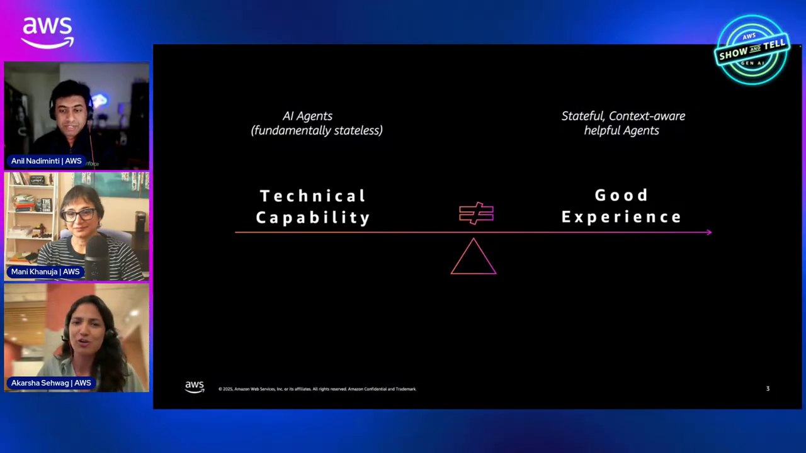
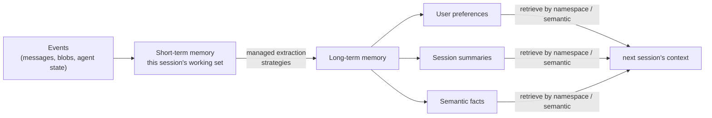
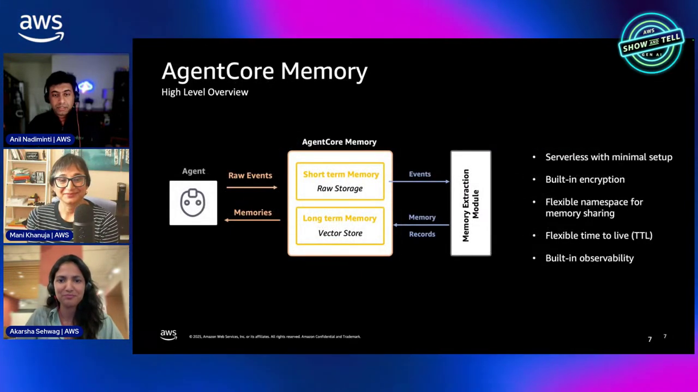

# AgentCore Memory Course — Chapter 1

# 🧠 AgentCore Memory — Short-Term vs Long-Term

## 🎬 About This Course — The Source Video

This course is built as **interactive, chapter-by-chapter notes** for the AWS Show & Tell episode **"AgentCore Memory deep dive"** — host **Anil Nadiminti** with **Mani** and **Akasha** unpacking how memory makes agents context-aware.

<VideoSection youtubeId="-N4v6-kJgwA" title="AgentCore Memory Deep Dive | AWS Show & Tell" />

---

## Chapter Goal

By the end of this chapter, the learner will be able to:

- Explain why memory is *the* blocker for agent adoption — not model quality.
- Distinguish **short-term memory** (session events) from **long-term memory** (extracted facts/preferences).
- Describe the event model — `create_event`, timestamps, branching, blobs vs conversations.
- Name the three identifiers: `memoryId`, `actorId`, `sessionId`.

---

## 1.1 🚧 Why Memory Is the Real Bottleneck

The episode frames it early (~03:00–07:30): models keep getting better, so model quality is no longer the top reason agents disappoint. **Memory is.**

Two failure modes without it:

| Without memory | What the user experiences |
|---|---|
| No session state | Every turn forgets what you just said |
| No persistence | Next session starts from zero — "explain your problem all over again" |

The concrete example (~12:00): *"If you always tell your agent you prefer Python — that's repetitive input. Why can't it just remember?"* That's the adoption gap.

---

## 1.2 🗄️ Two Flavors of Memory

| | **Short-term** | **Long-term** |
|---|---|---|
| What | Conversation turns, agent state, session data | Extracted preferences, facts, summaries |
| Scope | This session | Persists across sessions |
| Written | Every `create_event` | By the service's extraction pipeline |
| Storage | Session-scoped store | Vector-backed, searchable |

<ConceptCard title="You write short-term; Memory derives long-term">
Your code posts **events** — messages, blobs, state — to short-term memory. AgentCore Memory then runs **extraction strategies** on them to produce long-term memories (preferences/facts/summaries) automatically. You don't hand-summarize anything.
</ConceptCard>

---

## 1.3 📦 The Event Model — What You Actually Write

Everything memory holds is an **event** (~20:00–25:30):

- `create_event` — post a conversational message, a blob of agent state, or a checkpoint
- Events carry a **timestamp** — ordering matters
- **Branching** — organize into logical branches ("food prefs" vs "travel prefs")
- Payload = conversation messages **or binary blob** — whatever state matters

The three identifiers that scope everything:

| ID | Scopes to |
|---|---|
| `memoryId` | The memory resource itself |
| `actorId` | The user — "who this memory is about" |
| `sessionId` | The conversation instance |

<InfoCard title="Namespacing is the key to multi-tenant memory">
Events live under namespaces like `support/customer/{actorId}/preferences/` — the `actorId` placeholder resolves per user. One memory resource serves every user, cleanly isolated by namespace.
</InfoCard>

---

## 1.4 ⚙️ Why It's a Service (Not Just a Vector DB)

From the "why not just build it" answer (~18:00–19:30):

- **Serverless, minimal setup** — create a memory resource, post events
- **Different storage per flavor** — STM is a session/event store; LTM is vector-backed — each optimized for its job
- **Managed extraction** — the STM→LTM pipeline (summarize, extract prefs/facts) runs for you
- **Strategies are configurable** — pick what to extract, override prompts/models if needed

---

## 🧠 Knowledge Check

<Quiz question="What's the difference between short-term and long-term memory?" options={["STM is RAM, LTM is disk","STM = session events you write; LTM = extracted preferences/facts/summaries the service derives from them","STM is faster","They're the same thing"]} answerIndex={1} explanation="You post raw events (STM); Memory's extraction pipeline produces long-term memories (preferences, facts, summaries) from them automatically." />

<Quiz question="Which three identifiers scope memory?" options={["user, role, region","memoryId, actorId, sessionId","table, partition, key","account, vpc, subnet"]} answerIndex={1} explanation="memoryId is the resource, actorId is the user the memory is about, sessionId is the conversation instance." />

<Quiz question="Can an event store non-conversation data?" options={["No — only chat messages","Yes — blobs of binary/agent state too, not just messages","Only JSON","Only strings under 1KB"]} answerIndex={1} explanation="Events can be conversational messages OR binary blobs — checkpoints, agent state, whatever you need to persist." />

---

## 🏁 Chapter 1 Summary

- Memory — not model quality — is what separates a demo agent from a useful one.
- **STM** = events you post; **LTM** = preferences/facts/summaries the service extracts from them.
- Everything's an **event** with a timestamp, namespaced by `actorId`/`sessionId`.
- Serverless + managed extraction = you get both flavors without building pipelines.

**Next:** Chapter 2 — the strategies, namespaces, and the consolidation step that keeps memories accurate over time.
