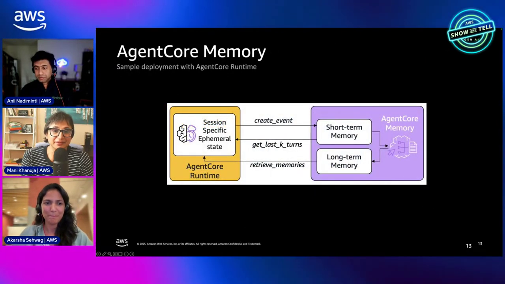
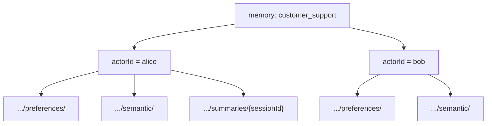
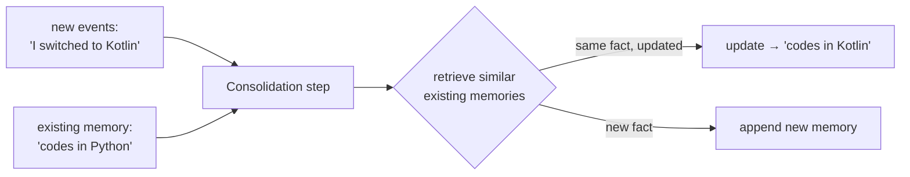
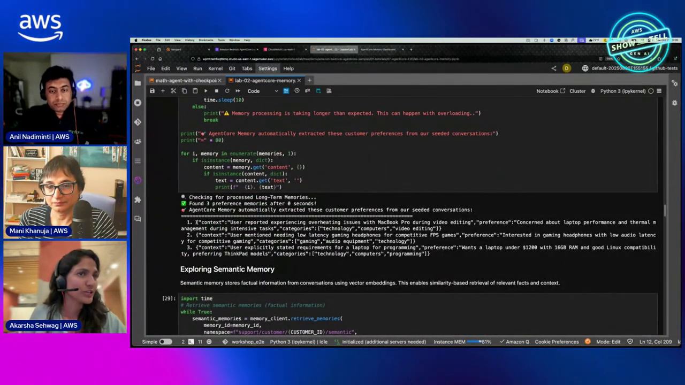

# AgentCore Memory Course — Chapter 2

# 🗂️ Strategies, Namespaces & Consolidation — How Long-Term Memory Stays Useful

## Chapter Goal

By the end of this chapter, the learner will be able to:

- Configure **extraction strategies** — what kinds of long-term memories to derive.
- Use **namespaces** (`{actorId}` templates) to organize memories per user.
- Override strategies when the default extraction doesn't fit.
- Explain **consolidation** — how new events update rather than duplicate memories.

---

## 2.1 🎛️ Extraction Strategies — Choose What to Remember

Raw events are noise; strategies are the signal (~34:30). When you create a memory resource you pick which long-term memory types it extracts:

```python
client.create_memory(
    name="customer_support_memory",
    strategies=[
        {"name": "UserPreferences", "type": "userPreference",
         "namespaces": ["support/customer/{actorId}/preferences/"]},
        {"name": "SemanticFacts", "type": "semantic",
         "namespaces": ["support/customer/{actorId}/semantic/"]},
        {"name": "SessionSummaries", "type": "summary",
         "namespaces": ["support/customer/{actorId}/summaries/{sessionId}"]},
    ],
)
```

| Strategy type | Extracts | Example |
|---|---|---|
| `userPreference` | Likes, dislikes, settings | "codes in Python", "prefers evening flights" |
| `semantic` | Facts worth recalling | "favorite device is Gaming Console Pro" |
| `summary` | Per-session recap | "last session: warranty expired complaint" |

<ConceptCard title="Override when the default misses">
The episode calls this out (~31:30): a travel agent might care that you like beach vacations but *not* that you take coffee black or code in Python. If the default strategy extracts too much, scope it down — or write a custom pipeline with your own prompts/models.
</ConceptCard>



---

## 2.2 🗂️ Namespaces — The Organization Layer

Namespaces are how memories stay per-user and per-purpose (~27:00–30:00):



- `{actorId}` in the template resolves to the actual user at write/read time
- `{sessionId}` scopes session summaries to their conversation
- Retrieval: `retrieve_memories(namespace=".../preferences/", query="...")` — keyword, namespace-prefix, or **semantic search**

<TipCard title="Namespace = the multi-tenant boundary">
One memory resource serves all users — namespaces ensure Alice's preferences never surface in Bob's context. Design the namespace hierarchy before you write events.
</TipCard>

---

## 2.3 🔁 Consolidation — How Memories Update, Not Just Append

A subtle but crucial step (~36:00–38:00): when new events arrive, Memory doesn't just append — it **consolidates**:



- Retrieves similar existing long-term memories from the vector store
- Decides **update vs. append** — facts that change get updated, new facts get added
- This is what keeps memory *accurate* over time — not a graveyard of stale facts

<WarningCard title="This is why 'remember everything' fails">
Without consolidation, "I like Paris" (5 years ago) and "I don't like Paris now" both persist — and the agent happily uses the stale one. Consolidation reconciles them.
</WarningCard>

---

## 2.4 🔍 Retrieving — The Read Side

Three retrieval modes, all namespaced (~39:20 in ep01 recap / ~39:00 here):

| Mode | Call shape | When |
|---|---|---|
| **Namespace prefix** | `retrieve_memories(namespace_prefix=".../preferences/")` | Pull a whole category |
| **Semantic search** | `retrieve_memories(query="favorite device")` | "Find what's relevant to this turn" |
| **Raw events** | `list_events` | Session playback / debugging |



---

## 🧠 Knowledge Check

<Quiz question="What do extraction strategies control?" options={["How fast memory responds","Which kinds of long-term memories get derived from events — preferences, semantic facts, summaries","The memory's size","The retention period"]} answerIndex={1} explanation="Strategies define what the pipeline extracts; namespaces within each say where it lands." />

<Quiz question="What does {actorId} do in a namespace?" options={["It's a fixed string","Resolves to the actual user at runtime — isolates memories per user in one shared resource","It's the agent's name","It sets the region"]} answerIndex={1} explanation="The placeholder binds the namespace to whoever the actor is — the multi-tenancy boundary." />

<Quiz question="What does consolidation do?" options={["Compresses storage","Compares new events against existing long-term memories and updates changed facts instead of duplicating","Deletes old events","Batches API calls"]} answerIndex={1} explanation="Consolidation retrieves similar existing memories and updates them — 'codes in Python' becomes 'codes in Kotlin' instead of coexisting." />

---

## 🏁 Chapter 2 Summary

- **Strategies** pick what long-term memory extracts — `userPreference`, `semantic`, `summary` — override or roll your own.
- **Namespaces** (`{actorId}`/`{sessionId}` templates) isolate per-user, per-category memories in one shared resource.
- **Consolidation** keeps memory truthful — update changed facts, append genuinely new ones.
- Retrieve by namespace, keyword, or semantic search — or replay raw events for debugging.

**Next:** Chapter 3 — wiring memory into a Strands agent via hooks and watching it remember in the memory browser.
