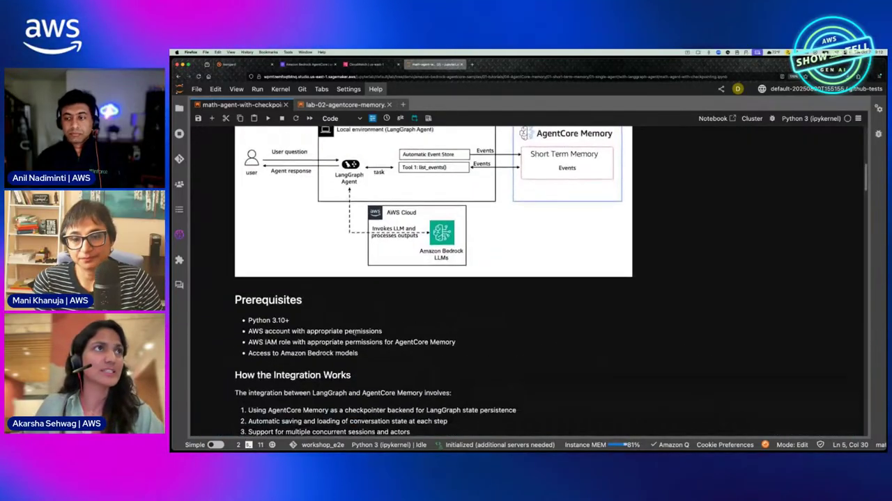
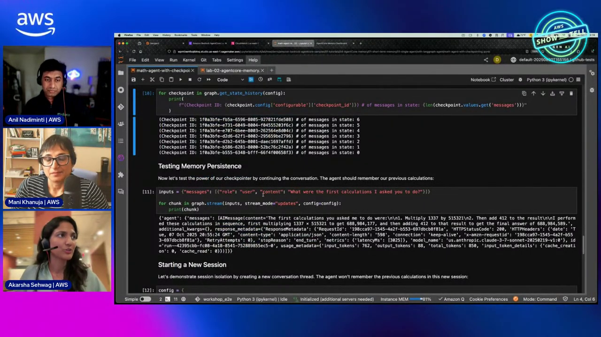
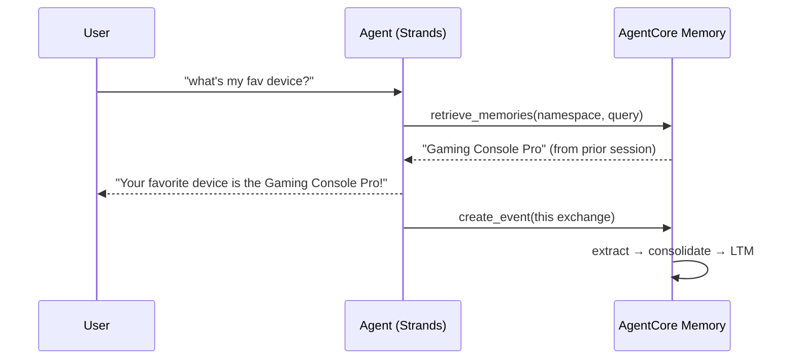
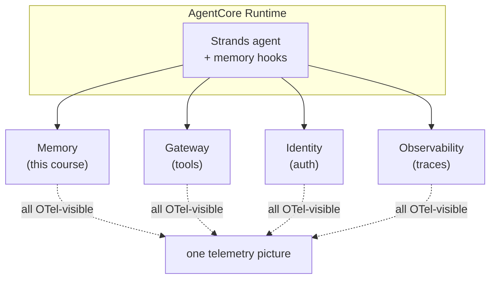
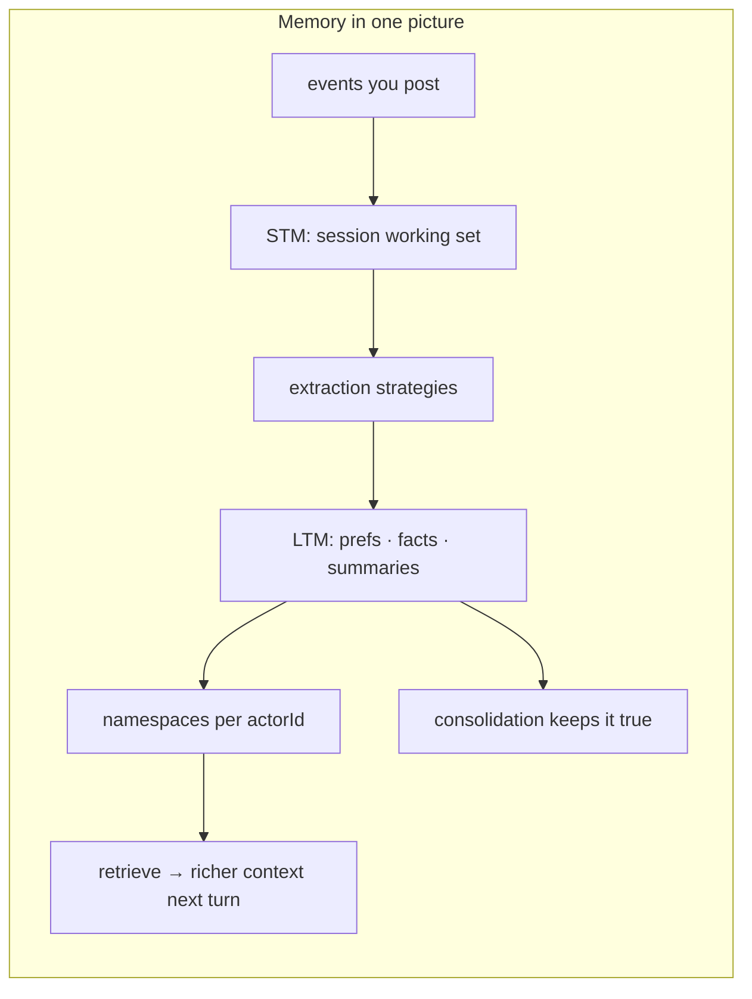

# AgentCore Memory Course — Chapter 3

# 🪝 Memory in Action — Strands Hooks & the Memory Browser

## Chapter Goal

By the end of this chapter, the learner will be able to:

- Wire memory into a Strands agent with the **memory client** + `create_event` + `retrieve_memories`.
- See the demo's pattern — batch previous interactions, send as events, retrieve memories.
- Use the **memory browser** to inspect what's stored per actor.
- Understand why deployment on Runtime is the recommended home for memory-using agents.

---

## 3.1 🔌 Setting Up Memory — Create Once, Reuse

Setup (~42:00):

```python
from bedrock_agentcore.memory import MemoryClient

client = MemoryClient(region_name="us-west-2")

# ⚠️ create_memory creates a *resource* — call once, store the ID
memory = client.create_memory(name="customer_support_memory",
                              strategies=[...])
memory_id = memory["id"]
```

<WarningCard title="create_memory ≠ a lightweight call">
It provisions the memory resource itself — call it once at setup and persist the returned `memory_id`. Calling it per-request would try to create a new resource each time (~45:00).
</WarningCard>



---

## 3.2 📨 Writing Events — Batch or Stream

The demo (~54:00) feeds prior interactions as events — batched or one-by-one, your choice:

```python
client.create_event(
    memory_id=memory_id,
    actor_id="customer-42",
    session_id="session-001",
    messages=[("I love the Gaming Console Pro", "USER"),
              ("Noted — it's your favorite device", "ASSISTANT")],
)
```

- Events carry **actor + session** — no manual state management, the agent knows who it's talking to
- Batch prior history on a returning user, or stream events as the conversation happens
- Includes agent state blobs if you need more than messages





---

## 3.3 🖥️ The Memory Browser — See What's Stored

A real gem (~48:00): a **memory browser** the team built — inspect what's actually in memory per actor:

- Pick an `actorId` → see their preferences, semantic facts, session summaries
- Browse raw events and branches
- Confirm extraction strategies are producing what you expected

<TipCard title="Debug memory like you debug a DB">
When the agent "remembers wrong", open the browser — did the event land? Did extraction produce the fact? Under the right namespace? The browser answers all three.
</TipCard>

---

## 3.4 🚀 Why Deploy on Runtime

Asked why Runtime vs ECS/Fargate (~39:00): *"I prefer Runtime — why build everything yourself?"* The composition:



- Session isolation + memory namespaces = per-user state done right
- `context.session_id` from Runtime == the `session_id` memory scopes by — they fit
- One observability surface for model + tools + memory calls

---

## 3.5 🧭 Putting Memory to Work — Patterns

| Goal | Pattern |
|---|---|
| Personalize replies | On init, inject `.../preferences/` memories into context |
| Continue a conversation | Inject `.../summaries/{sessionId}` |
| Remember facts | Semantic retrieve on each turn |
| Persist agent state | Blob events, restore on next session |

---

## 🧠 Knowledge Check

<Quiz question="Why call create_memory only once?" options={["It's slow","It provisions the resource — repeated calls try to create new resources; store the returned memory_id","It costs money","It's not idempotent"]} answerIndex={1} explanation="create_memory provisions the memory resource. Setup once, reuse the ID — it's not a per-turn call." />

<Quiz question="What does the memory browser let you do?" options={["Edit user data","Inspect per-actor memories — preferences, facts, summaries — plus raw events and branches","Reset the vault","Tune the model"]} answerIndex={1} explanation="It's an inspection view: see what extraction produced per actor, under which namespaces, and the raw events behind it." />

<Quiz question="How do Runtime session_id and memory session_id relate?" options={["They're unrelated","The runtime's context.session_id is what memory scopes by — same value, natural fit","Memory generates its own","One overrides the other"]} answerIndex={1} explanation="Runtime hands you context.session_id per session — pass it to memory's sessionId so the same session boundary applies." />

---

## 🏁 Chapter 3 Summary — and the Course

- `MemoryClient` — `create_memory` once; `create_event` per turn; `retrieve_memories` by namespace/semantic.
- Batch prior history or stream events — the agent just talks; memory handles persistence.
- The **memory browser** makes stored state inspectable — essential for debugging "it remembered wrong".
- Runtime + Memory fit naturally: session boundaries, isolation, and telemetry line up.



### Watch the Original Tutorial

<VideoSection youtubeId="-N4v6-kJgwA" title="AgentCore Memory Deep Dive | AWS Show & Tell" />

**Related:** *Episodic Memory & Patterns* (ep 12) goes further — episodes, reflections, and deriving insights across sessions.
