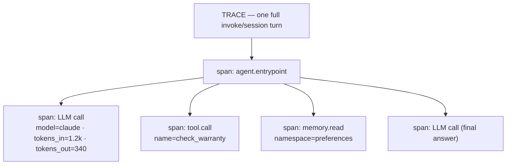
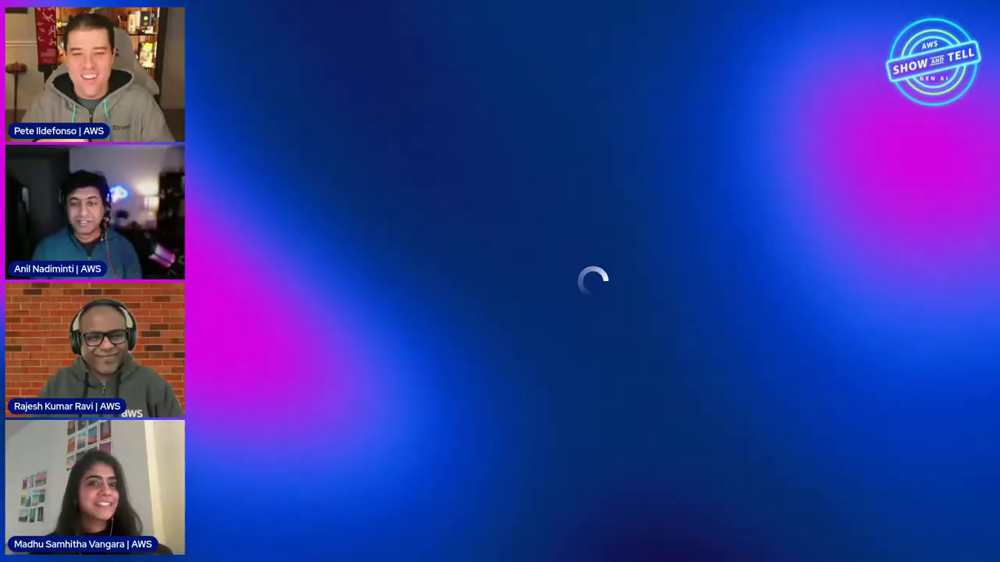
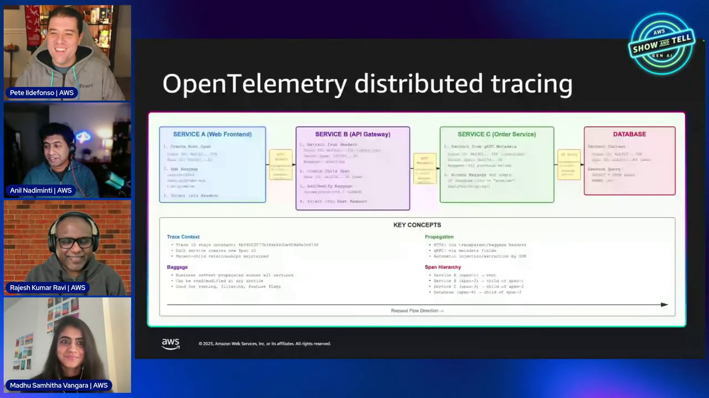

# AgentCore Observability Course — Chapter 1

# 📡 OpenTelemetry — Spans, Traces and What Agents Emit

## 🎬 About This Course — The Source Video

This course is built as **interactive, chapter-by-chapter notes** for the AWS Show & Tell episode **"AgentCore Observability"** — a deep dive into how every agentic interaction becomes queryable telemetry.

<VideoSection youtubeId="wWQgawUPr1k" title="AgentCore Observability | AWS Show & Tell" />

---

## Chapter Goal

By the end of this chapter, the learner will be able to:

- Explain **traces, spans and attributes** in the agent context.
- Describe what AgentCore Runtime emits automatically — no instrumentation needed.
- Follow a single agent turn through a trace — model call, tool calls, memory ops.
- Understand why agent observability differs from classic APM.

---

## 1.1 🔭 Why Agent Observability Is Different

Classic APM answers "is the service up and fast?" Agents need more (~early episode): the agent is *non-deterministic* — the same input can take different tool paths, different model calls, different costs.

| Classic APM asks | Agent observability adds |
|---|---|
| Latency? Errors? | **Which tools** did it pick — and why? |
| Throughput? | **Token usage** per turn — cost signal |
| Uptime? | **Session** continuity — memory hits/misses |
| Traces per request | Traces per **reasoning step** |

<InfoCard title="The core promise">
AgentCore Runtime emits **OpenTelemetry telemetry automatically** — every invoke becomes a trace with spans for model calls, tool invocations, memory reads/writes and gateway hops. Zero instrumentation code in your agent.
</InfoCard>

---

## 1.2 🧱 Traces, Spans, Attributes — The Vocabulary



- **Trace** — the whole request; identified by trace ID + session ID
- **Span** — one operation (model call, tool call, memory op); has duration + status
- **Attributes** — metadata on the span: model id, token counts, tool name, latency, errors



---

## 1.3 📤 What Gets Emitted Automatically

The episode catalogs the auto-emitted telemetry:

| Signal | Contents |
|---|---|
| **Traces** | Span tree per invoke — model + tools + memory |
| **Metrics** | Latency, token usage, error rates, session counts |
| **Logs** | Agent stdout/stderr, platform events |
| **Dimensions** | agent ID, session ID, model, tool names |

<ConceptCard title="Standard OTel — not proprietary">
Everything is emitted as standard OpenTelemetry — meaning it can flow to CloudWatch (default) **or any OTel-compatible backend** (Datadog, Dynatrace, Grafana…). No vendor lock-in on the observability layer.
</ConceptCard>

---

## 1.4 🔗 The Correlation Keys

What makes it queryable — the IDs stamped on every span:

- **Session ID** — groups all turns in a conversation (and pins the microVM)
- **Trace ID** — one request's full span tree
- **Agent/Runtime ARN** — which agent version served it
- **Span kind** — LLM vs tool vs memory vs gateway

```text
query shape: session_id = "sess-abc" → all turns of that conversation
             trace_id   = "t-xyz"    → the span tree of one invoke
```



---

## 🧠 Knowledge Check

<Quiz question="Why does agent observability go beyond classic APM?" options={["It doesn't","Agents are non-deterministic — you must observe which tools were picked, token cost, and reasoning steps, not just latency","APM handles agents fine","Agents don't emit telemetry"]} answerIndex={1} explanation="Same input → different tool paths/costs. Agent observability tracks tool choice, token usage and per-step reasoning, not just service health." />

<Quiz question="How much instrumentation does your agent code need for AgentCore telemetry?" options={["Full OTel SDK setup","None — Runtime emits OTel traces/metrics/logs automatically","One decorator per function","A sidecar container"]} answerIndex={1} explanation="Runtime auto-emits OpenTelemetry for every invoke — model calls, tools, memory — with no code changes." />

<Quiz question="What ID groups all turns of one conversation?" options={["Trace ID","Session ID","Span ID","Model ID"]} answerIndex={1} explanation="Session ID correlates every turn; trace ID identifies a single invoke's span tree." />

---

## 🏁 Chapter 1 Summary

- Agents need observability beyond APM — tool choice, token cost, reasoning steps.
- Runtime emits **standard OTel** automatically — traces, metrics, logs, per-invoke.
- Correlation keys: session ID (conversation), trace ID (request), agent ARN, span kind.

**Next:** Chapter 2 — the CloudWatch GenAI dashboard and reading a real trace.
