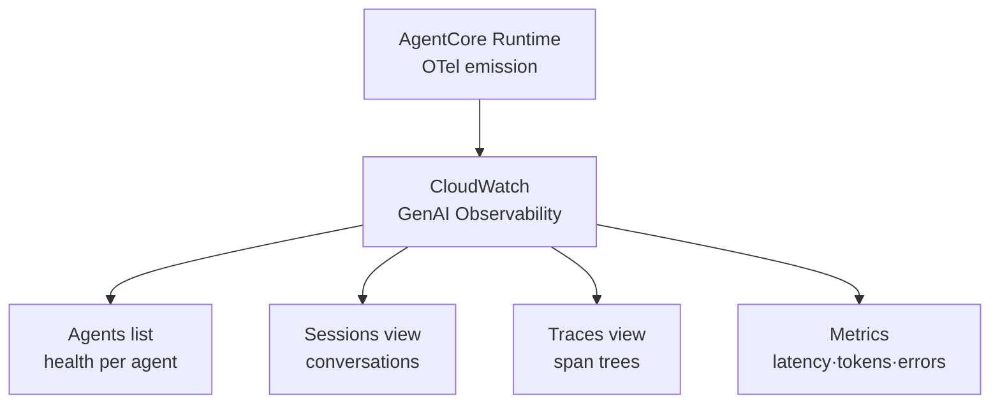
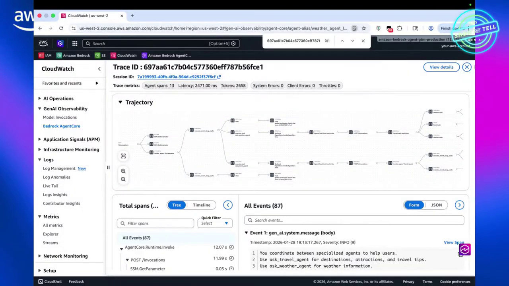
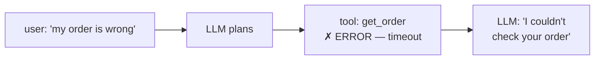

# AgentCore Observability Course — Chapter 2

# 📊 The CloudWatch GenAI Dashboard — Reading a Live Trace

## Chapter Goal

By the end of this chapter, the learner will be able to:

- Navigate the **CloudWatch GenAI Observability** dashboard for AgentCore agents.
- Read a trace — span tree, model calls, tool calls, durations, token counts.
- Use the aggregate views — sessions, latency, errors, token spend.
- Diagnose a real failure or slowdown from the trace.

---

## 2.1 🖥️ The Dashboard — Where Telemetry Lands

AgentCore telemetry flows into **CloudWatch GenAI Observability** — a purpose-built view for agents, models and tools:



| View | Answers |
|---|---|
| Agents | Which agents are running, error rates, invocation volume |
| Sessions | Each conversation — turns, duration, token totals |
| Traces | The span tree of a single invoke |
| Metrics | Aggregate latency / tokens / errors over time |

<InfoCard title="No config needed">
Because Runtime emits standard OTel and CloudWatch is the default sink, the dashboard populates the moment your first invoke lands — nothing to wire up.
</InfoCard>


---

## 2.2 🔍 Reading a Trace — The Span Tree

Opening one trace shows the reasoning path as a waterfall:

```text
invoke  .....................  4.2s  total
 ├─ LLM call (plan)              1.1s   tokens: 890 in / 120 out
 ├─ tool.call check_warranty      0.6s   ✓
 ├─ tool.call get_order           0.4s   ✓
 ├─ memory.read preferences       0.05s  hit
 └─ LLM call (compose answer)     2.0s   tokens: 1.4k in / 300 out
```

What to notice on each span:

- **Duration** — where the time went (usually the final LLM call dominates)
- **Token attributes** — `tokens_in`/`tokens_out` per model call → cost
- **Tool spans** — which tool, its args (redacted where sensitive), its result status
- **Status/error** — a failed tool shows the exception inline



---

## 2.3 📈 Aggregates — Session & Fleet Views

Beyond single traces, the episode shows the roll-ups:

- **Per-session** — total tokens, turns, duration for a conversation
- **Per-agent** — invocation count, p50/p95 latency, error rate trend
- **Per-model** — token spend by model
- **Tool usage** — which tools get called most / fail most

<TipCard title="Token spend is the cost signal">
Watch `tokens_out` on the final-compose spans — that's where verbose answers burn cost. Latency spikes usually trace to a specific slow tool or a very long context being fed back to the model.
</TipCard>

---

## 2.4 🧯 Tracing a Real Failure

The episode walks a failing trace:



The trace shows the **tool span red** with the timeout — you immediately see it's `get_order` (a Lambda behind Gateway) rather than the model misbehaving. Without the span tree you'd be guessing whether the agent hallucinated the failure.

---

## 🧠 Knowledge Check

<Quiz question="Where does AgentCore telemetry land by default?" options={["S3","CloudWatch GenAI Observability — agents/sessions/traces/metrics views","X-Ray only","You must self-host Grafana"]} answerIndex={1} explanation="Standard OTel flows to CloudWatch GenAI Observability out of the box; it can also be routed to any OTel backend." />

<Quiz question="On a trace, what attribute captures cost per model call?" options={["Duration","tokens_in / tokens_out on the LLM span","Span name","Status code"]} answerIndex={1} explanation="Token counts on each model-call span are the direct cost signal." />

<Quiz question="A trace shows a red tool span with a timeout. What happened?" options={["The model hallucinated","The tool (e.g. a Lambda behind Gateway) timed out — the span tree pinpoints it, not the model","CloudWatch failed","The session ended"]} answerIndex={1} explanation="Span status shows the failure is in the tool hop — you can distinguish tool errors from model errors instantly." />

---

## 🏁 Chapter 2 Summary

- **CloudWatch GenAI Observability** is the default landing: Agents / Sessions / Traces / Metrics.
- A trace = waterfall of model + tool + memory spans with durations, tokens, status.
- Aggregates give latency, error-rate and **token-spend** trends per agent/session/model.
- Failed spans pinpoint *which* hop broke — tool vs model — without guessing.

**Next:** Chapter 3 — routing the same telemetry to third-party APMs.
