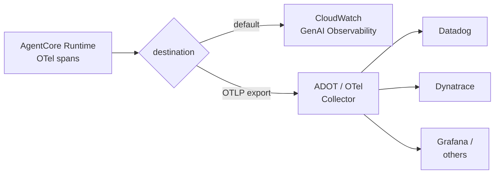
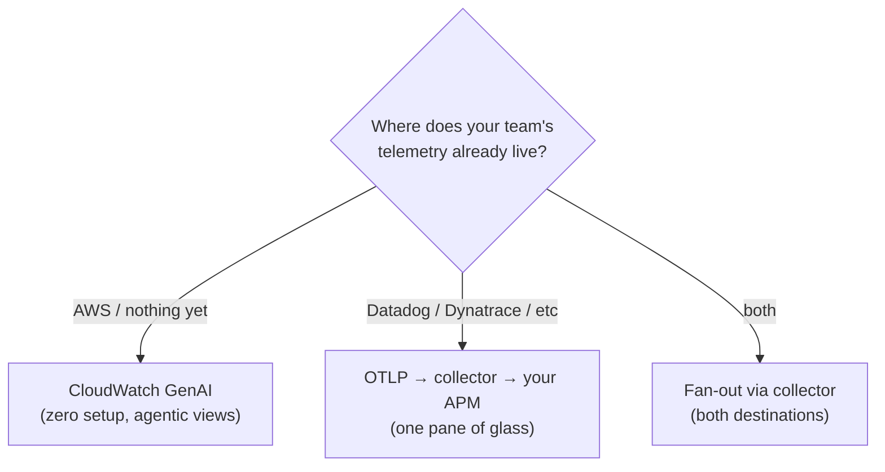
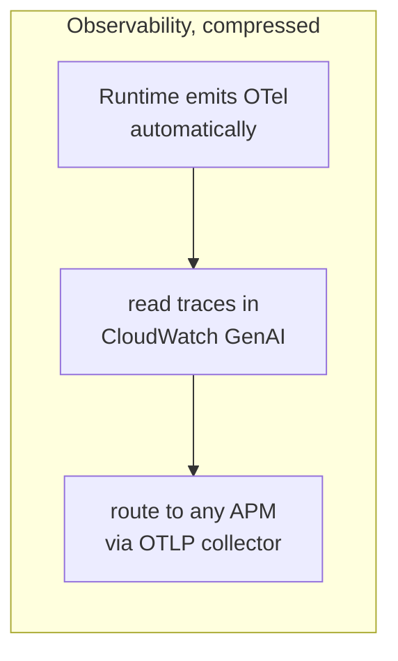

# AgentCore Observability Course — Chapter 3

# 🔀 Third-Party APM — Datadog, Dynatrace, and the OTel Escape Hatch

## Chapter Goal

By the end of this chapter, the learner will be able to:

- Route AgentCore telemetry to **any OTel-compatible backend**, not just CloudWatch.
- Explain how ADOT / OTel collectors sit between Runtime and the APM.
- Keep the standard span attributes meaningful in a third-party tool.
- Decide when to use CloudWatch vs an external APM.

---

## 3.1 🚪 No Lock-In — It's Just OTel

Because AgentCore emits **standard OpenTelemetry**, the destination is a config choice, not a code change:

The episode's point: *"Bring your own observability"* — the same spans, attributes and trace structure land in your existing APM if that's where the rest of your telemetry already lives.

---

## 3.2 🧰 How the Export Works

The routing path (OTLP out to a collector, collector forwards):

| Step | Piece |
|---|---|
| 1 | Runtime emits OTLP (traces + metrics + logs) |
| 2 | An **ADOT collector** / OTel collector receives the export |
| 3 | Collector's **exporter** forwards to your backend (Datadog/Dynatrace/…) |
| 4 | Span attributes (model, tokens, tool, session) arrive intact |

<ConceptCard title="Why a collector and not direct">
The collector is the standard OTel pattern — it can batch, filter, sample, and fan-out to multiple backends without touching the runtime emission. Point the collector at your APM's OTLP intake.
</ConceptCard>

---

## 3.3 🏷️ Keep the Attributes That Matter

When spans land in a third-party APM, the *agentic* meaning lives in the attributes — keep them:

| Attribute | Why it matters in the APM |
|---|---|
| `session_id` | group turns into conversations |
| `gen_ai.request.model` | cost/latency per model |
| `gen_ai.usage.*tokens` | token spend |
| `tool.name` | which tool was called |
| span status/error | tool vs model failures |

<WarningCard title="Don't flatten the agentic context">
A generic APM will show spans — but the agentic value is in `session_id`, token usage and tool names. Map them into your APM's facet/tag structure so you can still slice "all turns of this session" or "token spend by model."
</WarningCard>

---

## 3.4 ⚖️ CloudWatch vs Third-Party — Deciding

| Choose | When |
|---|---|
| **CloudWatch GenAI** | All-in on AWS; want zero setup; the purpose-built agentic views fit |
| **Third-party APM** | Org-wide telemetry already lives there; need correlation with non-agent services; existing dashboards/alerts |

<TipCard title="Fan-out is free">
A collector can export to CloudWatch *and* your APM simultaneously — you don't have to pick one forever.
</TipCard>

---

## 🧠 Knowledge Check

<Quiz question="Can AgentCore telemetry go to Datadog/Dynatrace?" options={["No — CloudWatch only","Yes — it's standard OTel; export OTLP to a collector that forwards to any OTel-compatible backend","Only via a custom exporter you write","Only metrics, not traces"]} answerIndex={1} explanation="The emission is standard OpenTelemetry — route it through an ADOT/OTel collector to any compatible backend." />

<Quiz question="What's the collector's role in third-party export?" options={["It runs the agent","It receives the OTLP export and forwards (batch/filter/fan-out) to your backend","It stores traces forever","It replaces CloudWatch"]} answerIndex={1} explanation="The collector is the standard OTel routing layer — receives OTLP, can batch/filter/fan-out to one or more backends." />

<Quiz question="Which attributes must you preserve when moving to a third-party APM?" options={["None","session_id, model, token usage, tool name — they carry the agentic meaning","Only timestamps","Only errors"]} answerIndex={1} explanation="The agentic value is in the attributes — session correlation, per-model token cost, tool identification." />

---

## 🏁 Chapter 3 Summary — and the Course

- AgentCore telemetry is **standard OTel** — destination is config, not code.
- Export via OTLP → **ADOT/OTel collector** → any backend (Datadog, Dynatrace, Grafana…), or fan out to several.
- Preserve `session_id`, model, token and tool attributes — they're the agentic signal.
- CloudWatch GenAI for zero-setup agentic views; external APM when your telemetry already lives there — or both.

### Watch the Original Tutorial

<VideoSection youtubeId="wWQgawUPr1k" title="AgentCore Observability | AWS Show & Tell" />

**Related:** *AgentCore Production Deploy* shows the live dashboard on a real deployment; *AgentCore Evaluations* builds on this telemetry to score agent quality.
