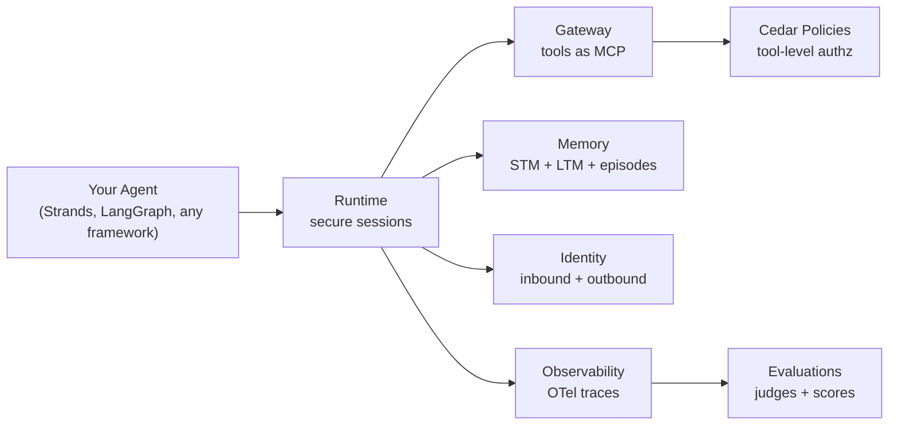
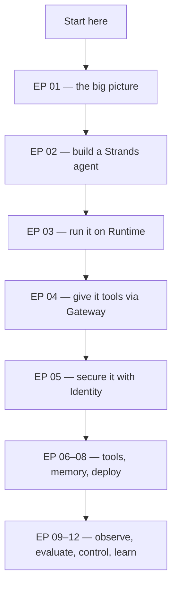

# AWS AgentCore — Complete Series

# ☁️ AWS AgentCore — The Complete Series

<VideoSection youtubeId="wzIQDPFQx30" title="AWS Show &amp; Tell — Amazon Bedrock AgentCore series (playlist ep 01 of 12)" />

## Chapter Goal

This course collects the **entire 12-episode AWS Show &amp; Tell playlist on Amazon Bedrock AgentCore** into one guided path. You will go from "what is AgentCore and why do agents fail in production" all the way to identity, memory, observability, evaluations, Cedar policies and episodic learning — every episode distilled into interactive notes with screenshots, diagrams, code explorers and quizzes.

<ConceptCard title="How this course is organized">
Each playlist episode is a **section in the sidebar**. Open a section to find its chapters — each chapter is a ~10-minute read with screenshots from the actual video, a knowledge check, and a link back to the source episode. Start with **EP 01** or jump straight to the pillar you need.
</ConceptCard>

## 0.1 🗺️ The Series Map — All 12 Episodes

| EP | Episode | What you learn | Section |
|----|---------|----------------|---------|
| 01 | Building your first production-ready AI agent | The prototype→production gap, the AgentCore pillars, Runtime/Gateway/Memory/Identity tour | [Open](/courses/aws-agentcore/ep01-production-agent) |
| 02 | Build your first agentic AI app step by step | Strands Agents SDK, tools, MCP wiring, multi-agent orchestration | [Open](/courses/aws-agentcore/ep02-strands-agents) |
| 03 | AgentCore Runtime deep dive | `agentcore configure/launch/invoke`, session isolation, streaming, MCP on Runtime | [Open](/courses/aws-agentcore/ep03-runtime-deep-dive) |
| 04 | AgentCore Gateway deep dive | Turn Lambdas and OpenAPI services into MCP tools, auth, tool search | [Open](/courses/aws-agentcore/ep04-gateway-deep-dive) |
| 05 | Secure your agent workflows | Inbound vs outbound identity, token vault, OAuth credential providers | [Open](/courses/aws-agentcore/ep05-secure-workflows) |
| 06 | Built-in tools — Browser & Code Interpreter | Managed headless Chromium via CDP, sandboxed Python execution | [Open](/courses/aws-agentcore/ep06-built-in-tools) |
| 07 | Memory deep dive | Short-term vs long-term memory, strategies, namespaces, hooks | [Open](/courses/aws-agentcore/ep07-memory-deep-dive) |
| 08 | Prototype to production | CI/CD for agents, CodeBuild→ECR→Runtime, end-to-end deployment | [Open](/courses/aws-agentcore/ep08-prototype-to-production) |
| 09 | Observability | OpenTelemetry spans/traces, CloudWatch GenAI dashboard, third-party APM | [Open](/courses/aws-agentcore/ep09-observability) |
| 10 | Evaluations | Judges, on-demand vs continuous evaluation, score dashboards | [Open](/courses/aws-agentcore/ep10-evaluations) |
| 11 | Control agent↔tool interactions | Cedar policies on Gateway, argument-level authorization, audit | [Open](/courses/aws-agentcore/ep11-tool-controls) |
| 12 | Episodic memory & patterns | Episodes, reflections, feedback loops — agents that learn | [Open](/courses/aws-agentcore/ep12-episodic-memory) |

<TipCard title="Lost? Use the sidebar">
Every section above is also in the left sidebar of this course. The **Summary Notes** section at the end is a condensed cheatsheet of the whole series — perfect for revision.
</TipCard>

## 0.2 🧱 The AgentCore Pillars — One Picture

Every episode in this series is really about one slice of the same platform. AgentCore wraps a working agent in **production services** so you stop rebuilding undifferentiated infrastructure:

| Pillar | Answers the question | Deep-dived in |
|--------|---------------------|---------------|
| **Runtime** | Where does the agent run, securely, at scale? | EP 03, EP 08 |
| **Gateway** | How does the agent discover and call tools? | EP 04, EP 11 |
| **Identity** | Who is calling, and who is the agent allowed to act as? | EP 05 |
| **Memory** | What does the agent remember across turns, sessions, users? | EP 07, EP 12 |
| **Observability** | What did the agent actually do, and why? | EP 09 |
| **Evaluations** | Is the agent actually *good*? | EP 10 |
| **Built-in Tools** | Browser + code execution without hosting it yourself | EP 06 |

## 0.3 🧭 Suggested Learning Path

| If you are… | Path |
|-------------|------|
| New to agents entirely | EP 01 → 02 → 03 → 04, then everything else in order |
| Already building with Strands/LangGraph | EP 01 → 03 → 08, then pillar deep-dives as needed |
| Focused on security/governance | EP 05 → 11 → 09 |
| Focused on agent quality | EP 10 → 09 → 07 → 12 |

<InfoCard title="Prerequisites">
An AWS account and basic Python familiarity. AgentCore is **framework-agnostic** — episodes use Strands Agents, but everything applies to LangGraph, CrewAI or custom agents. No ML background needed.
</InfoCard>

## 0.4 📓 What's Inside Each Chapter

| Element | What it gives you |
|---------|-------------------|
| 🎬 Source video card | The exact AWS episode, embedded |
| 📸 Screenshots | Real frames from the video — slides, console, code |
| 🧩 Diagrams | Mermaid architecture flows drawn from the episode |
| 💻 Code explorers | Real repo files with line-by-line highlights |
| 🖥️ Terminals | Actual CLI commands and their real output |
| 🧠 Knowledge checks | Decision-testing quizzes, not trivia |
| 📝 Summary Notes | Final section — the whole series on two screens |

## 🧠 Knowledge Check

<Quiz question="Which AgentCore pillar turns an existing Lambda function into a tool your agent can call?" options='["Runtime", "Gateway", "Memory", "Evaluations"]' answer={1} explanation="Gateway exposes existing capabilities — Lambdas, OpenAPI services, MCP servers — as MCP tools with auth, without redeploying the agent." />

<Quiz question="In this course, where is the condensed cheatsheet of the whole series?" options='["The Introduction chapter", "The Summary Notes section", "EP 12 only", "There is none"]' answer={1} explanation="The Summary Notes section at the end of the sidebar distills all 12 episodes into pillar-by-pillar tables, command references and a decision guide." />

## 🏁 Welcome — Start Here

You're one click from the first episode. **EP 01 — Building your first production-ready AI agent** explains the gap between a notebook demo and a production agent, then tours every pillar you'll master in this series.

👉 [Open EP 01 — Production-Ready AI Agent](/courses/aws-agentcore/ep01-production-agent)
