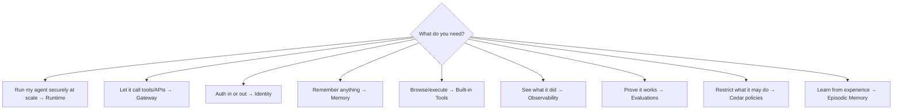
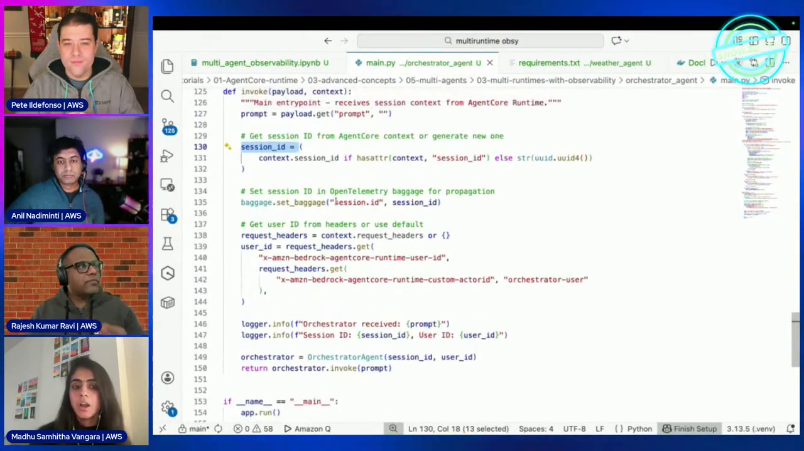

# AWS AgentCore — Complete Series

# 📝 Summary Notes — The Whole Series on Two Screens

## Chapter Goal

Everything the 12-episode AWS Show &amp; Tell playlist teaches about Amazon Bedrock AgentCore, condensed into cheatsheet tables, the key commands, and a decision guide. Use this for revision or as a reference while you build.

## S.1 🧱 Pillar Cheatsheet

| Pillar | What it does | You call it with | Episode |
|--------|--------------|------------------|---------|
| **Runtime** | Runs any agent framework in isolated Firecracker microVM sessions; streaming, async, 8-hour sessions, 100MB payloads | `BedrockAgentCoreApp`, `agentcore configure / launch / invoke` | [EP 03](/courses/aws-agentcore/ep03-runtime-deep-dive), [EP 08](/courses/aws-agentcore/ep08-prototype-to-production) |
| **Gateway** | Exposes Lambdas, OpenAPI services and MCP servers as agent tools — update tools without redeploying | `create_gateway_target`, `MCPClient` + bearer token | [EP 04](/courses/aws-agentcore/ep04-gateway-deep-dive) |
| **Identity** | Inbound (who may call the agent) + outbound (who the agent acts as); token vault, OAuth providers | `@requires_access_token`, credential providers | [EP 05](/courses/aws-agentcore/ep05-secure-workflows) |
| **Memory** | Short-term session state + long-term extraction (facts, preferences, episodes) via strategies and namespaces | Memory hooks, namespaces per user/agent | [EP 07](/courses/aws-agentcore/ep07-memory-deep-dive), [EP 12](/courses/aws-agentcore/ep12-episodic-memory) |
| **Built-in Tools** | Managed Browser Tool (headless Chromium/CDP, live view) and Code Interpreter (sandboxed Python, file I/O) | Tool clients from the SDK | [EP 06](/courses/aws-agentcore/ep06-built-in-tools) |
| **Observability** | OpenTelemetry spans/traces auto-emitted; CloudWatch GenAI dashboard; export to any APM | `SESSION_ID`/baggage propagation | [EP 09](/courses/aws-agentcore/ep09-observability) |
| **Evaluations** | Judges score correctness, faithfulness, latency, reliability — on-demand or continuous | Eval configs + score dashboards | [EP 10](/courses/aws-agentcore/ep10-evaluations) |
| **Policy controls** | Cedar policies attached to Gateway control *which tool with which arguments* an agent may use | Cedar policy engine on Gateway | [EP 11](/courses/aws-agentcore/ep11-tool-controls) |

## S.2 ⌨️ Command &amp; API Reference

| Task | Command / API |
|------|---------------|
| Deploy an agent | `agentcore configure` → `agentcore launch` (CodeBuild → ECR → Runtime endpoint) |
| Invoke | `agentcore invoke` or `invoke_agent_runtime` API |
| Required endpoints in your app | `POST /invocations`, `GET /ping` |
| Wrap your agent | `app = BedrockAgentCoreApp(); app.run()` |
| Attach a tool | `create_gateway_target(...)` — Lambda, OpenAPI or MCP target |
| Outbound auth | `@requires_access_token(provider_name=..., scopes=[...])` |
| Memory | memory hooks auto-record turns; strategies extract to namespaces |
| Tracing | OTel auto-instrumented; `SESSION_ID` baggage links a whole session |
| Tool guardrails | Cedar `permit/forbid` policies on the Gateway, evaluated per call + per argument |

## S.3 🧭 Decision Guide — Which Pillar When

| Symptom | Reach for |
|---------|-----------|
| "Works on my laptop, dies in prod" | Runtime (sessions, isolation, scaling) — EP 03 |
| "Every tool change = redeploy" | Gateway — EP 04 |
| "Agent needs my GitHub/Calendar" | Identity outbound + token vault — EP 05 |
| "Agent forgets the user between sessions" | Memory LTM strategies — EP 07 |
| "Can't tell why it did that" | Observability traces — EP 09 |
| "Is it actually getting better?" | Evaluations — EP 10 |
| "It might call a dangerous tool" | Cedar policies — EP 11 |
| "Same mistakes every session" | Episodic memory reflections — EP 12 |

## S.4 🔑 The One Big Idea

<ConceptCard title="Agents are workloads — treat them like production software">
A notebook agent is a prototype. A production agent needs **isolated sessions** (Runtime), **governed tools** (Gateway + Cedar), **identity** (inbound + outbound), **memory** (STM/LTM/episodic), and **evidence** (Observability + Evaluations). AgentCore provides all of it as managed services — you keep your framework, you skip the undifferentiated heavy lifting.
</ConceptCard>

## 🧠 Final Knowledge Check

<Quiz question="An agent must call a Lambda tool only when the region argument equals 'us-east-1'. Which pillar enforces this?" options='["Identity", "Cedar policies on Gateway", "Memory", "Runtime"]' answer={1} explanation="Cedar policies evaluate each tool call including argument values — argument-level authorization lives on Gateway." />

<Quiz question="Which pair gives an agent both 'what happened this session' and 'what we learned about this user over months'?" options='["Runtime + Gateway", "Short-term + long-term memory", "Identity + Observability", "Evaluations + Cedar"]' answer={1} explanation="STM holds the live session; LTM strategies extract durable facts/preferences/episodes into namespaces that persist across sessions." />

<Quiz question="Trace spans for one user interaction are correlated by…" options='["The agent name", "SESSION_ID propagated as OTel baggage", "The CloudWatch log group", "The Lambda ARN"]' answer={1} explanation="AgentCore propagates SESSION_ID through OpenTelemetry baggage so every span of a session stitches into one trajectory." />

## 🏁 Series Complete

You now hold the full AgentCore map: **Runtime → Gateway → Identity → Memory → Tools → Observability → Evaluations → Policies → Episodic Memory**. Revisit any episode section above, then build — the `awslabs/agentcore-samples` repo carries working code for everything in this course.
