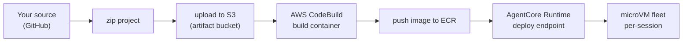
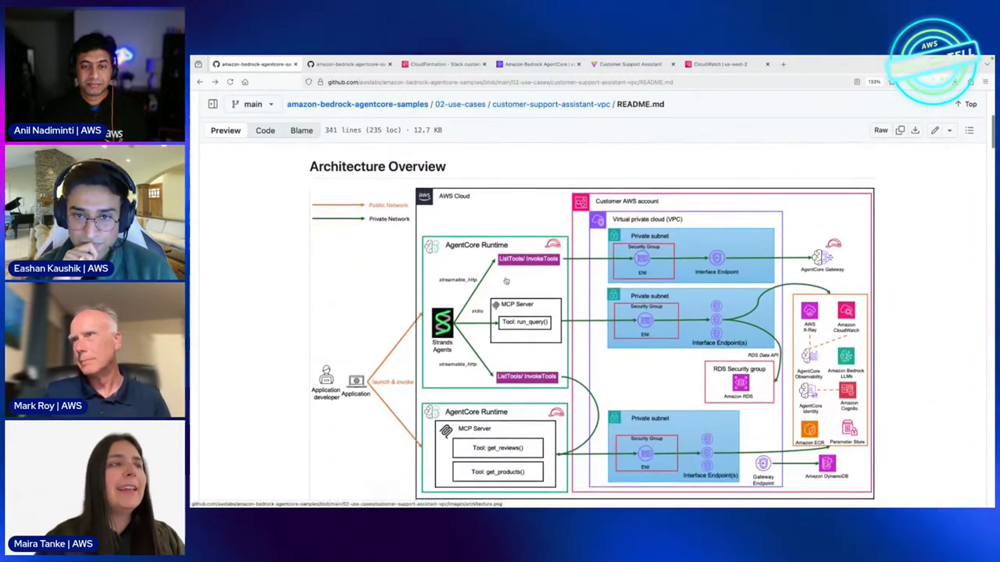
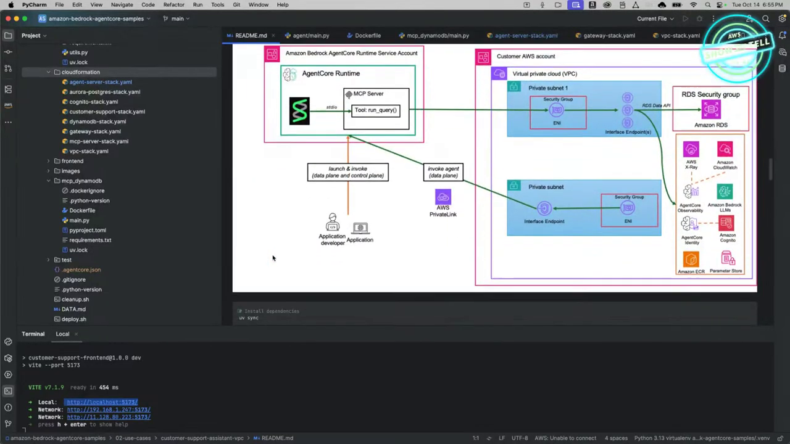

# AgentCore Production Deploy Course — Chapter 1

# 🏭 The Production Lifecycle — From GitHub to a Live Endpoint

## 🎬 About This Course — The Source Video

This course is built as **interactive, chapter-by-chapter notes** for the AWS Show & Tell episode **"Moving AI agents from prototype to production with Amazon Bedrock AgentCore"** — host **Anil** with the team walking a full customer-support deployment end-to-end, from source repo to live traced endpoint.

<VideoSection youtubeId="WyGK8UcAxKo" title="Moving AI agents from prototype to production | AWS Show & Tell" />

---

## Chapter Goal

By the end of this chapter, the learner will be able to:

- Describe the **deploy pipeline**: source → zip → S3 → CodeBuild → ECR → Runtime endpoint.
- Follow the **customer-support** example wired end-to-end (agent + gateway tools + identity + observability).
- Understand what gets **generated for you** — Dockerfile, CodeBuild project, IAM roles.
- Recognize the pieces teams must still own — data sources, auth config, guardrails.

---

## 1.1 🔁 The Pipeline — What `agentcore launch` Actually Does

The full deployment chain (~22:30):



| Stage | What happens | You own |
|---|---|---|
| `configure` | Parses entrypoint, generates Dockerfile + `.bedrock_agentcore.yaml`, sets IAM role + auth | Entry code, deps |
| `launch` | Zips → S3 → CodeBuild builds image → ECR → deploys | Nothing — it's managed |
| Invoke | Endpoint serves; each session gets a microVM | Auth (JWT) + payload |

<ConceptCard title="CodeBuild does the heavy lifting">
You never build locally for prod — CodeBuild compiles the Docker image from your source, pushes to ECR, and Runtime deploys it. The demo shows the CodeBuild project + build runs in the console.
</ConceptCard>

---

## 1.2 🧩 The Reference App — Not a Toy

The episode's customer-support app (~17:30) is deliberately realistic:

| Piece | In the demo |
|---|---|
| Data | Multiple systems — warranty tables, customer records, knowledge bases |
| Tools | Lambda-backed tools exposed via **Gateway** |
| Auth | Identity — Cognito inbound, OAuth outbound |
| Memory | Optional — could be added for continuity |
| Observability | Traces, sessions, tokens on every invoke |



<InfoCard title="This is the same blueprint as ep01">
The customer-support assistant from the first episode returns here — now being driven through a *production* deployment rather than a local walkthrough. The lesson is the delta between "works on my machine" and "works at scale."
</InfoCard>

---

## 1.3 ⚙️ What Gets Generated for You

The episode stresses how little boilerplate you write (~22:30–30:00):

- **`Dockerfile` + `.dockerignore`** — generated by `configure`
- **`.bedrock_agentcore.yaml`** — name, region, role, auth — checked into the repo
- **CodeBuild project** — created on first `launch`
- **ECR repo** — auto-created if absent
- **IAM execution role** — auto-created (add policies for your data sources)



```bash
# the whole production path
agentcore configure --entrypoint main.py
agentcore launch            # zip → S3 → CodeBuild → ECR → Runtime
agentcore invoke '{"prompt":"..."}'
```

<TipCard title="Commit the generated files">
`.bedrock_agentcore.yaml` and the generated Dockerfile belong in the repo — they're your deployment config, and re-running configure is idempotent.
</TipCard>

---

## 1.4 🔧 What You Still Own

The platform handles infrastructure; you still own the domain:

- **Data sources** — the knowledge base, DynamoDB tables, APIs the tools hit
- **Auth config** — Cognito pool, OAuth providers, inbound JWT
- **IAM scoping** — least-privilege on the execution role
- **Guardrails** — content/tool policies appropriate to your domain
- **CI/CD** — wire `agentcore launch` into your pipeline for repeatability (~47:30)

---

## 🧠 Knowledge Check

<Quiz question="What builds the agent's Docker image in production?" options={["Your laptop","AWS CodeBuild — source zips to S3, CodeBuild builds and pushes to ECR","A Lambda function","EC2 Auto Scaling"]} answerIndex={1} explanation="Launch uploads the project to S3 and triggers CodeBuild, which compiles the image and pushes it to ECR for Runtime to serve." />

<Quiz question="Which deployment file should be committed to source control?" options={["The container image",".bedrock_agentcore.yaml (and generated Dockerfile) — it's your deploy config","The access token","The CloudWatch logs"]} answerIndex={1} explanation="The config file records name, region, role, auth — it's deployment config that belongs with the code." />

<Quiz question="Which of these stays your responsibility?" options={["Building the Docker image","IAM scoping on the execution role, your data sources, and your auth config","Provisioning microVMs","Cold-start tuning"]} answerIndex={1} explanation="AgentCore owns infra; you own IAM least-privilege, data sources, auth config, and domain guardrails." />

---

## 🏁 Chapter 1 Summary

- Production deploy = **source → S3 → CodeBuild → ECR → Runtime endpoint** — all managed via `agentcore launch`.
- The demo proves it on a real multi-system app — not a hello-world.
- Generated artifacts (Dockerfile, yaml, CodeBuild project, roles) remove boilerplate; you own data, auth, and least-privilege.
- Commit the generated config; wire `launch` into CI/CD for repeatability.

**Next:** Chapter 2 — hosting an MCP server on the same Runtime.
