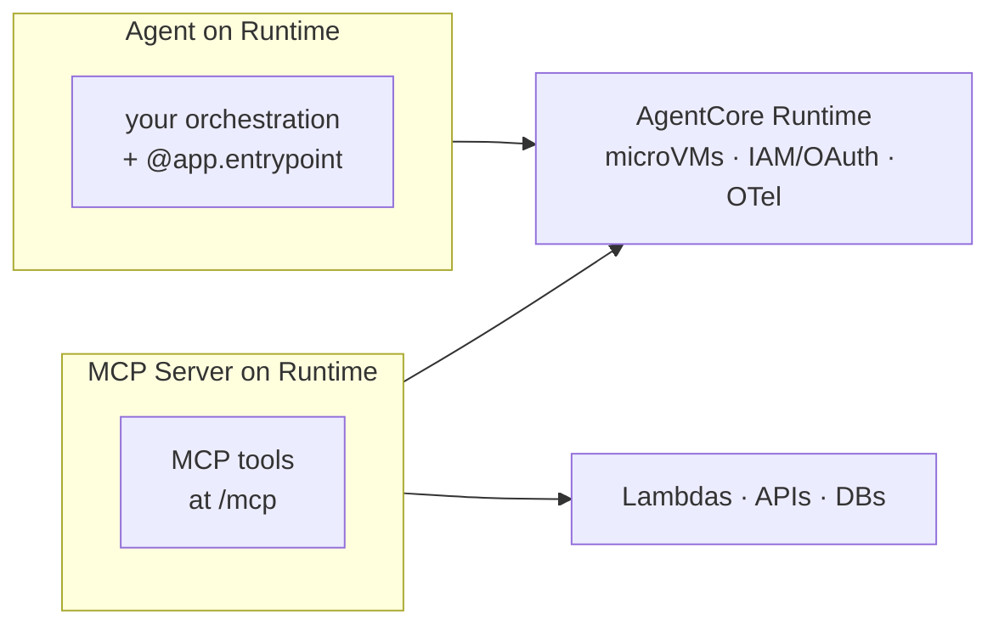

# AgentCore Production Deploy Course — Chapter 2

# 🌐 MCP Servers on AgentCore Runtime

## Chapter Goal

By the end of this chapter, the learner will be able to:

- Explain how Runtime hosts **MCP servers**, not just agents.
- Describe the MCP contract — `0.0.0.0:8000/mcp`, stateless, OAuth-protected.
- Walk the demo — an MCP server exposing tools, tested through the same pipeline.
- Contrast "agent on Runtime" vs "MCP server on Runtime".

---

## 2.1 🔄 Agents Aren't the Only Thing Runtime Hosts

A key revelation (~32:30): *"How different is deploying an MCP server? Not different at all."* The same Runtime that hosts agents hosts **MCP servers** — your tools get the same isolation, scale, and auth story.



| | Agent on Runtime | MCP server on Runtime |
|---|---|---|
| What it exposes | `POST /invocations` — agent loop | `/mcp` — MCP tools |
| Who calls it | Users / upstream systems | Agents (via MCP client or gateway) |
| Protocol | HTTP invoke contract | MCP over Streamable HTTP |
| Same | Isolation, deploy pipeline, auth, tracing | |

<InfoCard title="Why host MCP on Runtime at all?">
Your tools get the same production properties agents do — per-session microVM isolation, OAuth in front, OTel tracing — instead of hand-rolling a tool server.
</InfoCard>

---

## 2.2 📜 The MCP Contract on Runtime

The server binds `0.0.0.0:8000/mcp`, runs **stateless**, and sits behind OAuth (~32:30–40:00):

```python
# minimal MCP server on AgentCore Runtime
from mcp.server.fastmcp import FastMCP

mcp = FastMCP(host="0.0.0.0", port=8000, stateless_http=True)

@mcp.tool()
def get_order(order_id: str) -> dict:
    """Look up an order's status."""
    return {"order_id": order_id, "status": "shipped"}

if __name__ == "__main__":
    mcp.run(transport="streamable-http")   # served at /mcp
```

The same `agentcore configure`/`launch`/`invoke` pipeline ships it — Runtime detects the MCP server and exposes it accordingly.

---

## 2.3 🔐 Identity on the MCP Server Too

The MCP server gets its own identity config (~40:00) — so tools behind it are governed:

- **Inbound** — JWT authorizer, same as agents
- **Outbound** — the server can call downstream AWS resources via IAM
- Works alongside a **Gateway** in front when you want the broader tool catalog

<TipCard title="MCP server vs Gateway — when which">
MCP server on Runtime = you're *writing* the tools. Gateway = you're *wrapping* existing Lambdas/APIs into MCP. Compose them — gateway targets can point at your MCP server or at raw services.
</TipCard>

---

## 2.4 🎬 The Live Run — Same Shape as the Agent

The episode walks the same flow for an MCP server (~45:00):

```text
agentcore configure --entrypoint mcp_server.py
agentcore launch
   → CodeBuild → ECR → Runtime endpoint (same as agents)
agentcore invoke / MCP inspector call
   → lists tools → calls get_order → real result
```

The point isn't the tool — it's that **the operational surface is identical** whether you're hosting the agent or its tools.

---

## 🧠 Knowledge Check

<Quiz question="How does hosting an MCP server on Runtime differ from hosting an agent?" options={["Completely different pipeline","Same pipeline — configure/launch/invoke — only the contract differs (/mcp vs /invocations)","MCP needs EC2","Agents can't use MCP"]} answerIndex={1} explanation="The deploy path is identical; Runtime serves either an agent's /invocations or a server's /mcp depending on what you ship." />

<Quiz question="What transport does the MCP server use on Runtime?" options={["STDIO","Streamable HTTP at 0.0.0.0:8000/mcp, stateless","WebSockets","gRPC"]} answerIndex={1} explanation="Streamable HTTP, stateless, at /mcp — and fronted by the same OAuth/JWT auth as agents." />

<Quiz question="MCP server vs Gateway — the distinction?" options={["They're identical","MCP server = you write the tools; Gateway = wrap existing Lambdas/APIs as MCP","Gateway is faster","MCP is deprecated"]} answerIndex={1} explanation="Author tools → MCP server on Runtime. Expose existing services → Gateway targets. Both yield MCP tools." />

---

## 🏁 Chapter 2 Summary

- Runtime hosts **MCP servers** with the same pipeline, isolation, auth and tracing as agents.
- Contract: `0.0.0.0:8000/mcp`, stateless Streamable HTTP, OAuth-protected.
- One operational surface for agents *and* tools — write MCP servers for new tools, use Gateway to wrap existing services.

**Next:** Chapter 3 — the end-to-end walkthrough and how all the pillars land in one deployed app.
