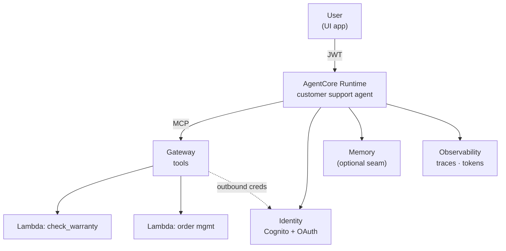
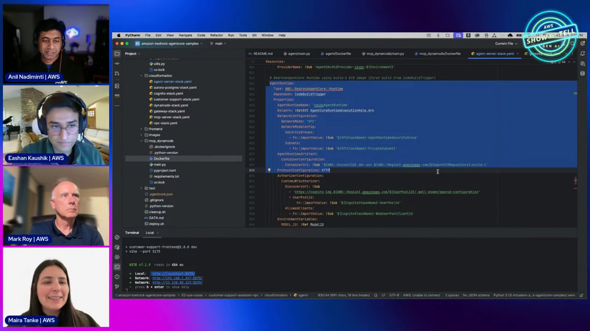
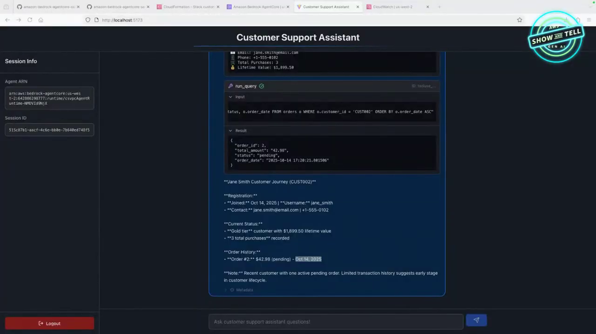
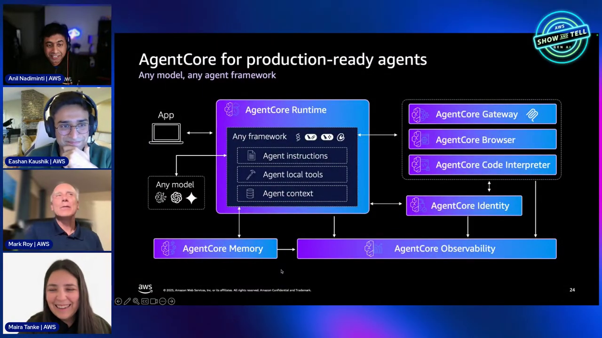
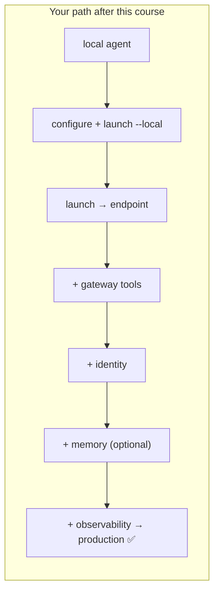
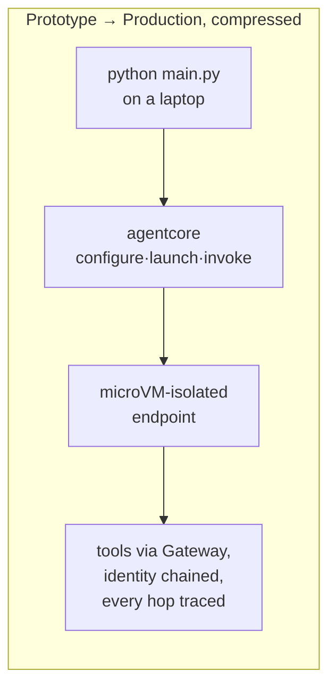

# AgentCore Production Deploy Course — Chapter 3

# 🔗 The End-to-End Walkthrough — All Pillars in One App

## Chapter Goal

By the end of this chapter, the learner will be able to:

- Trace the complete request path through a production AgentCore deployment.
- See how Runtime, Gateway, Identity and Observability compose in one app.
- Interpret the observability and deployment artifacts the episode shows.
- Identify the "memory optional" seam and where each pillar slots.

---

## 3.1 🗺️ The Full Architecture — Revisited

Everything lands in one picture (~47:30):



| Hop | Pillar | Verified how |
|---|---|---|
| User → Runtime | Identity (inbound) | JWT validated per request |
| Runtime → tools | Gateway (MCP) | list/call tools over /mcp |
| Gateway → Lambdas | Identity (outbound) | `GATEWAY_IAM_ROLE` |
| Everything | Observability | OTel spans on each hop |

---

## 3.2 🧬 The Deploy, Observed

The episode shows the operational artifacts that prove production-worthiness (~50:00):

- **CodeBuild console** — the `bedrock-agentcore` builder project with successful runs
- **Runtime console** — the deployed agent listed as Ready, with endpoint + version
- **Invoke** — response streams back with the session ID
- **Observability** — traces for each invoke, span tree showing model + tool calls





```bash
# tail agent logs live while debugging
aws logs tail /aws/bedrock-agentcore/runtime/<agent> --follow
```

<TipCard title="Session pinning">
The Session ID returned on invoke pins subsequent calls to the same microVM — that continuity is what makes memory and state tools work correctly across turns.
</TipCard>

---

## 3.3 🧠 The Memory Seam — Addable, Not Required

At ~55:00 the hosts note memory wasn't wired in this demo — but the seam is there: *"We didn't add memory. We could add memory — it would make our customer support better."* That's the honest lesson: each pillar is **independent and composable**. Add the ones your use case needs; nothing forces all of them.

| Add memory when | Skip when |
|---|---|
| Users return and expect continuity | Each call is stateless |
| Personalization matters | Single-shot Q&A |
| Multi-turn workflows | Pure task execution |

---

## 3.4 📚 The Repeatable Path — Resources

The episode closes on where the full code lives (~57:30):

- **`awslabs/agentcore-samples`** — tutorials + use-cases; this exact customer-support walkthrough is there
- The AgentCore **docs** — per-pillar deep-dives


- The starter toolkit/`agentcore-cli` — the deploy flow shown throughout



---

## 🧠 Knowledge Check

<Quiz question="In the deployed app, what verifies the user on every invoke?" options={["The Lambda","Inbound JWT validation via AgentCore Identity","The Dockerfile","ECR"]} answerIndex={1} explanation="The JWT the caller presents is validated against the Cognito/OIDC authorizer configured on the endpoint." />

<Quiz question="Why was memory left out of this demo?" options={["It's broken","Each pillar is composable — memory is added only when your use case needs continuity","Memory requires a VPC","It costs extra only"]} answerIndex={1} explanation="The pillars are independent — you compose what your use case needs rather than taking all-or-nothing." />

<Quiz question="What does the session ID returned on invoke control?" options={["Billing","Pinning to the same microVM — continuity across turns","The model","The region"]} answerIndex={1} explanation="Session ID pins subsequent calls to the same microVM — what makes state and memory coherent across the conversation." />

---

## 🏁 Chapter 3 Summary — and the Course

- The deployed app composes **Runtime + Gateway + Identity + Observability** in one request path.
- Production artifacts are all visible: CodeBuild runs, the Ready endpoint, streamed invokes, OTel traces.
- Pillars are **composable** — add memory when continuity matters, skip when stateless.
- The whole course is the path: local agent → deployed → tools → identity → (memory) → observed.



### Watch the Original Tutorial

<VideoSection youtubeId="WyGK8UcAxKo" title="Moving AI agents from prototype to production | AWS Show & Tell" />

**Related:** *AgentCore — Production-Ready Agents* covers the same arc at a higher level; *AgentCore Security* goes deep on the Identity hop.
