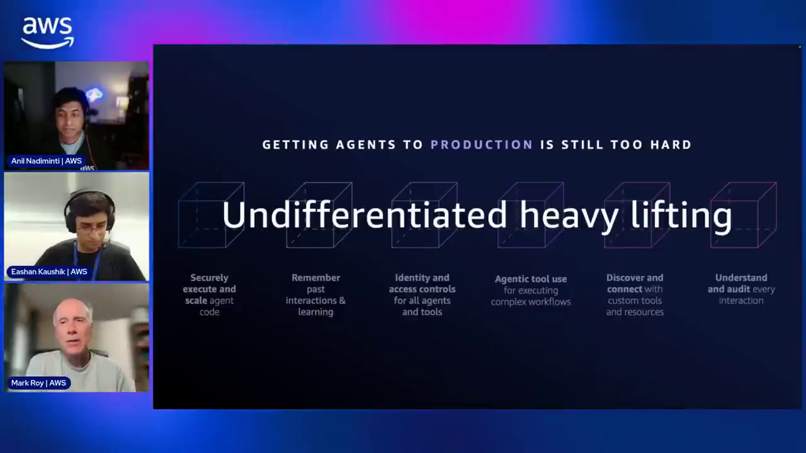
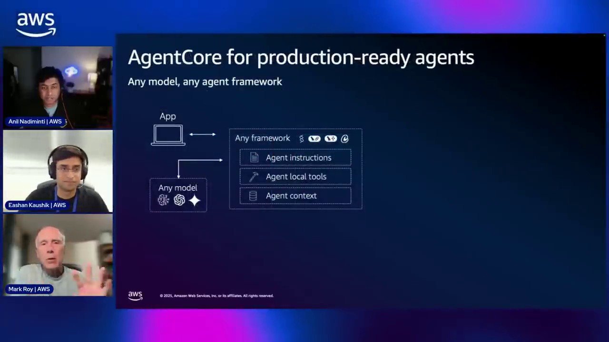
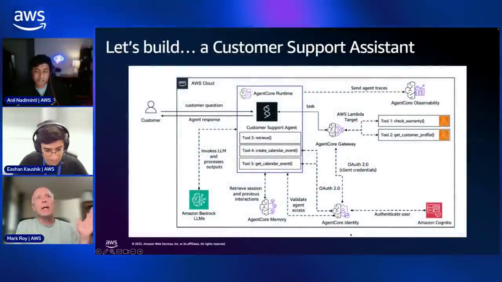
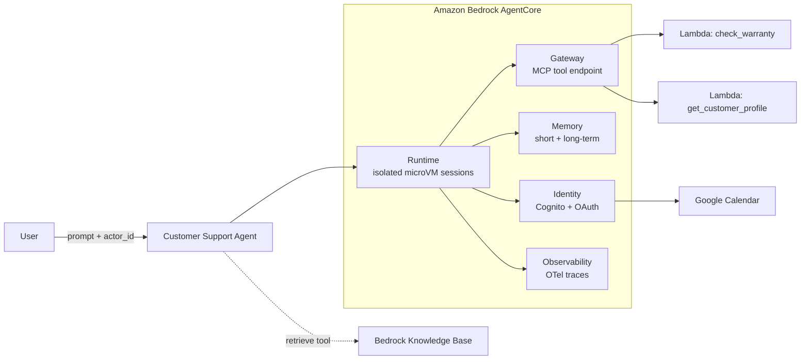
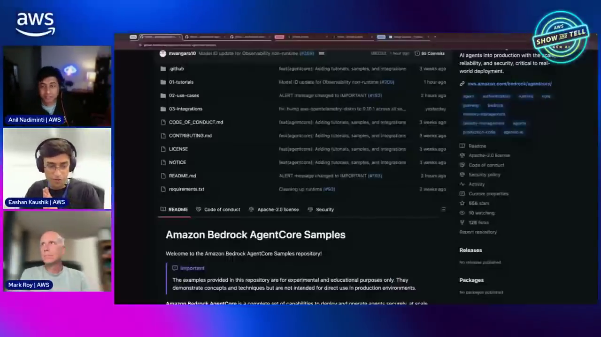

# AgentCore Production Agent Course — Chapter 1

# 🚀 The Prototype-to-Production Gap — Why AgentCore Exists

## 🎬 About This Course — The Source Video

This course is built as **interactive, chapter-by-chapter notes** for the AWS Show & Tell episode **"Building your first production-ready AI agent with Amazon Bedrock AgentCore"** — where host **Anil Nadiminti**, Agentic AI Tech Lead **Mark Roy**, and Solutions Architect **Eashan "EK" Kaushik** take a local Strands agent all the way to a deployed, authenticated, memory-enabled production agent live.

<VideoSection youtubeId="wzIQDPFQx30" title="Building your first production-ready AI agent with Amazon Bedrock AgentCore | AWS Show & Tell" />

---

## Chapter Goal

By the end of this chapter, the learner will be able to:

- Explain the **prototype-to-production gap** — why a demo agent on a laptop is not a product.
- Name the six classes of **undifferentiated heavy lifting** AgentCore removes.
- Describe the AgentCore building blocks — **Runtime, Gateway, Memory, Identity, Observability, and built-in Tools** — and what each one owns.
- Read the **Customer Support Assistant blueprint** used as the running example across the whole episode.
- Find the official repos — samples, SDK, and starter toolkit.

---

## 1.1 🧗 The Problem — Demo Agents Don't Ship

Mark sets the stakes early (~03:30): *"It's pretty easy to build prototypes using any agent framework — download it to your laptop and quickly get something together. But if you don't get your agents into production, you've pretty much produced no business value other than exciting the C-suite with some amazing demos."*

The gap between `python main.py` on your laptop and a real production agent is a wall of **undifferentiated heavy lifting**:

*The six production challenges the episode calls out: security, scalability, performance, large payloads, long-running agents, and frameworks.*

| Challenge | Why it bites |
|---|---|
| **Security** | Agents act on data and call APIs — authN/authZ, token handling, isolation |
| **Scalability** | One user is easy; thousands of concurrent sessions are not |
| **Performance** | Cold starts and latency kill interactive experiences |
| **Large payloads** | Real users upload spreadsheets, documents, media |
| **Long-running agents** | Multi-step research/automation can run for hours — far past a Lambda timeout |
| **Frameworks** | Teams use Strands, LangGraph, CrewAI — the platform can't lock you in |

<ConceptCard title="The honest framing">
AgentCore doesn't make your agent smarter — it makes your agent **shippable**. The model and orchestration are still yours; the undifferentiated infrastructure becomes AWS's problem.
</ConceptCard>

---

## 1.2 🧩 What AgentCore Is — Any Model, Any Framework

At ~06:14 the overview slide lands the core promise: **"AgentCore for production-ready agents — any model, any framework, real-time."**

*The pitch: pick any model and any agent framework — AgentCore provides the production substrate underneath.*

The building blocks introduced in the episode:

| Block | What it owns |
|---|---|
| **AgentCore Runtime** | Secure, scalable hosting — serverless microVMs, session isolation, 8-hour runs, 100MB payloads |
| **AgentCore Gateway** | Turns your existing APIs / Lambda functions / REST services into agent-ready **MCP tools** — securely |
| **AgentCore Memory** | Short-term conversation memory + fully-managed **long-term** memory (preferences, facts, session summaries) |
| **AgentCore Identity** | End-to-end auth — Cognito/IAM inbound, OAuth flows outbound to third-party services (Google, etc.) |
| **AgentCore Observability** | OpenTelemetry-native tracing — sessions, traces, token usage, agent trajectory |
| **Built-in Tools** | Managed tools like **Browser** (automate legacy web flows) and **Code Interpreter** (run generated code safely) |

<InfoCard title="Any framework, any model — really">
The demo uses **Strands + Claude on Bedrock**, but Mark repeats it several times: AgentCore works with LangGraph, CrewAI, or your own loop, and any model — Bedrock or otherwise. The primitives (runtime, gateway, memory…) are framework-agnostic.
</InfoCard>

---

## 1.3 🎯 The Running Example — Customer Support Assistant

At ~08:48 the episode commits to a real build: a **Customer Support Assistant** that starts as a local agent and gains production capabilities one layer at a time.

*The blueprint for the whole episode — each box on this slide gets built live in later chapters.*

The journey maps cleanly to the course chapters:

| Chapter | Layer added |
|---|---|
| **Ch 02** | Runtime — wrap the local Strands agent, `agentcore configure / launch / invoke` |
| **Ch 03** | Gateway — expose existing Lambda/DynamoDB tools as MCP, with OAuth |
| **Ch 04** | Memory + Identity + Observability — the agent remembers, authenticates outbound, and gets traced |

---

## 1.4 📚 The Resources — Three Repos to Bookmark

At ~10:42 the show points at the repos where **all the demo code lives**:

*The samples repo — the customer-support walkthrough and every building-block tutorial lives here.*

| Repo | What it is |
|---|---|
| [`awslabs/agentcore-samples`](https://github.com/awslabs/agentcore-samples) | Tutorials, use-cases, workshops — the demo code from this episode |
| [`aws/bedrock-agentcore-sdk-python`](https://github.com/aws/bedrock-agentcore-sdk-python) | The open-source SDK — `BedrockAgentCoreApp`, memory clients, auth decorators |
| [`aws/bedrock-agentcore-starter-toolkit`](https://github.com/aws/bedrock-agentcore-starter-toolkit) | The `agentcore` CLI (configure / launch / invoke) |

<WarningCard title="Repo names moved — honest note">
The video shows `amazon-bedrock-agentcore-samples`; the canonical repo is now **`awslabs/agentcore-samples`** (it redirects). Also note the starter toolkit README now points new projects to [`aws/agentcore-cli`](https://github.com/aws/agentcore-cli) — the commands in this course (`agentcore configure/launch/invoke`) are what the video used, and the same flow carries over.
</WarningCard>

---

## 🧠 Knowledge Check

<Quiz question="Why does the episode call production deployment 'undifferentiated heavy lifting'?" options={["Because training the model is expensive","Because security, scaling, isolation, and auth work is identical for every agent and doesn't differentiate your product","Because writing tools is boring","Because Docker is hard"]} answerIndex={1} explanation="Every production agent needs session isolation, auth, scaling, observability — none of it makes YOUR agent special. AgentCore takes that undifferentiated work off your plate so you focus on the agent's actual logic." />

<Quiz question="What is AgentCore's stance on agent frameworks and models?" options={["Strands agents only","Bedrock models only","Any framework, any model","Only frameworks that support MCP"]} answerIndex={2} explanation="'Any framework, any model' is repeated throughout the episode — Strands, LangGraph, CrewAI or your own loop; Bedrock or third-party models." />

<Quiz question="In the Customer Support Assistant blueprint, what connects the deployed agent to the existing Lambda functions?" options={["A REST API Gateway","AgentCore Gateway — it exposes existing APIs and Lambdas as MCP tools","A direct boto3 call","An SQS queue"]} answerIndex={1} explanation="AgentCore Gateway bridges existing enterprise APIs and Lambda functions into standard MCP tools the agent can discover and call." />

---

## 🏁 Chapter 1 Summary

- The **prototype→production gap** is real: security, scale, payloads, long runs, and framework lock-in stand between a demo and a product.
- **AgentCore** is a set of composable primitives — **Runtime, Gateway, Memory, Identity, Observability, Tools** — that work with **any model and any framework**.
- The running example: a **Customer Support Assistant** built live across the episode — local Strands agent → cloud runtime → gateway tools → memory + identity → observability.
- All code lives in `awslabs/agentcore-samples`; the SDK is `aws/bedrock-agentcore-sdk-python`; the CLI is the starter toolkit (now `aws/agentcore-cli`).

**Next:** Chapter 2 — wrapping that local agent with `BedrockAgentCoreApp` and launching it to the cloud.
