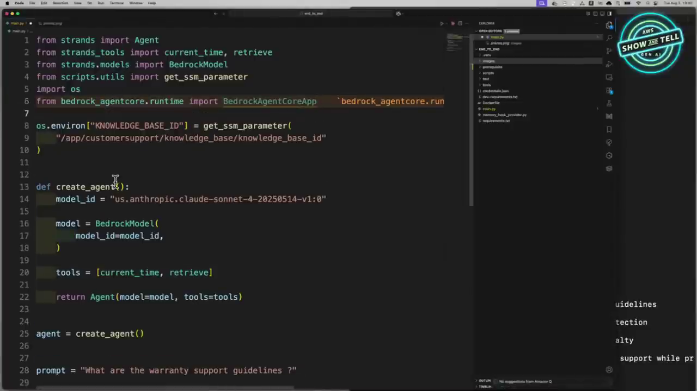
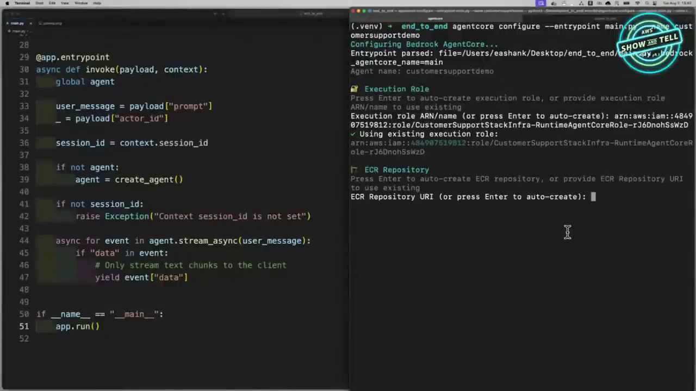
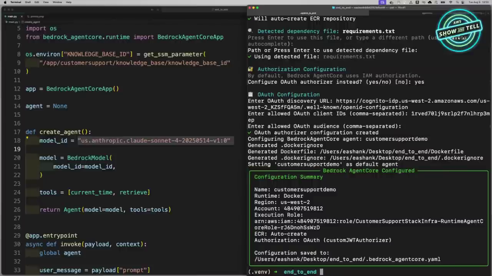
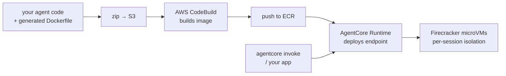
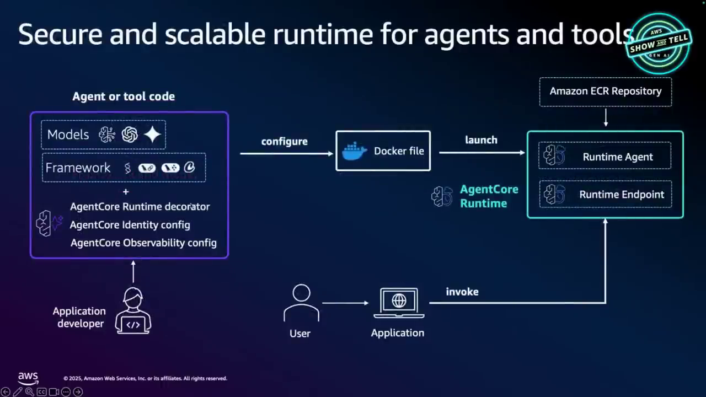
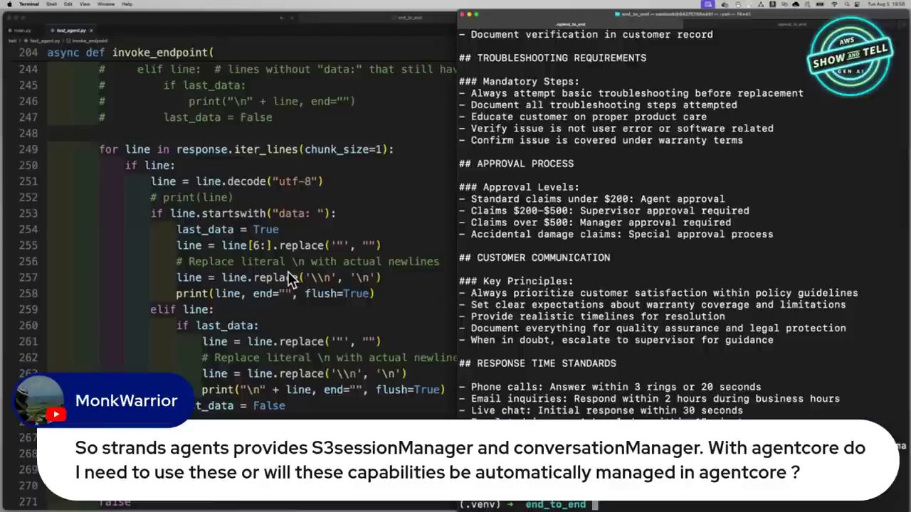

# AgentCore Production Agent Course — Chapter 2

# ☁️ AgentCore Runtime — From Local Strands Agent to Cloud Endpoint

## Chapter Goal

By the end of this chapter, the learner will be able to:

- Wrap a local agent with **`BedrockAgentCoreApp`** and the **`@app.entrypoint`** pattern.
- Explain what `payload` and `context` carry — prompt, `session_id`, `actor_id`.
- Run the three-step CLI flow — **`agentcore configure` → `launch --local` → `launch` → `invoke`**.
- Describe the Runtime's isolation model — **Firecracker microVMs per session** — and its limits (100MB payloads, 8-hour executions).
- Invoke the deployed endpoint with a **Cognito bearer token**.

---

## 2.1 🧪 Life Before AgentCore — The Local Agent

The starting point (~12:40) is a perfectly ordinary local Strands agent — `BedrockModel` + a couple of tools, answering warranty questions through a knowledge base:

```python
model_id = "us.anthropic.claude-sonnet-4-20250514-v1:0"
model = BedrockModel(model_id=model_id)
tools = [current_time, retrieve]
return Agent(model=model, tools=tools)
```

It works — on EK's laptop. As Mark jokes (~14:00): *"You've officially impressed the C-suite. How do you get to production is what we're going to see now."*


*The entire port to AgentCore: import `BedrockAgentCoreApp`, create the app, decorate an entrypoint. The agent logic itself doesn't change.*

---

## 2.2 🎁 The Wrap — `BedrockAgentCoreApp` + `@app.entrypoint`

The AgentCore SDK turns the local script into a hosted service (~14:40):

```python
from bedrock_agentcore.runtime import BedrockAgentCoreApp

app = BedrockAgentCoreApp()
agent = None

@app.entrypoint
async def invoke(payload, context):
    global agent
    user_message = payload["prompt"]        # the user's question
    session_id = context.session_id          # runtime-managed session
    actor_id   = payload["actor_id"]         # who the user is
    if not agent:
        agent = create_agent()               # warm-start: create once per microVM
    async for event in agent.stream_async(user_message):
        if "data" in event:
            yield event["data"]              # stream chunks back to the caller
```

Three things to notice:

| Piece | What it is |
|---|---|
| `payload` | The caller's JSON — `{"prompt": ..., "actor_id": ...}` — whatever your API contract defines |
| `context` | Runtime-provided metadata — `session_id` (per conversation), request headers |
| `yield` streaming | The entrypoint is a generator — chunks stream back as the model produces them |

<TipCard title="Why global agent">
`agent` is cached in a global so it's created once per **microVM**, not per request — the microVM is session-scoped and warm. For production code prefer context variables over globals (the video notes this too).
</TipCard>

Here it is in the **real samples repo** — the simplest possible version, with a custom `@tool` and `BedrockModel`:

<GitHubExplorer repo="awslabs/agentcore-samples" ref="main" expanded="true" title="Runtime hosting — Strands agent + BedrockAgentCoreApp" files={[
  { "path": "01-features/02-host-your-agent/01-runtime/01-hosting-agents/01-http-protocol/01-strands-bedrock/agent.py", "label": "agent.py — @app.entrypoint + app.run()", "highlights": [[3,6],[39,47],[50,51]], "note": "3 lines of AgentCore: create the app, decorate the handler, app.run()." },
  { "path": "01-features/02-host-your-agent/01-runtime/01-hosting-agents/01-http-protocol/01-strands-bedrock/deploy.py", "label": "deploy.py — programmatic deploy (alternative to the CLI)" },
  { "path": "01-features/02-host-your-agent/01-runtime/01-hosting-agents/01-http-protocol/01-strands-bedrock/invoke.py", "label": "invoke.py — invoke_runtime_agent via boto3", "highlights": [[27,43]], "note": "The data-plane call — payload is just JSON: {'prompt': ...}." }
]} />

---

## 2.3 ⚙️ Step 1 — `agentcore configure`

One command scaffolds the whole deployment (~17:20):

```bash
agentcore configure --entrypoint main.py
```

```text
Enter the execution role ARN (or press Enter to create one):
✔ Will auto-create ECR repository
✔ Detected dependency file: requirements.txt

🔐 Authorization Configuration
By default, Bedrock AgentCore uses IAM authorization.
Configure OAuth authorizer instead? (yes/no) [no]: yes

Enter OAuth discovery URL: https://cognito-idp.us-west-2.amazonaws.com/us-west-2_xxx/.well-known/openid-configuration
Enter allowed OAuth client IDs: 1rvedo1lj9srlp2f7nlhrp3mep
Enter allowed OAuth audience:

✔ OAuth authorizer configuration created
✔ Generated .dockerignore
✔ Generated Dockerfile: /Users/.../end_to_end/Dockerfile
Setting 'customersupportdemo' as default agent

────── Bedrock AgentCore Configured ──────
Configuration Summary
  Name: customersupportdemo        Runtime: Docker
  Region: us-west-2                Account: 484907519812
  Authorization: OAuth (customJWTAuthorizer)
Configuration saved to: .bedrock_agentcore.yaml
```


*Configure generates a `Dockerfile`, `.dockerignore`, and `.bedrock_agentcore.yaml` — and wires OAuth/Cognito as the inbound authorizer.*

What configure collected:

| Asked for | Used for |
|---|---|
| Execution role | IAM role the agent runs as |
| ECR repository | Where the agent image lands (auto-created) |
| `requirements.txt` | Baked into the container |
| OAuth authorizer | Cognito discovery URL + client IDs + audience → inbound auth |

---

## 2.4 🏠 Step 2 — `agentcore launch --local`

Before touching the cloud, you can run the **whole runtime contract locally** (~19:20):

```bash
agentcore launch --local
```

```text
🚀 Local agent running — http://localhost:8080
You: What are the warranty support guidelines?
Assistant: [streams back — it invoked the retrieve tool]
```


*Same container, same entrypoint, on your laptop — the `--local` flag exists precisely so you debug locally before paying the cloud round-trip.*

---

## 2.5 🚀 Step 3 — `agentcore launch` — What Actually Happens

```bash
agentcore launch
```

Under the hood (~20:40):




*Configure → Dockerfile → launch → CodeBuild → ECR → Runtime endpoint → invoke.*

### Why the runtime is special

From the runtime deep-dive (~21:00–23:30):

| Capability | Number/mechanism |
|---|---|
| **Session isolation** | Each `session_id` gets its own **Firecracker microVM** — hardware-level memory/kernel separation; session ends → VM is torn down |
| **Payload size** | Up to **100MB** per request — spreadsheets, docs, media |
| **Execution time** | Up to **8 hours** — vs Lambda's 15 minutes |
| **Cold start** | Fast — microVMs boot in milliseconds |
| **Scale** | Concurrent sessions scale out as independent VMs |

<ConceptCard title="The session-isolation mental model">
On a shared Flask server, every user's data shares one process — a leak is one bug away. In AgentCore Runtime, **session = microVM**: User A's files, memory and state physically cannot touch User B's. This is the single most important thing Runtime gives you.
</ConceptCard>

---

## 2.6 📞 Step 4 — `agentcore invoke` + Bearer Token

Invoking the endpoint means passing the Cognito token you configured (~24:40):

```bash
agentcore invoke '{"prompt": "What are the warranty support guidelines?"}'
```

Or programmatically — the bearer token goes in headers:

```python
headers = {"Authorization": f"Bearer {access_token}"}
response = requests.post(invoke_url, json={"prompt": q, "actor_id": user}, headers=headers)
for line in response.iter_lines():      # stream back, same as local
    ...
```


*Invoke = HTTP POST to the agent endpoint with a bearer token; the response streams exactly like the local run.*

<TipCard title="Tail the logs while you debug">
The deploy output prints CloudWatch log group URLs — `aws logs tail /aws/bedrock-agentcore/runtime/... --follow` tails agent logs live. (The video mentions this but skips it for time — it's the first thing to reach for when a deploy misbehaves.)
</TipCard>

---

## 🧠 Knowledge Check

<Quiz question="Which VM technology gives AgentCore Runtime its per-session isolation?" options={["Docker containers","AWS Fargate","AWS Firecracker microVMs","EC2 instances"]} answerIndex={2} explanation="Each session runs in its own Firecracker microVM — hardware-level isolation, torn down when the session ends." />

<Quiz question="What does @app.entrypoint decorate in an AgentCore app?" options={["The model constructor","The function the runtime calls for each request — receiving payload + context","The tool definitions","The Docker entrypoint"]} answerIndex={1} explanation="The decorated function is the request handler: payload carries the caller's JSON, context carries session_id and request metadata." />

<Quiz question="What does 'agentcore launch --local' do?" options={["Deploys to a local AWS region","Runs the same container + entrypoint contract on localhost for debugging","Creates a local Cognito pool","Mocks the LLM"]} answerIndex={1} explanation="It's the real runtime contract locally — same container, same payload/context semantics — so you debug before deploying." />

<Quiz question="A user asks your agent to analyze a 40MB spreadsheet in a 3-hour research task. Can AgentCore Runtime handle it?" options={["No — payload too large","No — 15 minute limit","Yes — up to 100MB payloads and 8-hour executions","Only with a custom EC2 deployment"]} answerIndex={2} explanation="Runtime supports 100MB payloads and 8-hour executions — built for long-running, heavy agents." />

---

## 🏁 Chapter 2 Summary

- **`BedrockAgentCoreApp` + `@app.entrypoint`** wraps any agent — logic unchanged, ~3 new lines.
- **CLI flow:** `agentcore configure` (role, ECR, OAuth) → `launch --local` (debug) → `launch` (CodeBuild→ECR→Runtime) → `invoke` (bearer token + streaming).
- **Runtime isolation:** each session = dedicated **Firecracker microVM** — the core security story.
- **Limits:** 100MB payloads, 8-hour runs, fast cold starts, per-session teardown.

**Next:** Chapter 3 — connecting the deployed agent to real enterprise tools through **AgentCore Gateway**.
