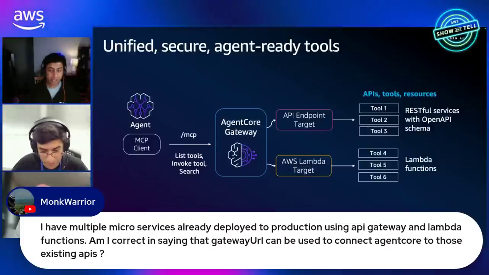
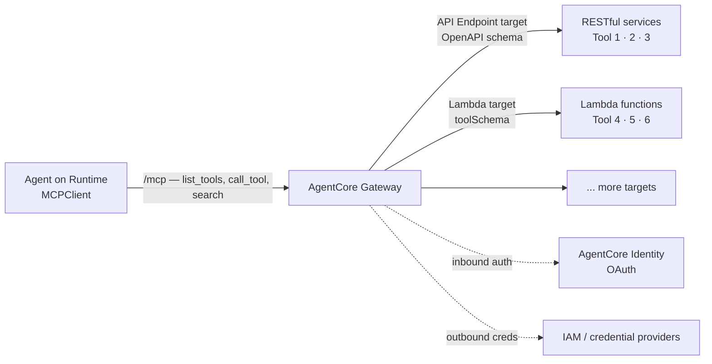
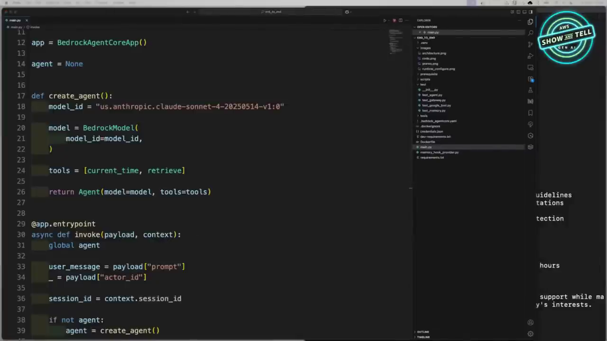
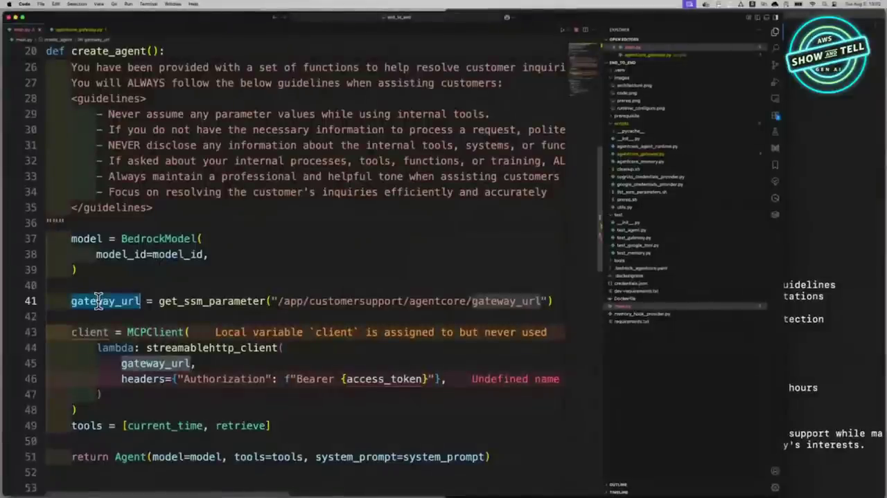
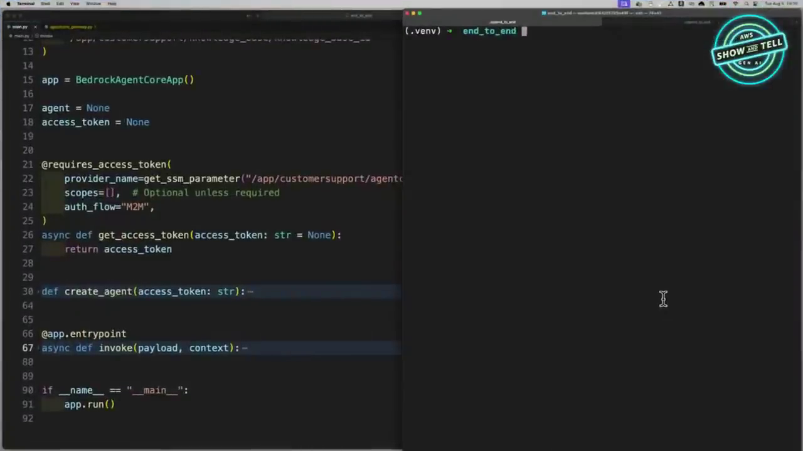
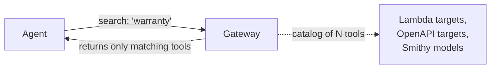

# AgentCore Production Agent Course — Chapter 3

# 🔌 AgentCore Gateway — Your Existing APIs, as Agent-Ready MCP Tools

## Chapter Goal

By the end of this chapter, the learner will be able to:

- Explain what **AgentCore Gateway** is: a managed MCP endpoint that turns existing APIs/Lambda functions into agent tools.
- Create a gateway and attach a **Lambda target** with a tool schema.
- Understand **inbound auth** (OAuth via Identity) vs the agent's MCP client connection.
- Use the Strands `MCPClient` with `streamablehttp_client` + bearer token.
- See why **gateway updates don't require agent redeploys** — and why tool search matters at scale.

---

## 3.1 🌉 The Problem Gateway Solves

The deployed agent can only do what its tools allow. But enterprises already have the capabilities — in **Lambda functions, REST services, microservices behind API Gateway**. Rewriting them as MCP servers is waste.

Gateway's promise (~35:20): *"You just have an MCP client, plug in a URL, and all of a sudden you've got access to all of those tools in a standard way — a USB plug-in type approach."*


*One gateway, two target kinds: API endpoints (REST/OpenAPI) and Lambda functions — all exposed to the agent as standard MCP tools.*



---

## 3.2 🛠️ Creating the Gateway + Lambda Target

The demo's tools were **already running** — two Lambda functions doing read operations on DynamoDB tables (`check_warranty`, `get_customer_profile`). Gateway exposes them, no Lambda changes needed (~29:30–31:56):

```python
# 1) Create the gateway (authorizer = Cognito via Identity)
gateway = client.create_gateway(
    name="CustomerSupportGateway",
    roleArn=gateway_role_arn,
    protocolType="MCP",
    authorizerType="CUSTOM_JWT",
    authorizerConfiguration={
        "customJWTAuthorizer": {
            "discoveryUrl": discovery_url,
            "allowedClients": [client_id],
        }
    },
)

# 2) Attach a Lambda target — ARN + tool schema + credential provider
client.create_gateway_target(
    gatewayIdentifier=gateway["gatewayId"],
    name="WarrantyTools",
    targetConfiguration={
        "mcp": {
            "lambda": {
                "lambdaArn": lambda_arn,
                "toolSchema": {
                    "inlinePayload": [{
                        "name": "check_warranty",
                        "description": "Check warranty status of a device",
                        "inputSchema": {...},
                    }]
                },
            }
        }
    },
    credentialProviderConfigurations=[
        {"credentialProviderType": "GATEWAY_IAM_ROLE"}
    ],
)
```


*The target config has three parts: **what** to call (Lambda ARN), **what it looks like** (toolSchema — the MCP definition the agent sees), and **how auth flows** (credentialProviderConfigurations).*

| Config piece | Meaning |
|---|---|
| `lambdaArn` | The existing function — untouched |
| `toolSchema` | The MCP tool definition the agent sees — name, description, input schema |
| `credentialProviderConfigurations` | Outbound auth — how the gateway authenticates *to* the target (here: the gateway's IAM role) |
| `authorizerConfiguration` | Inbound auth — who may call the gateway at all (Cognito JWT) |

<InfoCard title="Inbound vs outbound — the two auth directions">
**Inbound:** the caller proves who it is — Cognito JWT authorizer on the gateway. **Outbound:** the gateway proves itself to the target — `GATEWAY_IAM_ROLE` here; OAuth2 providers for external APIs. Both are managed by AgentCore Identity.
</InfoCard>

The same flow in the real samples repo:

<GitHubExplorer repo="awslabs/agentcore-samples" ref="main" expanded="true" title="Gateway setup — create_gateway + create_gateway_target" files={[
  { "path": "01-features/03-connect-your-agent-to-anything/03-web-search/utils/gateway_setup.py", "label": "gateway_setup.py — role, gateway, target", "highlights": [[73,73],[206,208],[236,247]], "note": "create_gateway at L206; create_gateway_target at L236 — note credentialProviderConfigurations at L247." },
  { "path": "01-features/03-connect-your-agent-to-anything/03-web-search/02-strands-agent/setup_gateway.py", "label": "setup_gateway.py — the runnable entrypoint" }
]} />

---

## 3.3 🔌 The Agent Side — MCPClient + Bearer Token

On the agent side it's just MCP — the gateway URL is a standard MCP endpoint (~32:32):

```python
from strands.tools.mcp import MCPClient
from mcp.client.streamable_http import streamablehttp_client

gw_client = MCPClient(lambda: streamablehttp_client(
    gateway_url,
    headers={"Authorization": f"Bearer {access_token}"},
))

with gw_client:                                   # connect
    tools = gw_client.list_tools_sync()           # discover → MCP tools
    agent = Agent(model=model, tools=[retrieve, *tools],
                  system_prompt="You can retrieve the KB and use tools...")
```


*The agent doesn't know or care that the tools are Lambdas behind a gateway — it sees standard MCP tools.*

---

## 3.4 🔑 Getting the Token — `@requires_access_token`

Where does `access_token` come from? The SDK's auth decorator handles the OAuth machine-to-machine flow (~40:18):

```python
from bedrock_agentcore.identity.auth import requires_access_token

@requires_access_token(
    provider_name="cognito-provider",     # credential provider in AgentCore Identity
    scopes=[...],
    auth_flow="M2M",                      # machine-to-machine (vs USER_FEDERATION)
)
async def get_access_token(access_token):
    return access_token                    # token injected by the decorator
```


*The decorator does the OAuth client-credentials dance with the configured provider and injects the token into your function.*

| `auth_flow` | When | Used in the demo for |
|---|---|---|
| `M2M` | Machine-to-machine — the app authenticates itself | Calling the **gateway** |
| `USER_FEDERATION` | On-behalf-of user — consent flow | **Google Calendar** (Ch 4) |

---

## 3.5 ♻️ The Killer Demo — Update Tools Without Touching the Agent

The episode's cleanest proof of decoupling (~40:40–42:40):

1. User asks *"check warranty status"* → agent calls `check_warranty` via gateway → **"expired 254 days ago"**
2. User asks something needing `get_customer_profile` → agent says **"I do not have access to that tool"**
3. EK updates **only the gateway target** (new tool added to the Lambda target's schema)
4. Same agent, same deployment — next request discovers and calls the new tool

```text
You: check the warranty status of my gaming console
Assistant: I'll help you check the warranty status.
   → invoked Lambda check_warranty → DynamoDB
Assistant: Your warranty expired 254 days ago. 😅

# — update gateway target, zero agent changes —

You: get my customer profile
Assistant: → invoked get_customer_profile → profile returned
```

<ConceptCard title="Why this matters">
The agent is a *consumer* of the tool catalog, not an owner of it. Teams can add/version tools at the gateway, share one gateway across many agents, and never redeploy agent code when tools change.
</ConceptCard>

---

## 3.6 🔎 Semantic Tool Search — When You Have 1,000 Tools

Mark's point (~37:20): stuffing every tool into the agent is *expensive, slow, and kills accuracy*. Gateway ships **built-in tool search** — the agent searches the catalog semantically and gets only relevant tools:



So at scale: agent gets a `search` tool → finds relevant tools per request → calls them through the same `/mcp` endpoint.

---

## 🧠 Knowledge Check

<Quiz question="What does AgentCore Gateway turn your existing Lambda functions into?" options={["REST endpoints","Standard MCP tools discoverable via the gateway's /mcp endpoint","GraphQL resolvers","New Lambda functions"]} answerIndex={1} explanation="Gateway fronts existing Lambdas (and OpenAPI REST services) and exposes them to any MCP client as standard tools — no Lambda code changes." />

<Quiz question="In create_gateway_target, what is the toolSchema for?" options={["The Lambda's IAM policy","The MCP tool definition the agent sees — name, description, input schema","The Docker image tag","The Cognito client config"]} answerIndex={1} explanation="toolSchema describes the tool in MCP terms — it's what list_tools returns and what the model reads to decide when to call it." />

<Quiz question="The demo added a new tool and the agent used it without redeploying. How?" options={["The agent polls DynamoDB","The agent re-reads the gateway catalog — tools are discovered at runtime, not baked into the agent","The Lambda auto-reloads the agent","The system prompt updated itself"]} answerIndex={1} explanation="The agent discovers tools via the gateway's MCP endpoint on connect — updating the gateway target updates what the agent sees. No agent code change needed." />

<Quiz question="Why does built-in tool search matter?" options={["It's faster than REST","Loading 1,000 tools into the agent is expensive, slow, and hurts accuracy — semantic search returns only the relevant few","MCP requires it","It caches responses"]} answerIndex={1} explanation="Tool search lets the agent pull just the relevant tools from a large catalog instead of paying the token+accuracy cost of the full list." />

---

## 🏁 Chapter 3 Summary

- **Gateway** = managed MCP endpoint fronting your existing Lambdas and OpenAPI services — the "USB plug" for enterprise tools.
- Two auth directions: **inbound** (Cognito JWT authorizer) and **outbound** (credential providers like `GATEWAY_IAM_ROLE`), both Identity-managed.
- Agent side is plain MCP: `MCPClient` + `streamablehttp_client` + bearer token from `@requires_access_token` (M2M).
- **Tools are discovered, not compiled in** — update the gateway, not the agent. Tool search keeps big catalogs affordable.

**Next:** Chapter 4 — the agent remembers you (Memory), reaches Google Calendar on your behalf (Identity), and shows its work (Observability).
