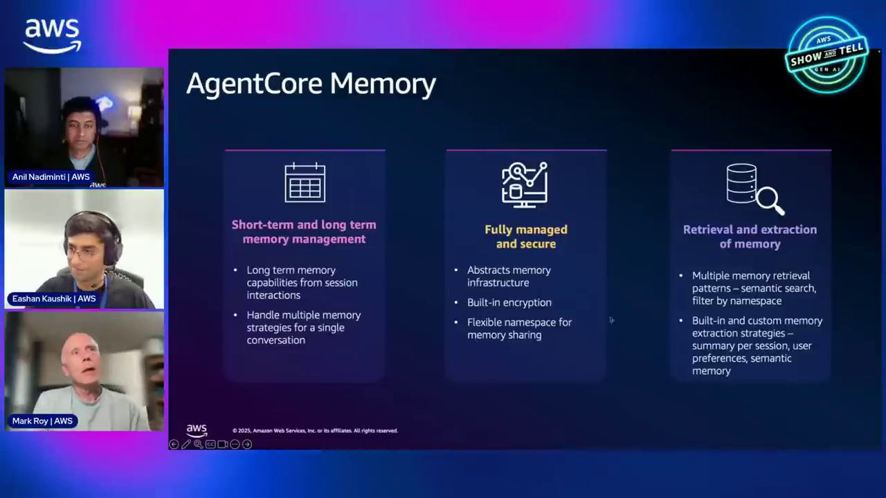
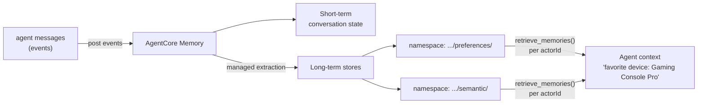
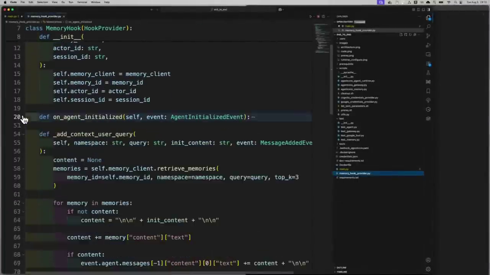
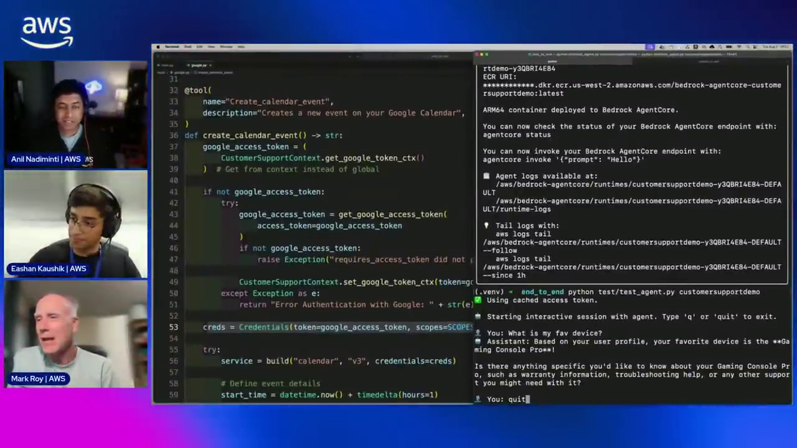
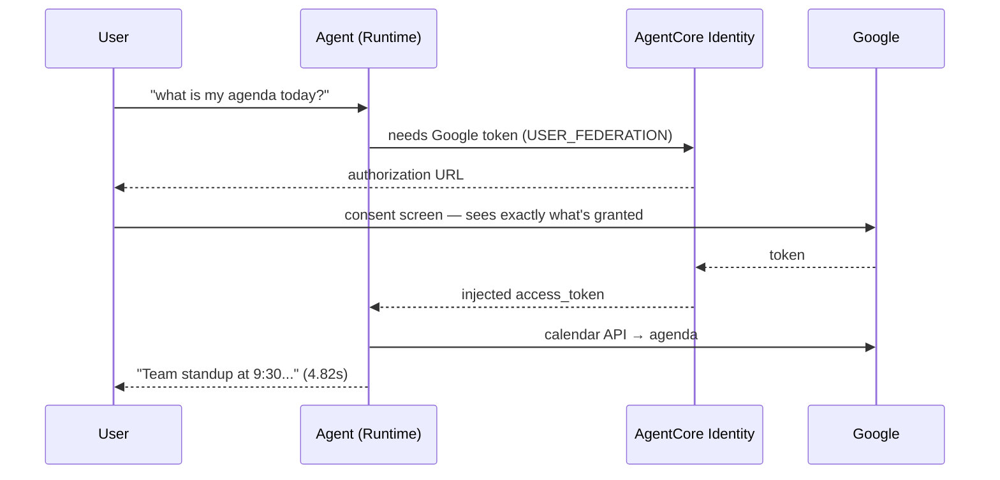
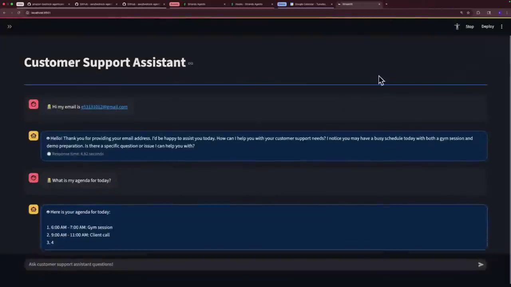
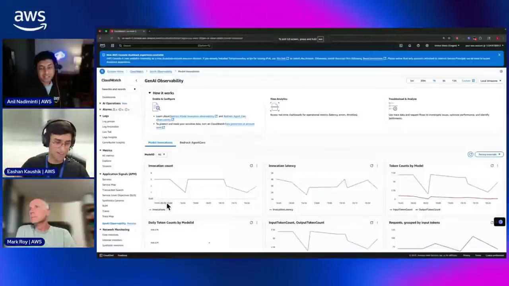
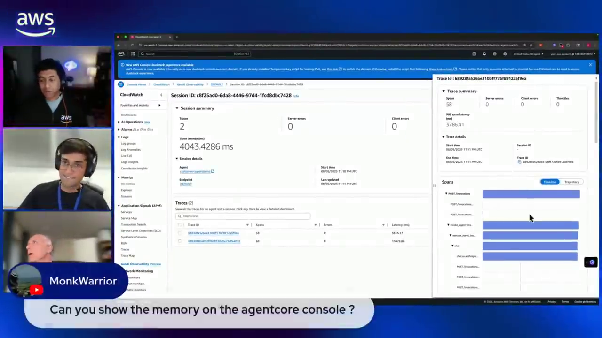
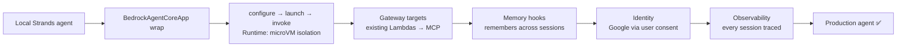

# AgentCore Production Agent Course — Chapter 4

# 🧠 Memory, Identity & Observability — The Agent Remembers, Authenticates, and Shows Its Work

## Chapter Goal

By the end of this chapter, the learner will be able to:

- Distinguish AgentCore Memory's two flavors — **short-term** (conversation events) vs **long-term** (preferences, facts, summaries).
- Wire memory into a Strands agent with **hooks** (`HookProvider`, `AgentInitializedEvent`, `MessageAddedEvent`) and namespaced retrieval.
- Explain the **USER_FEDERATION** OAuth flow — how the agent got delegated Google Calendar access with user consent.
- Read the **GenAI Observability** dashboard — sessions, traces, tokens, and the per-span agent trajectory.
- Recap the whole build: local agent → runtime → gateway tools → memory → identity → observability.

---

## 4.1 🧠 AgentCore Memory — Two Flavors

Agents without memory are, as Mark puts it (~38:00), *"not very powerful."* Memory comes in two flavors:


*Short-term keeps the conversation coherent; long-term is the compelling part — the agent remembers across sessions.*

| Flavor | What it stores | Retrieval |
|---|---|---|
| **Short-term** | Conversation events for the session | Post events → Memory keeps them; list raw events |
| **Long-term** | Extracted **user preferences, facts, session summaries** | Keyword, **namespace**, or **semantic search** |

The magic is that long-term extraction is **fully managed** — you post raw events; Memory summarizes them into preferences/facts behind the scenes. Before this existed, the demo notes, all of that was hand-rolled code.



---

## 4.2 🪝 Wiring Memory In — Strands Hooks

The integration (~44:06) uses **Strands hooks** — extension points in the agent loop:

```python
class MemoryHook(HookProvider):
    def register_hooks(self, registry: HookRegistry):
        # 1) When the agent starts → pull long-term memories into context
        registry.add_callback(AgentInitializedEvent, self.on_agent_initialized)
        # 2) On each message → store it as a memory event
        registry.add_callback(MessageAddedEvent, self.on_message_added)

    def on_agent_initialized(self, event):
        memories = self.session.retrieve_memories(
            namespace_prefix=f"support/customer/{actor_id}/preferences/")
        # inject into the agent's context
```


*Two hooks do the work: on init, inject the user's long-term memories; on each message, persist events back to Memory.*

The real, fuller implementation in the samples repo — custom strategies + `MemorySessionManager`, namespaced per `actorId`:

<GitHubExplorer repo="awslabs/agentcore-samples" ref="main" expanded="true" title="Long-term memory via Strands hooks — customer support example" files={[
  { "path": "01-features/04-manage-context-of-your-agent/memory/02-long-term-memory/examples/single-agent/with-strands-agent/02-custom-hook/customer-support/customer-support-override-strategy.py", "label": "customer-support-override-strategy.py — MemorySessionManager + hooks", "highlights": [[336,355],[478,478],[496,538],[591,605]], "note": "Namespaces per actorId (L336/355), MemorySessionManager (L478), CustomerSupportMemoryHooks(HookProvider) (L496), register_hooks (L591)." },
  { "path": "01-features/04-manage-context-of-your-agent/memory/02-long-term-memory/examples/single-agent/with-strands-agent/01-built-in-hook/customer-support/customer-support-inbuilt-strategy.py", "label": "Built-in strategy variant — same pattern, less code" }
]} />

---

## 4.3 ✨ The Payoff — It Actually Remembers

The demo's proof (~50:00–51:20): same user, new session —

```bash
python test/test_agent.py customersupportdemo
```

```text
Starting interactive session with agent. Type 'q' or 'quit' to exit.

You: What is my fav device?
🤖 Assistant: Based on your user profile, your favorite device is the
   **Gaming Console Pro**!

Is there anything specific you'd like to know about your Gaming Console Pro,
such as warranty information, troubleshooting help, or any other support
topics you might need help with?
```


*A few lines of hook code → the agent greets a returning user already knowing their favorite device. No session state hand-coding.*

<WarningCard title="UX honesty">
Note the query `What is my fav device?` — the agent had never been told "favorite" in those words; semantic retrieval matched it to stored preferences. That's the difference between long-term memory and just replaying chat history.
</WarningCard>

---

## 4.4 🔐 AgentCore Identity — Google Calendar via USER_FEDERATION

Next the agent gets access to **third-party** services — Google Calendar — securely, with the user's consent (~47:20–55:30):

```python
# Identity: an OAuth2 credential provider registered for Google
# (client ID + secret from your Google Cloud project)

@requires_access_token(
    provider_name="google-provider",
    scopes=["https://www.googleapis.com/auth/calendar"],
    auth_flow="USER_FEDERATION",          # on-behalf-of the end user
)
def get_google_access_token(access_token):
    return access_token
```

The flow, exactly as it played out live:



| Step | Frame | What you see |
|---|---|---|
| Consent | Google consent screen | The user **sees and approves** the scopes — no password sharing |
| Result | Customer Support UI | The agent answers with the real agenda |
| Inbound auth | Cognito hosted UI | The same user pool that gated `invoke` |


*End result — the web UI (access token + session ID in the sidebar) answering "what's my agenda" from Google Calendar.*


*Cognito is doing double duty: JWT authorizer inbound, OAuth token vault outbound.*

<InfoCard title="USER_FEDERATION vs M2M — the two auth_flows">
**M2M** (Ch 3): the *app* authenticates to call the gateway — no user involved. **USER_FEDERATION**: the *user* delegates access via a consent flow — the agent acts on their behalf with a scoped token. Same `@requires_access_token` decorator, different flow.
</InfoCard>

---

## 4.5 🔭 AgentCore Observability — GenAI Observability Dashboard

The finale (~56:00): *"What is my agent actually doing in the back end?"* — answered by the **GenAI Observability** dashboard in CloudWatch:


*Invocation count, latency, input/output token counts per model, request distributions — out of the box.*


*Drill into a session: 2 traces, trace latency, zero errors — and the span tree showing the Strands agent loop, the Anthropic model call, and tool executions. "You can see which trajectory the agent took."*

What you get with no instrumentation added (the runtime emits OTel automatically):

| Level | Shows |
|---|---|
| **Dashboard** | Sessions, invocation count, latency, token counts by model, errors/throttles |
| **Session** | All traces for one conversation; per-trace latency and error count |
| **Trace → spans** | The agent loop: invoke → `stream_async` → model call → tool calls → response — the full trajectory |

<Quiz question="Which of these does AgentCore Observability surface WITHOUT extra instrumentation?" options={["Your Lambda cold-start times","Sessions, traces, token usage, and the agent's span trajectory","Cognito sign-up rates","DynamoDB item sizes"]} answerIndex={1} explanation="The runtime emits OpenTelemetry traces by default — the dashboard showed the agent's session, span tree and token counts with zero instrumentation code." />

---

## 4.6 🧩 Q&A Nuggets Worth Keeping

| Question from chat | Answer (as given) |
|---|---|
| "Strands has S3 session/conversation managers — needed with AgentCore?" | AgentCore Memory manages this for you — you don't need to wire them separately |
| "Can gatewayUrl connect to my existing API Gateway + Lambda microservices?" | **Yes, spot on** — point gateway targets at existing REST/Lambda, get MCP tools |
| "Memory in the AgentCore console?" | Not yet at recording time — UI team was working on it *(check current docs — it has since shipped)* |
| "Vibe coding?" | Works great — Claude Code / Q CLI / Kiro + the SDK; first-party decorators for that were "coming in the next week or two" |

---

## 🧠 Knowledge Check

<Quiz question="Which Strands hook mechanism injects long-term memories when the agent starts?" options={["A middleware on the HTTP request","AgentInitializedEvent — the hook retrieves memories by namespace and puts them in context","A system-prompt rewrite","A cron job"]} answerIndex={1} explanation="MemoryHook registers callbacks on AgentInitializedEvent (retrieve → inject context) and MessageAddedEvent (persist events)." />

<Quiz question="How did the agent access the user's Google Calendar?" options={["The user pasted their API key","USER_FEDERATION OAuth — user consents on a Google screen, Identity holds the token, the decorator injects it","M2M auth","The agent screenshotted Google Calendar"]} answerIndex={1} explanation="@requires_access_token with auth_flow='USER_FEDERATION' triggers a consent flow — the user approves scopes, the token reaches the agent without it ever seeing credentials." />

<Quiz question="Where do long-term memories get organized?" options={["A single flat list","Namespaces like support/customer/{actorId}/preferences/ — retrievable by keyword or semantic search","The session_id only","S3 buckets per user"]} answerIndex={1} explanation="Memory uses per-actor namespaces (preferences, semantic, summaries) with keyword/namespace/semantic retrieval." />

---

## 🏁 Chapter 4 Summary — and the Whole Build

- **Memory** — post events, get managed short-term state + extracted long-term preferences; Strands hooks wire it in ~40 lines.
- **Identity** — `@requires_access_token` covers both **M2M** (gateway calls) and **USER_FEDERATION** (Google consent) flows; Cognito doubles as inbound authorizer.
- **Observability** — sessions → traces → span trajectory, token counts, errors — zero instrumentation required.

The full arc the episode demonstrated live:



### Watch the Original Tutorial

<VideoSection youtubeId="wzIQDPFQx30" title="Building your first production-ready AI agent with Amazon Bedrock AgentCore | AWS Show & Tell" />

**Keep going:** *Bedrock to Production* Ch 04–05 go deeper on AgentCore Runtime and a full Gateway walkthrough; *Strands Agents* covers the agent framework used throughout this course.
