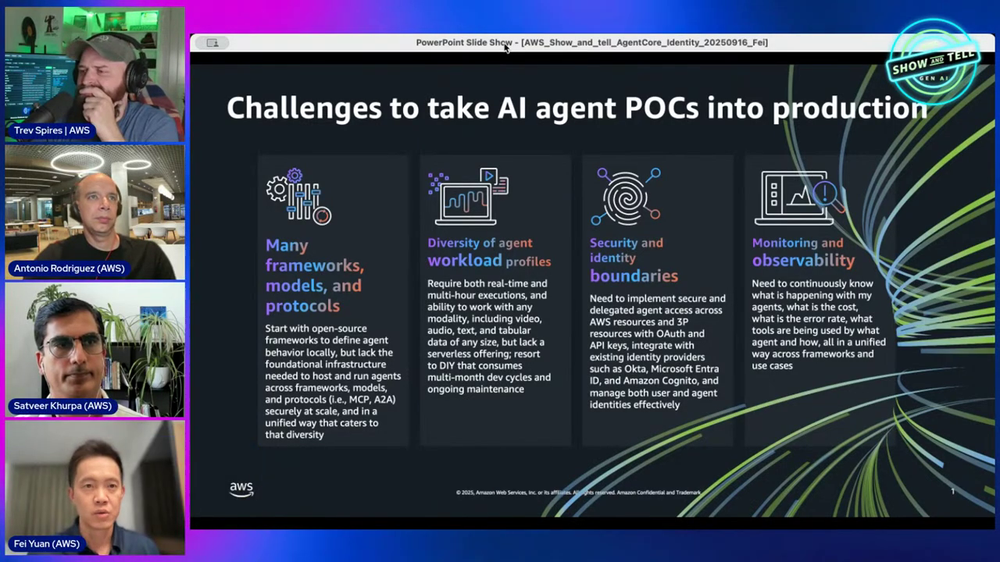
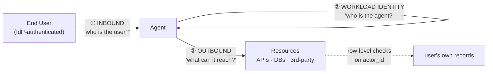
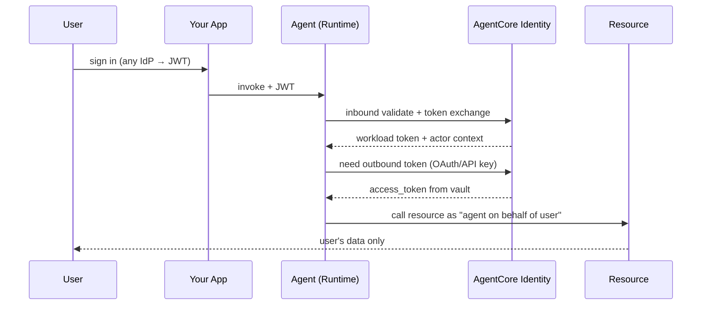

# AgentCore Security Course — Chapter 1

# 🔐 Securing Agent Workflows — The Identity Model

## 🎬 About This Course — The Source Video

This course is built as **interactive, chapter-by-chapter notes** for the AWS Show & Tell episode **"Secure your agent workflows with Amazon Bedrock AgentCore"** — where host **Trevor Spires** is joined by **Fei** (lead engineer of the AgentCore Identity service), **Saurabh**, and **Antonio** to walk through how identity works end-to-end for agents.

<VideoSection youtubeId="wv2doVDF7KQ" title="Secure your agent workflows with Amazon Bedrock AgentCore | AWS Show & Tell" />

---

## Chapter Goal

By the end of this chapter, the learner will be able to:

- Explain why **an agent is not just a workload** — and why that debate mattered internally at AWS.
- Break identity for agents into three questions: **inbound** (who's the user), **workload** (who's the agent), **outbound** (what can the agent reach).
- Describe the two flows AgentCore Identity manages — **inbound auth** (user → agent) and **outbound auth** (agent → resource).
- Name the four building blocks: token vault, workload identity, credential providers, and the identity directory.

---

## 1.1 🤔 Is an Agent a Workload? The Debate That Shaped Identity

Early in the episode (~06:00) Fei surfaces the question that drove the whole design: *"What's the difference between an agent and a workload? Are they the same?"*

The answer the team landed on — **no, and the difference is security-critical**:

| | Traditional workload | Agent |
|---|---|---|
| **Acts for** | Itself — a service identity | A specific **end user** — identity must propagate |
| **Calls resources** | Fixed, predictable set | Dynamic — decided by the LLM at runtime |
| **Auth model** | Service-to-service (mTLS, IAM) | On-behalf-of user + machine creds + third-party OAuth |
| **Risk** | Known blast radius | An agent with tools can do *anything* its tools allow |

<ConceptCard title="Why customers were afraid">
Fei notes a real pattern: enterprises stalled agent projects because they couldn't answer "who is this agent acting as, and can it leak another user's data?" Until identity is solved, agents don't move past the demo.
</ConceptCard>

---

## 1.2 🧭 The Three Questions Every Agent Deployment Asks

Fei lays out the model (~08:15–12:00) as three distinct questions — each maps to a different piece of the picture:

1. **Inbound** — a user sits in front of an application calling your agent. How do you authenticate *that* user?
2. **Workload identity** — what is the agent's own identity? (This is where it *is* like a workload — service-to-service.)
3. **Outbound** — the agent needs to reach resources — AWS services, internal APIs, or third-party (GitHub, Google). How does it prove both "this is my agent" and "it's acting for *this* user"?

<InfoCard title="The third question is the hard one">
"Is Sever asking me to access his account, or is Antonio? And how do I know the agent isn't lying?" — the outbound hop needs to carry **both** the workload identity *and* the user's identity. That's the piece no traditional auth pattern covers.
</InfoCard>

---

## 1.3 🧱 AgentCore Identity — The Four Building Blocks

The service's answer (~12:45–18:00), deliberately **bring-your-own-IdP** — *"We wanted to make sure you can bring your identity provider as-is; you don't need Cognito"*:

| Block | What it does |
|---|---|
| **Identity directory / workload identity** | Registers your agents as first-class identities — the agent's "who am I" |
| **Token vault** | Securely stores OAuth tokens obtained on behalf of users — the agent code never holds credentials |
| **Resource credential providers** | Registered outbound configs — OAuth2 (GitHub/Google OBO), API keys (Perplexity), or IAM for AWS resources |
| **Auth decorators / SDK** | `@requires_access_token`, `@requires_api_key` — pull the right token out of the vault at call time |

<WarningCard title="Zero trust, every hop">
Fei's framing (~27:00): *"We don't trust hop to hop. Every hop you need to show proof in order to access resources."* Identity isn't a one-time login — every hop re-verifies.
</WarningCard>

Works with the IdPs enterprises actually use — Cognito, Entra, Okta, Auth0, Ping, Cisco Duo — and the samples repo has step-by-step setups for each.

---

## 1.4 🔄 The End-to-End Flow — Tying It Together

The full picture (~20:15–25:30):

Two distinct token-handling modes in the same service:

- **AWS resources / IAM-controlled** → IAM does the authZ — Identity just brokers it
- **OAuth or API-key resources** → Identity's **token vault** holds the credential; your code never does

That's why Antonio highlights (~24:45): *"Your agent's code will be handling those tokens properly — that's the reason we have this service."*

---

## 🧠 Knowledge Check

<Quiz question="What's the core difference between an agent and a traditional workload?" options={["Agents are faster","Agents act on behalf of a specific end user — user identity must propagate through every call","Agents use GPUs","Workloads can't call APIs"]} answerIndex={1} explanation="A workload acts as itself; an agent acts for a user. That on-behalf-of propagation is the hard problem AgentCore Identity solves." />

<Quiz question="What are the three identity questions in the AgentCore model?" options={["Login, logout, refresh","Inbound (user→agent), workload identity (who is the agent), outbound (agent→resources)","AuthN, authZ, audit","OAuth, SAML, OIDC"]} answerIndex={1} explanation="Inbound authenticates the user, workload identity names the agent itself, outbound proves agent + user to the resource." />

<Quiz question="What does the AgentCore Identity token vault do?" options={["Mints JWTs for users","Securely stores OAuth/API tokens obtained on behalf of users so agent code never handles raw credentials","Manages IAM roles","Logs all API calls"]} answerIndex={1} explanation="The vault is the whole point — your code asks for a token, Identity returns it; credentials never sit in your code." />

---

## 🏁 Chapter 1 Summary

- **Agents ≠ workloads** — they act for a user, decide calls at runtime, and need end-to-end identity.
- The model splits into **inbound** (user → agent), **workload identity** (the agent itself), and **outbound** (agent → resources) — each hop independently verified.
- AgentCore Identity = **token vault + workload identity + credential providers + SDK decorators**, bring-your-own-IdP.
- Every hop requires proof — zero-trust applied to agent chains.

**Next:** Chapter 2 — the demo: an agent that reaches into your private GitHub repos via OAuth, with user consent.
