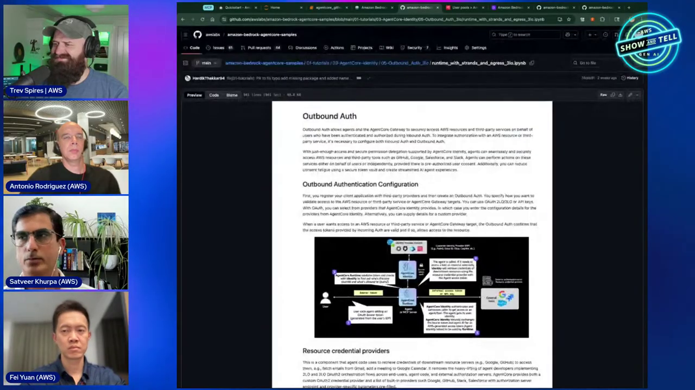
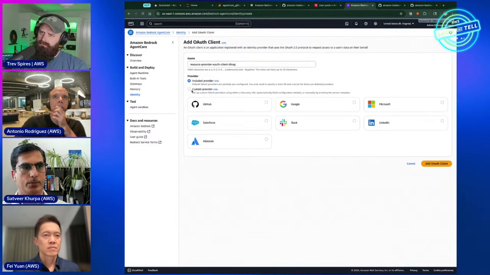
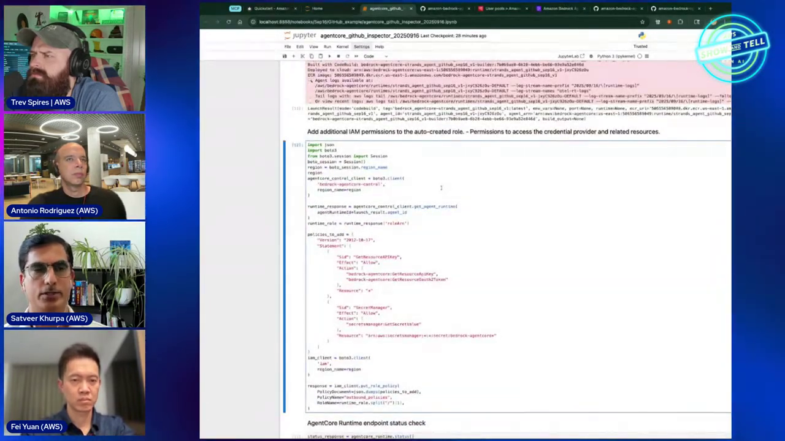
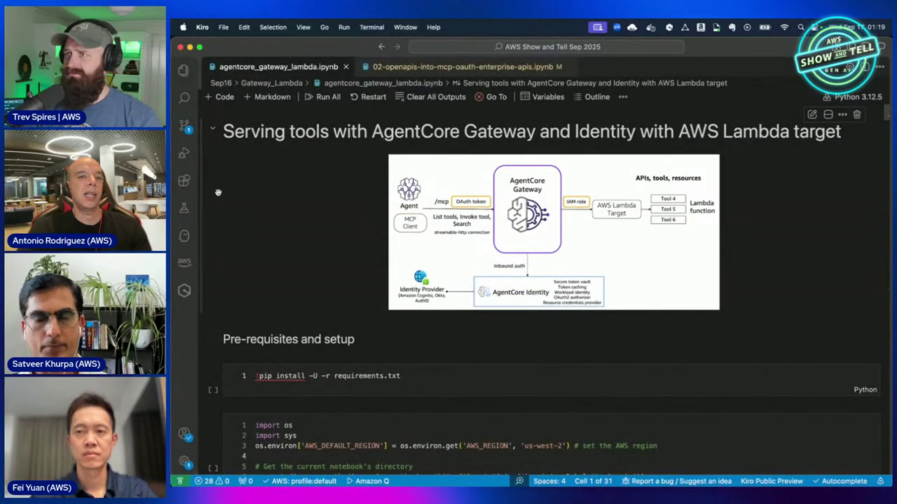

# AgentCore Security Course — Chapter 2

# 🔑 Credential Providers & Outbound OAuth — The GitHub Demo

## Chapter Goal

By the end of this chapter, the learner will be able to:

- Configure a **resource credential provider** for a third-party OAuth API (GitHub).
- Wire **USER_FEDERATION** (3-legged OAuth) so the agent gets a token *with user consent*.
- Deploy the agent to Runtime and watch the consent → token → call flow end-to-end.
- Recognize that Identity works **standalone** — you don't need Runtime to use it.

---

## 2.1 🧪 Setting Up — A GitHub Assistant Agent

Savibir's demo (~27:45): an agent that can **list your private GitHub repositories** — deliberately chosen because GitHub is OAuth-protected and *not* an AWS resource. The flow exercises the whole outbound path.

```mermaid
flowchart LR
    U["User"] -->|"prompt"| AG["GitHub Assistant agent<br/>(on AgentCore Runtime)"]
    AG -->|"`inspect_repos` tool<br/>needs GitHub token"| ID["AgentCore Identity<br/>token vault"]
    ID -->|"consent URL"| U
    U -->|"grants read:repo"| GH["GitHub OAuth"]
    GH -->|"access token → vault"| ID
    ID -->|"token injected"| AG
    AG -->|"list repos"| GH
```

The notebook is public — in the samples repo under the Identity tutorials.



---

## 2.2 ⚙️ Step 1 — Register the Credential Provider

Before the agent can call GitHub, you tell Identity *how* to get a token (~29:15–31:30). In the console or SDK:

```python
client.create_oauth2_credential_provider(
    name="github-provider-sep16",
    credentialProviderVendor="GitHubOauth2",   # named provider
    oauth2ProviderConfigInput={
        "githubOauth2ProviderConfig": {
            "clientId": GITHUB_CLIENT_ID,
            "clientSecret": GITHUB_CLIENT_SECRET,   # lives in Secrets Manager
        }
    },
)
```

| Field | What it is |
|---|---|
| `credentialProviderVendor` | A **named provider** — `GitHubOauth2`, `GoogleOauth2`, `CustomOauth2`, plus `ApiKey`/`IAM` types |
| `clientId` / `clientSecret` | Your GitHub OAuth app's credentials — the secret is stored via **Secrets Manager**, never in code |
| `name` | The handle your agent's decorator references later |

<InfoCard title="Why 'credential provider' and not just 'token'?">
A credential provider describes *how to get* credentials (the OAuth endpoints, the client, the secret) — Identity then handles obtaining, storing, refreshing and injecting the token. Same abstraction covers OAuth2, API keys, and IAM.
</InfoCard>





---

## 2.3 🤝 Step 2 — USER_FEDERATION, the 3-Legged Flow

The agent code requests a token on the user's behalf (~33:00):

```python
@requires_access_token(
    provider_name="github-provider-sep16",
    scopes=["repo"],                    # read-only scope in the demo
    auth_flow="USER_FEDERATION",        # 3-legged OAuth — needs user consent
)
def get_github_token(access_token):
    return access_token                  # injected after consent
```

`USER_FEDERATION` means the **end user must consent**:

```text
Agent runs → no token in vault yet
  → Identity returns an authorization URL
  → user opens it → GitHub consent screen → approves scopes
  → GitHub sends token → vault stores it
  → agent retries → token is injected → repos listed
```

<ConceptCard title="The consent is the point">
The agent can't silently gain access — the user sees GitHub's real consent screen and approves the exact scope (`repo` read). After that, the vault holds the token and every later call just works.
</ConceptCard>

---

## 2.4 🚀 Step 3 — Deploy & Invoke

Savibir deploys the same agent to Runtime (~34:30) — `agentcore configure` + `launch` — then invokes with the Cognito JWT for inbound auth:

```text
You: tell me a joke                       # smoke test
Assistant: 😄 ...                          # agent alive

You: list my private repositories
   → needs GitHub token → consent URL returned
   → [user clicks, consents]
Assistant: Here are your private repositories:
   • deepti-private-notes • internal-tooling • ...
```

An honest demo moment: the first invoke **times out** waiting on consent — the flow is async; the agent has to retry once consent lands. Real systems handle this by returning the URL to the UI and polling.



---

## 2.5 🧩 Identity Works Without Runtime — The Standalone Case

Antonio's second demo (~40:30–45:00) answers the most common question: *"Do I need the rest of AgentCore to use Identity?"* — **no**.

```python
# A plain Python research agent — no AgentCore Runtime at all
class ResearchAgent:
    def research(self, topic):
        perplexity_key = get_perplexity_key()      # API-key credential provider
        # ... calls Perplexity ...
    def save(self, content):
        token = get_google_token()                  # OAuth2 provider → Google Drive
        # ... uploads to Drive ...
```

Two credential types side-by-side:

| Credential provider | Used for | Type |
|---|---|---|
| Google OAuth2 | Writing the report to **Google Drive** | `USER_FEDERATION` OAuth |
| Perplexity API key | Calling **Perplexity** for research | API-key vault entry |

<TipCard title="The takeaway">
Identity is a standalone primitive. Run your agent on a laptop, on ECS, in Lambda — the vault + credential providers work the same. Runtime integration is a bonus, not a requirement.
</TipCard>

---

## 🧠 Knowledge Check

<Quiz question="What does a resource credential provider describe?" options={["A stored password","How to obtain credentials for a resource — OAuth endpoints, client ID/secret, or API key","The user's IAM role","The agent's Docker image"]} answerIndex={1} explanation="It captures the *how* — vendor type (GitHubOauth2, GoogleOauth2, ApiKey, IAM…) plus the client config. Identity then gets/stores/refreshes tokens from it." />

<Quiz question="When does USER_FEDERATION show a consent screen?" options={["Never","On first call when no token exists in the vault — the user approves scopes, then the token is stored","Every single call","Only in production"]} answerIndex={1} explanation="3-legged OAuth: first call returns an authorization URL → user consents → token goes to the vault → subsequent calls are silent." />

<Quiz question="Can you use AgentCore Identity without AgentCore Runtime?" options={["No — it requires the runtime","Yes — it's a standalone primitive; the second demo ran a plain Python agent","Only on Lambda","Only with Cognito"]} answerIndex={1} explanation="The research-agent demo ran Identity's token vault + credential providers with zero Runtime — it works wherever your code runs." />

---

## 🏁 Chapter 2 Summary

- **Resource credential providers** tell Identity how to get credentials — OAuth2 vendors, API keys, or IAM — secrets live in Secrets Manager.
- **USER_FEDERATION** = 3-legged OAuth with real user consent; the token lands in the vault and gets injected via `@requires_access_token`.
- The GitHub demo proves the full loop: deploy → invoke → consent URL → token → private repos.
- **Identity is standalone** — the same vault works from any agent host.

**Next:** Chapter 3 — Gateway + Identity: inbound JWT auth and outbound credential chaining to Lambda tools.
