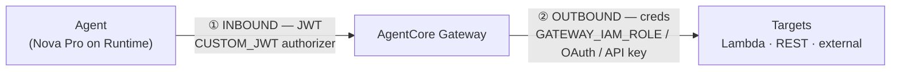
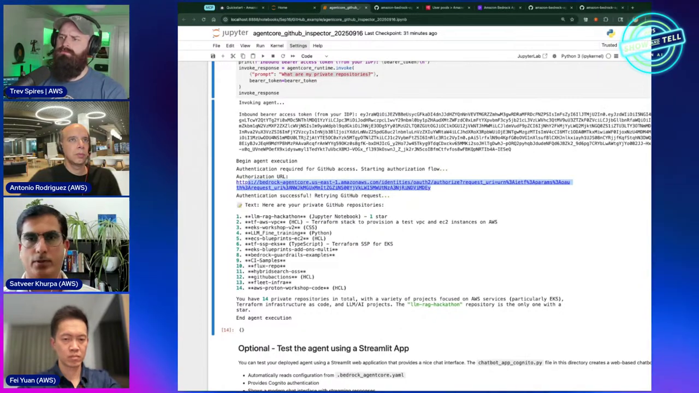
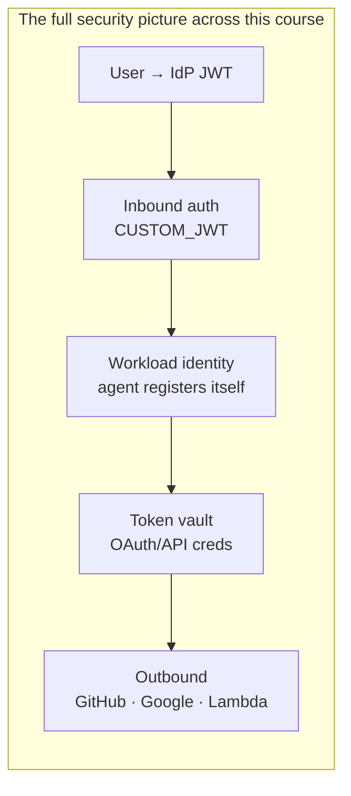

# AgentCore Security Course — Chapter 3

# 🌉 Gateway + Identity — End-to-End Auth Through the Tool Layer

## Chapter Goal

By the end of this chapter, the learner will be able to:

- Configure a **Gateway** with an inbound **JWT authorizer** (Cognito).
- Attach a **Lambda target** with a `GATEWAY_IAM_ROLE` credential config.
- Understand outbound OAuth and API-key options for external targets.
- Watch the live order-management demo — a Nova Pro agent calling tools behind a secured gateway.

---

## 3.1 🔗 Two Auth Boundaries on One Gateway

Antonio's demo (~46:30–56:00) puts Identity through the Gateway — an **order-management** agent calling Lambda tools (`get_order`, `update_order`). The gateway has to answer *both* directions of auth:



| Direction | Config | In the demo |
|---|---|---|
| **Inbound** (caller → gateway) | `authorizerConfiguration` on the gateway | `customJWTAuthorizer` backed by a Cognito user pool |
| **Outbound** (gateway → target) | `credentialProviderConfigurations` on each target | `GATEWAY_IAM_ROLE` for the Lambda; OAuth/API key for externals |

<ConceptCard title="Same Identity, both sides">
Both directions run through AgentCore Identity — inbound validates *who's calling*, outbound provides *how the gateway proves itself to the target*. One service owns the whole chain.
</ConceptCard>



---

## 3.2 ⚙️ Building the Gateway — Inbound Auth First

Antonio configures the gateway's authorizer (~50:15):

```python
client.create_gateway(
    name="OrderManagementGateway",
    roleArn=gateway_role_arn,
    protocolType="MCP",
    authorizerType="CUSTOM_JWT",
    authorizerConfiguration={
        "customJWTAuthorizer": {
            "discoveryUrl": cognito_discovery_url,
            "allowedClients": [cognito_client_id],
            # allowedAudience — optional scoping
        }
    },
)
```

Cognito is the IdP here for flexibility — but any OIDC issuer works the same. The JWT the agent's caller presents gets validated against this config on every `/mcp` call.

---

## 3.3 🎯 Targets with Credential Config

Each target declares *its own* outbound auth (~51:45):

```python
client.create_gateway_target(
    gatewayIdentifier=gateway_id,
    name="OrderTools",
    targetConfiguration={
        "mcp": {
            "lambda": {
                "lambdaArn": order_lambda_arn,
                "toolSchema": {"inlinePayload": [
                    {"name": "get_order", "inputSchema": {...}},
                    {"name": "update_order", "inputSchema": {...}},
                ]},
            }
        }
    },
    credentialProviderConfigurations=[
        {"credentialProviderType": "GATEWAY_IAM_ROLE"}   # gateway's IAM role calls Lambda
    ],
)
```

The outbound options by target type:

| Target | `credentialProviderType` |
|---|---|
| AWS Lambda / AWS APIs | `GATEWAY_IAM_ROLE` — IAM does it |
| External OAuth API (GitHub, Salesforce…) | `OAUTH` — via a resource credential provider |
| API-key service (Perplexity…) | `API_KEY` — key held in the vault |

---

## 3.4 🎬 The Live Run — Agent Sees the Tools

With the gateway up and the agent configured (~54:00–55:30):

```text
You: what tools do you have?
🤖 Agent: Let me check… I see tools available: get_order, update_order.

You: get status of order 12345
🤖 → invoke get_order via /mcp
   → gateway validates JWT (inbound)
   → gateway calls Lambda as GATEWAY_IAM_ROLE (outbound)
   → Lambda returns order status
🤖 Assistant: Order 12345 is "shipped", arriving Tuesday.
```

The model driving the demo is **Amazon Nova Pro** — a reminder that the whole chain is model-agnostic; the gateway doesn't care what LLM calls it.

<WarningCard title="Every hop verified">
The JWT is checked at the gateway, the gateway assumes its IAM role to reach Lambda, and the Lambda can scope down further by `actor_id` — the row-level security from Ch 1. Nothing is implicitly trusted.
</WarningCard>

---

## 3.5 📚 Where to Go Next — The Full Resource Catalog

The episode closes by pointing at the samples repo (~56:00–58:30) — Identity examples cover:

- **Inbound OAuth** — Cognito, Entra, Okta, Auth0, Ping, Cisco Duo step-by-steps
- **Outbound OAuth** — GitHub, Google, and generic OAuth2 providers
- **AWS resources** — accessing S3/DynamoDB/etc. through IAM
- **End-to-end** — Runtime + Gateway + Identity chained (exactly this demo)

All in `awslabs/agentcore-samples` — notebook-first so you can step through each.

---

## 🧠 Knowledge Check

<Quiz question="What does customJWTAuthorizer on the gateway do?" options={["Mints JWTs","Validates the inbound caller's JWT against a discovery URL + allowed clients","Signs outbound requests","Encrypts the payload"]} answerIndex={1} explanation="It's the inbound authorizer — every /mcp call's JWT is validated against the OIDC discovery URL and allowed client IDs." />

<Quiz question="Which credentialProviderType makes the gateway call a Lambda with IAM?" options={["API_KEY","OAUTH","GATEWAY_IAM_ROLE","CUSTOM_JWT"]} answerIndex={1} explanation="GATEWAY_IAM_ROLE means the gateway uses its own IAM role for outbound auth to AWS targets." />

<Quiz question="The order-management demo used which model?" options={["Claude Sonnet","Amazon Nova Pro","Llama 3","Titan"]} answerIndex={1} explanation="Nova Pro — deliberately showing the chain is model-agnostic; gateway/identity don't care which LLM calls them." />

---

## 🏁 Chapter 3 Summary — and the Course

- **Gateway + Identity** gives you both auth boundaries: inbound `customJWTAuthorizer` (Cognito/OIDC) and outbound `credentialProviderConfigurations` (`GATEWAY_IAM_ROLE` / `OAUTH` / `API_KEY`).
- The agent just sees MCP tools; Identity does inbound JWT validation and outbound credential brokering.
- The repo has worked examples for every major IdP and outbound resource type.



### Watch the Original Tutorial

<VideoSection youtubeId="wv2doVDF7KQ" title="Secure your agent workflows with Amazon Bedrock AgentCore | AWS Show & Tell" />

**Related:** *AgentCore — Production-Ready Agents* Ch 03 covers the Gateway mechanics themselves; this course went deep on the identity layer.
