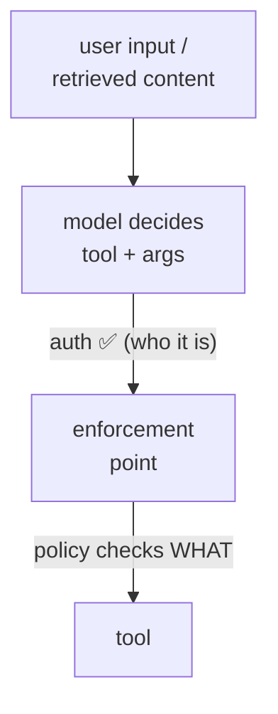
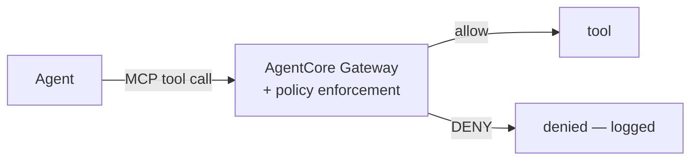
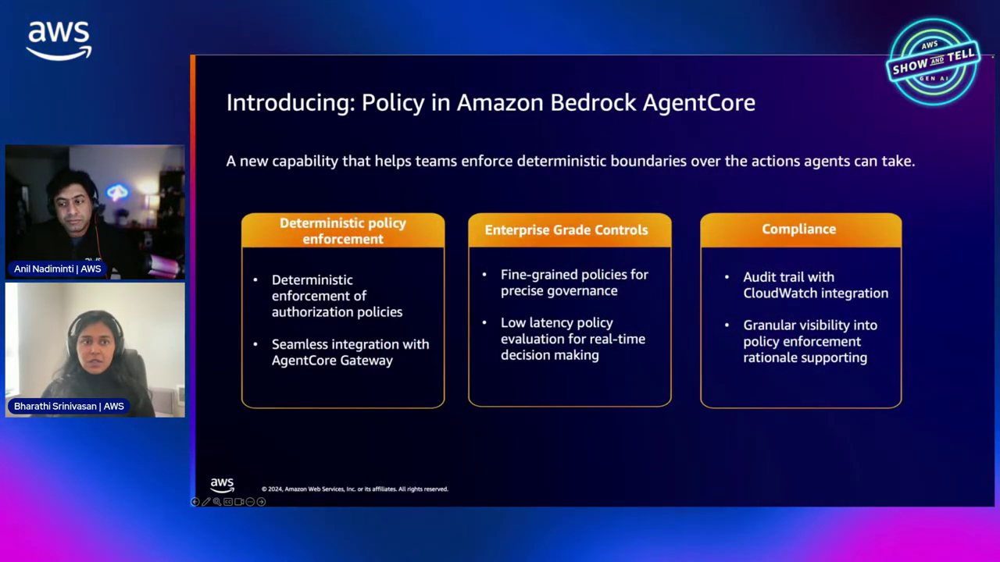

# AgentCore Tool Controls Course — Chapter 1

# 🛡️ Agent-to-Tool Risks — Why Auth Isn't Enough

## 🎬 About This Course — The Source Video

This course is built as **interactive, chapter-by-chapter notes** for the AWS Show & Tell episode **"Control agent-to-tool interactions"** — how to put fine-grained policy between an agent and what it's allowed to do.

<VideoSection youtubeId="q_9htaugcgI" title="Control agent-to-tool interactions | AWS Show & Tell" />

---

## Chapter Goal

By the end of this chapter, the learner will be able to:

- Name the risk classes in **agent→tool** calls that auth alone doesn't cover.
- Explain why "the agent is authenticated" ≠ "the tool call is safe."
- Distinguish identity (who) from authorization (what/which-args/when).
- See where policy enforcement must sit — between agent and tool.

---

## 1.1 ⚠️ The Risk — Agents Pick Their Own Calls

Classic authorization assumes a user picks an action and you check if *they* may. Agents are different — **the model decides** which tool to call and with what arguments, based on reasoning a prompt or retrieved content can steer:



| Risk | Example |
|---|---|
| **Over-broad args** | agent calls `refund` with a huge amount — it's "allowed" by identity |
| **Wrong tool** | picks a destructive tool when a read-only one would do |
| **Prompt-injected call** | retrieved/web content steers the agent into a bad call |
| **Argument values** | auth says "can call refund" — not "refund ≤ $100" |

<WarningCard title="Authentication ≠ authorization">
An authenticated agent is only answering *who* is calling. It says nothing about *whether this specific call, with these arguments, right now, should be allowed.* That gap is the attack surface.
</WarningCard>

---

## 1.2 🎯 The Gap — Identity vs Action Policy

The episode draws the line clearly:

| Question | Answered by |
|---|---|
| *Who* is calling? | Identity / auth (JWT) |
| *Can* they call this tool at all? | Coarse permission |
| *This* call, *these args*, *now*? | **Fine-grained policy** — the missing layer |

The dangerous calls are the ones identity permits but policy should block:

```text
auth allows:  "agent may invoke refund_order"
policy must decide: "refund_order(order=o, amount<=100) — yes; amount=9000 — DENY"
```

---

## 1.3 🏰 Where Enforcement Belongs

Policy can't live in the agent's prompt (the model decides it) and can't live in each tool (duplicated, inconsistent). It belongs **between** agent and tool — at the Gateway:



- **Central** — one place all tool calls pass through
- **Deterministic** — not a model judgment; a policy evaluation
- **Auditable** — every allow/deny is logged with the reason

<InfoCard title="Why at the Gateway">
Every tool call already flows through Gateway for MCP — it's the natural chokepoint to insert policy before the call reaches the tool.
</InfoCard>



---

## 1.4 📋 What Policy Can Decide

Fine-grained policy evaluates the full call context:

- **Principal** — which agent / which user behind it
- **Action** — which tool / which operation
- **Resource** — which record/entity it touches
- **Context** — argument values, session attributes, time, etc.

So you can express rules like "agents may read orders, may refund up to $100 for standard users, never delete" — far beyond "may invoke refund."

---

## 🧠 Knowledge Check

<Quiz question="Why isn't authenticating the agent enough for tool safety?" options={["It is enough","Auth answers WHO — not whether THIS call with THESE args should be allowed; the model picks args itself","Auth is unnecessary","Tools can't be authenticated"]} answerIndex={1} explanation="Identity establishes who calls; policy must judge the specific call+args — which a model chooses and content can steer." />

<Quiz question="What's the agentic-specific tool risk?" options={["Slow tools","The model decides tool+args — so retrieved/injected content can steer it into bad-but-authenticated calls","Tools always fail","Agents don't use tools"]} answerIndex={1} explanation="Model-driven tool choice means a prompt or retrieved content can steer calls — auth doesn't catch malicious argument choices." />

<Quiz question="Where should policy enforcement sit?" options={["In the prompt","Between agent and tool — at the Gateway, the central deterministic chokepoint","Inside each tool only","In the model weights"]} answerIndex={1} explanation="All tool calls already traverse Gateway for MCP — it's the deterministic, auditable place to evaluate policy before the tool runs." />

---

## 🏁 Chapter 1 Summary

- Agents **choose their own tool calls and args** — the model is the decision-maker, and content can steer it.
- **Auth ≠ authorization**: who vs whether-this-call-with-these-args.
- Enforcement belongs **between agent and tool** — at the Gateway — central, deterministic, auditable.
- Policy evaluates principal + action + resource + **context (argument values)** — far beyond "may invoke."

**Next:** Chapter 2 — Cedar policies on the Gateway.
