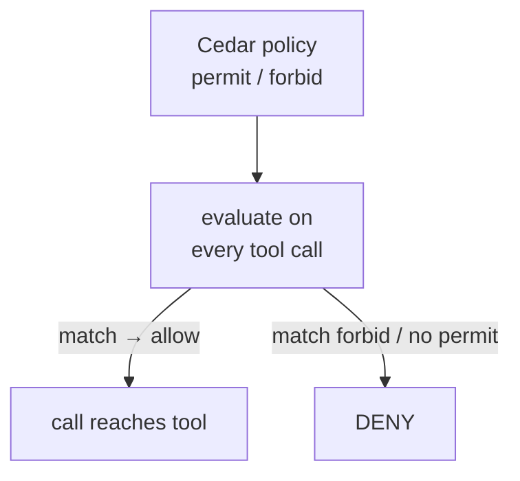
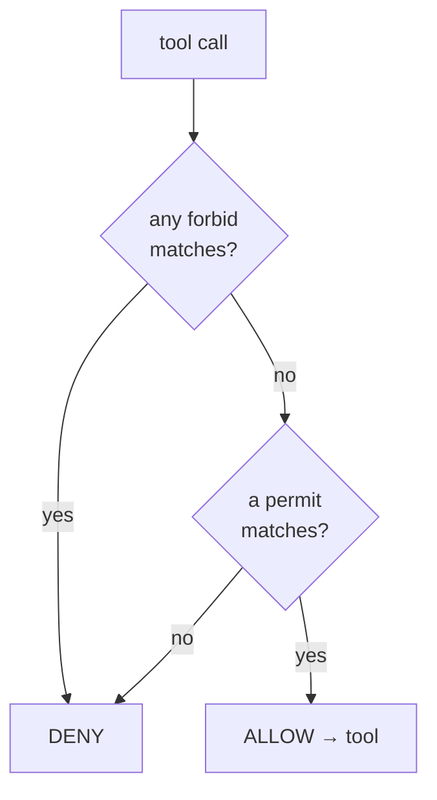
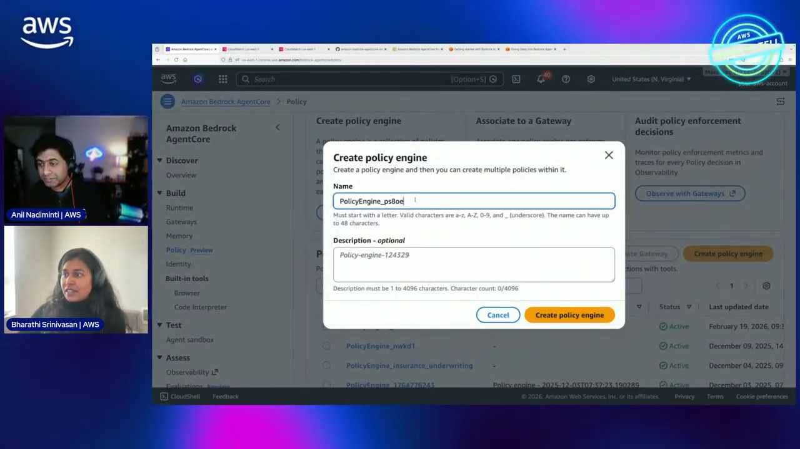

# AgentCore Tool Controls Course — Chapter 2

# 🌲 Cedar Policies on AgentCore Gateway

## Chapter Goal

By the end of this chapter, the learner will be able to:

- Describe **Cedar** — the policy language used to govern Gateway tool calls.
- Read a Cedar policy — `permit`/`forbid`, principal, action, resource, `when` conditions.
- Attach policies to a Gateway and understand the default-deny model.
- Design policies that constrain argument values, not just actions.

---

## 2.1 🌲 What Is Cedar

The episode uses **Cedar** — AWS's open-source policy language — to express authorization rules on Gateway targets:



| Cedar piece | Meaning |
|---|---|
| `permit` / `forbid` | allow or deny |
| `principal` | who's acting (agent, user role) |
| `action` | what's being done (the tool call) |
| `resource` | what it acts on |
| `when { ... }` | conditions — **including argument values** |

<InfoCard title="Why Cedar">
It's deterministic (not a model decision), analyzable (you can reason about what a policy allows), and built for exactly this — attribute-and-condition authorization.
</InfoCard>

---

## 2.2 📜 Reading a Cedar Policy

The shape of a tool-gating policy:

```cedar
permit(
  principal,
  action == AgentCore::Action::"InvokeTool",
  resource == AgentCore::Tool::"RefundOrder"
)
when {
  context.amount <= 100
};
```

- `permit` — this grants
- `action` — the tool invocation
- `resource` — the specific tool (`RefundOrder`)
- `when` — **the argument-value check**: only refunds ≤ $100

A `forbid` overrides permits — so you can carve out "never" rules that always win.

<TipCard title="forbid wins">
Cedar semantics: if *any* `forbid` matches, the call is denied even if a `permit` matches. Use forbids for hard "never" boundaries and permits for the allowed space.
</TipCard>

---

## 2.3 🚪 Default Deny + Layering

Gateway + policies give a **default-deny** posture:



| Layer | Rule |
|---|---|
| No permit matches | Deny |
| A forbid matches | Deny (overrides permit) |
| Permit matches, no forbid | Allow |

This means the safe baseline is "deny everything, then permit narrowly" — not "allow all, block bad ones."

---

## 2.4 🧩 Constraining Arguments — The Real Power

The agentic win is `when` on **argument values**, not just tool names:

| Policy says | Blocks |
|---|---|
| `context.amount <= 100` | A $9000 refund the agent decided to make |
| `context.order_status == "shipped"` | Refunding an unshipped order |
| `principal.role == "support"` | Other agents hitting the refund tool |
| `context.channel == "web"` | Calls from unexpected contexts |


<ConceptCard title="This is what auth can't say">
IAM says "agent may invoke this Lambda." Cedar on Gateway says "agent may invoke `refund` *only when amount ≤ 100 and the order shipped*." The argument-level condition is the entire point for agents that pick their own args.
</ConceptCard>

---

## 2.5 🛠️ Attaching Policies to a Gateway

Mechanics from the demo — policies attach to the gateway/target:

```text
Gateway
 ├── target: order-tools (Lambda)
 │      └── policies: [refund-cap, shipped-only]
 ├── target: read-only tools
 │      └── policies: [read-permit]
 └── default: deny (no permit → blocked)
```

Policies live alongside the target definition — each tool invocation gets evaluated against the attached policy set before reaching the Lambda/API.



---

## 🧠 Knowledge Check

<Quiz question="What does `when { context.amount <= 100 }` do?" options={["Nothing — decoration","Constrains the call by argument value — refunds only up to $100, even though the action itself is permitted","Sets a timeout","Logs the amount"]} answerIndex={1} explanation="`when` conditions evaluate context (argument values) — this is the argument-level control auth can't express." />

<Quiz question="If both a `permit` and a `forbid` match a call?" options={["Permit wins","Forbid wins — it overrides permits","Whichever was written last","It's an error"]} answerIndex={1} explanation="Cedar: any matching forbid denies, even with a matching permit — forbids are the hard 'never' boundaries." />

<Quiz question="What's the Gateway's posture when no permit matches a call?" options={["Allow anyway","Default deny — a call is blocked unless a permit matches and no forbid does","Log and allow","Retry"]} answerIndex={1} explanation="Default-deny: allow only where a permit matches and no forbid overrides — the safe baseline for agent tool calls." />

---

## 🏁 Chapter 2 Summary

- **Cedar** is the policy language — `permit`/`forbid` over principal/action/resource + `when` conditions.
- `forbid` **overrides** `permit`; Gateway is **default-deny**.
- The agentic power is `when` on **argument values** — constraining *how* a tool is called, not just *whether*.
- Policies attach per target; every invocation is evaluated before reaching the tool.

**Next:** Chapter 3 — the policy author and live enforcement demo.
