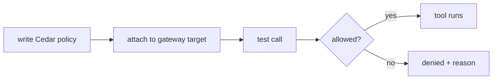
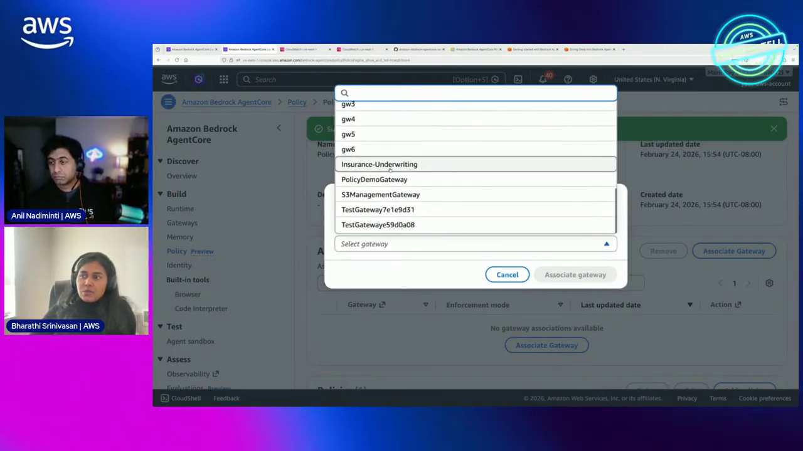
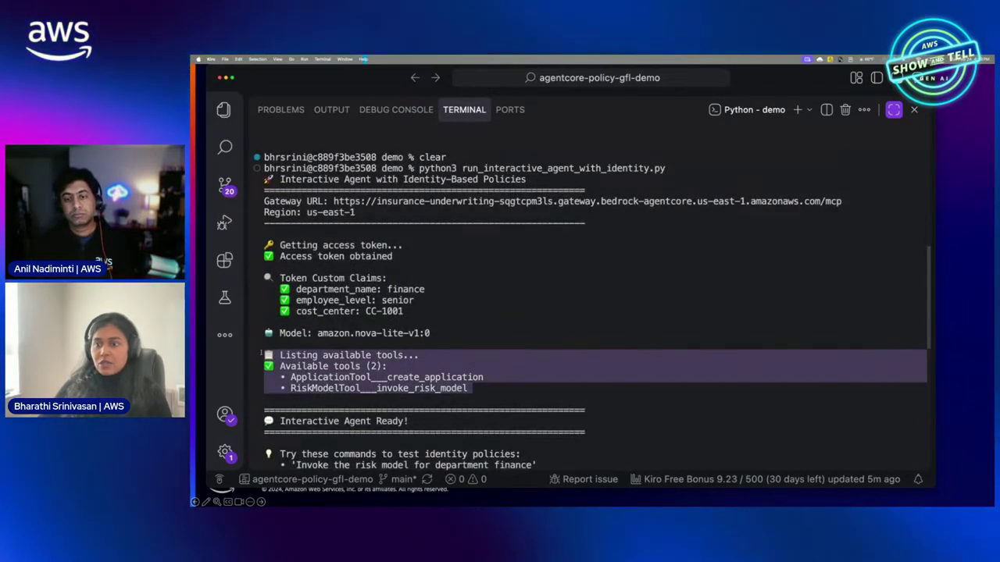
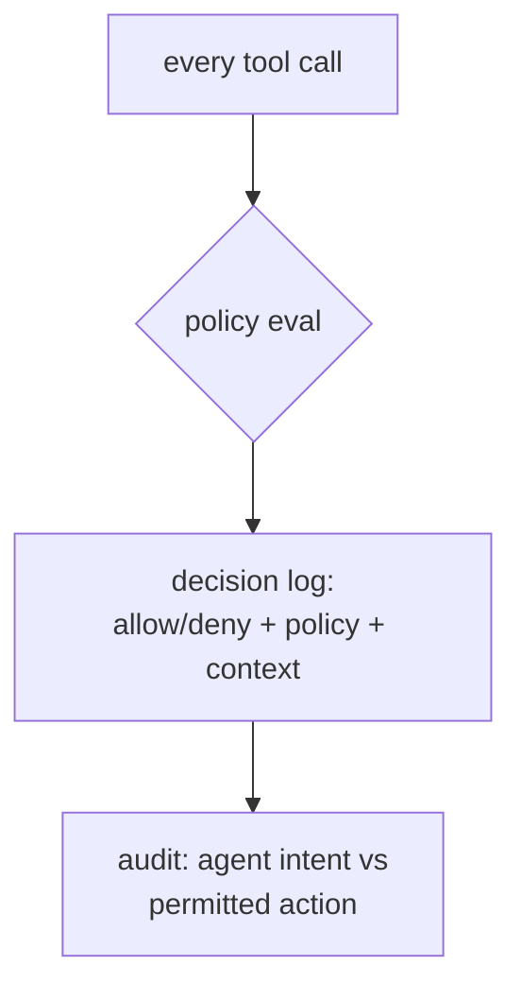
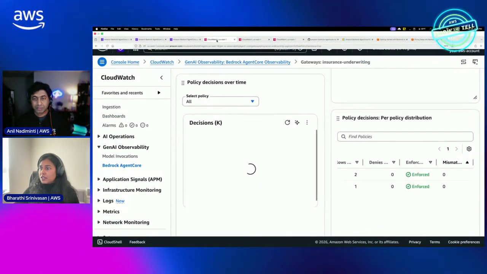
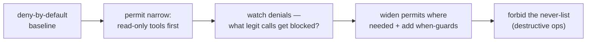
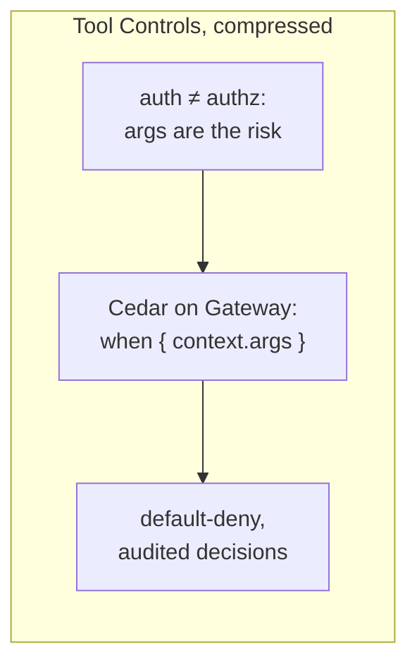

# AgentCore Tool Controls Course — Chapter 3

# ✍️ Policy Authoring & Live Enforcement

## Chapter Goal

By the end of this chapter, the learner will be able to:

- Walk the **policy author** experience — writing and attaching policies.
- Watch a **live enforcement** — a tool call allowed, then denied by policy.
- Audit decisions — every allow/deny is logged with the reason.
- Design a safe rollout — start deny-by-default, open narrowly.

---

## 3.1 ✍️ The Policy Author Experience

The episode shows authoring policies against a gateway — you pick the target and express the rule:



| Step | What you do |
|---|---|
| Author | Write the Cedar `permit`/`forbid` + `when` conditions |
| Attach | Bind the policy to a gateway target/tool |
| Evaluate | Calls get checked on every invocation |
| Audit | Each decision logged with matched policy |

<InfoCard title="Author against the real tool schema">
Because policies constrain *arguments*, the author surfaces the tool's parameter schema — you're writing `context.<param>` conditions against the actual tool signature, not guessing names.
</InfoCard>



---

## 3.2 🎬 The Live Enforcement — The Payoff

The demo's moment is a call that goes both ways (~mid-episode):

```text
agent → gateway → refund_order(amount=50)
   policy: permit ... when context.amount <= 100
   → ALLOW ✓  tool executes

agent → gateway → refund_order(amount=9000)
   same permit, context.amount=9000 fails the when
   no other permit → DENY ✗  logged
```

Same tool, same caller — **the argument value flips the decision**. That's the whole thesis: the model chose a bad amount, and policy — not the model — stopped it.



<TipCard title="The denial is visible">
Denied calls aren't silent — the gateway returns a denial and logs which policy/decision caused it, so you can audit "what did the agent try to do" separately from "what did it do."
</TipCard>

---

## 3.3 🧾 Auditing Decisions

Every evaluation produces an auditable record:

| Logged | Use |
|---|---|
| Allow / deny | What was permitted through |
| Matched policy | *Which* rule decided it |
| Call context | The args that were evaluated |
| Deny reason | Why it was blocked |



This closes the loop on the trust question — you can reconstruct not just what the agent did, but what it *tried* and was stopped from doing.



---

## 3.4 🚦 A Safe Rollout Pattern

How to introduce policy without breaking the agent:



| Stage | Rule |
|---|---|
| Baseline | Default deny |
| Open narrow | Permit read-only/safe tools |
| Observe | Watch denied calls for false-positives |
| Guard | Add `when` conditions on mutating tools (amount, status) |
| Hard-block | `forbid` the truly-never operations |

<WarningCard title="Don't ship all-allow then tighten">
Introduce deny-by-default and open up — the reverse order means a bad agent call can do damage before you notice. Start closed, widen deliberately.
</WarningCard>

---

## 🧠 Knowledge Check

<Quiz question="In the demo, what flips a refund call from allow to deny?" options={["The caller","The argument value — amount=50 allowed, amount=9000 denied by the `when` condition","The tool name","The time of day"]} answerIndex={1} explanation="Same caller, same tool — the `when context.amount <= 100` condition denies the large amount. Argument-level control is the point." />

<Quiz question="What does a denied call leave behind?" options={["Nothing","A logged decision — allow/deny, matched policy, and the evaluated context — so you can audit agent intent","A retry","A model error"]} answerIndex={1} explanation="Every evaluation is logged with the matched policy and context — you can audit what the agent tried, not just what it did." />

<Quiz question="The safe rollout order for tool policies?" options={["Allow all, tighten later","Deny-by-default → permit narrow → observe denials → add when-guards → forbid the never-list","Just add a forbid","Permit everything"]} answerIndex={1} explanation="Start closed and widen deliberately — all-allow first means a bad call does damage before you notice." />

---

## 🏁 Chapter 3 Summary — and the Course

- The **policy author** writes Cedar against the tool's real schema and attaches to gateway targets.
- **Live enforcement**: argument values flip allow→deny — the model's bad choice is stopped by policy, not the model.
- Every decision is **auditable** — you see what the agent tried vs did.
- Roll out **deny-by-default**, widen with `when` guards, hard-`forbid` the never-list.



### Watch the Original Tutorial

<VideoSection youtubeId="q_9htaugcgI" title="Control agent-to-tool interactions | AWS Show & Tell" />

**Related:** *AgentCore Security* covers the identity layer that authenticates the caller these policies then authorize.
