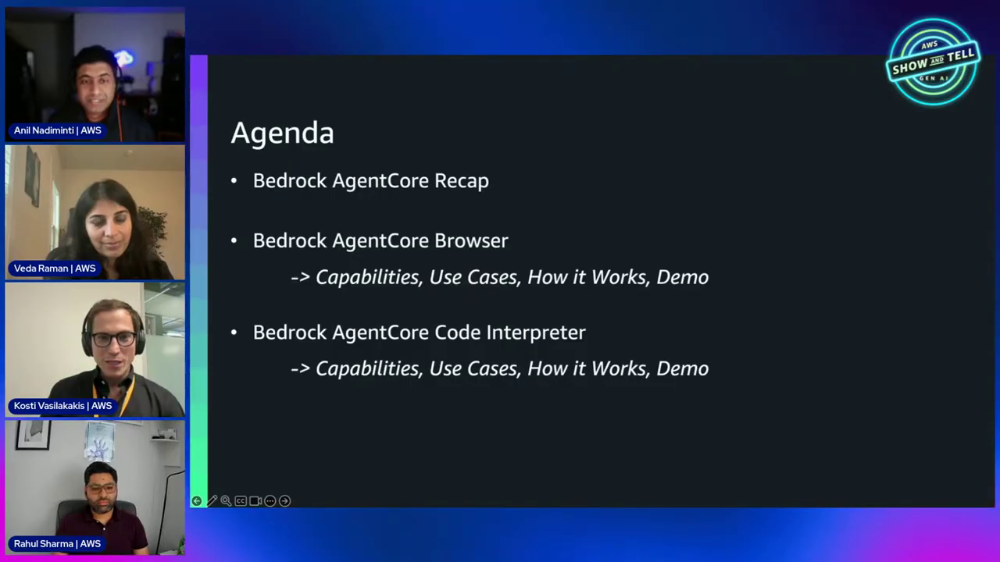
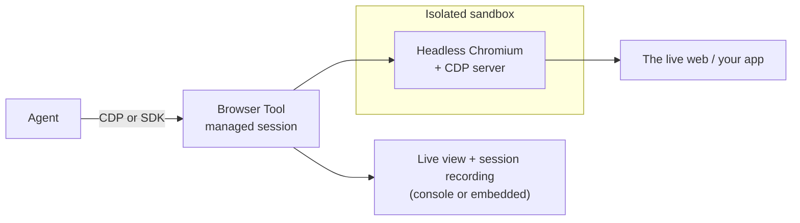
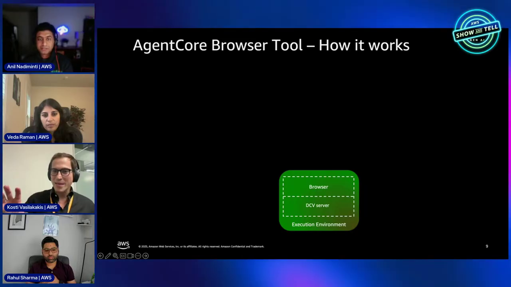
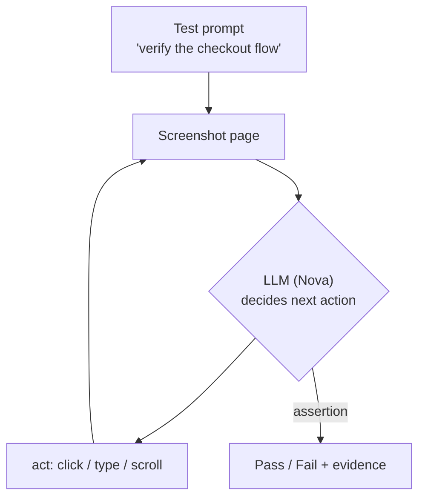
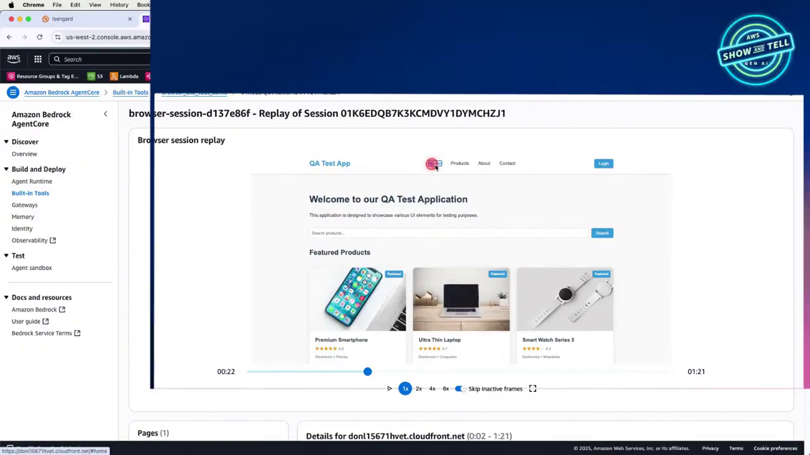

# AgentCore Built-in Tools Course — Chapter 1

# 🌐 The Browser Tool — A Managed Headless Browser for Your Agent

## 🎬 About This Course — The Source Video

This course is built as **interactive, chapter-by-chapter notes** for the AWS Show & Tell episode **"AgentCore Built-in Tools — Browser Tool & Code Interpreter"** — with **Anil Nadiminti** hosting, plus **Vaibhav** and **Rahul Sharma** walking through the first-party tools.

<VideoSection youtubeId="z3lAJ-Nf_lk" title="AgentCore Built-in Tools — Browser Tool and Code Interpreter | AWS Show & Tell" />

---

## Chapter Goal

By the end of this chapter, the learner will be able to:

- Explain what the **Browser Tool** is: a fully-managed, sandboxed headless Chromium.
- Describe the two ways to drive it — **CDP** and the higher-level **AgentCore Python SDK**.
- Follow the live demo — an agent doing real QA testing on a web app, visible in a **live view**.
- Understand when to reach for Browser vs. a custom tool.

---

## 1.1 🤖 Why Agents Need a Browser

The motivation (~06:00): agents need to **act on the real world**, and a huge fraction of real business still lives in web apps — legacy portals, dashboards, flows that have no API.

| Problem | Browser Tool's answer |
|---|---|
| Legacy systems with no API | Drive the actual UI like a human would |
| Multi-step web flows (checkout, forms) | The agent sees, clicks, types — autonomously |
| Manual business processes | Automate without rewriting the underlying system |



---

## 1.2 🧱 What the Browser Tool Actually Is

At ~07:30 the architecture lands:



| Property | Detail |
|---|---|
| **Fully managed** | No provisioning — a headless Chromium + CDP server in an isolated container per session |
| **Isolated** | Each session is its own sandboxed environment — the underlying instance is torn down after |
| **Observable** | Live view + recorded session replay — you can watch every action the agent took |
| **No right-sizing** | Serverless — no capacity planning (~10:30) |

<ConceptCard title="The agentic loop">
The agent doesn't get a script — it gets a loop: **screenshot → reason → act → screenshot**. The tool returns the page state; the model decides the next action. That's what makes it work on flows it was never explicitly coded for.
</ConceptCard>



---

## 1.3 🛠️ Two Ways to Drive It — CDP vs the SDK

**Option A — CDP (Chrome DevTools Protocol):** full control, but verbose and brittle (~12:00). You drive raw browser primitives.

**Option B — AgentCore Python SDK** (~16:30): higher-level client — start a session, get a browser the agent can use as a tool.

```python
from bedrock_agentcore.tools.browser_client import BrowserClient

client = BrowserClient(region="us-west-2")
session_id = client.start(
    identifier="aws.browser",        # the built-in browser resource
    # network, timeouts, etc.
)
# hand the session's CDP endpoint to your agent loop / Nova-act style tool
```

The console flow is even simpler (~18:00): under **AgentCore → Built-in tools** there's already a `browser` resource created for you — you just configure network/permissions.


---

## 1.4 🧪 Live Run — Agentic QA Testing a Real Web App

Rahul's demo (~24:00–36:00) is the good one: **automated QA testing** of a web app hosted on S3 + CloudFront.

```python
# One process per test suite — parallel browser sessions
for suite in test_suites:
    p = Process(target=run_suite, args=(suite, browser_tool_id))
    p.start()
```

Inside each suite, the agent loop:



What the live view showed (~31:30–34:30):

- The browser driving the app **in real time** — clicking, typing, navigating
- **Session replay** — after the fact, scrub through every action with the agent's reasoning
- Pass/fail assertions driven by the agent's own observation of the page



<TipCard title="QA is the gateway use case">
The hosts call out QA testing as the most popular entry point — it's low-risk, immediately useful, and shows off the observe-act loop. Other common ones: legacy portal automation, data scraping with human-like flows, form-filling processes.
</TipCard>

<InfoCard title="Pricing note from the episode">
At recording time the tools were in **preview — free to experiment**. Billing was set to turn on October 7th. Check current pricing before building production workloads on them.
</InfoCard>

---

## 🧠 Knowledge Check

<Quiz question="What is the AgentCore Browser Tool at its core?" options={["A headless Chromium + CDP server in an isolated, managed sandbox","A web scraping API","A Puppeteer clone you run locally","A screenshot service"]} answerIndex={0} explanation="Fully-managed headless Chromium with a CDP server, one isolated container per session, torn down after." />

<Quiz question="What are the two ways to drive the browser?" options={["REST and gRPC","CDP (raw) and the AgentCore Python SDK (higher-level)","Selenium and Playwright","Only via the console"]} answerIndex={1} explanation="CDP gives full control but is verbose; the SDK wraps sessions and actions in a friendlier client." />

<Quiz question="What makes the agent's browser loop 'agentic'?" options={["It follows a fixed script","It runs screenshot → reason → act in a continuous feedback loop, deciding each step","It uses XPath only","It never looks at the page"]} answerIndex={1} explanation="No scripted steps — the model observes the page state and decides the next action each iteration." />

---

## 🏁 Chapter 1 Summary

- **Browser Tool** = managed, sandboxed, observable headless Chromium — agents get real web interaction without infrastructure work.
- Drive it via **CDP** (raw control) or the **Python SDK** (sessions, easier).
- The **live view + session recording** is the killer feature — you can watch exactly what the agent did.
- The demo: autonomous QA testing with pass/fail assertions — the agentic loop in action.

**Next:** Chapter 2 — the Code Interpreter: a sandboxed Python environment for math, files, and analysis.
