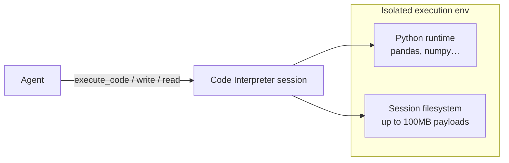
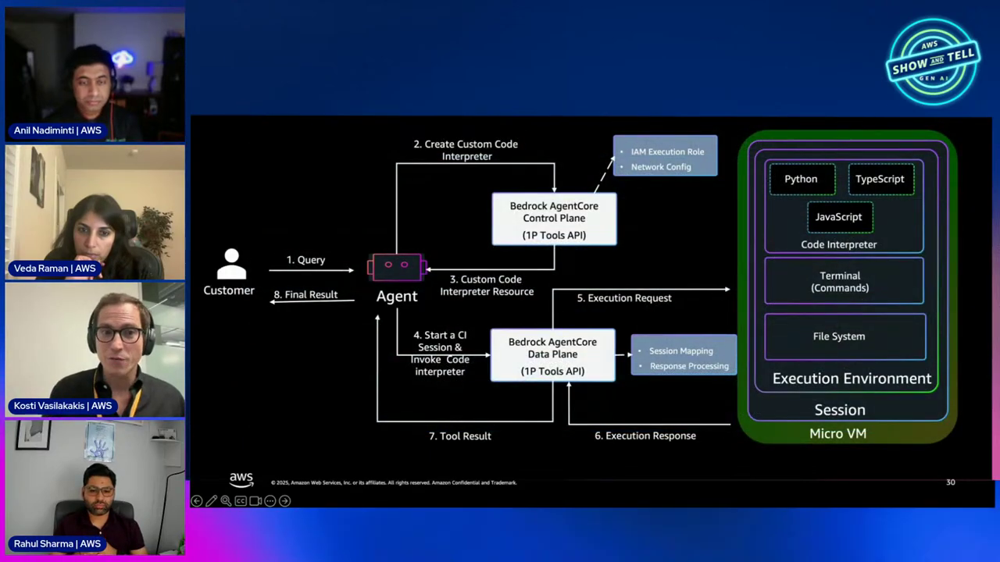
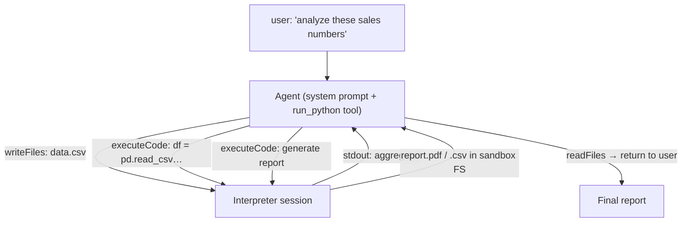

# AgentCore Built-in Tools Course — Chapter 2

# 🐍 The Code Interpreter — A Sandboxed Python Runtime for Your Agent

## Chapter Goal

By the end of this chapter, the learner will be able to:

- Explain why agents need **code execution they can't run themselves** — the hallucination problem.
- Describe the Code Interpreter's sandbox — isolated, persistent sessions, large payload support.
- Write/read **files into the session** and pull results back out.
- Follow the demo — a data-analysis agent generating a report via generated Python.

---

## 2.1 🧮 Why an Interpreter — LLMs Hallucinate Math

The honest problem statement (~37:30, ~42:00): if you ask an LLM to add `2020 + 23` directly, it will *probably* get it right — and *sometimes* confidently hallucinate. Agents doing real analysis can't afford "probably".

| Task | LLM alone | LLM + Code Interpreter |
|---|---|---|
| Arithmetic / aggregates | Error-prone, unverifiable | Generates Python → runs it → uses the real result |
| Data analysis on files | Can't — no execution | Pandas on real CSV/Excel |
| Report/PDF/CSV generation | Hallucinated output | Actually produced file |
| Validation | Trust the model | Re-run the code, check the output |

<ConceptCard title="Why sandboxed?">
The generated code is untrusted — the model wrote it. Running it *inside your agent's host* means a bug (or an injection) hits production. The Interpreter runs it in a **separate, isolated environment** so bad code can't hurt you (~37:30).
</ConceptCard>

---

## 2.2 🏗️ The Isolated Environment — What You Get



| Capability | Detail |
|---|---|
| **Isolated** | Separate env from the agent host — a crashed/malicious snippet can't touch the agent |
| **Session state** | Variables, files, imports persist for the session — iterate like a real REPL |
| **Large payloads** | Up to **100MB** — real datasets, not toy snippets (~40:30) |
| **File I/O** | Write inputs in (`put`/`write`), read outputs (reports, CSVs, PDFs) back |
| **Deployment** | Managed config by default; can run in your own VPC with an IAM role (~43:30) |



---

## 2.3 🛠️ Driving It — Session + Tools

Like the Browser Tool, two levels (~45:00): raw API/boto3 or the SDK. The demo uses sessions + a tool exposed to the agent:

```python
from bedrock_agentcore.tools.code_interpreter_client import CodeInterpreterClient

ci = CodeInterpreterClient(region="us-west-2")
session = ci.start(identifier="aws.code_interpreter")

# write an input file into the sandbox
ci.invoke("writeFiles", files=[{"path": "data.csv", "text": csv_text}])

# agent calls it as a tool — the model writes the code itself
@tool
def run_python(code: str) -> str:
    """Execute Python in the sandbox and return stdout."""
    return ci.invoke("executeCode", language="python", code=code)
```

<InfoCard title="The model writes the code — not you">
You give the agent a `run_python(code)` tool. The *model* authors the snippet per task — `df.groupby(...)`, `matplotlib` chart, whatever — and the Interpreter executes it. Your code surface stays tiny; capability scales with the model.
</InfoCard>

---

## 2.4 📊 Live Run — Data Analysis → Report

Rahul's code-interpreter demo (~46:30–54:00) shows the full chain:



Real output in the demo: the agent generated a formatted report — customizable per use-case — entirely from model-authored Python executing in the sandbox.

<WarningCard title="Don't conflate the two tools">
**Browser Tool** acts on the web (clicks, navigation, UI). **Code Interpreter** executes *code* (math, data, files). They're complementary — a workflow might browse a portal *then* analyze what it scraped.
</WarningCard>

---

## 2.5 🧭 When to Use Which Tool

| Use case | Tool |
|---|---|
| Interact with a web UI / legacy portal | **Browser** |
| Run generated Python safely | **Code Interpreter** |
| Math, data transforms, file generation | **Code Interpreter** |
| QA a web app visually | **Browser** |
| Both (scrape → analyze) | **Both, composed** |

---

## 🧠 Knowledge Check

<Quiz question="Why give the agent a code interpreter instead of trusting the LLM's math?" options={["LLMs are too slow","Generated code is verifiable — LLMs can hallucinate arithmetic; the interpreter returns real output","It's cheaper","Interpreter is required by policy"]} answerIndex={1} explanation="The LLM writes the code; the sandbox executes it and returns real output — eliminating arithmetic/data hallucination." />

<Quiz question="How does code get into the interpreter session?" options={["You precompile it","The model authors code per-task and calls the run_python tool — the sandbox executes it","It deploys a Lambda","Via SSH"]} answerIndex={1} explanation="You expose a small execute-code tool; the model writes each snippet itself and the session persists state across calls." />

<Quiz question="Why must the interpreter be sandboxed?" options={["For speed","Generated code is untrusted — it must not run where the agent is hosted","For billing","Sandboxing is optional"]} answerIndex={1} explanation="The model could produce buggy or hostile code; running it isolated from the agent's environment removes the risk." />

---

## 🏁 Chapter 2 Summary

- **Code Interpreter** = isolated Python sandbox — sessions, file I/O, 100MB payloads, optional VPC deployment.
- The agent gets a `run_python` tool; the **model authors the code** — interpreter just executes truthfully.
- Kills hallucinated math/data and enables real report/file generation.
- **Browser** acts on the web; **Interpreter** executes code — complementary, composable.

**Next:** Chapter 3 — putting it together: end-to-end workflows and production considerations.
