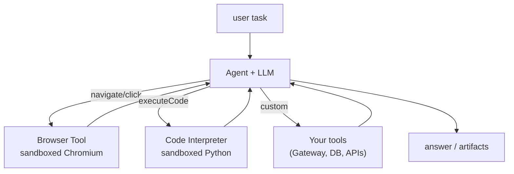
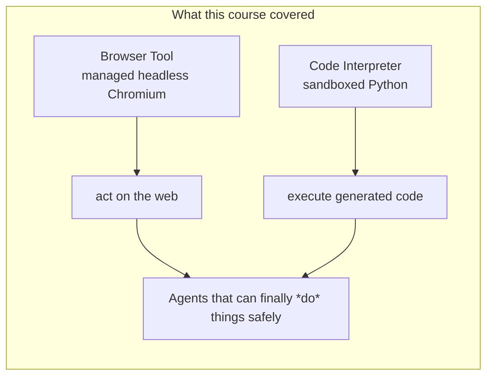

# AgentCore Built-in Tools Course — Chapter 3

# 🔗 Composing Tools & Production Notes — Putting It Together

## Chapter Goal

By the end of this chapter, the learner will be able to:

- Compose **Browser + Code Interpreter + custom tools** in one agent.
- Recall the isolation model — what runs where.
- Handle the console resource, sessions, and observability across both tools.
- Apply the production checklist: auth, payload limits, billing, session lifecycle.

---

## 3.1 🧰 One Agent, Many Tools

Nothing forces a choice — the agent gets all of them as ordinary tools (~21:00 shows both under *Built-in tools*):

```python
agent = Agent(
    model=model,
    tools=[browser_session, run_python, custom_business_tool],
    system_prompt="You can browse the web and run Python to answer questions.",
)
```



The model decides which tool fits each sub-task — the tool description is the routing signal.

---

## 3.2 🔒 The Isolation Model — Three Separate Boundaries

Easy to blur; keep them distinct:

| Boundary | What it isolates | Why |
|---|---|---|
| **Runtime** (host) | Agent sessions — Firecracker microVMs | User A's agent state ≠ User B's |
| **Browser session** | The Chromium sandbox | Untrusted web content can't touch the agent |
| **Interpreter session** | The Python sandbox | Generated code can't touch the agent |

<ConceptCard title="Layered defense">
The agent never trusts the web or its own generated code. Each is boxed into its own sandbox, and results cross back only as data — screenshots, stdout, files — not shared memory.
</ConceptCard>

---

## 3.3 🖥️ Managing Sessions & Observing

Both tools give you a **resource** in the console (~18:00) plus a session lifecycle in code:

```python
# Browser
b = BrowserClient(region)
sid = b.start(identifier="aws.browser")
...  # agent uses it
b.stop(sid)

# Code Interpreter
ci = CodeInterpreterClient(region)
s = ci.start(identifier="aws.code_interpreter")
ci.invoke("writeFiles", files=[...])
ci.invoke("executeCode", code=...)
ci.stop(s)
```

- **Live view / replay** (browser): watch or replay actions — in console, or embeddable in your app (~19:30).
- **Session files** (interpreter): write inputs in, read generated outputs back.
- **OTel traces**: both emit spans — the sessions show up in the same GenAI observability view.

---

## 3.4 🚀 The Production Checklist

Before shipping an agent on built-in tools:

| Concern | What to check |
|---|---|
| **Auth** | Inbound JWT/OAuth on your endpoint; IAM role scoped for tool calls (~43:30) |
| **Payloads** | Interpreter handles up to ~100MB — plan file sizes |
| **Session lifecycle** | Start/stop sessions deliberately; stale sessions = cost + risk |
| **Billing** | Preview pricing at recording; October 7th billing start noted — check current |
| **VPC** | Interpreter supports deploying into your VPC if data must stay in-network |
| **Observability** | Wire traces/session IDs so every tool action is auditable |

<TipCard title="Start with QA testing">
The team's own advice: automated web QA is the lowest-risk way to productionize Browser + Interpreter experience — clear pass/fail, visible replay, immediate value.
</TipCard>

---

## 🧠 Knowledge Check

<Quiz question="An agent needs to log into a portal then compute stats on what it finds. Which tools?" options={["Browser only","Interpreter only","Browser for the portal + Interpreter for the stats","A custom Lambda for both"]} answerIndex={2} explanation="Browser handles the UI interaction; Interpreter runs the analysis — compose them through the same agent." />

<Quiz question="What isolates generated Python code from your agent process?" options={["The LLM","The Code Interpreter runs it in a separate sandbox — results cross back as data only","Nothing — it runs in-process","IAM policies"]} answerIndex={1} explanation="Untrusted generated code executes in its own isolated environment; only stdout/files return to the agent." />

<Quiz question="Which feature lets you watch what the agent did in a browser session?" options={["CloudTrail only","Live view + recorded session replay","There is none","The browser's cache"]} answerIndex={1} explanation="Both live view (console/embeddable) and post-hoc session replay — every action is recorded and observable." />

---

## 🏁 Chapter 3 Summary — and the Course

- **Compose freely** — Browser + Interpreter + custom tools on one agent; the model routes by tool description.
- **Three isolation boundaries**: Runtime microVMs (agent), browser sandbox (web), interpreter sandbox (code).
- Manage sessions deliberately; use live view/replay + OTel traces for auditability.
- Checklist before production: auth, payloads, lifecycle, billing, VPC, observability.



### Watch the Original Tutorial

<VideoSection youtubeId="z3lAJ-Nf_lk" title="AgentCore Built-in Tools — Browser Tool and Code Interpreter | AWS Show & Tell" />

**Related:** *AgentCore — Production-Ready Agents* Ch 01 introduces these tools among the pillars; this course went deep on both.
