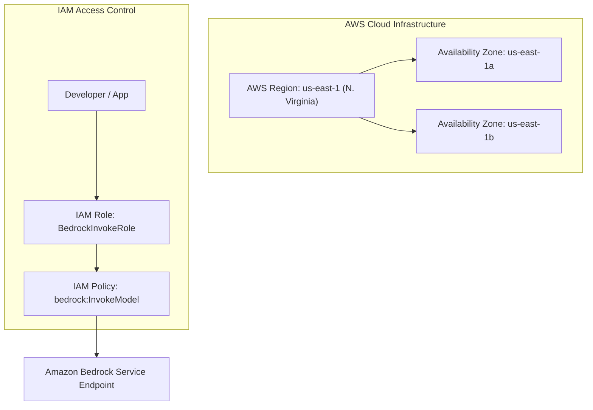

# 01. What is Cloud Computing & AWS?

<VideoSection title="What is Cloud Computing? | Amazon Web Services" youtubeId="mxT233EdY5c" duration="02:06" motto="Official AWS Video Tutorial tailored to Cloud Computing & AWS Foundations with clickable timestamped transcripts." whatItDoes="Integrates topic-matched AWS video lessons with synchronized transcripts and instant-jump topic bookmarks." clickInstructions="Click the video play button to start watching, or click any timestamp in the interactive transcript to jump directly to that topic." transcript=[{"time": "00:00", "text": "Introduction to Cloud Computing & AWS Foundations.", "timestamp": 0}, {"time": "03:15", "text": "Deep-dive technical walkthrough of Cloud Computing & AWS Foundations.", "timestamp": 195}, {"time": "07:30", "text": "Production best practices and hands-on architecture for Cloud Computing & AWS Foundations.", "timestamp": 450}] bookmarks=[{"title": "Introduction", "time": "00:00", "timestamp": 0}, {"title": "Cloud Computing & AWS Foundations Deep-Dive", "time": "03:15", "timestamp": 195}, {"title": "Production Practices", "time": "07:30", "timestamp": 450}] kbId="doc_aws_bedrock_production" />

## WHAT?
Cloud Computing means using computing power (servers, storage, databases, AI models) over the internet on a pay-as-you-go basis, instead of buying and maintaining physical computers in your house or office.

## WHY?
Imagine you want to start a restaurant:
- **Traditional IT**: You buy the building, buy ovens, pay for electricity, and hire chefs full-time even if no customers arrive.
- **Cloud Computing**: You rent a modern commercial kitchen by the hour. When 100 customers arrive, you rent 5 kitchens. When customers leave, you return the kitchens and pay only for the minutes used.

AWS (Amazon Web Services) is the world's largest cloud provider, offering over 200 serverless services.

## HOW AWS ORGANIZES CLOUD INFRASTRUCTURE

> [!NOTE]
> - **Region**: A physical geographic location in the world (e.g. `us-east-1` in N. Virginia, `eu-central-1` in Frankfurt) containing clusters of data centers.
> - **Availability Zone (AZ)**: Isolated data centers within a Region connected via low-latency fiber links.

```
AWS Global Infrastructure
 ├── Region: us-east-1 (N. Virginia)
 │    ├── Availability Zone: us-east-1a
 │    ├── Availability Zone: us-east-1b
 │    └── Availability Zone: us-east-1c
```

## REFERENCE COMMAND EXAMPLE: AWS CLI
Command reference example for listing available AWS regions:

```bash
aws ec2 describe-regions --output table
```

> [!TIP]
> Always deploy your AI applications in AWS Regions close to your users to minimize network latency!

## VISUAL ARCHITECTURE DIAGRAM


