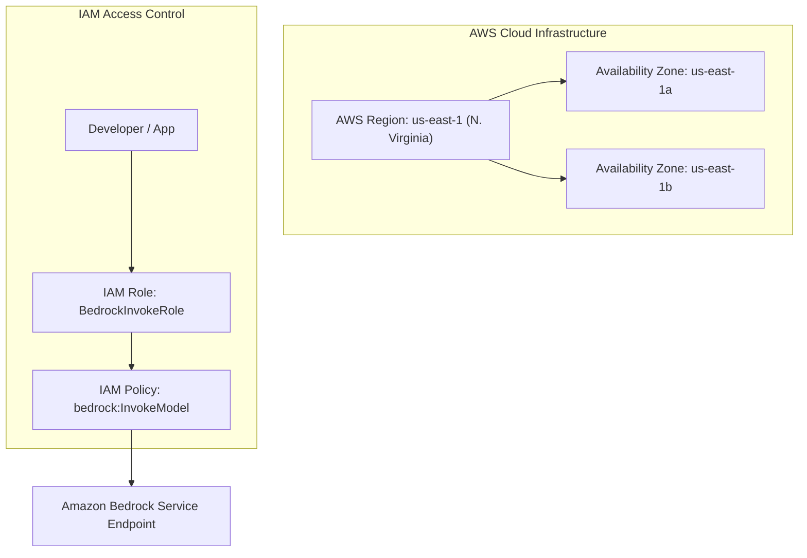

# 02. Regions & IAM Basics (Identity & Access Management)

<VideoSection title="AWS Cloud Regions, Availability Zones & IAM Roles: Regions & IAM Basics (Identity & Access Management)" youtubeId="XgLctgRh_7g" duration="02:19" motto="Official AWS Bedrock Video Tutorial tailored to AWS Regions & IAM Basics with clickable timestamped transcripts." whatItDoes="Integrates topic-matched AWS Bedrock video lessons with synchronized transcripts and instant-jump topic bookmarks." clickInstructions="Click the video play button to start watching, or click any timestamp in the interactive transcript to jump directly to that topic." transcript=[{"time": "00:00", "text": "Introduction to AWS Regions & IAM Basics in Amazon Bedrock.", "timestamp": 0}, {"time": "03:15", "text": "Deep-dive technical walkthrough of AWS Regions & IAM Basics.", "timestamp": 195}, {"time": "07:30", "text": "Production best practices and hands-on architecture for AWS Regions & IAM Basics.", "timestamp": 450}] bookmarks=[{"title": "Introduction", "time": "00:00", "timestamp": 0}, {"title": "AWS Regions & IAM Basics Deep-Dive", "time": "03:15", "timestamp": 195}, {"title": "Production Practices", "time": "07:30", "timestamp": 450}] kbId="doc_aws_bedrock_production" />

## WHAT IS IAM?
AWS IAM (Identity and Access Management) controls WHO can access WHICH AWS resources under WHAT conditions.

## REAL-LIFE ANALOGY
- **AWS Account**: A secure office building.
- **IAM User / Role**: An employee ID badge.
- **IAM Policy**: The permission rules written on the badge ("Can enter Floor 3 (Bedrock Room), but CANNOT enter Floor 5 (Billing Room)").

```
IAM Identity (User/Role) ──► IAM Policy (JSON Rules) ──► AWS Service (Amazon Bedrock)
```

## HOW IAM POLICIES WORK
IAM policies are JSON documents that explicitly grant or deny actions:

```json
{
  "Version": "2012-10-17",
  "Statement": [
    {
      "Sid": "AllowBedrockInvocation",
      "Effect": "Allow",
      "Action": [
        "bedrock:InvokeModel",
        "bedrock:InvokeModelWithResponseStream"
      ],
      "Resource": "arn:aws:bedrock:us-east-1::foundation-model/*"
    }
  ]
}
```

> [!IMPORTANT]
> **Least Privilege Rule**: Never grant wildcard `Action: "*"` permissions. Only grant the exact API permissions required by your application!

## SECURITY CHALLENGE
Check your security knowledge in the interactive challenge below:

```widget:SecurityChallenge
{
  "challengeTitle": "AWS IAM Bedrock Access Policy Security Challenge",
  "auditResult": "CRITICAL VULNERABILITY DETECTED",
  "vulnerablePolicy": {
    "Version": "2012-10-17",
    "Statement": [
      {
        "Effect": "Allow",
        "Action": "*",
        "Resource": "*"
      }
    ]
  },
  "remediatedPolicy": {
    "Version": "2012-10-17",
    "Statement": [
      {
        "Effect": "Allow",
        "Action": [
          "bedrock:InvokeModel",
          "bedrock:InvokeModelWithResponseStream"
        ],
        "Resource": "arn:aws:bedrock:us-east-1::foundation-model/anthropic.claude-3-5-sonnet-20241022-v2:0",
        "Condition": {
          "StringEquals": {
            "aws:PrincipalTag/Environment": "Production"
          }
        }
      }
    ]
  }
}
```

## VISUAL ARCHITECTURE DIAGRAM


