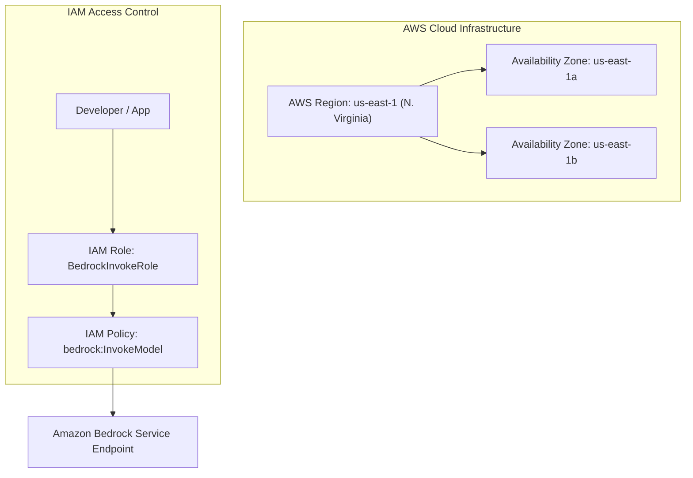

# 03. Demystifying AI, Machine Learning & Generative AI

<VideoSection title="Demystifying AI : How Artificial Intelligence works?: Demystifying AI, Machine Learning & Generative AI" youtubeId="THOL6xF8m_o" duration="02:19" motto="Official AWS Bedrock Video Tutorial tailored to AI vs Machine Learning vs Deep Learning vs GenAI with clickable timestamped transcripts." whatItDoes="Integrates topic-matched AWS Bedrock video lessons with synchronized transcripts and instant-jump topic bookmarks." clickInstructions="Click the video play button to start watching, or click any timestamp in the interactive transcript to jump directly to that topic." transcript=[{"time": "00:00", "text": "Introduction to AI vs Machine Learning vs Deep Learning vs GenAI in Amazon Bedrock.", "timestamp": 0}, {"time": "03:15", "text": "Deep-dive technical walkthrough of AI vs Machine Learning vs Deep Learning vs GenAI.", "timestamp": 195}, {"time": "07:30", "text": "Production best practices and hands-on architecture for AI vs Machine Learning vs Deep Learning vs GenAI.", "timestamp": 450}] bookmarks=[{"title": "Introduction", "time": "00:00", "timestamp": 0}, {"title": "AI vs Machine Learning vs Deep Learning vs GenAI Deep-Dive", "time": "03:15", "timestamp": 195}, {"title": "Production Practices", "time": "07:30", "timestamp": 450}] kbId="doc_aws_bedrock_production" />

## WHAT ARE THE DIFFERENCES?

Artificial Intelligence (AI), Machine Learning (ML), Deep Learning (DL), and Generative AI (GenAI) are nested fields of technology.

```
┌─────────────────────────────────────────────────────────────┐
│ Artificial Intelligence (AI)                                │
│  ┌───────────────────────────────────────────────────────┐  │
│  │ Machine Learning (ML)                                 │  │
│  │  ┌─────────────────────────────────────────────────┐  │  │
│  │  │ Deep Learning (DL)                              │  │  │
│  │  │  ┌───────────────────────────────────────────┐  │  │  │
│  │  │  │ Generative AI (GenAI & LLMs)               │  │  │  │
│  │  │  └───────────────────────────────────────────┘  │  │  │
│  │  └─────────────────────────────────────────────────┘  │  │
│  └───────────────────────────────────────────────────────┘  │
└─────────────────────────────────────────────────────────────┘
```

## SIMPLE EXPLANATIONS & ANALOGIES

1. **Artificial Intelligence (AI)**: Machines displaying smart behavior.
   - *Analogy*: Any vehicle that moves without human legs (Bicycle, Car, Airplane).
2. **Machine Learning (ML)**: Software that learns patterns from data without explicit rules.
   - *Analogy*: Learning to drive a car by practicing 1,000 hours rather than reading a traffic rulebook.
3. **Deep Learning (DL)**: ML using multi-layered artificial neural networks.
   - *Analogy*: An expert driver who can automatically navigate rain, fog, and night traffic.
4. **Generative AI (GenAI)**: Deep learning models that create NEW text, code, images, audio, or video based on prompts.
   - *Analogy*: An artist who paints brand-new portraits on request.

## REFERENCE EXAMPLE: PREDICT THE PARADIGM
- *Predicting spam vs ham email based on rules*: Traditional ML
- *Generating a Python script to calculate Fibonacci sequence*: Generative AI

## VISUAL ARCHITECTURE DIAGRAM


