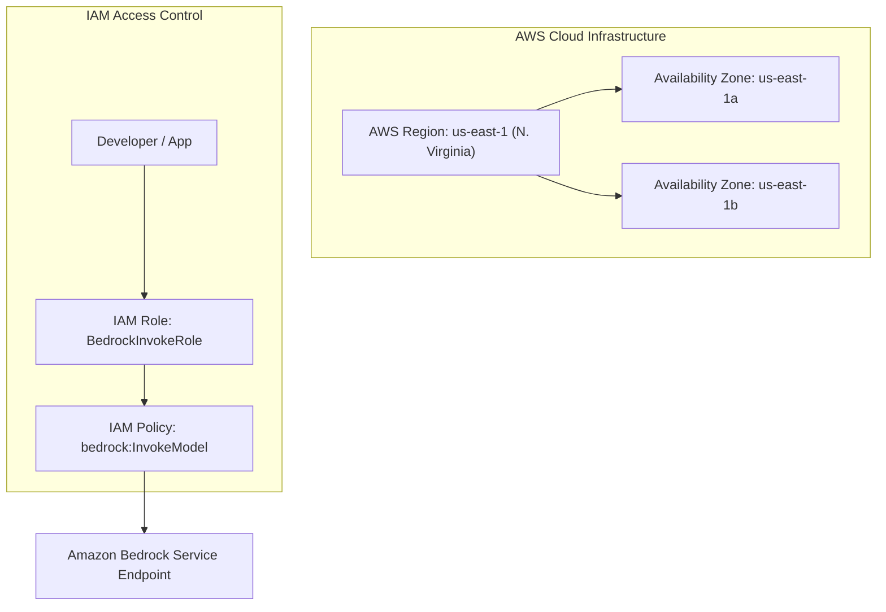

# 04. What is a Foundation Model (FM) & Large Language Model (LLM)?

<VideoSection title="LLM vs. Foundation Model: What’s the Difference?: What is a Foundation Model (FM) & Large Language Model (LLM)?" youtubeId="Ysb1MUaxxPc" duration="05:45" motto="Official AWS Bedrock Video Tutorial tailored to LLMs & Foundation Models with clickable timestamped transcripts." whatItDoes="Integrates topic-matched AWS Bedrock video lessons with synchronized transcripts and instant-jump topic bookmarks." clickInstructions="Click the video play button to start watching, or click any timestamp in the interactive transcript to jump directly to that topic." transcript=[{"time": "00:00", "text": "Introduction to LLMs & Foundation Models in Amazon Bedrock.", "timestamp": 0}, {"time": "03:15", "text": "Deep-dive technical walkthrough of LLMs & Foundation Models.", "timestamp": 195}, {"time": "07:30", "text": "Production best practices and hands-on architecture for LLMs & Foundation Models.", "timestamp": 450}] bookmarks=[{"title": "Introduction", "time": "00:00", "timestamp": 0}, {"title": "LLMs & Foundation Models Deep-Dive", "time": "03:15", "timestamp": 195}, {"title": "Production Practices", "time": "07:30", "timestamp": 450}] kbId="doc_aws_bedrock_production" />

## WHAT IS A FOUNDATION MODEL?
A **Foundation Model (FM)** is a massive deep learning neural network trained on vast amounts of unstructured internet data (text, images, audio, code). FMs act as general-purpose engines that can be adapted to hundreds of downstream tasks.

## REAL-LIFE ANALOGY
- **Traditional Software**: A single specialized kitchen tool (e.g. an egg slicer).
- **Foundation Model**: A Master Chef who graduated from top culinary school. The chef can slice eggs, bake French bread, cook Italian pasta, or craft Japanese sushi depending on what order you give!

```
Order (Prompt) ──► Master Chef (Foundation Model) ──► Prepared Meal (Response)
```

## WHY FOUNDATION MODELS MATTER IN CLOUD
Before Foundation Models, building an AI app required gathering millions of labeled images, spending months training a custom model, buying expensive GPU servers, and hiring PhD data scientists.

With Amazon Bedrock:
1. You pick an existing pre-trained Foundation Model (Claude, Llama, Titan, Nova).
2. You send a prompt via API.
3. You get a response in milliseconds!

> [!TIP]
> You do NOT need to train a model from scratch to build world-class AI applications. Bedrock gives you serverless access to FMs!

## VISUAL ARCHITECTURE DIAGRAM


